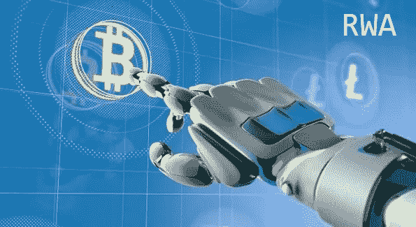
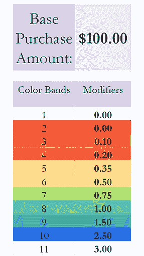
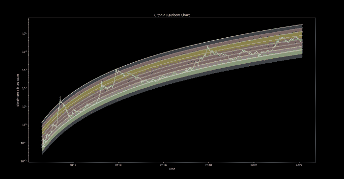

# 用 Python 创建彩虹加权平均交易机器人

> 原文：<https://blog.devgenius.io/creating-a-rainbow-weighted-average-trading-bot-with-python-99f13642a2c9?source=collection_archive---------6----------------------->



你们中的一些人可能已经看过我上一篇关于彩虹加权平均(RWA)以及它如何比简单的比特币美元成本平均更有利可图的文章。关于这方面的更多细节，你可以在下面找到一个详细描述这个工作的帖子。

[](https://medium.com/coinmonks/using-python-to-analyze-rainbow-weighted-averaging-a-more-profitable-frequency-investment-12009a8c3617) [## 使用 Python 分析彩虹加权平均——一种更有利可图的频率投资…

### 介绍

medium.com](https://medium.com/coinmonks/using-python-to-analyze-rainbow-weighted-averaging-a-more-profitable-frequency-investment-12009a8c3617) 

在这篇文章中，我将创建一个 Python 机器人，它将根据我们在比特币对数回归带中的位置进行加权交易。

# 什么是 RWA？

对于那些没有读过我上一篇文章的人来说，快速提醒一下，彩虹加权平均(RWA)是一种投资方法，当应用于历史 BTC 价格数据时，它在 96.8%的情况下优于 DCA，平均高出 35.3%的回报。

策略很简单，用比特币彩虹图。这让我们大致了解了我们在比特币周期中的位置，以及我们在特定时间点的过热或欠热程度。该图表简单地显示了以对数刻度为 y 轴的 BTC 价格历史，以及 x 轴的时间(注意:这不在对数刻度内)。彩虹是通过简单地在比特币图表上上下移动 BTC 回归带创造出来的。颜色对应于我们将 RWA 投资额乘以多少，这些颜色可以在下图中看到。



波段倍增

## 您将需要什么:

*   一些编程知识。
*   Python 3。
*   [巨蟒-币安](https://python-binance.readthedocs.io/en/latest/)。
*   [熊猫](https://pandas.pydata.org/)和[熊猫](https://numpy.org/)
*   Scipy 适用于一些非常非常低级的机器学习(称之为 scipy 有点夸张，但听起来很花哨)
*   [纳斯达克链接](https://pypi.org/project/Nasdaq-Data-Link/)获取历史比特币数据
*   一个[币安](https://testnet.binance.vision/)模拟账户来做一些测试(**注意:**你需要一个 Github 账户来做这个)。

## 限制

*   它不会从您的银行账户向币安汇款，您必须自己设置。
*   “买入金额”必须大于最低买入金额，对于欧元，这是€10。
*   这个机器人不是为服务器优化的，所以我计划让它在我的覆盆子馅饼上运行。

# 创建 RWA Bot

在这里，我将详细介绍创建 RWA bot 所需的步骤，如果你读过我以前的 Python bot 帖子，那么其中一些会很熟悉，但是我觉得更多的人会从从头到尾看到这个过程中受益。



比特币彩虹聊天工具

## 设置

设置是相当容易的，我把我的 API 密匙保存在我的操作系统环境中，但是你可以随意复制粘贴你的。

## 助手功能

首先，我们需要创建一些币安 API 助手函数，我们将使用这些函数从币安交易所获得一些有用的数据。我将在下面列出这个机器人将要使用的函数，如果你查看 Github，你会发现更多用于测试的帮助函数，你可能会想在你的测试中使用它们。

## 获得平衡

向币安 API 请求你交易的账户余额，在我的例子中是欧元，注意测试 API 没有欧元，所以要换成 USDT 或者其他稳定的货币。

```
*def* getBalances():
    #client.API_URL = 'https://testnet.binance.vision/api'
    balance = client.get_asset_balance(asset='EUR') # or asset = 'USDT' for test
    *return* balance
```

## 获取市场价格

这将得到你选择的交易对的当前价格。

```
*def* getMarketPrice(*tradingPair*):
    #client.API_URL = 'https://testnet.binance.vision/api'
    price = client.get_symbol_ticker(symbol=*tradingPair*)    *return price*
```

## 推特机器人

这是一个推特机器人，它会在推特上发布你购买密码的价格，以及交易时出现的任何错误。

```
*def* tweet(*Order*):
 # Authenticate to Twitter
auth = tweepy.OAuthHandler("CONSUMER_KEY", "CONSUMER_SECRET")
auth.set_access_token("ACCESS_TOKEN", "ACCESS_TOKEN_SECRET")api = tweepy.API(auth)api.update_status(order)
```

## 下购买订单

这个函数下一个市场买入订单，然后它会使用 tweet 发送该商品和交易对，如果买入订单没有通过，则发送一个错误消息。

```
*def* placeBuyOrder(*quantity*, *tradingPair*):
    #client.API_URL = 'https://testnet.binance.vision/api'
    *try*:
        order = client.create_order(symbol=*tradingPair*, side='BUY', type='MARKET', quantity=*quantity*)
        #order = client.create_test_order(symbol=tradingPair, side='BUY', type='MARKET', quantity=quantity)
        toTweet = "Bought " + order["symbol"] +  " at "+  order["fills"][0]['price']
        tweet(toTweet)
    *except* BinanceAPIException *as* e:
        tweet(e)
        print(e)
    *except* BinanceOrderException *as* e:
        tweet(e)
        print(e)
    *return*
```

## 购买功能

这是主函数，您将在其中使用前面讨论的其他函数。

首先，它得到你选择的交易对手的当前价格，然后它得到我们账户中的余额，无论我们的法定价值是多少，对我来说是欧元，但无论你想要什么。然后你需要得到步长，它基本上给了你在当前价格买入时应该去的小数位数。(**注意**你可能不需要这个，但是没有它我无法让它工作)。

之后，检查你的余额，并确保你有足够的钱实际购买一些密码(最低消费为欧元€10)。如果余额大于最小购买量，那么将计算一个购买订单，并使用“placeBuyOrder”函数执行该购买。

如果账户中没有足够的资产，那么我们假设长期订单没有通过，我们等待一个小时，看看钱是否已经存入。

如果由于某种原因，这其中有任何错误，机器人将在推特上发布错误，这样我就知道有事发生了。

# RWA 计算

这是奇迹真正发生的地方。在此函数中，我们采用历史比特币价格，并使用 Scipy 中的曲线拟合函数来获得比特币的对数回归带，并在图表中上下移动该带以获得彩虹带。然后，我们采用比特币的当前价格，并使用一系列的 *if* 和 *elif* 语句来找出它位于哪个加权区间。这给出了我们的加权投资金额，然后我们调用前面小节中讨论的购买函数来购买我们认为适合当前市场条件的比特币数量。

您可以在下面的 GitHub 资源库中找到完整的代码

[](https://github.com/Totesthegoats/rca_bot) [## GitHub - Totesthegoats/rca_bot

### 储存库可用于创建一个 Python 机器人，它将根据我们在比特币中的地位进行加权交易…

github.com](https://github.com/Totesthegoats/rca_bot) 

# 结论

差不多就是这样，正如我以前说过的，这个机器人比使用普通的 DCA 机器人更有利可图，我建议你阅读我以前的帖子，了解 RWA 与 DCA 相比如何工作的细节。

有几个改进可以用来增加这个机器人的可用性，主要是 Twitter API 的集成，它允许您创建一个 Twitter 机器人，以便您可以轻松地监控您的机器人的进度以及购买价格。我不会在这里深入讨论这些细节，但是你可以在下面的帖子中找到如何做到这一点的细节。

[](https://totesthegoats92.medium.com/improving-the-dca-bot-python-51b82f6b4779) [## 改进 DCA bot (Python)

### 在之前的一篇文章中，我描述了如何使用 Python 以及 Twitter 和币安 API 来创建 DCA Bot。我…

totesthegoats92.medium.com](https://totesthegoats92.medium.com/improving-the-dca-bot-python-51b82f6b4779) 

如果你需要任何帮助设置这个机器人不要害怕伸出手来，并取得联系。

## 注意

使用此机器人的现场版本，风险自担。

# 支持我

如果你觉得这很有趣或者你真的很好，你可以发给我一些 sat。

BTC 钱包:BC 1 q 6 UE 97 Lyn 296 eeh 6 fzmqttvafgtm 2 q WPU 87 DDA 4

ETH 钱包:0 xfa 4c 099 ed 0 c 6 da 25d 2347 c 481 CFD 12 b 7 bcda 1329