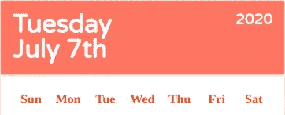

# 学习时刻创建 React 日历组件:第 2 部分

> 原文：<https://blog.devgenius.io/creating-a-react-calendar-component-part-2-8992af1426fb?source=collection_archive---------7----------------------->


照片由[费伦茨·阿尔马西](https://unsplash.com/@flowforfrank?utm_source=medium&utm_medium=referral)在 [Unsplash](https://unsplash.com?utm_source=medium&utm_medium=referral) 拍摄

在 web 开发中寻找一个新的框架可能会令人望而生畏。这个行业的技术发展很快，学习新技能是必要的。谢天谢地，新技能并不意味着我们每次开始一个新项目都需要学习一个新的框架。深入一个现有的领域，甚至过一段时间后重新审视它，以跟上新的变化也同样重要。

在本系列的第一部分[中，我们探索了创建日期并在 React 日历组件上显示的逻辑。现在，我们将使用我们在第 1 部分中创建的函数`getDatesInMonthDisplay`深入 React 本身以及日历组件在 JSX 世界中是如何形成的。如果你不熟悉我们是如何创建这个函数的，并且想知道的话，请查看系列文章](https://medium.com/@elbert.bae/learning-moments-creating-a-react-calendar-component-part-1-e7a95a3f5b1)的第一部分[。](https://medium.com/@elbert.bae/learning-moments-creating-a-react-calendar-component-part-1-e7a95a3f5b1)

在我们开始之前，我不会深入探究 React 是如何工作的，假设你，我的读者，理解 React 渲染引擎的基本概念，以及它是如何被`state`和`props`控制的。如果您不熟悉 React，我建议您创建一个简单的项目，通过他们的[官方入门页面](https://reactjs.org/docs/getting-started.html)来理解基本概念。否则，请继续阅读！


这是完整的 React 组件，今天，我们将把它分成 4 个部分。

1.  *日历标题组件*
2.  *工作日指示器组件*
3.  *日期指示器组件*
4.  *月份指示器组件*

在每一部分中，我们将花时间讨论状态管理，并讨论其背后的原因

**第 1 部分:日历标题**

React 最常用于单页应用程序，如果编码正确，它可以非常高效地在数据变化时重新呈现 web 或应用程序的各个部分。这是通过一个叫做`state`的东西来完成的，代码通过它来寻找我们想要跟踪的已定义状态的数据变化。

因为日历组件希望一次显示一个月，所以让它显示用户选择的日期的月份。

```
import React, { useState } from 'react';
import moment from 'moment'
import './bae-calendar.scss';const BaeCalendar = () => {
  const [selectDate, setSelectDate] = useState(moment().toDate()); return (
    <div className="bae-calendar-container">
      Hello World
    </div>
  );
};export default BaeCalendar;
```

使用 React 的`useState`钩子，我们像这样创建一个名为`selectDate`的状态，并通过使用 MomentJs 调用`moment().toDate()`来设置一个初始状态，以获得今天的日期对象(例如`2020–07–08T00:00:00.000Z`)。

```
...
const [selectDate, setSelectDate] = useState(moment().toDate());
...
```

现在我们有了一个日期对象，让我们看看日历标题。在我看来，日历有 4 个逻辑部分，标题是最容易开始的地方。这是完整的组件，以及如何将名为`CalendarHeader`的子组件拉入到`BaeCalendar`组件中，该组件将成为文件夹的根文件`index.js`。

```
import React, { useState } from 'react';
import moment from 'moment'
import './bae-calendar.scss';import CalendarHeader from './components/calendar-header';const BaeCalendar = () => {
  const [selectDate, setSelectDate] = useState(moment().toDate()); return (
    <div className={`bae-calendar-container ${themes[theme]}`}>
      <CalendarHeader selectDate={selectDate}/>
    </div>
  );
};export default BaeCalendar;
```


这是`CalendarHeader`自己的样子！

让我们看一下 header 组件文件，它利用 MomentJs 将 date 对象格式化成我们需要的格式。简单吧？MomentJs 的格式化功能是顶级的，如果你想了解更多，可以查看官方文档中关于`MMMM do`和`dddd`的功能的文档。

```
import React from 'react';
import moment from 'moment'const CalendarHeader = ({ selectDate }) => {
  return (
    <div className="bae-calendar-header">
      <div className="left-container">
        <h1>{moment(selectDate).format('dddd')}</h1>
        <h1>{moment(selectDate).format('MMMM Do')}</h1>
      </div>
      <div className="right-container">
        <h3>{moment(selectDate).year()}</h3>
      </div>
    </div>
  );
};export default CalendarHeader;
```

您还会注意到，不知何故，我们的`CalendarHeader`组件可以访问我们在主`BaeCalendar`父组件中创建的`state`。这是通过传入我们所谓的`props`来完成的。下面是它在主组件中通过道具时的样子:

```
<CalendarHeader selectDate={selectDate}/>
```

在`CalendarHeader`组件中访问:

```
const CalendarHeader = ({ selectDate }) => {
  ...
}
```

现在这个组件可以访问这些数据了！道具可以是任何东西，不一定非得是严格的数据，所以要有创意。如果你仍然不确定`props`如何工作，查看 React 的[官方入门页面](https://reactjs.org/docs/getting-started.html)并创建一个小项目来玩。

现在..这是一个很好的开始，但是我们还有可以改进的地方。我们将在整个日历组件中进行大量的格式化，重复的代码是不好的。因此，让我们花点时间创建一个名为`moment-utils.js`的实用程序文件，它将为我们处理格式化。下面是我们最终将在组件中使用的各种格式，我们将继续使用这些格式。

```
import moment from 'moment';export const getSpecificDate = (month, dayOfMonth, year) => {
  return moment(`${month}-${dayOfMonth}-${year}`, 'MM-DD-YYYY').toDate();
};export const getDayOfMonth = (date) => moment(date).date();export const getMonth = (date) => moment(date).month();export const getYear = (date) => moment(date).year();export const getToday = () => moment().toDate();export const getReadableWeekday = (date) => moment(date).format('dddd');export const getReadableMonthDate = (date) => moment(date).format('MMMM Do');export const getMonthDayYear = (date) => moment(date).format('MM-DD-YYYY');
```

所以我们的`CalendarHeader`现在看起来像这样。

```
import React from 'react';
import {
  getReadableMonthDate,
  getReadableWeekday,
  getYear,
} from '../utils/moment-utils';const CalendarHeader = ({ selectDate }) => {
  return (
    <div className="bae-calendar-header">
      <div className="left-container">
        <h1>{getReadableWeekday(selectDate)}</h1>
        <h1>{getReadableMonthDate(selectDate)}</h1>
      </div>
      <div className="right-container">
        <h3>{getYear(selectDate)}</h3>
      </div>
    </div>
  );
};export default CalendarHeader;
```

**第 2 部分:工作日指示器组件**

现在，我们要处理的下一部分是工作日指示器，它显示了我们组件中的[周日—周六]表示。

```
import React, { useState } from 'react';
import { getToday } from './utils/moment-utils';
import './bae-calendar.scss';import CalendarHeader from './components/calendar-header';
import WeekdayIndicator from './components/weekday-indicator';const BaeCalendar = () => {
  const [selectDate, setSelectDate] = useState(moment().toDate());
  return (
    <div className={`bae-calendar-container ${themes[theme]}`}>
      <CalendarHeader selectDate={selectDate}/>
      <WeekdayIndicator />
    </div>
  );
};
export default BaeCalendar;
```

`WeekdayIndicator`很简单。对于所有的意图和目的，我们实际上不需要传递任何状态或道具给它。事实上，它的唯一职责就是显示一周中的每一天。

```
import React from 'react';const WeekdayIndicator = () => {
  return (
    <div className="bae-weekday-indicators">
      <div className="weekday-indicator-icon">
        Sun
      </div>
      <div className="weekday-indicator-icon">
        Mon
      </div>
      <div className="weekday-indicator-icon">
        Tue
      </div>
      <div className="weekday-indicator-icon">
        Wed
      </div>
      <div className="weekday-indicator-icon">
        Thu
      </div>
      <div className="weekday-indicator-icon">
        Fri
      </div>
      <div className="weekday-indicator-icon">
        Sat
      </div>
    </div>;
  )
};export default WeekdayIndicator;
```

从技术上讲，这是可行的，但是要把它打出来是多么的痛苦啊！让我们在“反应方式”中重新做一遍。

```
import React from 'react';const weekdays = ['Sun', 'Mon', 'Tue', 'Wed', 'Thu', 'Fri', 'Sat'];const WeekdayIndicator = () => {
  const weekdayIcons = weekdays.map((day, key) => {
    return (
      <div className="weekday-indicator-icon" key={key}>
        {day}
      </div>
    );
  });
  return <div className="bae-weekday-indicators">{weekdayIcons}</div>;
};export default WeekdayIndicator;
```

首先，通过创建一个工作日数组，我们可以利用 JavaScript 的`.map`迭代器方法来创建 React JSX 代码。因为`.map`返回一个新数组，这个新数组被赋给变量`weekdayIcons`，变量`weekdayIcons`每次迭代返回如下…

```
<div className="weekday-indicator-icon" key={key}>
  {day}
</div>
```

你会注意到这里的一些事情。为什么每个元素都有一个`key`道具传入其中，而`{...}`在做什么？

当使用循环创建多个元素时，React 希望您传递一个包含唯一值的`key`属性。否则，它会抱怨一个警告，在我们的网络控制台上看到这个警告总是很烦人。至于花括号，React 自动假设放入其中的任何数据都可以是变量。当然，您可以传入一个字符串值，但是这违背了它的用途。

这允许我们将`weekdayIcons`传递到包装的`div`元素中，以获得与像这样单独输入每个元素相同的结果。

```
...
return <div className="bae-weekday-indicators">{weekdayIcons}</div>
...
```



这就是我们现在所处的位置！

**第三节:日期指示器**

谢天谢地，在之前的文章中([日历日期显示逻辑](https://medium.com/@elbert.bae/learning-moments-creating-a-react-calendar-component-part-1-e7a95a3f5b1))，我们完成了创建日期指示器的大部分工作。

```
import React, { useState } from 'react';
import { getToday } from './utils/moment-utils';
import './bae-calendar.scss';import CalendarHeader from './components/calendar-header';
import WeekdayIndicator from './components/weekday-indicator';
import DateIndicator from './components/date-indicator';const BaeCalendar = () => {
  const [selectDate, setSelectDate] = useState(moment().toDate());
  return (
    <div className={`bae-calendar-container ${themes[theme]}`}>
      <CalendarHeader selectDate={selectDate}/>
      <WeekdayIndicator />
      <DateIndicator
        selectDate={selectDate}
        setSelectDate={setSelectDate}
      />
    </div>
  );
};
export default BaeCalendar;
```

你会注意到我们将两个`props`传递给了`DateIndicator`组件，但是对于本系列的这一部分，忽略第二个叫做`setSelectDate` 的组件，专注于我们将如何使用`selectDate`。我们来看看吧！

```
import React from 'react';
import {
  getDayOfMonth,
  getMonthDayYear,
  getMonth,
  getYear,
} from '../utils/moment-utils';
import { getDatesInMonthDisplay } from '../utils/date-utils';const DateIndicator = ({ selectDate, setSelectDate }) => {
  const datesInMonth = getDatesInMonthDisplay(
    getMonth(selectDate) + 1,
    getYear(selectDate)
  ); const monthDates = datesInMonth.map((i, key) => {
    return (
      <div
        className="date-icon"}
        data-active-month={i.currentMonth}
        data-date={i.date.toString()}
        key={key}
        onClick={changeDate}
      >
        {getDayOfMonth(i.date)}
      </div>
    );
  });return <div className="bae-date-indicator">{monthDates}</div>;
};export default DateIndicator;
```

通过利用 MomentJs 和辅助函数`getMonth`和`getYear`，我们可以使用`selectDate`道具获得一个具有属性`date`和`currentMonth`的对象数组！因此无论`selectDate`代表哪个日期，`DateIndicator`都可以使用`getDatesInMonthDisplay`来提取任何月份和年份的每个日期。

首先，我们之前已经在`getDatesInMonthDisplay`函数中完成了确定一个月中需要显示多少个日期的逻辑，难道你不高兴吗？

类似于我们如何在`WeekIndicator`组件中创建一周中的每一天，我们在这里也使用了`.map`迭代器。理所当然，因为如果我们不得不把这个打 42 次…那么让我先去拿些啤酒。

```
const monthDates = datesInMonth.map((i, key) => {
  return (
    <div
      className="date-icon"
      data-active-month={i.currentMonth}
      data-date={i.date.toString()}
      key={key}
    >
      {getDayOfMonth(i.date)}
    </div>
 );
});
```

让我们来分析一下我们是如何利用数组中的每一项的，数组中的每一项都代表一个具有属性`date`(日期对象)和`currentMonth`(布尔型)的对象。

首先，`div`元素有一个使用`getDayOfMonth(i.date)`的内部内容，它利用`moment(*date*).date()`返回一个月中的第几天。如果我们没有这样做，只是简单的通过了`i.date.toString()`(。toString()，因为我们不能将日期对象传入 HTML)…好吧，这里的混乱会让任何 UX/UI 设计师对你尖叫。


恶…

然而，这个日期对象非常有用，即使在组件的 UI 上看起来并不友好，这就是为什么我们将它作为字符串传递到名为`data-date`的数据属性中。以下是该元素在 web 控制台中的外观。


只需使用普通的 Javascript，我们就可以访问特定元素的日期对象，稍后我们会像这样使用它。

```
document.querySelector('.selected[data-date]').getAttribute('data-date')
// Fri Jul 10 2020 00:00:00 GMT-0700 (Pacific Daylight Time)
```

最后，`data-active-month={i.currentMonth}`为数据属性提供了一个`"true"`或`"false"`。你能猜出它是用来做什么的吗？如果您不确定，请务必继续阅读本系列的第三部分，在那里我将进一步讨论这个问题。

考虑到我们现在所处的位置，我们有足够的东西让我们的组件具有交互性。正如您在一些照片中看到的，有一个圆圈突出显示了用户选择的日期。让我们看看如何使用名为`setSelectDate`的`useState` React 钩子。

```
import React from 'react';
import {
  getDayOfMonth,
  getMonthDayYear,
  getMonth,
  getYear,
} from '../utils/moment-utils';
import { getDatesInMonthDisplay } from '../utils/date-utils';const DateIndicator = ({ activeDates, selectDate, setSelectDate }) => { // EVENT HANDLING CALLBACK
  const changeDate = (e) => {
    setSelectDate(e.target.getAttribute('data-date'));
  }; const datesInMonth = getDatesInMonthDisplay(
    getMonth(selectDate) + 1,
    getYear(selectDate)
  ); const monthDates = datesInMonth.map((i, key) => {
    const selected =
      getMonthDayYear(selectDate) === getMonthDayYear(i.date) ? 'selected' : '';
    const active =
      activeDates && activeDates[getMonthDayYear(i.date)] ? 'active' : ''; return (
      <div
        className={`date-icon ${selected} ${active}`}
        data-active-month={i.currentMonth}
        data-date={i.date.toString()}
        key={key} // EVENT HANDLER
        onClick={changeDate}
      >
        {getDayOfMonth(i.date)}
      </div>
    );
  });return <div className="bae-date-indicator">{monthDates}</div>;
};export default DateIndicator;
```

看一下上面的代码，找到`setSelectDate`，你会注意到它是在一个叫做`changeDate`的函数中使用的。Javascript 本质上是一种浏览器语言，事件处理是它的专长。如果您不熟悉 Javascript 中的事件，请阅读 [MDN](https://developer.mozilla.org/en-US/docs/Web/Events) 中的相关内容，它是浏览器语言的支柱。

根据使用`changeDate`的地方，您会注意到每个`date-icon`元素都有一个名为`onClick`的`prop`，它作为回调函数传入`changeDate`。这意味着当任何一个`date-icon`元素被点击时，都会触发`setSelectDate`的功能设置。它作为参数传递给`setSelectDate`的值利用了我在上面使用数据属性`data-date`展示的内容。

下面的代码响应由`e`表示的点击事件。通过访问目标和`data-date`属性，我们可以获取我们想要选择的新日期，并更改名为`selectDate`的`state`。

```
(e) => e.target.getAttribute('data-date')
```

现在，您可以将功能`changeDate`更改为以下内容，以查看控制台登录到 web 控制台的新选定日期，但由于您尚未应用任何样式，因此您不会看到图标的变化。然而，由于`state`仍在变化，您应该看到`CalendarHeader`组件的数据更新，因为它利用状态`selectDate`重新渲染任何组件！

```
const changeDate = (e) => {
  console.log(e.target.getAttribute('data-date');
  setSelectDate(e.target.getAttribute('data-date'));
}
```

**差不多了…第 4 节:月指标**

到目前为止，您应该已经有了一个正常工作的日历组件，它可以用新选择的日期更改`CalendarHeader`数据，甚至可以通过单击一个溢出日期来更改月份的显示。让我们通过添加`MonthIndicator`组件来结束本系列的第 2 部分！

```
import React, { useState } from 'react';
import { getToday } from './utils/moment-utils';
import './bae-calendar.scss';
import CalendarHeader from './components/calendar-header';
import WeekdayIndicator from './components/weekday-indicator';
import DateIndicator from './components/date-indicator';
import MonthIndicator from './components/month-indicator';const BaeCalendar = () => {
  const [selectDate, setSelectDate] = useState(moment().toDate());
  return (
    <div className={`bae-calendar-container ${themes[theme]}`}>
      <CalendarHeader selectDate={selectDate}/>
      <WeekdayIndicator />
      <DateIndicator
        selectDate={selectDate}
        setSelectDate={setSelectDate}
      />
      <MonthIndicator 
        selectDate={selectDate} 
        setSelectDate={setSelectDate}
      />
    </div>
  );
};
export default BaeCalendar;
```

最后一个子组件，让我们看看它是如何构造的。

```
import React from 'react';
import { getMonth } from '../utils/moment-utils';
import { getMonthSet } from '../utils/date-utils';
import './month-indicator.scss';import { monthsFull } from '../constants/dates';const MonthIndicator = ({ selectDate, setSelectDate }) => {
  const changeMonth = (e) => {
    setSelectDate(e.target.getAttribute('data-date'));
  }; const monthSet = getMonthSet(selectDate); return (
    <div className="bae-month-indicator">
      <h4 data-date={monthSet.prev} onClick={changeMonth}>
        {monthsFull[getMonth(monthSet.prev)]}
      </h4>
      <h3>{monthsFull[getMonth(monthSet.current)]}</h3>
      <h4 data-date={monthSet.next} onClick={changeMonth}>
        {monthsFull[getMonth(monthSet.next)]}
      </h4>
    </div>
  );
};export default MonthIndicator;
```

我们在这里又看到了两个`props`(`selectDate`和`setSelectDate`)。现在，我们为什么需要`selectDate`已经很清楚了。使用当前选择的日期，我们可以拉出当前、上一个和下一个月。你能想到我们在根据当前月份确定前几个月和后几个月时可能会遇到的挑战吗？

两个月立刻浮现在脑海中，分别是`December`和`January`。根据设计，我们希望这些元素可以点击来改变显示的月份。如果我们只取当前月份，用矩来加减月份，显然不适用于所有情况。从`January`到`December`意味着年份以相反的逻辑变化。

所以…让我们创建一个小助手函数来处理这个问题！

```
const getMonthSet = (selectDate) => {
  const month = getMonth(selectDate) + 1;
  const result = {
    current: selectDate,
    prev: getSpecificDate(month - 1, 1, getYear(selectDate)),
    next: getSpecificDate(month + 1, 1, getYear(selectDate)),
  }; if (month === 1) {
    result.prev = getSpecificDate(12, 1, getYear(selectDate) - 1);
  } if (month === 12) {
    result.next = getSpecificDate(1, 1, getYear(selectDate) + 1);
  } return result;
};
```

直截了当对吗？通过获取当前所选日期的月份(+1，因为月份以索引形式返回)，我们可以使用 MomentJs 来构造`prev`和`next`月份的日期对象。如果一月的月份是`1`，我们将获取年份并减去 1。如果 12 月的月份是`12`，反过来加一。

与`DateIndicator`组件中的`date-icons`类似，这个组件将数据属性`data-date`添加到之前和之后的月份元素中。

```
...
<div className="bae-month-indicator">
  <h4 data-date={monthSet.prev} onClick={changeMonth}>
    {monthsFull[getMonth(monthSet.prev)]}
  </h4>
  <h3>{monthsFull[getMonth(monthSet.current)]}</h3>
  <h4 data-date={monthSet.next} onClick={changeMonth}>
    {monthsFull[getMonth(monthSet.next)]}
  </h4>
</div>
...
```

如您所见，这两个元素似乎也有一个调用函数`changeMonth`的`onClick`事件监听器。类似于`DateIndicator`中的回调函数，它通过调用`setSelectDate`来改变`selectDate`的状态。

虽然有点问题。名称`changeMonth`似乎有点误导，因为我们在技术上改变了`selectDate`状态的整个日期，而这段代码是重复的！在这样的时刻，您应该考虑对此进行重构，以减少重复的代码，并更改函数的名称，使其行为更加准确。

现在，让我们将名称改为`changeDate`并保留在组件中。在这种情况下，对于是否要重构重复的代码有很多不同的看法。然而，对于一个小项目，我更喜欢将回调函数放在使用它们的组件中。随着时间的推移，项目变得越来越大，这是应该重新考虑的事情，但现在应该没问题。


带样式的组件

不错吧？现在，您应该有了一个正常工作的 React 日历组件，当您单击日期时，它会更改`CalendarHeader`和`MonthIndicator`中的日期。

如果你想看看整个组件的代码，看看 G [ithub 库](https://github.com/bert-bae/bae-components/tree/master/src/components/calendar)。

在本系列的最后一部分中，我们将向组件添加一些特性，使其对其他人可用，显示选定的日期以及样式。我们将触及的一些概念是组件的可重用性、样式表组织以及使用 Flex 和 Grid 的一般 CSS/SASS 技巧。

希望你喜欢阅读，并发现它有助于激发你继续通过有趣的迷你项目发展你的技能！