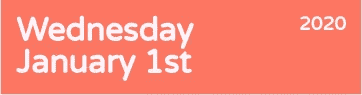

# 创建 React 日历组件:第 3 部分

> 原文：<https://blog.devgenius.io/creating-a-react-calendar-component-part-3-a69740dd8d43?source=collection_archive---------33----------------------->


创建一个吸引人的可视化组件是吸引人们关注你的 web 应用程序的有效方法。在本系列的[第 1 部分](https://dev.to/bertbae/creating-a-react-calendar-component-part-1-31j1)和[第 2 部分](https://dev.to/bertbae/creating-a-react-calendar-component-part-2-1nep)中，我们探索了要显示的日期背后的逻辑，以及使用一组日期在浏览器中呈现可见组件的 React 代码。在下一部分中，我们将探索赋予组件视觉吸引力的代码。

当我刚开始编码的时候，我从来没有像喜欢开发的其他方面一样喜欢 CSS。我的第一份工作是用一个单独的 CSS 文件控制整个 web 应用程序的样式。由于当时对 CSS 的经验有限，这绝对是一场噩梦。然而，那次经历促使我进一步探索在未来的项目中构建 CSS 代码的最佳方式。就像开发的其他部分一样，CSS 有它自己的设计模式和实践，这些模式和实践通过诸如 [SASS](https://sass-lang.com/) 和[风格组件](https://styled-components.com/)等技术得到了进一步的支持。

在我们开始之前，下面的例子将在 SASS 中，它是 CSS 的超集。SASS 被编译成 CSS，但是允许一些功能，使得组织样式代码更容易。我最喜欢的 SASS 的 3 个方面是，它允许嵌套 CSS 以实现特殊性，创建变量以实现可重用性，以及 SASS 文件可以相互导入。让我们来分析一下我们今天要看的内容:

1.  *使用 Flexbox 设计日历标题的样式*
2.  *使用 Flexbox 设计月份指示器的样式*
3.  *使用网格 CSS 设计工作日指示器的样式*
4.  *使用网格 CSS 设计日期指示器的样式*
5.  *添加主题*

**第 1 部分:使用 Flexbox 设计日历标题的样式**

在我们开始之前，让我们向主`BaeCalendar`组件添加一些 CSS，这样我们就可以在浏览器上看到它，并规范化一些 HTML 元素样式。

```
.bae-calendar-container {
  box-sizing: border-box;
  box-shadow: 0 0 3px rgba(0, 0, 0, 0.5);
  height: 100%;
  width: 100%; h1,
  h2,
  h3,
  h4,
  h5,
  h6,
  p {
    padding: 0;
    margin: 0;
    line-height: 1;
    font-family: 'Varela Round', sans-serif;
  }
}
```

如您所见，具有名为`bae-calendar-container`的类的元素被赋予了其父元素的`100%`高度和宽度。这允许任何导入组件的用户将其包装在不同的容器中，以便他们可以自己指定高度和宽度。现在，它将采用`body`元素的高度和宽度属性，这样我们就可以在浏览器上看到它。

除此之外，您会注意到我们正在利用 SASS 的嵌套功能来设计`h1, h2, h3...`元素的样式，以规范化其默认样式。无需深入细节，嵌套会将其转换成如下所示的 CSS 代码:

```
.bae-calendar-container h1, .bae-calendar-container h2 {
  padding: 0;
  margin: 0;
  line-height: 1;
  font-family: 'Varela Round', sans-serif;
}
// And so on...
```


上面是没有样式的组件，我们将把它转换成下面的样子。



让我们花点时间来看看`CalendarHeader`组件的 HTML 布局。

```
<div className="bae-calendar-header">
  <div className="left-container">
    <h1>{getReadableWeekday(selectDate)}</h1>
    <h1>{getReadableMonthDate(selectDate)}</h1>
  </div>
  <div className="right-container">
    <h3>{getYear(selectDate)}</h3>
  </div>
</div>
```

我们在这里看到的所有元素都是`block`元素，根据定义，这是一个开始新行的元素。那么我们如何得到两列呢？幸运的是，flexbox 是我们可以利用的一个非常有用的 CSS 属性。

```
.bae-calendar-header { 
  display: flex; 
}
```

属性定义了一个类似于 T4 元素的元素。`flex`元件的作用不同。本质上，外部元素仍然是一个`block`元素，但是任何内部元素都呈现出更加流畅的形式。除非指定了`display: flex`，否则我们无法应用任何其他基于`flex`的 CSS 属性。

下面是一个带有`display: flex`的组件的例子。


注意到内部元素不再充当`block`元素了吗？包装内容的容器本身将保持其`block`行为，但是这给了我们控制内部元素布局的自由。让我们通过添加`justify-content: space-between`使可读的日期和年份结束在相反的两边。

```
.bae-calendar-header {
  display: flex;
  justify-content: space-between;
}
```

不言自明吧？当`flex`为行格式时(如`left-container`和`right-container` ), `justify-content`修改水平布局。请记住，如果您正在使用列格式的`flex`元素，`justify-content`将跟随新的更改并影响垂直布局。我们提供的选项`space-between`确实如其名。它在所有元素之间提供了均匀的间距，但在边缘上没有间距。

我们正在取得进展，但让我们看看是否可以为边缘提供一些空间和一个边框来显示`CalendarHeader`组件的结束位置。

```
.bae-calendar-header {
  padding: 15px;
  box-shadow: 0 1px 3px rgba(0, 0, 0, 0.3);
  display: flex;
  justify-content: space-between;
}
```


太好了！让我们继续对我们的月指标使用同样的`flex`技巧。

**第 2 部分:使用 Flexbox 设计月份指示器的样式**

类似于`CalendarHeader`组件，`MonthIndicator`是一个`div`元素，内部有 3 个`block`元素。

```
<div className="bae-month-indicator">
  <h4 data-date={monthSet.prev} onClick={changeDate}>
    {monthsFull[getMonth(monthSet.prev)]}
  </h4>
  <h3>{monthsFull[getMonth(monthSet.current)]}</h3>
  <h4 data-date={monthSet.next} onClick={changeDate}>
    {monthsFull[getMonth(monthSet.next)]}
  </h4>
</div>
```

这是没有造型时的样子…


我们想要达到的目标是…


看起来我们可以应用类似的`flex`属性，所以让我们添加同样的东西到头部。

```
.bae-month-indicator {
  display: flex;
  justify-content: space-between;
}
```

目前看来还不错。不过，让我给你看一件事。虽然你看不出来，但这三个元素并没有完全居中。在这种情况下，这可能没有太大的关系，但用一个简单的规则来确保所有元素垂直居中是相当简单的。

```
.bae-month-indicator { display: flex; justify-content: space-between; align-items: center; }
```

属性`align-items`类似于`justify-content`。`flex`为行格式，`justify-content`水平工作，`align-items`垂直工作。将任何项目居中的一个快速技巧是为父元素 a `display: flex`和`justify-content: center`提供`align-items: center`，并确保项目在父元素内居中。

Flexbox 的知识非常有用。学习 Flexbox 的最好方法之一是通过一个互动游戏，你可以点击[这里](https://flexboxfroggy.com/)！

**第 3 节:使用网格 CSS 设计工作日指示器的样式**

既然我们已经花时间了解了 Flexbox 是如何应用于日历组件的，那么让我们花一些时间来探索网格 CSS 的基础知识。与 Flexbox 类似，Grid 用于创建 web 应用程序中可视组件的布局。Flexbox 和 Grid 之间存在一些差异，但在大多数情况下，两者都可以实现相似的布局结果。

根据我的经验，我在不同的场景中使用了 Flexbox 和 Grid。我使用 Flexbox 主要是为了定位单个元素，但是当涉及到重复和可预测的布局时，我更喜欢使用 Grid。让我们在设计`WeekdayIndicator`样式时探索一下这个问题。

回到本系列的第二部分，这里是`WeekdayIndicator`看起来像 React 代码的样子:

```
const weekdays ['Sun', 'Mon', 'Tue', 'Wed', 'Thu', 'Fri', 'Sat']; const WeekdayIndicator = () => { const weekdayIcons = weekdays.map((day, key) => { return ( <div className="weekday-indicator-icon" key={key}> {day} </div> ); }); return <div className="bae-weekday-indicators">{weekdayIcons}</div>; };
```

这转换成以下 HTML:

```
<div className="bae-weekday-indicators"> <div className="weekday-indicator-icon"> Sun </div> <div className="weekday-indicator-icon"> Mon </div> <div className="weekday-indicator-icon"> Tue </div> <div className="weekday-indicator-icon"> Wed </div> <div className="weekday-indicator-icon"> Thu </div> <div className="weekday-indicator-icon"> Fri </div> <div className="weekday-indicator-icon"> Sat </div> </div>
```

没有任何样式，这里是这些元素的自然`block`行为。


这是我们设计后想要的样子。


虽然 Flexbox 肯定可以用来实现这一结果，但我们将使用网格组合来使工作日水平且均匀分布，同时使用 Flexbox 来使每个`div.weekday-indicator-icon`元素内的文本居中。

让我们从使用两个属性`grid-template-columns`和`grid-template-rows`的网格开始。

```
.bae-weekday-indicators { display: grid; grid-template-columns: repeat(7, minmax(auto, 1fr)); grid-template-rows: 1; padding: 15px // To keep padding consistent with the other components so far }
```

在`grid-template-columns`中，`repeat(7, minmax(auto, 1fr))`的值表示创建 7 个包含内部元素的列，其最小尺寸为`auto`(根据需要更改)，最大尺寸为`1fr`(总容器尺寸的 1/7)。例如，您可以使它只有 3 列，这样它将通过溢出和创建新的行来覆盖`grid-template-rows`,以适应父容器内部元素的数量。


让我们换回来，继续前进。正如您所看到的，工作日指示器图标没有居中，我们接下来将使用上面使用的 Flexbox 概念进行处理。由于网格展示了每个包装工作日文本的容器，我们需要为类名为`weekday-indicator-icon`的元素添加一些样式。

```
.bae-weekday-indicators { display: grid; grid-template-columns: repeat(7, minmax(auto, 1fr)); grid-template-rows: 1; padding: 15px; .weekday-indicator-icon { height: 25px; width: 25px; display: flex; justify-self: center; justify-content: center; align-items: center; padding: 5px; font-weight: bold; cursor: pointer; } }
```

如你所见，我使用`justify-content: center`和`align-items: center`应用了 Flexbox 居中技巧。这确保了`div.weekday-indicator-icon`内部的元素居中。但是，`justify-self`在做什么呢？在本例中，我们应用了一个水平 CSS 属性，但是通过引用元素本身来应用。这是一个没有`justify-self: center`元素的例子，下面是有`justify-self: center`元素的例子。


自我调整未应用


自圆其说:居中；

**第 4 节:使用网格 CSS 设计日期指示器的样式**

现在我们有了上面的带有`WeekdayIndicator`组件的网格示例，让我们对`DateIndicator`应用同样的更改来实现这一点。


作为快速复习，这里是`DateIndicator`组件。

```
const DateIndicator = ({ activeDates, selectDate, setSelectDate }) => {
  const changeDate = (e) => {
    setSelectDate(e.target.getAttribute('data-date'));
  }; const datesInMonth = getDatesInMonthDisplay(
    getMonth(selectDate) + 1,
    getYear(selectDate)
  ); const monthDates = datesInMonth.map((i, key) => {
    const selected = getMonthDayYear(selectDate) === getMonthDayYear(i.date) ? 'selected' : ''; return (
      <div
        className=`date-icon ${selected}`
        data-active-month={i.currentMonth}
        data-date={i.date.toString()}
        key={key}
        onClick={changeDate}
      >
        {getDayOfMonth(i.date)}
      </div>
    );
  }); return <div className="bae-date-indicator">{monthDates}</div>;
};
```

这里我们想做两件事。一种是使用与上面使用 Grid CSS 相同的原理来设置网格。另一个是直观地区分当前月的有效日期与前几个月和后几个月的溢出日期。网格部分应该很简单，所以下面是我们要添加的内容。

```
.bae-date-indicator {
  display: grid;
  grid-template-columns: repeat(7, minmax(auto, 1fr));
  grid-template-rows: repeat(6, minmax(35px, 1fr));
  grid-gap: 5px;
  padding: 0 15px;
  .date-icon {
    display: flex;
    justify-content: center;
    justify-self: center;
    align-items: center;
    height: 25px;
    width: 25px;
    padding: 5px;
    cursor: pointer;
  }
}
```

现在，我们想淡出溢出日期。查看组件代码，我们可以看到应用了数据属性`data-active-month={i.currentMonth}`。这既可以是`data-active-month="true"`也可以是`data-active-month="false"`，为我们提供了一种简单的方法来识别当前月份或不在我们的 CSS 中，下面是对具有特征`.bae-date-indicator .date-icon[data-active-month="false"]`的目标元素的更改。

```
.bae-date-indicator {
  display: grid;
  grid-template-columns: repeat(7, minmax(auto, 1fr));
  grid-template-rows: repeat(6, minmax(35px, 1fr));
  grid-gap: 5px;
  padding: 0 15px;
  .date-icon {
    display: flex;
    justify-content: center;
    justify-self: center;
    align-items: center;
    height: 25px;
    width: 25px;
    padding: 5px;
    cursor: pointer;
    &[data-active-month='false'] {
      color: rgba(0, 0, 0, 0.3);
    }
  }
}
```

就是这样！我们要添加的最后一件事是带有`selected`类名的元素的样式，我们将通过让用户清楚日历上当前选择的日期来改进我们的 UI。

```
.bae-date-indicator {
  display: grid;
  grid-template-columns: repeat(7, minmax(auto, 1fr));
  grid-template-rows: repeat(6, minmax(35px, 1fr));
  grid-gap: 5px;
  padding: 0 15px;
  .date-icon {
    display: flex;
    justify-content: center;
    justify-self: center;
    align-items: center;
    height: 25px;
    width: 25px;
    padding: 5px;
    cursor: pointer;
    &[data-active-month='false'] {
      color: rgba(0, 0, 0, 0.3);
    }
    &.selected {
      border-radius: 50%;
      box-shadow: 0 0 3px rgba(0, 0, 0, 0.5);
    }
  }
}
```

此时，将我们的组件和样式放在一起应该是这样的。


**第 5 部分:添加主题**

现在我们已经为组件准备好了布局，让我们通过添加颜色来为它添加一点活力。色彩搭配和设计绝对不是我的强项，这就是为什么我想尽可能地使它易于修改。为了应用我们的主题，我们将通过在 SASS 中使用嵌套来利用 CSS 特异性规则。这是我们的根文件`bae-calendar.sass`。

```
.bae-calendar-container {
  box-sizing: border-box;
  box-shadow: 0 0 3px rgba(0, 0, 0, 0.5);
  height: 100%;
  width: 100%; h1,
  h2,
  h3,
  h4,
  h5,
  h6,
  p {
    padding: 0;
    margin: 0;
    line-height: 1;
    font-family: 'Varela Round', sans-serif;
  }
  &.salmon-theme {
    [@import](http://twitter.com/import) './themes/salmon.sass';
  }
  [@import](http://twitter.com/import) './components/calendar-header.sass';
  [@import](http://twitter.com/import) './components/weekday-indicator.sass';
  [@import](http://twitter.com/import) './components/date-indicator.sass';
}
```

正如您所看到的，这个根 SASS 文件导入了多个 SASS 文件，这些文件由我们上面样式化的每个子组件的样式组成。您还可以看到，在类名`salmon-theme`下有一个新文件，它是用`&`选择器导入的，用来对带有`.bar-calendar-container.salmon-theme`的元素应用样式。在这里，我们将概述日历组件的主题样式。

在我们的`salmon.sass`文件中，我们有以下内容:

```
$primaryColor: #fa8072;
$secondaryColor: #ffa98f;
$highlightTextColor: #d95e39;
$activeTextColor: #f8f8ff;h1,
h2,
h3,
h4,
h5,
h6 {
  color: $activeTextColor;
}.bae-calendar-header {
  background-color: $primaryColor;
}.bae-weekday-indicators {
  .weekday-indicator-icon {
    color: $highlightTextColor;
    &.active {
      background-color: $primaryColor;
      color: $activeTextColor;
    }
  }
}.bae-date-indicator {
  .date-icon {
    &.active {
      background-color: $secondaryColor;
      color: $activeTextColor;
    }
    &.selected {
      background-color: $primaryColor;
      color: $activeTextColor;
    }
  }
}.bae-month-indicator {
  background-color: $primaryColor;
}
```

不用深入细节，你能看到我们如何利用 SASS 变量名和主题文件的组织吗？很容易理解吧？我们所有的文本都将应用`color: $activeTextColor`，我们也看到了`background-color`属性的一些其他变化。这是组件在这种风格下的样子。


简单对吗？你能看出我们如何利用这种组织方式吗？我们现在需要做的就是为以下变量选择我们想要的颜色:

```
$primaryColor: #fa8072;
$secondaryColor: #ffa98f;
$highlightTextColor: #d95e39;
$activeTextColor: #f8f8ff;
```

例如，`monochrome-theme`使用以下变量。

```
$primaryColor: #646e78;
$secondaryColor: #8d98a7;
$highlightTextColor: #6d7c90;
$activeTextColor: #f8f8ff;
```

一旦我们改变了这些变量，我们就可以把它复制到一个新文件中，然后像这样再次导入它。

```
.bae-calendar-container {
  box-sizing: border-box;
  box-shadow: 0 0 3px rgba(0, 0, 0, 0.5);
  height: 100%;
  width: 100%; h1,
  h2,
  h3,
  h4,
  h5,
  h6,
  p {
    padding: 0;
    margin: 0;
    line-height: 1;
    font-family: 'Varela Round', sans-serif;
  }
  &.salmon-theme {
    [@import](http://twitter.com/import) './themes/salmon.scss';
  }
  &.monochrome-theme {
    [@import](http://twitter.com/import) './themes/monochrome.scss';
  }
  [@import](http://twitter.com/import) './components/calendar-header.scss';
  [@import](http://twitter.com/import) './components/weekday-indicator.scss';
  [@import](http://twitter.com/import) './components/date-indicator.scss';
}
```


为了方便用户，我们可以创建预设的主题，并通过指定将哪些类名附加到 main 元素来允许他们使用组件。作为一个例子，我们的日历组件可以做这样的事情来接受一个名为`theme`的`prop`，它被翻译成一个特定的`className`。

```
import React, { useState } from 'react';
import { getToday } from './utils/moment-utils';
import './bae-calendar.scss';import CalendarHeader from './components/calendar-header';
import WeekdayIndicator from './components/weekday-indicator';
import DateIndicator from './components/date-indicator';
import MonthIndicator from './components/month-indicator';
// [https://uicookies.com/html-calendar/](https://uicookies.com/html-calendar/)import { presetDateTracker } from './utils/date-utils';// preset themes that are available
const themes = {
  salmon: 'salmon-theme',
  monochrome: 'monochrome-theme',
  rouge: 'rouge-theme',
};const BaeCalendar = ({ theme, activeDates, onDateSelect }) => {
  const presetActiveDates = useRef(presetDateTracker(activeDates || []));
  const [selectDate, setSelectDate] = useState(getToday());// Add the theme name to the main container `${themes[theme]}`
  return (
    <div className={`bae-calendar-container ${themes[theme]}`}>
      <CalendarHeader selectDate={selectDate} />
      <WeekdayIndicator />
      <DateIndicator
        activeDates={presetActiveDates.current}
        selectDate={selectDate}
        setSelectDate={setSelectDate}
      />
      <MonthIndicator selectDate={selectDate} setSelectDate={setSelectDate} />
    </div>
  );
};export default BaeCalendar;
```

这样就可以导入了…

```
<BaeCalendar theme="monochrome" />
```

就是这样！希望这些信息能对如何组织组件的样式提供一些帮助。样式文件需要和其他代码领域一样多的组织和设计，所以当你创建下一个前端项目时，确保你没有忽略仔细的计划。在下一部分中，我将向您展示组件文件是如何构建的，并添加一些特性，这些特性将允许我们的组件用户获得他们选择的`date`，以便在他们自己的程序中使用，并传递预先选择的日期。