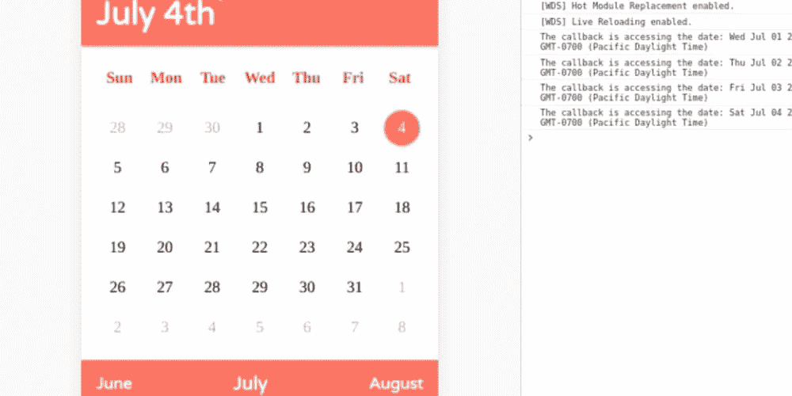
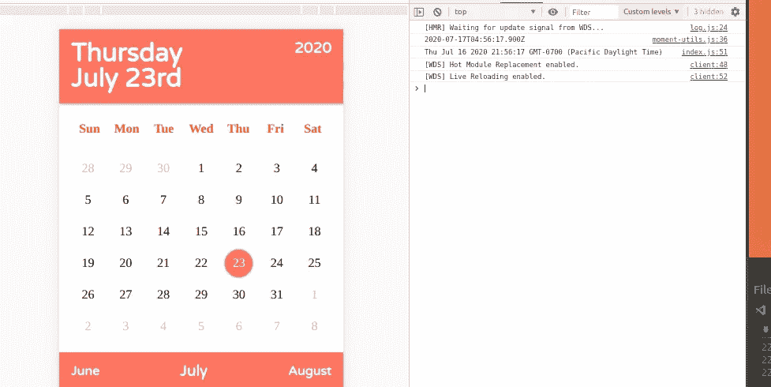
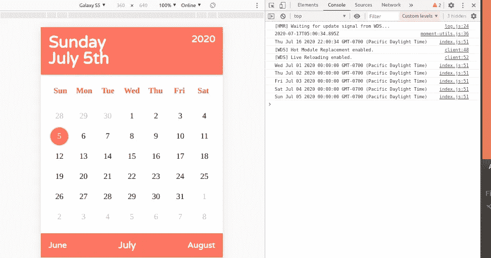
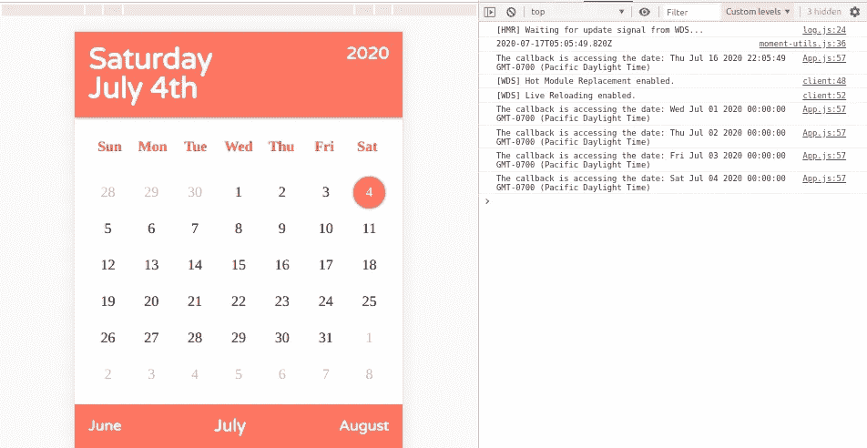
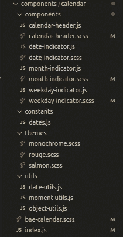

# 创建 React 日历组件:第 4 部分

> 原文：<https://blog.devgenius.io/creating-a-react-calendar-component-part-4-d30fdc2e99e?source=collection_archive---------16----------------------->



文件夹结构和代码布局与实际代码本身一样重要。干净的代码应该易读易懂。目标应该是让一个新人看一看你的代码，并且能够理解你的目的，而不需要深入代码的细节。同样，我喜欢用一种方式来组织我的文件和文件夹，这种方式可以很容易地浏览和理解哪些文件是相互关联的。

在这一部分中，让我们添加两个功能，让用户可以很容易地看到哪个日期被选中，组件的用户能够访问该日期，然后查看日历组件的文件夹结构，然后

**第一部分:选定日期显示**

web 应用程序(任何相关的应用程序)最令人恼火的事情之一就是缺少指示器。如果用户不知道什么是选中的、加载的、禁用的或活动的，那么他们会感到困惑。正如大多数人所知，您可以尽可能多地测试任何 web 应用程序，只是让用户通过`dumb users`来挑选它。这是谬论。

如果 web 应用程序没有指导用户正确地使用它，那么在创建时就严重缺乏 UI/UX 决策。当然，我不是 UI/UX 专家，但是和他们以及 QA 测试人员一起工作过，理解它的重要性。因此，让我们花一点时间添加一个由用户选择的日期指示。

下面是已完成组件的图像，我们现在要添加的是所选日期周围的圆圈。

这是我们的`DateIndicator`的代码:

```
import React from 'react';
import {
  getDayOfMonth,
  getMonthDayYear,
  getMonth,
  getYear,
} from '../utils/moment-utils';
import { getDatesInMonthDisplay } from '../utils/date-utils';const DateIndicator = ({ activeDates, selectDate, setSelectDate }) => {
  const changeDate = (e) => {
    setSelectDate(e.target.getAttribute('data-date'));
  }; const datesInMonth = getDatesInMonthDisplay(
    getMonth(selectDate) + 1,
    getYear(selectDate)
  ); const monthDates = datesInMonth.map((i, key) => {
    return (
      <div
        className="date-icon"
        data-active-month={i.currentMonth}
        data-date={i.date.toString()}
        key={key}
        onClick={changeDate}
      >
        {getDayOfMonth(i.date)}
      </div>
    );
  });return <div className="bae-date-indicator">{monthDates}</div>;
};export default DateIndicator;
```

由于使用 CSS 在 HTML 元素上指定不同的样式只需要一个应用于属性的样式，我们将利用一个名为`selected`的类名。正在讨论的元素目前有一个类名叫做`date-icon`。但是没有规定说我不能再加了！

```
// We want to add `className="date-icon selected"
<div
  className="date-icon"
  data-active-month={i.currentMonth}
  data-date={i.date.toString()}
  key={key}
  onClick={changeDate}
>
  {getDayOfMonth(i.date)}
</div>
```

现在真正的问题是，我们如何确定选择了哪个日期，并且只将`selected`类名应用于正确的日期？良好的...这很简单。我们知道`selectDate`属性是由父组件跟踪的状态。幸运的是，这个组件可以访问它。当每个`monthDates`被构建时，我们可以做一个匹配，看看正在构建的`date`图标是否与`selectDate`匹配。但是，让我们想一想，我们实际上需要匹配哪些数据？

我对匹配日期对象本身犹豫不决，因为你永远不知道日期对象是否精确到毫秒。更不用说，我不知道当日期对象从一个时区移动到另一个时区时，它会如何表现。例如，如果我的数据库使用 UTC 时间，但最终用户使用 PST 时间，则 date 对象可能会根据时区而变化。通常，我们会将这些信息存储为一个字符串来防止这种情况，但是你永远不会知道。所以…我们将采取安全的路线，使用下面的函数和`MomentJs`将月、日和年作为一个字符串提取出来。

```
export const getMonthDayYear = (date) => moment(date).format('MM-DD-YYYY');
```

利用这一点，我们可以像这样进行匹配。

```
const selected = getMonthDayYear(selectDate) === getMonthDayYear(i.date) ? 'selected' : '';
```

三元运算状态，如果`selectDate`的`MM-DD-YYYY`与另一个日期的`MM-DD-YYYY`匹配，那么变量`selected`将被赋予一个字符串值`selected`。否则，它将是一个空字符串。请注意，我们忽略了小时、分钟和秒钟，因为这些信息对于本特性来说并不重要。

应用这个新的变化，让我们来看看完整的组件。

```
import React from 'react';
import {
  getDayOfMonth,
  getMonthDayYear,
  getMonth,
  getYear,
} from '../utils/moment-utils';
import { getDatesInMonthDisplay } from '../utils/date-utils';const DateIndicator = ({ activeDates, selectDate, setSelectDate }) => {
  const changeDate = (e) => {
    setSelectDate(e.target.getAttribute('data-date'));
  }; const datesInMonth = getDatesInMonthDisplay(
    getMonth(selectDate) + 1,
    getYear(selectDate)
  ); const monthDates = datesInMonth.map((i, key) => {
    const selected =
      getMonthDayYear(selectDate) === getMonthDayYear(i.date) ? 'selected' : ''; return (
      <div
        className={`date-icon ${selected}`}
        data-active-month={i.currentMonth}
        data-date={i.date.toString()}
        key={key}
        onClick={changeDate}
      >
        {getDayOfMonth(i.date)}
      </div>
    );
  }); return <div className="bae-date-indicator">{monthDates}</div>;
};export default DateIndicator;
```

如您所见，`className`现在是`className={`日期图标\${selected} `}`。如果日期匹配，它将追加字符串`selected`并添加另一个类名属性。从现在开始，让我们快速添加对样式文件的更改。

```
.date-icon {
  display: flex;
  justify-content: center;
  justify-self: center;
  align-items: center;
  height: 25px;
  width: 25px;
  padding: 5px;
  cursor: pointer;
  &[data-active-month='false'] {
    color: rgba(0, 0, 0, 0.3);
  }
  &.selected {
    border-radius: 50%;
    box-shadow: 0 0 3px rgba(0, 0, 0, 0.5);
  }
}
```

在我们的主题文件中，来自[第二部分](https://dev.to/bertbae/creating-a-react-calendar-component-part-2-1nep):

```
.bae-date-indicator {
  .date-icon {
    &.active {
      background-color: $secondaryColor;
      color: $activeTextColor;
    }
    &.selected {
      background-color: $primaryColor;
      color: $activeTextColor;
    }
  }
}
```

这样，你的组件就是交互式的了！但是如果不能将日期作为数据选择出来，那么交互组件有什么用呢？

**第二部分:提取日期数据**

这是一个相当简单的问题，但是如果你不熟悉一个叫做`callbacks`的东西，那么答案对你来说可能不是那么明显。当然，大多数程序员在他们工作的早期就理解回调，因为它经常被使用。我们要做的是利用回调来提取所选的日期。

主组件文件目前使用名为`useState`的 React 钩子。对于我们的下一个项目，我们需要拉进另一个名为`useEffect`的钩子。

```
import React, { useEffect, useState } from 'react';
import { getToday } from './utils/moment-utils';
import './bae-calendar.scss';import CalendarHeader from './components/calendar-header';
import WeekdayIndicator from './components/weekday-indicator';
import DateIndicator from './components/date-indicator';
import MonthIndicator from './components/month-indicator';
// [https://uicookies.com/html-calendar/](https://uicookies.com/html-calendar/)import { presetDateTracker } from './utils/date-utils';const themes = {
  salmon: 'salmon-theme',
  monochrome: 'monochrome-theme',
  rouge: 'rouge-theme',
};const BaeCalendar = ({ theme, activeDates, onDateSelect }) => {
  const [selectDate, setSelectDate] = useState(getToday()); return (
    <div className={`bae-calendar-container ${themes[theme]}`}>
      <CalendarHeader selectDate={selectDate} />
      <WeekdayIndicator />
      <DateIndicator
        activeDates={presetActiveDates.current}
        selectDate={selectDate}
        setSelectDate={setSelectDate}
      />
      <MonthIndicator selectDate={selectDate} setSelectDate={setSelectDate} />
    </div>
  );
};export default BaeCalendar;
```

钩子`useEffect`类似于基于类的 react 中的`componentDidMount`和`componentDidUpdate`。看着上面的组件代码，我们来做一个小实验。我们将增加`useEffect`和`selectDate`中的`console.log`。

```
const BaeCalendar = ({ theme, activeDates, onDateSelect }) => {
  const [selectDate, setSelectDate] = useState(getToday()); useEffect(() => {
    console.log(selectDate);
  }, []); return (
    <div className={`bae-calendar-container ${themes[theme]}`}>
      <CalendarHeader selectDate={selectDate} />
      <WeekdayIndicator />
      <DateIndicator
        activeDates={presetActiveDates.current}
        selectDate={selectDate}
        setSelectDate={setSelectDate}
      />
      <MonthIndicator selectDate={selectDate} setSelectDate={setSelectDate} />
    </div>
  );
};export default BaeCalendar;
```

太好了！我们看到日期记录在浏览器控制台上。但是，在使用该组件时，您会很快注意到后续的日期选择不会重新记录新选择的日期数据。这是怎么回事？



嗯，`useEffect`有第二个参数，它当前是一个空数组。进入这个数组的项目通常是我们想要跟踪的`state`。例如，如果我在下面添加以下内容，我们现在可以看到，选择日期会像我们希望的那样触发日志。

```
const BaeCalendar = ({ theme, activeDates, onDateSelect }) => {
  const [selectDate, setSelectDate] = useState(getToday()); useEffect(() => {
    console.log(selectDate);
  }, [selectDate]); return (
    <div className={`bae-calendar-container ${themes[theme]}`}>
      <CalendarHeader selectDate={selectDate} />
      <WeekdayIndicator />
      <DateIndicator
        activeDates={presetActiveDates.current}
        selectDate={selectDate}
        setSelectDate={setSelectDate}
      />
      <MonthIndicator selectDate={selectDate} setSelectDate={setSelectDate} />
    </div>
  );
};export default BaeCalendar;
```

本质上，您需要订阅`useEffect`来监听某些状态的变化。如果需要，您可以在一个组件中创建多个`useEffect`钩子来跟踪多个状态。出于我们的目的，因为我们只跟踪一个，我们只需要将一个带有`selectDate`的`useEffect`钩子添加到第二个参数的数组中。现在它应该是这样的。



这太棒了。现在我们知道有一种方法可以跟踪状态变化来获取数据。现在，我们如何让程序在组件之外访问这些信息？这就是回调的用武之地。

幸运的是，我们可以向组件中添加任意多的道具。所以，让我们像这样给我们的父组件添加一个名为`onDateSelect`的道具。

```
const BaeCalendar = ({ theme, activeDates, onDateSelect }) => {
  const presetActiveDates = useRef(presetDateTracker(activeDates || []));
  const [selectDate, setSelectDate] = useState(getToday()); useEffect(() => {
    if (onDateSelect) {
      onDateSelect(selectDate);
    }
  }, [selectDate]); return (
    <div className={`bae-calendar-container ${themes[theme]}`}>
      <CalendarHeader selectDate={selectDate} />
      <WeekdayIndicator />
      <DateIndicator
        activeDates={presetActiveDates.current}
        selectDate={selectDate}
        setSelectDate={setSelectDate}
      />
      <MonthIndicator selectDate={selectDate} setSelectDate={setSelectDate} />
    </div>
  );
};
```

正如你所看到的，在我们的`useEffect`钩子中，我们现在有一个`if`语句，如果它是真的(例如存在)，它就调用`onDateSelect` prop 函数。请注意，在正常情况下，您可能需要在这里更加具体，因为用户可能会传入`true`到这个属性，这会破坏组件。但是，让我们看看该组件在其他地方是如何使用的。

```
<BaeCalendar
  theme="salmon"
  onDateSelect={(date) => {
    console.log(`The callback is accessing the date: ${date}`);
    return date;
  }}
  activeDates={null}
/>
```

如您所见，传入的回调函数可以在组件和`console.log`日期数据之外定义，在我们的浏览器日志中给出以下内容。简单吧？现在，该组件可以在表单中用于日期选择、日历或任何您想要创建的创意。在我们结束之前，作为开发人员，我们知道变化是不可避免的。因此，让我们看看组件文件夹和文件是如何组织的，以防我们以后需要修改或添加更多功能。



**第 3 节:组件的文件夹结构**

设计文件夹结构的方法有很多，通常，当你开始在一家公司工作时，这是你应该首先弄清楚的事情之一。团队维护的设计模式是所有团队成员签署的协议(即使做出决策时你不在)。也就是说，使用什么结构没有正确的答案。在大多数情况下，要使用的最佳设计或惯例取决于项目及其需求。

对于这个小组件来说，文件夹结构非常简单。我们知道有一个`index.js`文件保存着根组件和 4 个子组件:

我决定使用的文件夹结构是 [React 文档](https://reactjs.org/docs/faq-structure.html)中推荐的许多结构之一，它源于一种叫做原子设计的设计方法。原子设计的基本前提是相似的文件被分组在一起。在这种情况下，与日历组件相关的所有文件都被分组在一起。

花几分钟时间看看图像中的文件夹结构。



正如你所看到的，组件文件夹中的`root`是一个`index.js`和`bae-calendar.scss`文件。在它里面，有另一个包含日历子组件的`component`文件夹。紧挨着它们的是相关的样式文件。除此之外，还有 3 个文件夹叫做`constants`、`themes`和`utils`。让我们花一点时间来讨论为什么我喜欢这样构造我的组件文件。

## 按责任组织

子组件在技术上仍然是组件。他们各有各的责任。进一步看，应该很容易看出什么文件/文件夹负责什么。`themes`文件夹只包含样式文件。它的职责显然是我们在本系列第 3 部分[中添加的独立主题的样式。`constants`是我不希望动态改变的枚举数据集。`utils`是可重用的代码，可以被拉入任何组件中使用。花点时间想想`utils`文件里面可能有什么。回想一下在](https://dev.to/bertbae/creating-a-react-calendar-component-part-3-5b57)[第 1 部分](https://dev.to/bertbae/creating-a-react-calendar-component-part-1-31j1)和[第 2 部分](https://dev.to/bertbae/creating-a-react-calendar-component-part-2-1nep)中，我们创建了一些逻辑和日期格式。

## 容易找到

如果在任何时候，我需要对子组件或其相关样式进行修改，很容易找到需要进行更改的地方。文件的名称及其与相关文件的接近性意味着更少的点击和搜索。

## 易于移动

将来，如果我决定重用这段代码或者决定不再需要它并删除代码，我只需要在一个地方完成它。整个文件夹只包含与日历相关的代码。这意味着我可以删除或移动文件夹，而没有任何组件损坏的风险。我们正在确保编程的规则之一是`do not create side-effects`(尽可能)。

你能想到任何类似的模式吗？其中一个是 redux 推荐的叫做`duck`归档的东西。我就不赘述了，不过有兴趣的话可以多看看[原子设计](http://bradfrost.com/blog/post/atomic-web-design/)或者[鸭归档](https://medium.com/building-crowdriff/react-redux-file-architecture-ducks-it-up-6b32eaaba341)。

**包装东西**

首先，如果您已经阅读了该系列并发现这些信息很有帮助，请让我知道，并感谢您对这一过程的关注。编程是一个充满大量信息的疯狂之旅，但一次掌握少量信息会让我们更容易继续学习。我希望你考虑的一个挑战是给你的日历组件添加一个特性，允许其他人给它`pre-selected`日期。举个例子，如果程序员知道一个人在 2020 年有 10 件事，你会如何在日历上显示出来？

为这个系列写这些是一次有趣的经历，我希望这些信息在某种程度上对你有益。如果你还有什么想知道的，请在下面留言。