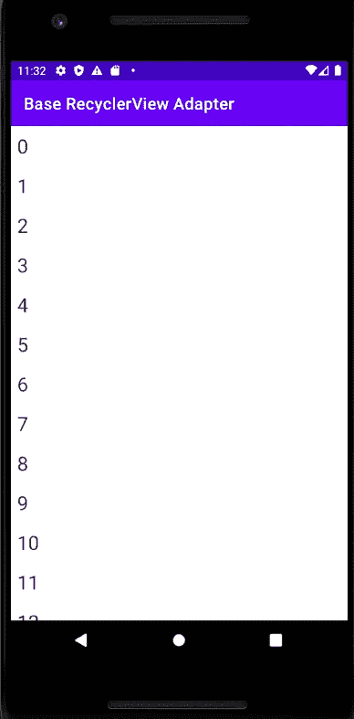

# 创建可用于任何数据模型(某种)和任何项目行视图(带有数据绑定)的 RecyclerView 适配器

> 原文：<https://blog.devgenius.io/creating-a-recyclerview-adapter-which-can-be-used-with-any-data-model-and-any-item-row-view-with-1144ca58f0be?source=collection_archive---------6----------------------->


Miguel A. Amutio 在 [Unsplash](https://unsplash.com?utm_source=medium&utm_medium=referral) 上拍摄的照片

对于 Android 开发者(以及一般的移动开发者)来说，最重要的 UI 组件是**列表视图**。我们移动开发者就是离不开**列表**(它们很棒)。尽管它们很棒，但有时为它们编写代码会变得如此重复和乏味。作为程序员，我们希望尽可能地遵循 **DRY** ，尽可能地重用代码。所以我做了一个简单的库，可以为 Android 处理基本的列表责任。好吧，让我们看看代码。

这里重要的东西是构造函数的这两个参数-**int resourceId**&
**int variable id**。 **BaseItemModel** 是一个数据模型类，它有一个 id 字段(它必须对列表中的每个对象有唯一的值)，在 **DiffUtil 中使用。项目回调**。模型类必须从 **BaseItemModel** 继承才能使用适配器。一个**难题。还提供了 ItemCallback** (名为**BaseDiffUtilItemCallback)**。你可以阅读 [DiffUtil](https://developer.android.com/reference/androidx/recyclerview/widget/DiffUtil) 和 [AsyncListDiffer](https://developer.android.com/reference/androidx/recyclerview/widget/AsyncListDiffer) 。它们用于在需要更新列表内容时确保最佳性能。下面给出了**BaseDiffUtilItemCallback**的代码。

以及 **BaseItemModel。**

下面是**base recyclerviewcholder**的代码。

bind 方法接受泛型类型参数 T，它是传递给适配器的模型类型。**view data binding . set variable(variable Id，type)** 此行将对象传递给 xml 代码(变量 id 将在 BR 中传递。<生成名称>表单)。**view data binding . executependingbindings()**将立即执行绑定，而不是等待下一帧。为了处理 onClick 和 onLongClick 事件，提供了 ListItemOnClickListener 。

我还在这个库中提供了一个更简单的适配器版本**basesimplecyclervieadapter**，它将与任何数据模型一起工作(不需要从 **BaseItemModel** 扩展)。但是当然它使用了**notifydatascethanged()**，这对性能不好。所以我推荐使用使用 **DiffUtil.ItemCallback.** 的那个

# ***用法:***

出于演示目的，生成了 itemModelList。**basecyclervieadapter**通过 R.layout.row_main_list(行布局)、BR.rowMainListObj(数据绑定变量)、BaseDiffUtilItemCallback()和 this(**ListItemOnClickListener**实现类)进行初始化。最后，使用**basecyclervieadapter . submit list(item modellist)**用数据填充回收器视图。

您还可以扩展适配器和其他组件来添加额外的功能。例如:如果需要在列表中膨胀不同的行。

# 结果:



您可以通过添加以下代码将此库添加到您的应用程序中:

```
project level build.gradle**allprojects {
		repositories {
			...
			maven { url 'https://jitpack.io' }
		}
	}**app level build.gradle**android {
    buildFeatures {
        dataBinding true
    }
}****dependencies {
    implementation 'com.github.tanveerprottoy:base-recyclerview-adapter:1.0'
}**
```

源代码在**Github**base-recycle view-adapter 上

今天到此为止。希望这对你有所帮助。感谢您的阅读。如果你喜欢这个帖子，请给一些掌声。