# 在 AWS 上创建研究蜜罐

> 原文：<https://blog.devgenius.io/creating-a-research-honeypot-on-aws-b0ded134729a?source=collection_archive---------5----------------------->


## **简介**

在这篇文章中，我将带你了解如何在 AWS 上轻松建立一个研究蜜罐。蜜罐是看起来易受攻击并包含敏感信息的服务器。蜜罐将记录采取的行动，提供有价值的威胁情报。

研究蜜罐收集攻击者使用的特定方法和策略的信息。这些通常被学生和教育机构使用，而不是被企业使用。收集的信息将提供攻击者 TTP 的更一般的概述。

另一方面，生产蜜罐通常用于收集企业或组织生产网络中的威胁情报。这些信息将有助于了解攻击者可能如何试图进入并利用公司的网络和资源。这些信息对于改善他们的安全状况非常重要。

这篇文章的蜜罐是 tpotce，一个由 Telekom Security 开发的开源蜜罐。

## **设置蜜罐**

登录 AWS 账户并导航至 **EC2 控制台**。

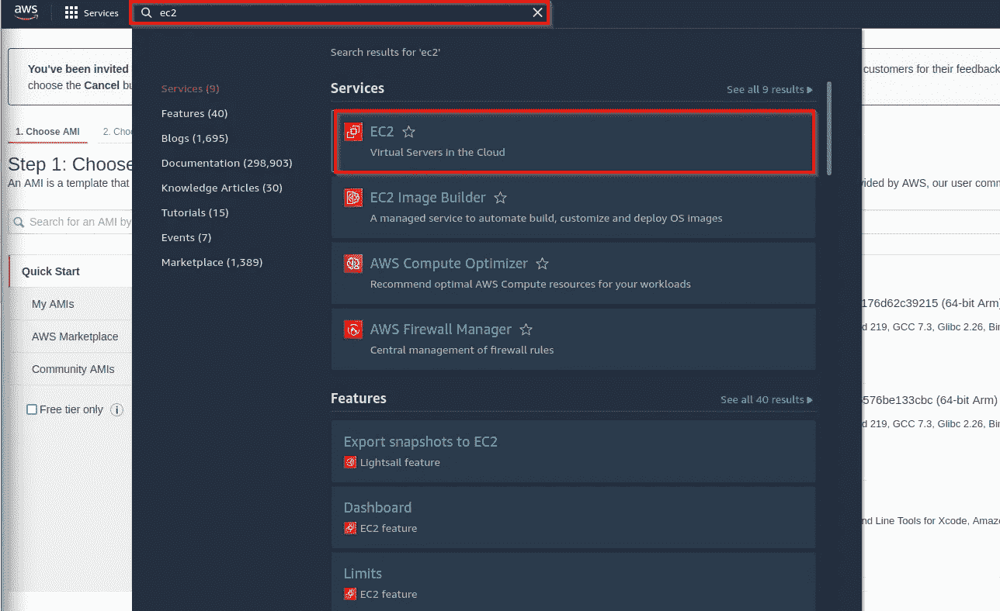

选择您想要设置蜜罐的 AWS 区域。根据您设置它的位置，可能会改变攻击的来源。可以通过在不同地区设置蜜罐来实验，看看是否得到不同的结果。我要在首尔建立我的蜜罐。

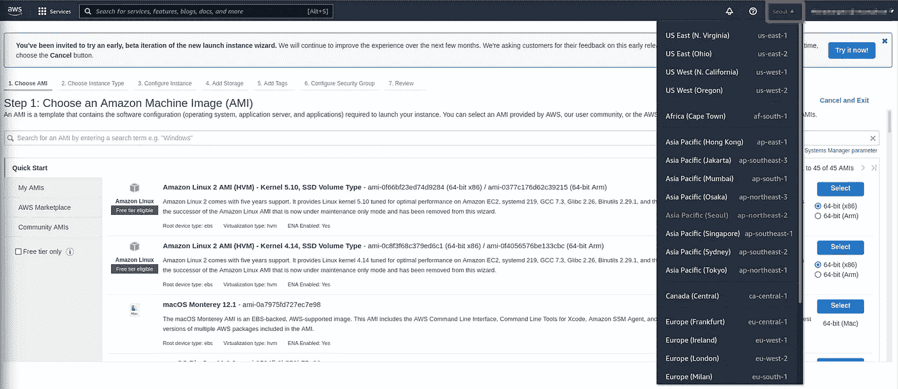

选择一个区域后，需要一个实例来托管蜜罐。点击侧面菜单中的**实例**，并点击**启动实例。**

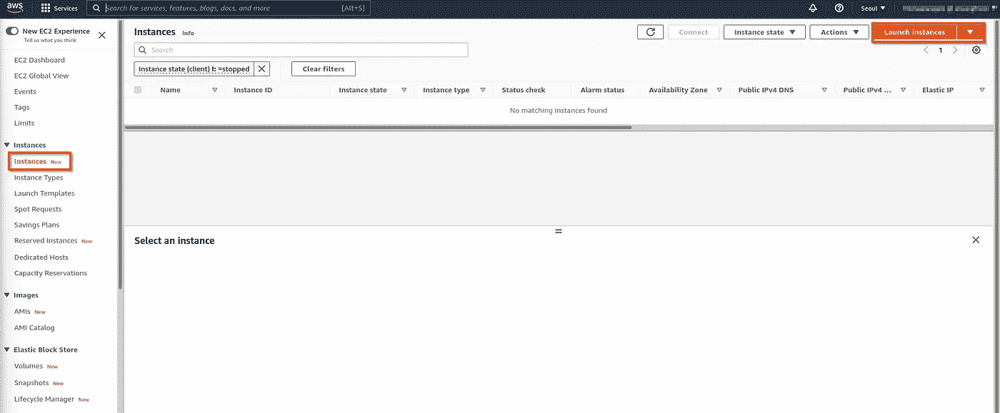

我将使用 **Debian 10 Buster** 镜像来托管蜜罐。点击 **AWS Marketplace** 并搜索“Debian 10 buster”，它应该是返回的第一个搜索结果。点击**选择**。

更新:Debian 10 不再支持这个蜜罐，所以需要 Debian 11。

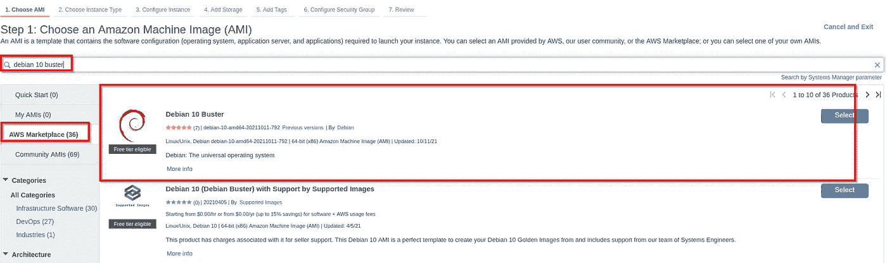

蜜罐需要大量的处理能力和内存，以确保我们不会为蜜罐耗尽内存。选择 **t2。Xlarge** 。然后点击**下一步:配置实例详细信息。**

免责声明:如果你让它运行，这将产生费用，所以要注意这一点。

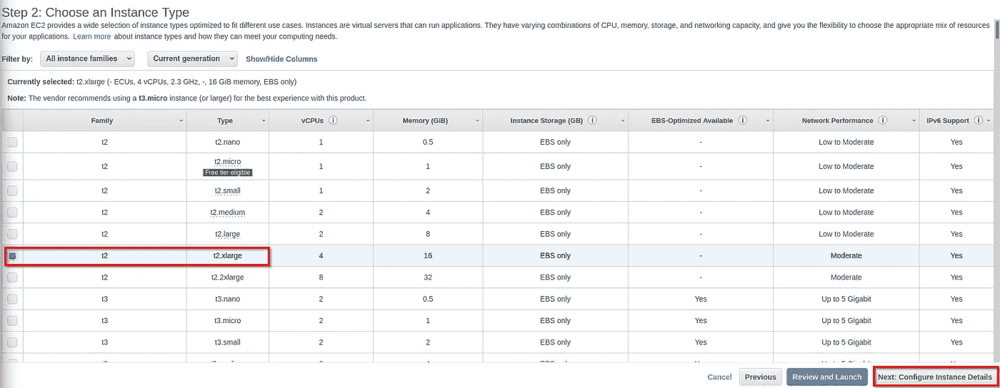

为了简单起见，我将把实例放在该地区的默认 VPC 中。这里唯一要更改的设置是**启用自动分配公共 IP** ，这样攻击者就可以访问它。其他的都可以不去管。**点击下一步:添加存储器。**

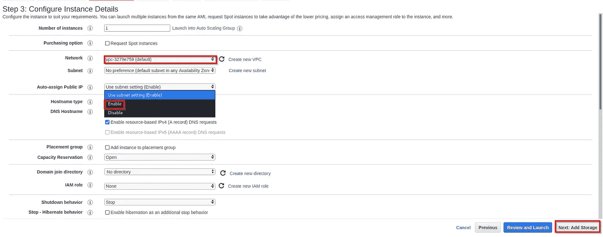

对于存储，将尺寸从 **8 增加到 128 GiB** ，然后点击**下一步:添加标签。**

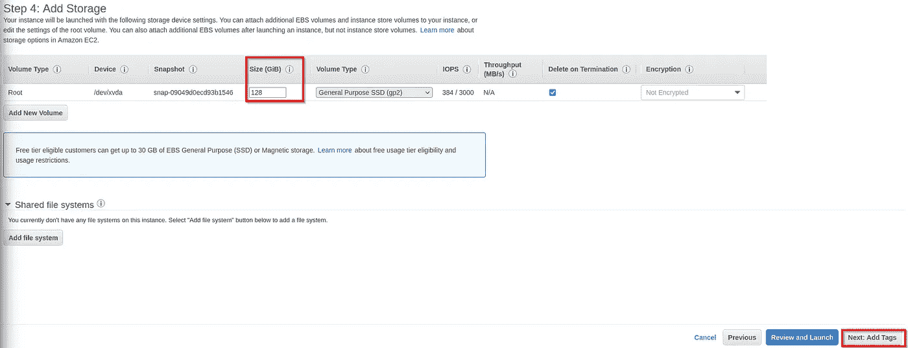

可选:添加标签，以便您可以轻松识别您将用于蜜罐的实例。然后点击**下一步:配置安全组**

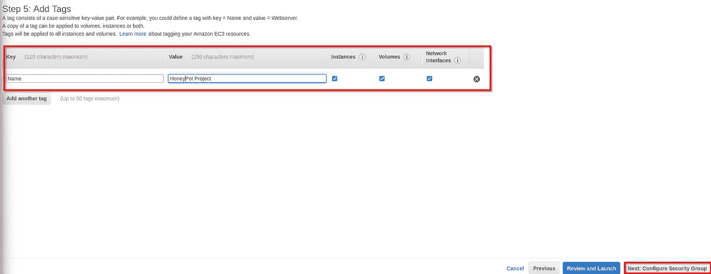

我们可以在这里保留默认值，并将在稍后的步骤中配置安全组，因此单击**查看并启动。**

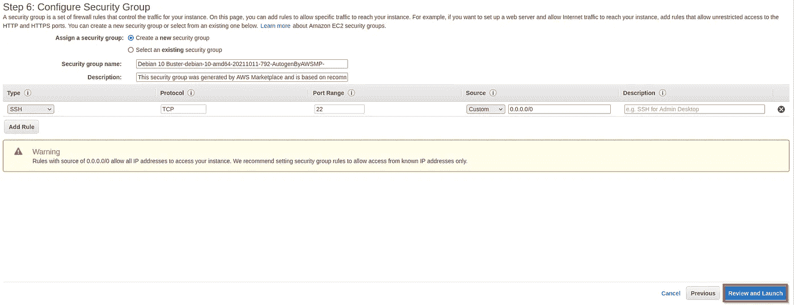

在下一页点击**启动**。

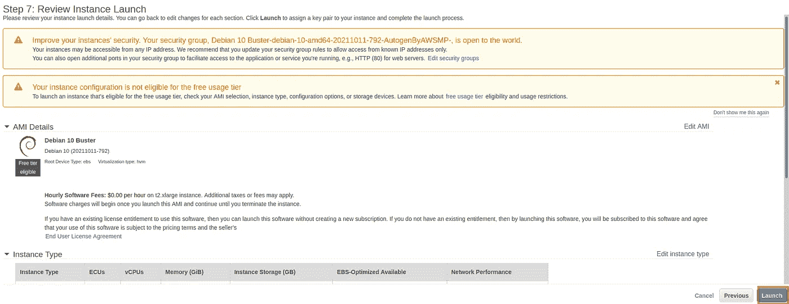

创建一个将用于 SSH 到实例的密钥对。不要丢失它，否则您将失去进入实例的权限。命名密钥对，下载密钥对并点击**启动实例**。

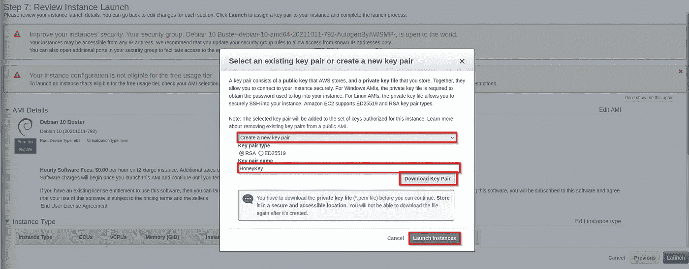

导航回 EC2 控制台，等待实例启动。首先会显示**正在初始化状态检查下的**，但我们需要等待，直到显示 **2/2 检查通过**。

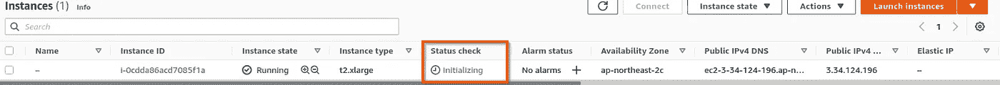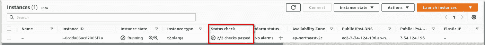

一旦它显示在**状态检查**下 **2/2 检查通过**，使用我们在上一步中创建的密钥 SSH 到实例中。您将需要该实例的公共 IP 地址，因此如果您选中该实例的复选框，您可以复制**公共 IPv4 地址。**

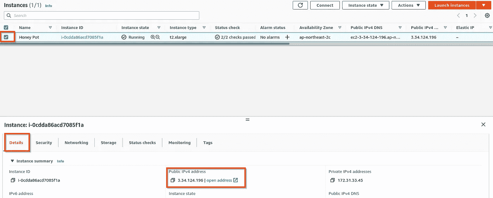

导航到您下载密钥的目录。首先，我们需要将密钥的权限更改为可读。

```
chmod 400 <Your key file>
```

使用以下命令 SSH 到实例中:

```
ssh -i <your key file> admin@<honeypot Public IPv4 address> 
Your ip address will be different and remove the brackets <>
```

*   I 选项选择要从中读取公钥身份验证标识(私钥)的文件

在成功使用 SSH 连接到实例之后，需要升级实例以便能够安装 git。Git 将用于从 github 克隆蜜罐的存储库。按此顺序运行以下命令:

```
sudo apt update
sudo apt upgrade
sudo apt install git
```

一旦安装了 git，我们就可以克隆存储库了。

```
git clone [https://github.com/telekom-security/tpotce.git](https://github.com/telekom-security/tpotce.git)
```

导航到新创建的 **tpotce** 目录并运行安装脚本。

```
cd tpotce
sudo ./install.sh --type=user
```

一旦安装完成，选择**标准**选项，并点击**确认**。

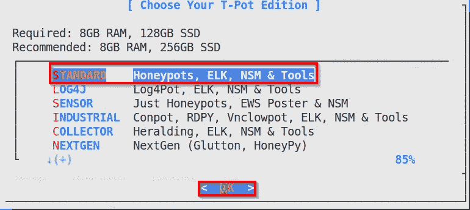

创建用户名。

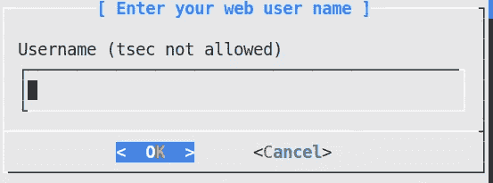

创建一个密码。

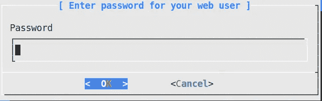

用户名和密码将用于登录蜜罐的 web 管理门户。这样做之后，通常会失去 SSH 连接，因为安装程序会重新映射许多端口，包括 SSH。接下来，我们需要配置安全组。导航回 EC2 控制台并选择您的实例。然后点击**安全**选项卡，并点击**安全组下的超链接。**

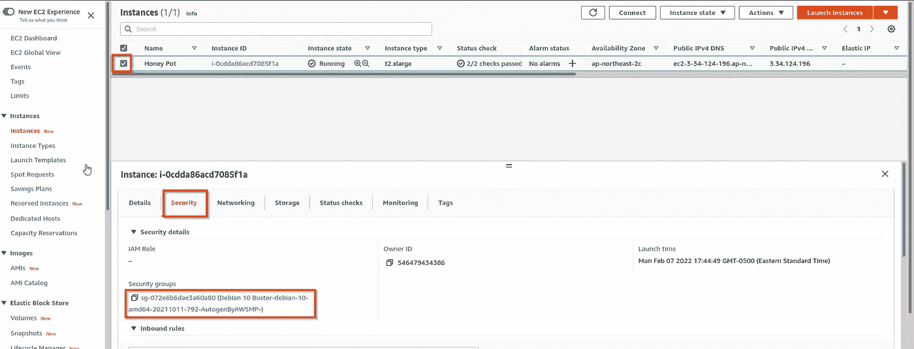

点击**编辑入库规则。**

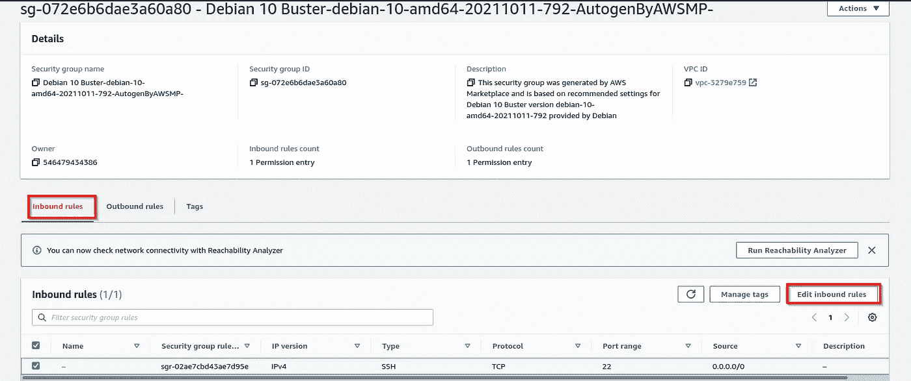

删除当前存在的规则。我们将为以下内容创建 3 条规则:

*   能够 SSH 到实例中
*   登录到 web 管理门户
*   使得攻击者能够访问端口 1–64，000

所有规则的**类型**将被设置为**自定义 TCP** 。对于第一个规则输入 **64295** 为**端口范围**。tpotce 安装程序将 SSH 的端口从 22 更改为 64295。在**源**的下拉菜单中选择**我的 IP。**“这将自动分配您的 IP 地址，并且只允许您通过 SSH 访问实例。您可以添加类似 Admin SSH 的描述来帮助您识别它的用途。

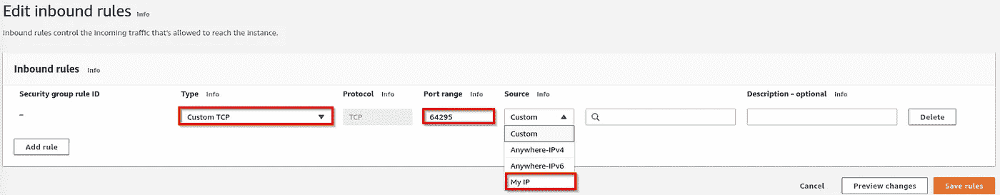

为 web 管理门户添加规则类似于上一步。点击**添加规则**。对于**类型**选择**自定义 TCP** ，但是对于**端口范围**输入 **64297** 。同样，为**源**选择“**我的 IP** ”，并添加类似“网络管理门户”的描述(如果您愿意的话)。

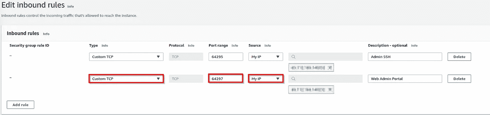

最后，创建允许所有流量进入的规则。点击**添加规则**。对于**端口范围**输入**1–64000**并选择 **Anywhere-IPv4** 作为**源**。完成后点击**保存规则**。

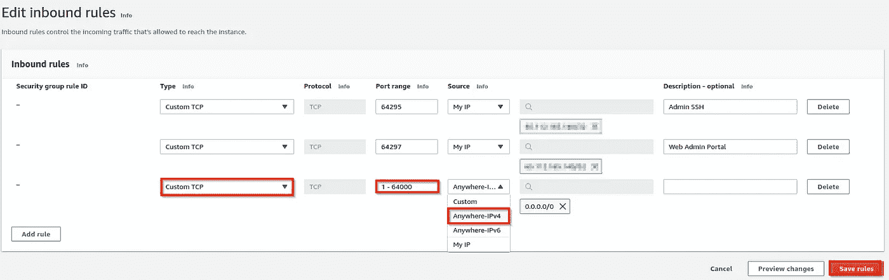

在您的浏览器中，您现在应该能够使用以下命令导航到 web 管理门户:

```
https://<honeypot Public IPv4 address>:64297
(remove the brackets <>)
```

如果您想通过 ssh 返回到实例，该命令将与之前类似，只是指定了端口:

```
ssh -i <your key file> -p 64295 admin@<honeypot Public IPv4 address>
```

我在连接 SSH 和 web 管理门户时遇到了一些问题，这是因为我使用了 VPN。如果您正在使用 VPN，断开连接，您应该能够连接没有问题。

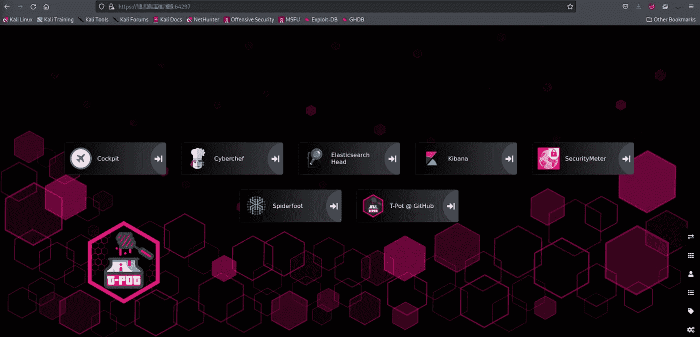

现在你已经成功地建立了一个研究蜜罐，你可以探索蜜罐网站管理门户。

*   Security meter 使用 T-Sec 雷达实时显示全球所有 tpotce 及其合作伙伴的蜜罐基础设施上发生的网络攻击。
*   Cyberchef 是一个伟大的开源工具，被称为“网络瑞士军刀”它可以做编码、解码、加密、哈希和校验和等功能。
*   Elasticsearch Head 是一个用于浏览和与弹性搜索集群交互的 web 前端。
*   Kibana 是一个免费开放的用户界面，允许您可视化 Elasticsearch 数据并浏览堆栈。
*   Spiderfoot 是一个用于从多个来源收集 OSINT 的工具，但需要 API 密钥才能运行