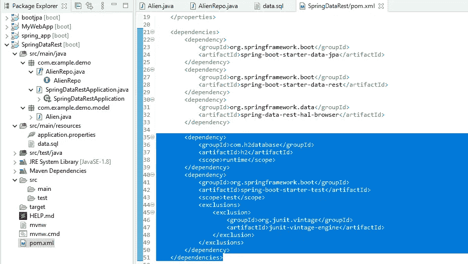
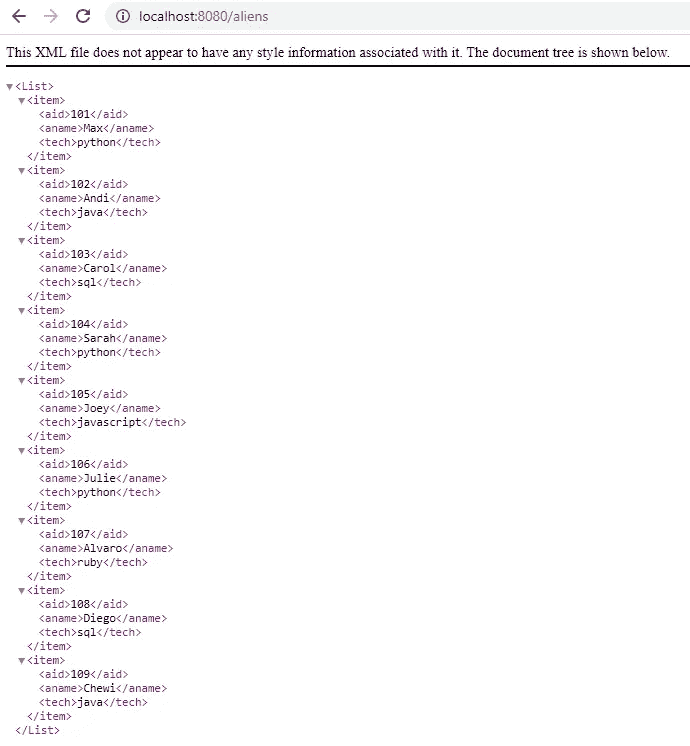
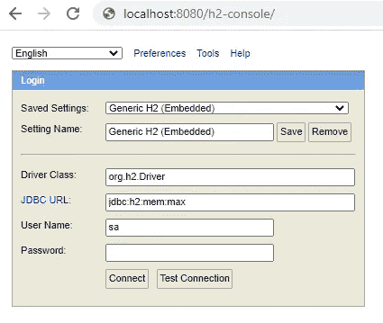

# 在 Spring 中用 Java 创建 Rest API

> 原文：<https://blog.devgenius.io/creating-a-rest-api-with-java-in-spring-f48400d24812?source=collection_archive---------15----------------------->


Spring boot + Rest API

# 介绍

我们都知道创建 Rest API 有多种方法。您可以使用 Flask、Django、Rails 或 Sinatra 来实现这一点，但本文将重点介绍如何使用 Java、Spring Boot 和 Spring Data Rest 来创建 restful API 端点。

**步骤:**

1.  生成 Spring Boot 项目
2.  添加实体
3.  创建 Rest 存储库
4.  数据库配置
5.  创建种子数据文件
6.  奔跑


运行控制台输出示例

# 生成 Spring Boot 项目

去[http://start.spring.io/](http://start.spring.io/)生成你的 Spring Boot (Maven)项目。添加 **JPA、Rest 存储库和 H2** 依赖项，并点击**生成项目**。


# 添加实体、列、getter/setter 和源

如果它看起来粗糙，它不是。在下面大约 200 个字符中，我只打了不到 50 个。Spring 提供了一种添加`getters and setters`和`tostring`的方式；我确信其他 ide，如 Eclipse 和 IntelliJ，也提供了类似的功能。


你的春季 maven 项目

首先你将点击你的应用程序(在我的例子中是 com.example.demo)并添加新包——这将创建一个带有`package`和`public`行的文件(见下图)。你要输入的只是`private`行！右键单击，转到 source 并选择 generate `tostring`和`generate getters and setters`，瞧，剩下的就添加进去了。Getters 和 Setters 都是`public void`线，`tostring`是覆盖线。将自动添加`import`行。一旦你添加了`@Entity`行；您还将自动添加导入实体行(下面的第 3 行)。


# 创建 Rest 存储库

接下来，您将创建一个接口文件。右键点击你的“com.example.demo”(或者随便你怎么称呼你的项目)，新建>界面；您将看到如下所示的`package and public interface`行。添加`@RepositoryRestResource`行**(点击 control + enter 弹出工具提示，在您想要添加的具体方法上按 enter 键—这将生成导入行(包))**，以及`interface`之后的文本；这将添加 Jparepository，它带有许多内置方法，例如:`findAll`、`findOne`和`delete`等等。


您的接口文件

## 为了你的启迪——休息方法:

@ **RepositoryRestResource** 用于设置公共存储库接口上的选项——它将根据正在扩展的存储库的类型(即 crud Repository/PagingAndSortingRepository/etc)自动创建适当的端点。

@**BasePathAwareController**和@**repository REST controller**用于当您想要手动创建端点，但是想要使用您已经设置的 Spring Data REST 配置时。

如果您使用@ **RestController** ，您将创建一组具有*不同*配置选项的并行端点——即不同的消息转换器、不同的错误处理程序等——但是它们将愉快地共存(并且可能会引起混淆)。

# 数据库配置

*还有其他地方/方法来存储/连接您的 API，如 MySql、PostgreSQL、NoSQL 等，但对于本文，我们将着眼于 h2 db 选项。

我们现在需要用下面的属性更新`src/main/resources/application.properties`文件。结合我们的 H2 依赖项(如下所述)，Spring Boot 将创建一个内存数据库供我们使用，我们最终可以查询并做任何我们想做的事情！


应用程序属性文件

# 创建 data.sql 文件

从我们数据库中的一些数据开始，让我们创建一个`sql`文件并导入一些行(只是为了确保它能工作)。在`src/main/resources`目录下添加一个名为`data.sql`的文件(右键>新建>文件> "data.sql" >回车)，Spring 会自动拾取并在启动时执行。将以下内容放入文件中(确保根据您在原始 java 文件中添加的列添加正确数量的输入):


SQL 文件

我加这个的时候确实得加点东西。sql 文件——几天前我做了这个，结果忘记了为了这个我需要做什么。sql 文件在 Spring 中正常工作/显示。但是如果你谷歌一下这个错误，你应该在几分钟内就能发现。不过，您可能根本不会遇到这个错误。只是一个小提示。

# 向 POM 文件添加依赖关系

这一部分并不复杂，但是为了让 API 工作，还需要执行一个额外的步骤。我们需要将 tomcat 和可能的 h2 依赖项添加到 pom.xml 文件中。

**Tomcat:**Apache**Tomcat**是一个长寿的、开源的 **Java** servlet 容器，它实现了几个核心的 **Java** 企业规范，即 **Java** Servlet、JavaServer Pages (JSP)和 WebSockets APIs。

基本上你需要搜索你的 **Maven Dependencies** 目录来找到你的 tomcat 和 h2 的具体版本，然后去[https://mvnrepository.com/artifact/org.apache.tomcat/](https://mvnrepository.com/artifact/org.apache.tomcat/tomcat-jasper/9.0.36)(H2 也一样)找到正确版本的代码并把它添加到你的 pom.xml 文件中。

这就是你添加更多依赖项的方法——所以从长远来看可能会派上用场！



您的 POM.xml 文件

# 奔跑

此时，您可以运行它，它会工作。但是我想更深入地探索一下。)



您的本地主机 url

# H2 控制台

让我们看看我们实际的内存 h2 数据库是什么样子的，对吗？好的，我们走吧。导航到[http://localhost:8080/H2-console/](http://localhost:8080/h2-console/)并输入凭证(您在`application.properties`文件中添加的内容)并测试>连接。



登录 h2 控制台

登录后，选择*您的数据库，让我们看看我们有什么！


嘣

# 邮递员客户请求

如果您像我一样，没有一个实际的应用程序/客户端来获取对您新构建的 java rest api(太酷了)的请求，那么您需要一种方法来测试不同的请求。这就是邮递员发挥作用的地方。这是一个开源工具，非常棒。我就不多说了，但是本质上你可以指定你的 url 并发送不同类型的请求:`get, post, delete, put`等等。


邮递员

# 控制器路由

如果您最终需要修改/创建您自己的端点配置，那么您会想要走控制器路线。这个我就不深究了，基本上你可以自己指定 X 操作的方法。下面是我在走`@RepositoryRestResource`路线之前写的一个例子。对于 Repo rest 途径，这些方法已经可用，因此不需要重新创建它们。

您还会在这里看到一些随机的行——这实际上是我用来帮助我了解 Java 和 Spring API 设计的一个测试脚本。比如下面几行——它们发布了我在控制台中创建的一个方法:

```
//post to console
System.out.println(repo.findByTech("java"));
System.out.println(repo.findByAidGreaterThan(102));
System.out.println(repo.findByTechSorted("java"));
```


控制器 Java 文件示例

# 添加向数据库提交数据的页面

让我们做最后一件事，我们创建一个页面，为用户输入的数据提供 html 论坛标签，并将数据存储在我们的 h2 数据库中。听起来像是纸上谈兵，但实际上编码有那么容易吗？是的——还不算太糟。

**步骤:**

*   在 src>main>webapp 中创建一个 home.jsp 文件(我添加了 webapp 目录)
*   通过右键单击 webapp >新建>其他>”来完成此操作。jsp" (spring 为您找到文件类型)> " home.jsp">enter
*   像这样输入您的代码:


论坛提交的 Home.jsp 文件

然后，您可以导航到[**http://localhost:8080/home . JSP**](http://localhost:8080/home.jsp)并提交输入，这些输入将被直接添加到您的 h2 数据库中。很酷吧？


[http://localhost:8080/home . JSP](http://localhost:8080/home.jsp)网址

# 结论

这是我上周才知道的。当然，这看起来令人畏惧，但最终也没那么糟糕。最困难的部分是知道在哪里引用您创建的所有不同的文件/方法/对象。有很多关于这方面的文档，但希望这能为您提供使用 Java ans Spring 创建 Rest API 的良好开端！

**源代码:**

github:[https://github.com/maxwellbade/java_rest_api_spring](https://github.com/maxwellbade/java_rest_api_spring)

[](https://www.buymeacoffee.com/31yearoldmoron)