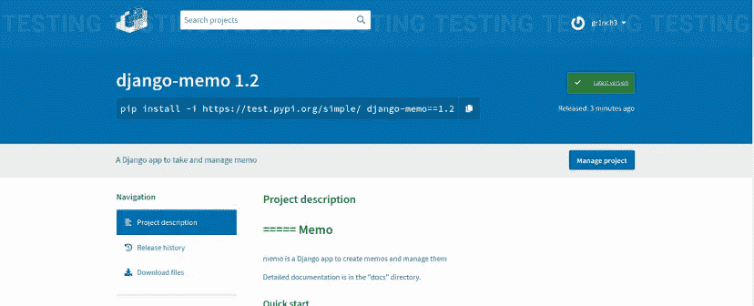
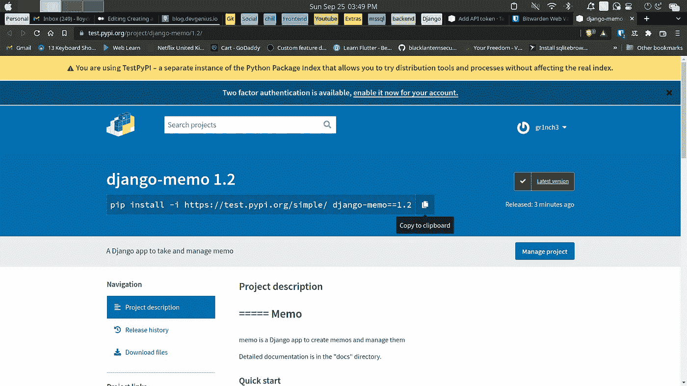

# 创建可重用的 Django 应用程序

> 原文：<https://blog.devgenius.io/creating-a-reusable-django-app-448c9631a886?source=collection_archive---------5----------------------->

Django 的多功能性并不仅限于创建 API 或令人印象深刻的 Web 应用程序，我们还可以从 Django 项目中的应用程序创建包。在本文中，我们将创建一个包，将其上传到 test.pypi，并研究如何在其他项目中使用该包。



# 可重复使用程度如何？

在我们开始之前，理解我们打算创建的包如何在其他人的项目中工作是至关重要的。我们的包会为项目提供功能，还是会独立工作并与数据库交互？我的包需要来自项目的数据吗？我的包会将数据传递给模板吗？等等。回答这些问题可以帮助你更好地掌握如何构建你的包。

# 创建您的包

我们将使用[这个回购](https://github.com/gr1nch3/django_memo.git)(也在下面)来创建我们的包。这是一个简单的备忘录应用程序，允许用户保存和检查备忘录，如果这是一项任务。

[](https://github.com/gr1nch3/django_memo.git) [## GitHub - gr1nch3/django_memo:简单的 django 备忘录应用程序

### 此时您不能执行该操作。您已使用另一个标签页或窗口登录。您已在另一个选项卡中注销，或者…

github.com](https://github.com/gr1nch3/django_memo.git) 

项目结构应该是这样的:

```
django_memo
  |_django_memo
  |_memo
  |_theme
  |_manage.py
```

第一步是把我们要变成包的 app 移动到另一个文件夹，你可以复制或者剪切到这个文件夹。您应该为该文件夹选择一个有意义的名称，因为它是您的包将被引用的名称。我会把我的命名为姜戈备忘录。在该文件夹之外，我们将创建一个虚拟环境。(确保您的包及其虚拟环境位于单独的工作区或文件夹中

```
# first
python3 -m venv my-env
# second
source my-env/bin/activate # macos/linux
my-env/scripts/activate.bat # windows
```

接下来是安装 twine 和 setuptools，我们将使用它们来构建我们的包并测试它。

```
pip install twine setuptools
```

## 临时演员

在你将应用程序移动到的文件夹中(在我的例子中是 django-memo)，我们将添加以下文件来配置和构建你的包: **setup.cfg，LICENSE，pyproject.toml，README.md** 和 **MANIFEST.in** 。

**pyproject.toml**

将以下内容添加到您的 **pyproject.toml** 文件中，并确保 setuptools 版本与您安装的版本相匹配。

```
[build-system]
requires = ['setuptools >= 65.3.0', 'wheel']
build-backend = 'setuptools.build_meta:__legacy__'
```

**setup.cfg**

这个文件包含 **PyPI** 的元数据以及您的包的其他需求。请务必检查您的软件包版本的要求，并相应地进行设置。

```
[metadata]
name = django-memo
version = 1.2
description = A Django app to take and manage memo
readme = "README.md"
long_description = file: README.md 
long_description_content_type=text/markdown
url = [https://www.example.com/](https://www.example.com/)
author = gr1nch3
author_email = example[@gmail.com](mailto:lloydm763@gmail.com)
license = MIT License
classifiers =
    Environment :: Web Environment
    Framework :: Django
    Framework :: Django :: 4.0 # set your version
    Intended Audience :: Developers
    License :: OSI Approved :: MIT License
    Operating System :: OS Independent
    Programming Language :: Python
    Programming Language :: Python :: 3
    Programming Language :: Python :: 3 :: Only
    Programming Language :: Python :: 3.9
    Programming Language :: Python :: 3.10
    Topic :: Communications :: Chat[options]
include_package_data = true
packages = find:
python_requires = >=3.9
install_requires =
    Django >= 4.0 # set your version
```

**注:**默认为 **long_description** 。rst 但是。md 为我工作。 **long_description** 和**long _ description _ content _ type**需要这样配置才能通过**捆绳**检查。

**自述**

您的自述文件需要正确编写，以便上传到 pypi。它还应该告诉如何在 Django 项目中设置您的包。

```
=====
Memo
=====memo is a Django app to create memos and manage themDetailed documentation is in the "docs" directory.Quick start
-----------1\. Add "memo" to your INSTALLED_APPS setting like this::INSTALLED_APPS = [
        ...
        'memo',
  ]2\. Include the memo URLconf in your project urls.py like this::path('memo/', include('memo.urls')),3\. Run ``python manage.py migrate`` to create the memo models.4\. Visit '[http://127.0.0.1:8000/memo/'](http://127.0.0.1:8000/memo/') to check out your memos
```

**执照**

许可证将包含您的软件包的许可证。我们将使用麻省理工学院的许可证

```
# MIT LicenseCopyright (c) [year] [your full name]Permission is hereby granted, free of charge, to any person obtaining a copy
of this software and associated documentation files (the "Software"), to deal
in the Software without restriction, including without limitation the rights
to use, copy, modify, merge, publish, distribute, sublicense, and/or sell
copies of the Software, and to permit persons to whom the Software is
furnished to do so, subject to the following conditions:The above copyright notice and this permission notice shall be included in all
copies or substantial portions of the Software.THE SOFTWARE IS PROVIDED "AS IS", WITHOUT WARRANTY OF ANY KIND, EXPRESS OR
IMPLIED, INCLUDING BUT NOT LIMITED TO THE WARRANTIES OF MERCHANTABILITY,
FITNESS FOR A PARTICULAR PURPOSE AND NONINFRINGEMENT. IN NO EVENT SHALL THE
AUTHORS OR COPYRIGHT HOLDERS BE LIABLE FOR ANY CLAIM, DAMAGES OR OTHER
LIABILITY, WHETHER IN AN ACTION OF CONTRACT, TORT OR OTHERWISE, ARISING FROM,
OUT OF OR IN CONNECTION WITH THE SOFTWARE OR THE USE OR OTHER DEALINGS IN THE
SOFTWARE.
```

**载货单**

清单将包括您的包需要的其他文件、文件夹和模板。

```
include LICENSE
include README.md
recursive-include docs *
```

**setup.py**

构建包所必需的

```
from setuptools import setupsetup()
```

完成所有配置后，您的包应该如下所示:

```
...(workspace or folder)
  |_my-env
  |_django-memo
    |_memo
    |_LICENSE
    |_MANIFEST.in
    |_pyproject.toml
    |_README.md
    |_setup.cfg
    |_setup.py
```

# 配置我们的模型

在这一节中，我们将配置我们的 memo 模型，使之与将要安装它的项目一起工作。因为 memo 模型需要一个抽象用户。我们将设置它，以便包从设置中获取用户模型。只需将用户模型传递给设置(用`AUTH_USER_MODEL`)并作为我们的 memo 模型的`settings.AUTH_USER_MODEL`访问它，就可以将模型作为字符串传递。所以我们将使用`django.contrib.auth`中的`get_user_model()` 。我们的备忘录模型结构将更改如下:

```
from django.db import modelsfrom django.contrib.auth import get_user_model # newMemoUser = get_user_model() # new
# Create your models here.# ---------------------------------------------------------------------------- #
#                           model of the memo detail                           #
# ---------------------------------------------------------------------------- #class Memo(models.Model):
                             # new
    user = models.ForeignKey(MemoUser, on_delete=models.CASCADE)
    title = models.CharField(max_length=100)
    memo = models.TextField(blank=True)
    created_at = models.DateTimeField(auto_now_add=True)
    updated_at = models.DateTimeField(auto_now=True)
    is_completed = models.BooleanField(default=False)def __str__(self):
        return self.titleclass Meta:
        db_table = 'memo'
        verbose_name = 'Memo'
        verbose_name_plural = 'Memos'
        ordering = ['-created_at']
```

注意:如果您要将一个模型传递给包并将其用作外键，您可以检查出`get_user_model()`函数的代码，它也适用于传递其他模型，您只需要在`settings.py`中设置它。

# 测试我们的包

在这一点上，我们已经构建和结构化了我们的应用程序，并且拥有了将它打包所需的所有文件。

## 建设

有两种方法可以创建包含这个包的 dist 文件夹。

1.  我们可以使用`setuptools`并在包含我们的应用程序和打包文件的目录中运行命令`python setup.py sdist`，我们将得到一个仍然通过`twine check`的构建。
2.  我们也可以使用 python `build`模块的`python3 -m build`命令，得到类似的结果，我们也可以得到包的轮子

## 试验

创建完`dist`文件夹后，在包含`dist`的文件夹中运行命令`twine check dist/*`，您应该会看到如下消息:

```
# if you used the first method
Checking dist/django-memo-1.2.tar.gz: PASSED# if you used the second method
Checking dist/django_memo-1.2-py3-none-any.whl: PASSED
Checking dist/django-memo-1.2.tar.gz: PASSED
```

## 安装我们的软件包

要在项目中本地安装我们的包，我们可以运行下面的命令:`python -m pip install -U ./dist/django-memo-1.2.tar.gz`。

# 上传我们的包

我们将把我们的包上传到[测试。PyPI](https://test.pypi.org/) 。确保创建一个帐户。完成后，转到帐户设置和添加 API 令牌，并创建一个令牌。请记住将您的令牌复制到安全的地方，因为您将使用它上传到 test.PyPI。

创建令牌后，在您的终端中运行以下命令:

```
python3 -m twine upload --repository testpypi dist/*
```

系统会提示您输入用户名，并将用户名值设置为`__token__`。当您收到密码提示时，您会添加为密码复制的令牌值。结果应该类似:

```
Uploading django_memo-1.2-py3-none-any.whl
100% ━━━━━━━━━━━━━━━━━━━━━━━━━━━━━━━━━━━━━━━━ 10.7/10.7 kB • 00:05 • 14.2 MB/s
Uploading django-memo-1.2.tar.gz
100% ━━━━━━━━━━━━━━━━━━━━━━━━━━━━━━━━━━━━━━━━ 9.6/9.6 kB • 00:00 • 9.6 MB/sView at:
[https://test.pypi.org/project/django-memo/1.2/](https://test.pypi.org/project/django-memo/1.2/)
```

恭喜你！您刚刚创建了第一个工作包！如果您按照终端中结果的链接，您应该会在 test.PyPI 上看到您的包。



要查看该套餐，请在此 repo 中查看:

[](https://github.com/gr1nch3/django-memo) [## GitHub - gr1nch3/django-memo

### 备忘录是一个用来创建备忘录和管理备忘录的 Django 应用程序。详细的文档在“文档”目录中。将“备忘录”添加到…

github.com](https://github.com/gr1nch3/django-memo)