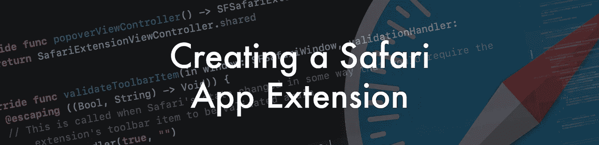
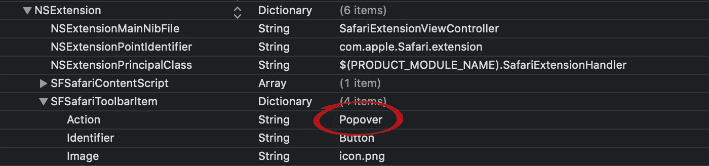
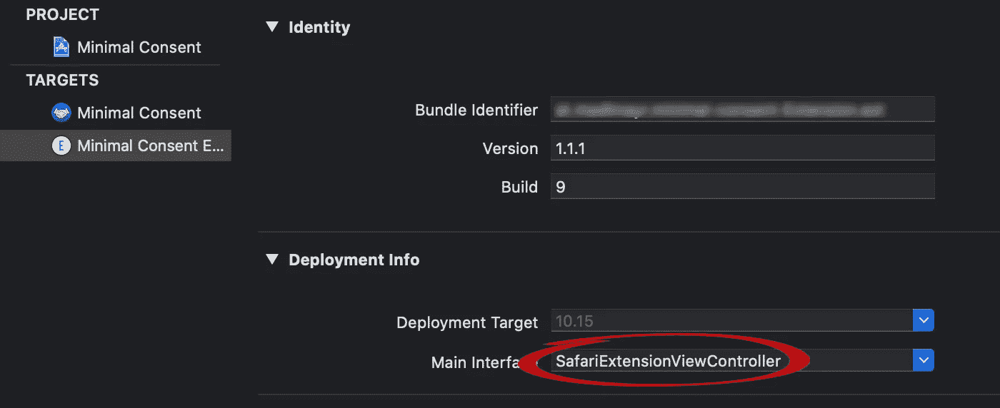

# 创建 Safari 应用程序扩展

> 原文：<https://blog.devgenius.io/creating-a-safari-app-extension-c17573d10270?source=collection_archive---------4----------------------->



在这篇文章中，我想分享一些从创建 Safari 应用程序扩展中学到的东西，它的 codebase party 也用在了一个完全用 TypeScript 编写的 WebExtension 中。

## 动机

浏览器扩展已经达到了一定的势头，因此谷歌宣布了一个[更严格的审查过程](https://blog.chromium.org/2020/04/keeping-spam-off-chrome-web-store.html)，并在 2020 年 8 月 27 日之前从商店中移除不符合这些新规则的扩展。

有了基于 [Mozilla WebExtension API](https://developer.mozilla.org/en-US/docs/Mozilla/Add-ons/WebExtensions) 的扩展，你可以针对所有基于 *Chromium* 的浏览器，比如 *Chrome* 、 *Opera* 和 *Edge* 以及 *FireFox* 。为了同时面向 Safari 用户，您需要一个专用实现:Safari 应用程序扩展。如果你还没有在苹果开发者生态系统中工作过，这是一个艰难的步骤，因为有许多障碍需要克服:

你需要

*   用于开发的 Mac 和 XCode，因为你必须提供的应用程序是编译好的代码，将通过苹果应用商店分发。
*   用于签署代码的开发者证书(售价 99 欧元)。
*   如果你不仅仅依赖内容脚本，重写你现有的扩展的一部分。

为了获得一些基本的见解，我建议在开始使用自己的 Safari 应用程序扩展之前，先学习这两个教程:

*   苹果:[添加、构建并启用 Safari 应用扩展](https://developer.apple.com/documentation/safariservices/safari_app_extensions/building_a_safari_app_extension)
*   Ulrik Lyngs: [如何构建 Safari 应用扩展](https://ulriklyngs.com/post/2018/11/02/how-to-build-safari-app-extensions/)

# Mozilla 和 Safari 架构在扩展方面的差异

在基于 Mozilla API 的浏览器扩展中，有不同的组件，你可能需要把它们移植到苹果的平台上。

*   [内容脚本](https://developer.chrome.com/extensions/content_scripts):内容脚本几乎可以不加修改地使用。Safari 也支持这些模块。但如果标准没有区别，那就不是苹果了。所以没有 *chrome* 或者*浏览器*对象，而是 *safari* ，略有不同。
*   [后台脚本](https://developer.chrome.com/extensions/background_pages#manifest):坏消息是，你必须在 Swift(或 ObjC)中完全重写这个功能，因为这个功能需要成为原生组件的一部分。好的一面是，本地代码很快，易于测试，Swift 通过 XCode 提供了很好的支持。后台脚本将被[扩展处理程序](https://developer.apple.com/documentation/safariservices/sfsafariextensionhandler)取代。
*   [弹出](https://developer.chrome.com/extensions/user_interface#popup):是的，你可以在 Safari 中有弹出窗口，如果按下浏览器工具栏中的 App 图标，但也需要原生实现。(附故事板)。在苹果的世界里，正确的说法是 [popover](https://developer.apple.com/library/archive/documentation/Tools/Conceptual/SafariExtensionGuide/AddingPopovers/AddingPopovers.html#//apple_ref/doc/uid/TP40009977-CH21-SW1) 。
*   [选项页](https://developer.chrome.com/extensions/options#linking):否，不支持。该功能要求您在单独模块中实现它，作为本机 macOS 应用程序的一部分。(包括故事板)

# 我的学习

## 公共代码库

尽量保持 Chrome 和 Safari 之间的代码库在内容脚本上尽可能的相似。重构现有的内容脚本，将浏览器特定的功能放在单独的类/文件中。这主要与内容脚本和扩展处理程序之间的[通信有关(Safari 中没有)。](https://developer.apple.com/library/archive/documentation/Tools/Conceptual/SafariExtensionGuide/MessagesandProxies/MessagesandProxies.html#//apple_ref/doc/uid/TP40009977-CH14-SW12)

为了确定你的内容脚本是在 safari 上运行还是在 chrome 环境中运行，你可以使用:

```
if (typeof safari !== 'undefined') {
    console.*log*("+++ Running on Safari +++");
} else if (typeof chrome !== 'undefined') {
    console.*log*("+++ Running on Chromium Platform +++")
} else {
    console.*log*("+++ Running on some other Platform +++")
}
```

## 类型脚本支持

如果您正在使用 TypeScript，那么会为 *safari* 对象提供一个[类型定义](https://www.npmjs.com/package/@types/safari-extension-content)。不幸的是，它不包含 *safari.extension.** 的方法签名(但至少现在可以识别 *safari* )。

## 处理扩展处理程序

如果您的内容脚本正在向扩展处理程序发送消息，该消息将触发方法 *messageReceived* ，您可以在其中处理数据。对于每条消息，都将有一个新的扩展处理程序实例，因此您不能在扩展处理程序之间共享信息，除非您将变量设为静态。

## 项目目标

Safari 应用程序扩展的项目至少包含两个目标:

*   作为分发容器的本机 macOS 应用程序。
*   将与浏览器集成的 Safari 应用程序扩展。

不要移除其中一个。你的应用扩展既不会运行，也不会通过苹果的审查程序。

## 清理本机 macOS 应用程序的生成代码

如果你专注于 Safari 应用扩展，原生 macOS 应用将几乎没有任何功能。尽管如此，您可能还是想看一下应用程序，因为它在用户的应用程序文件夹中，当然这也是审核过程的一部分。

*   移除未使用的菜单项(自动生成的视图有一个“帮助”菜单，没有内容)
*   在 macOS 应用程序中，有一个在 Safari 中打开“应用程序扩展”标签的链接。确保它有效。(如果重构应用程序命名，可能会损坏)。
*   坚持界面指南(自动生成的视图没有标题栏)。

## 从图像中移除标题，否则构建会中断

您可以使用矢量图形(PDF)或位图(PNG)作为工具栏图标。如果你添加图像，你必须在命令行使用 **xattr -cr** 来删除预览的标题。否则你将会以一个非零退出代码结束**命令代码设计失败。**

```
CodeSign xxx.app (in target ‘xxx’ from project ‘xxx’)cd xxxexport CODESIGN_ALLOCATE=/Applications/Xcode.app/Contents/Developer/Toolchains/XcodeDefault.xctoolchain/usr/bin/codesign_allocateSigning Identity: “Apple Development: xy@gmx.at (xxxxxxxx)”/usr/bin/codesign — force — sign F50F8AC5AE578F274F67697238501C192F618474 -o runtime — entitlements xxx — timestamp=none xxxx.appxxx.app: resource fork, Finder information, or similar detritus not allowed**Command CodeSign failed with a nonzero exit code**
```

附注:工具栏图标只有一种颜色和透明背景。

## 创建 Popover

创建弹出窗口需要四个步骤。

*   在 Info.plist 中，在子树 *SFSafariToolbarItem* 中将“Action”从“Command”改为“Popover”。



*   在扩展的构建目标中，在“General”中选择主界面的 XIB 文件。



*   您需要控制器的相应实现；但是在生成的 XCode 项目中有一个标准的实现。

```
import SafariServicesclass SafariExtensionViewController: SFSafariExtensionViewController {
   static let shared: SafariExtensionViewController = {
   let shared = SafariExtensionViewController()
   shared.preferredContentSize = NSSize(width:320, height:240)
   return shared
   }()
}
```

*   在扩展处理程序中覆盖 *popoverViewController* 方法:

```
override func popoverViewController() -> SFSafariExtensionViewController {
   return SafariExtensionViewController.shared
}
```

## AppStore 评论

带有英语音频解释的简短视图将有助于评论更好地理解您的扩展的功能。您只需将其上传到 AppStore Connect 即可。扩展的截图必须用 Safari 制作。

我希望这些见解对你有所帮助。查看[最小同意](https://www.minimal-consent.com)以了解“行动”中的理论。