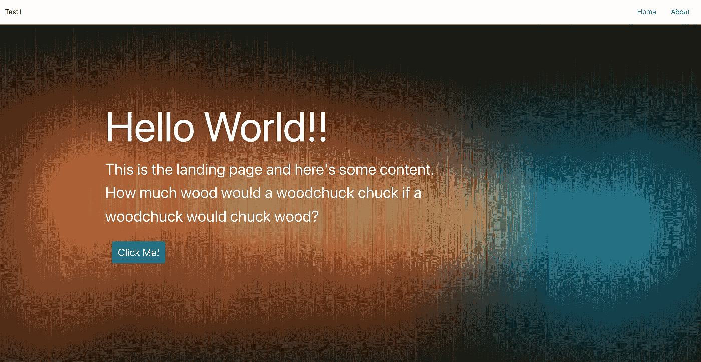
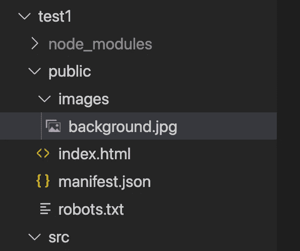
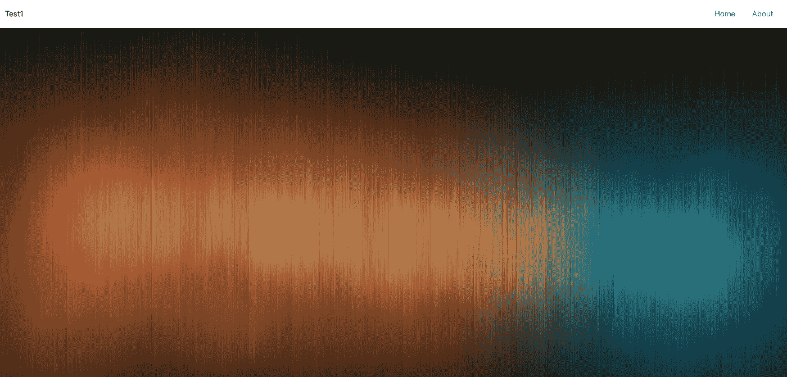
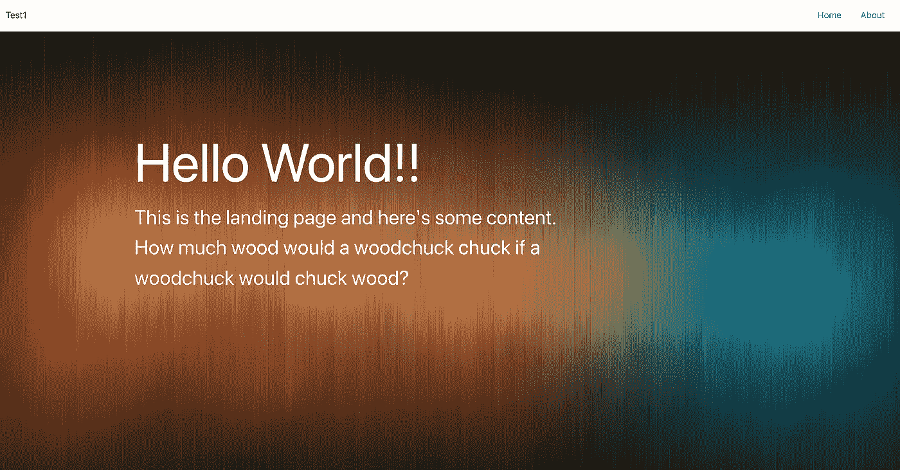
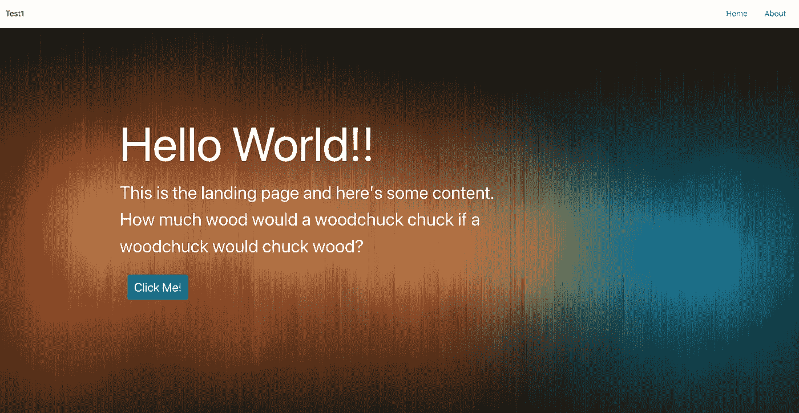

# 用 React 创建简单的登录页面——来自 React 初学者(第 2 部分)

> 原文：<https://blog.devgenius.io/creating-a-simple-landing-page-with-react-from-a-react-beginner-part-2-b53b730be78c?source=collection_archive---------1----------------------->


这一系列文章旨在以一种连贯的方式记录我的 React 学习之旅，并且旨在成为我还在弄清楚 React 中的东西是如何工作的时候就希望拥有的文档。特别是在这篇文章中，让我们看看如何创建一个简单的登录页面。



虽然这看起来很简单，但我还是花了比预期更长的时间来完成这项任务。

# 我们开始的代码

[](https://github.com/zlliu246/react_examples/tree/version1) [## GitHub-zlliu 246/react _ 第 1 版示例

### 这个项目是用 Create React App 引导的。在项目目录中，您可以运行:在…中运行应用程序

github.com](https://github.com/zlliu246/react_examples/tree/version1) 

到目前为止，我们已经有了一个包含两个链接的简单标题— `/`和`/about`。`/`路径通向主页(我们将编辑它)，而`/about`路径通向 about 页面。

# 1)下载我们的背景图像

我使用的图片是来自谷歌图片的一些随机背景图片。找到一张高质量的图片(从 Google Images 或 Shutterstock 或诸如此类的网站)并下载。



接下来，我们需要将我们的图像放在 public 文件夹下。对我来说，我喜欢把所有的图片放在一个`images`文件夹下，但是如果你不想的话，你可以不这么做。

# 2)添加背景图片作为背景

## HomePage.jsx

```
function LandingFrame() {
    const style = {
        "background-image": `url("images/background.jpg")`,
        "background-repeat": "no-repeat",
        "background-size": "cover",
        position: "absolute",
        height: "100%",
        width: "100%"
    } return <div style={style}></div>
}function HomePage() {
    return <div>
        <LandingFrame />
    </div>
}export default HomePage
```

在 React 的`.jsx`文件中，我们可以将 CSS 编写为 Javascript 对象，然后使用`style={style}`语法注入它。这段代码将使我们下载的图像成为我们主页的背景，就像这样:



# 3)添加一些文本

```
function LandingFrameMessage() { const style = {
        margin: "auto",
        padding: "10% 35% 10% 15%",
        color: "white"
    } return <div style={style}>

        <div style={{"font-size": "96px"}}>
            Hello World!!
        </div>

        <div style={{"font-size": "36px"}}>
            This is the landing page and here's some content.
            How much wood would a woodchuck chuck 
            if a woodchuck would chuck wood?
        </div> <br />
    </div>
}
```

让我们创建一个函数`LandingFrameMessage`来返回我们希望用户看到的文本。这里，请注意`style={{"font-size": ...}}`语法。外部的花括号用于将 javascript 代码注入 HTML 部分，内部的花括号表示 javascript 对象的开始。本质上，我们将对象`{"font-size": "96px"}`作为各自`div`元素的样式注入 HTML。

```
function LandingFrame() {
    const style = {
        "background-image": `url("images/background.jpg")`,
        "background-repeat": "no-repeat",
        ...
    }return <div style={style}>
        <LandingFrameMessage />
    </div>
}
```

接下来，我们需要将`LandingFrameMessage`注入到`LandingFrame`函数中，这样我们就可以添加我们希望用户看到的消息。这是我们的登录页面目前的样子。



# 4)在文本下方添加一个按钮

让我们把我们的按钮放在一个函数中，这样东西会更整洁。

```
import {Link} from "react-router-dom"function LandingPageButton() {
    return <Link to="/about" class="nav-link">
        <button class="btn btn-primary" > 
            <span style={{"font-size": "24px"}}>
                Click Me!
            </span>
        </button>
    </Link>
}
```

这里，让我们从`"react-router-dom"`库中导入`Link`。我已经设置了链接到`/about`页面的按钮，但是你可以设置链接到任何你想链接的地方。

```
function LandingFrameMessage() {
    const style = { margin: "auto", ... }
    return <div style={style}>
        the bunch of text<br /> <LandingPageButton /> </div>
}
```

接下来，让我们使用`LandingPageButton`函数将按钮放在文本下方。这是我们的登录页面目前的样子:



# 所有代码都在一个地方

## HomePage.jsx

```
import {Link} from "react-router-dom"function LandingPageButton() { return <Link to="/about" class="nav-link">
        <button class="btn btn-primary" > 
            <span style={{"font-size": "24px"}}>
                Click Me!
            </span>
        </button>
    </Link>
}function LandingFrameMessage() { const style = {
        margin: "auto",
        padding: "10% 35% 10% 15%",
        color: "white"
    } return <div style={style}>

        <div style={{"font-size": "96px"}}>
            Hello World!!
        </div>

        <div style={{"font-size": "36px"}}>
            This is the landing page and here's some content.
            How much wood would a woodchuck chuck if a 
            woodchuck would chuck wood?
        </div> <br /> <LandingPageButton /> </div>
}function LandingFrame() {
    const style = {
        "background-image": `url("images/background.jpg")`,
        "background-repeat": "no-repeat",
        "background-size": "cover",
        position: "absolute",
        height: "100%",
        width: "100%"
    } return <div style={style}>
        <LandingFrameMessage />
    </div>
}function HomePage() {
    return <div>
        <LandingFrame />
    </div>
}export default HomePage
```

# 一些最后的话

对于一个经验丰富的前端开发人员来说，这可能看起来很简单，但是这实际上比我想象的要多花一点时间。如果你是新手，希望这能让你更好地了解如何编写一个登陆页面。一定要根据你的喜好改变图片和文字。

# Github 回购

[](https://github.com/zlliu246/react_examples/tree/version2-landing-page) [## GitHub-zlliu 246/react _ examples at version 2-landing-page

### 这个项目是用 Create React App 引导的。在项目目录中，您可以运行:在…中运行应用程序

github.com](https://github.com/zlliu246/react_examples/tree/version2-landing-page) 

# 结论

*如果这篇文章有价值，并且你希望支持我成为一名作家，请考虑注册一个 Medium 会员——每月 5 美元，你可以无限制地访问 Medium 上的故事。如果你注册使用我的链接，我会赚一小笔佣金。*

[***点击此处无限制访问媒体***](https://zl-liu.medium.com/membership)

如果你希望在我发布时得到通知，请考虑加入我的电子邮件列表。

[](https://zl-liu.medium.com/subscribe) [## 每当 Zlliu 发布时收到一封电子邮件。

### 每当 Zlliu 发布时收到一封电子邮件。注册后，如果您还没有中型帐户，您将创建一个…

zl-liu.medium.com](https://zl-liu.medium.com/subscribe)