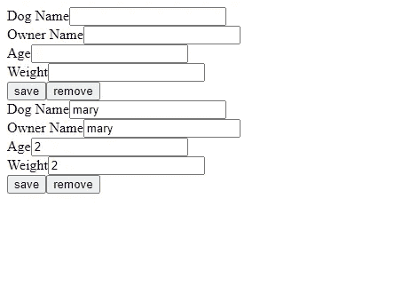

# 使用 HarperDB、Express 和 Vue 创建简单的 Web 应用程序

> 原文：<https://blog.devgenius.io/creating-a-simple-web-app-with-harperdb-express-and-vue-edecd136c554?source=collection_archive---------30----------------------->


卡斯帕·卡米尔·鲁宾在 [Unsplash](https://unsplash.com?utm_source=medium&utm_medium=referral) 上拍摄的照片

HarperDB 是一个可伸缩的 SQL 和 NoSQL 数据库，我们可以用它来存储数据。

我们可以进行查询，包括更复杂的查询，如连接。

利用其 API 的多功能性，它对于创建报告和数据分析非常有用。

它让我们通过 HTTP 请求而不是直接查询来控制数据库。

在本文中，我们将看看如何用 HarperDB、Express 和 Vue 创建一个简单的 web 应用程序。

# 入门指南

我们首先安装邮差 HTTP 客户端。

然后我们从 https://examples.harperdb.io/?version=latest 下载邮差合集。

它让我们了解哪些特性是可用的，以及如何发出命令来使用它们。

然后我们通过安装节点 12.16.1 来安装 HarperDB。

如果用 nvm，可以运行`nvm install 12.16.1`。

然后，我们通过运行以下命令切换到该版本:

```
nvm use 12.16.1
```

接下来，我们通过运行以下命令来安装 HarperDB:

```
npm install -g harperdb
```

然后我们通过运行来运行它:

```
harperdb run
```

# 创建我们的应用

接下来，我们用 Express 和 Vue 创建我们的项目。

它能让我们读取、创建、更新和删除关于狗的数据。

为了做到这一点，我们创建了一个包含`backend`和`frontend`文件夹的项目文件夹。

在`backend`文件夹中，我们运行:

```
npx express-generator
```

在`backend`文件夹里。

然后我们安装`cors`中间件，让我们的前端使用 API 和`axios`与 HarperDB 对话，方法是运行:

```
npm i cors axios
```

在同一个文件夹中。

在`frontend`文件夹中，我们运行:

```
npx vue create .
```

创建 Vue 项目。

我们只是用默认选项。

# 后端

现在我们可以在后端工作了。

要与 HarperDB 交互，我们只需发出 HTTP 请求。

我们首先将`routes`文件夹中的`user.js`重命名为`dog.js`。

然后在`app.js`中，我们写道:

```
`var createError = require('http-errors');
var express = require('express');
var path = require('path');
var cookieParser = require('cookie-parser');
var logger = require('morgan');
var cors = require('cors')var indexRouter = require('./routes/index');
var dogsRouter = require('./routes/dogs');var app = express();// view engine setup
app.set('views', path.join(__dirname, 'views'));
app.set('view engine', 'jade');app.use(logger('dev'));
app.use(express.json());
app.use(express.urlencoded({ extended: false }));
app.use(cookieParser());
app.use(express.static(path.join(__dirname, 'public')));
app.use(cors())app.use('/', indexRouter);
app.use('/dogs', dogsRouter);// catch 404 and forward to error handler
app.use(function(req, res, next) {
  next(createError(404));
});// error handler
app.use(function(err, req, res, next) {
  // set locals, only providing error in development
  res.locals.message = err.message;
  res.locals.error = req.app.get('env') === 'development' ? err : {};// render the error page
  res.status(err.status || 500);
  res.render('error');
});module.exports = app;
```

添加`dogs`路线:

```
var dogsRouter = require('./routes/dogs');
```

并且:

```
app.use('/dogs', dogsRouter);
```

我们添加了 CORS 中间件:

```
var cors = require('cors')
```

并且:

```
app.use('/dogs', dogsRouter);
```

接下来在`dog.js`中，我们创建路线。

为此，我们添加:

```
var express = require('express');
var router = express.Router();
const axios = require('axios');const HDB_ENDPOINT = 'http://localhost:9925';
const TOKEN = 'Basic SERCX0FETUlOOnBhc3N3b3Jk';
const headers = {
  Authorization: TOKEN,
  Accept: '*/*',
  'Accept-Encoding': 'gzip, deflate, br',
  'Connection': 'keep-alive',
  'Content-Type': 'application/json'
}router.get('/', async (req, res) => {
  try {
    const { data } = await axios.post(HDB_ENDPOINT, {
      "operation": "sql",
      "sql": `SELECT * FROM dev.dog`
    }, {
      headers
    })
    res.json(data);
  } catch (error) {
    console.log(error)
  }});router.get('/:id', async (req, res) => {
  const { id } = req.params;
  const { data } = await axios.post(HDB_ENDPOINT, {
    "operation": "sql",
    "sql": `SELECT * FROM dev.dog where id = ${id}`
  }, {
    headers
  })
  res.json(data);
});router.post('/', async (req, res) => {
  const { dog_name, owner_name, age, weight_lbs } = req.body;
  const { data } = await axios.post(HDB_ENDPOINT, {
    "operation": "insert",
    "schema": "dev",
    "table": "dog",
    "records": [
      {
        dog_name, owner_name, age, weight_lbs
      }
    ]
  }, {
    headers
  })
  res.json(data);
});router.put('/:id', async (req, res) => {
  const { id } = req.params;
  const { dog_name, owner_name, age, weight_lbs } = req.body;
  const { data } = await axios.post(HDB_ENDPOINT, {
    "operation": "update",
    "schema": "dev",
    "table": "dog",
    "records": [
      {
        id,
        dog_name, owner_name, age, weight_lbs
      }
    ]
  }, {
    headers
  })
  res.json(data);
});router.delete('/:id', async (req, res) => {
  try {
    const { id } = req.params;
    const { data } = await axios.post(HDB_ENDPOINT, {
      "operation": "sql",
      "sql": `DELETE FROM dev.dog WHERE id = '${id}'`
    }, {
      headers
    })
    res.json(data);
  } catch (error) {
    res.json(error)
  }
});module.exports = router;
```

到文件。

我们有发出选择命令的`get`路由。

头包含令牌、编码和`content-type`头。

令牌来自 Postman 示例，我们可以用它来与 HarperDB 的本地版本进行交互。

我们使用令牌向数据库进行身份验证。

如果我们在生产中使用它，那么我们必须使令牌可配置。

然后，我们发出命令，用 SQL 命令发出 HTTP 请求来检索和删除数据。

为了创建和更新，我们只需发送我们想要添加或更新的数据。

请求负载中的`operation`属性将告诉 HarperDB 做什么。

# 前端

为了构建前端，我们将`DogForm.vue`文件添加到`components`文件夹中。

我们在代码中添加表单。

我们补充:

```
<template>
  <div>
    <form @submit.prevent="submit">
      <div>
        <label>Dog Name</label>
        <input v-model="dog.dog_name" name="dogName" type="text" />
      </div>
      <div>
        <label>Owner Name</label>
        <input v-model="dog.owner_name" name="ownerName" type="text" />
      </div>
      <div>
        <label>Age</label>
        <input v-model="dog.age" name="age" type="number" />
      </div>
      <div>
        <label>Weight</label>
        <input v-model="dog.weight_lbs" name="weight" type="number" />
      </div>
      <div>
        <input type="submit" value="save" />
        <button type="button" @click="remove">remove</button>
      </div>
    </form>
  </div>
</template><script>
const axios = require("axios");
const APIURL = "http://localhost:3000/dogs";export default {
  name: "DogForm",
  props: {
    dog: {
      type: Object,
      default: () => ({})
    }
  },
  data() {
    return {};
  },
  methods: {
    async submit() {
      const { dog_name, owner_name, age, weight_lbs, id } = this.dog;
      if (!id) {
        await axios.post(APIURL, {
          dog_name,
          owner_name,
          age,
          weight_lbs
        });
      } else {
        await axios.put(`${APIURL}/${id}`, {
          dog_name,
          owner_name,
          age,
          weight_lbs
        });
      }
      this.$emit("submitted");
    }, async remove() {
      const { id } = this.dog;
      await axios.delete(`${APIURL}/${id}`);
      this.$emit("submitted");
    }
  }
};
</script>
```

我们添加表单来添加、编辑或删除狗的数据条目。

`props`有一个`type`对象，默认值是一个对象。

我们需要一个返回对象的函数来指定对象的默认值。

然后我们有我们的`submit`方法，如果没有`id`，它就发出 post 请求，这意味着它是新的。

如果它是一个生产应用程序，那么我们应该添加一些表单验证。

如果有一个`id`，那么我们更新现有的条目。

同样，我们有`remove`方法来删除一个条目。

当我们点击移除时它被调用。

所有方法都发出提交事件，我们在`App.vue`中监听这个事件。

在`App.vue`中，我们有:

```
<template>
  <div id="app">
    <DogForm @submitted="getDogs" />
    <DogForm v-for="dog of dogs" :key="dog.id" :dog="dog" @submitted="getDogs" />
  </div>
</template><script>
import DogForm from "./components/DogForm.vue";
const axios = require("axios");
const APIURL = "http://localhost:3000/dogs";export default {
  name: "App",
  components: {
    DogForm
  },
  data() {
    return {
      dogs: []
    };
  },
  beforeMount() {
    this.getDogs();
  },
  methods: {
    async getDogs() {
      const { data } = await axios.get(APIURL);
      this.dogs = data;
    }
  }
};
</script>
```

我们使用`DogForm`来输入和编辑条目。

它们监听`submitted`事件，因此新数据将被检索。

我们使用`getDogs`方法通过 get 请求获取数据。

# 运行我们的应用

我们转到 Postman 集合，创建 Dog 模式和表。

我们转到集合中的 QuickStart Examples 文件夹，并按列出的顺序运行“创建开发模式”和“创建 do 表”请求。

然后我们运行`backend`文件夹中的`npm start`来启动 Express app。

并且我们运行`frontend`文件夹中的`npm run dev`来运行前端 app。

现在我们得到了这样的结果:



我们可以输入我们想要的。

# 结论

我们可以使用 HarperDB 轻松创建数据库驱动的应用程序。

唯一的区别是，我们用 HTTP 请求向数据库发送命令，而不是直接发出命令。