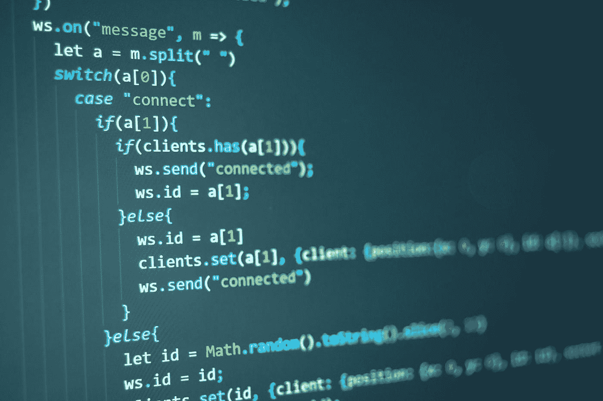

# 用 HTML 和 Javascript 创建一个简单的网络幻灯片

> 原文：<https://blog.devgenius.io/creating-a-simple-web-slideshow-with-html-and-javascript-b4feec8636ce?source=collection_archive---------8----------------------->

今天，让我们来看看如何用普通的 HTML 和 Javascript 为网站创建一个简单的照片幻灯片。当然，大多数网站内容管理系统已经有了这类插件，但是假设你正在做一些非常简单的事情，并且没有使用内容管理系统。

请注意，我目前没有处理任何类型的样式，也不担心实现移动优先或任何这类事情。为什么？首先，我假设您已经在使用现有的系统来处理这个问题。(如自举或布尔玛)。其次，我不想卷入任何关于 css 库更好的争论。我将暂时把造型留给你，如果有人想的话，以后可能会覆盖它。

照片由[克里斯托弗·罗宾·艾宾浩斯](https://unsplash.com/@cebbbinghaus?utm_source=medium&utm_medium=referral)在 [Unsplash](https://unsplash.com?utm_source=medium&utm_medium=referral) 上拍摄

# **模板标签**

HTML 中的<template></template>

它是一个标签，允许你在你的 HTML 中包含对用户隐藏的内容，这些内容可以被 Javascript 操作和使用。如果您有一些想要反复使用的内容，但又不想每次都“构建”或“构造”它，那么这是理想的。您可以将内容放入模板中，然后使用 Javascript 获取该内容，并按照您喜欢的方式显示它。

在我们的例子中，对于这个简单的幻灯片，我们将为幻灯片中显示的每个图像准备一个模板。这样，一旦 Javascript 完成并运行，您就可以简单地通过添加或删除模板来添加或删除幻灯片中的图像。

# **HTML**

如上所述，这个 HTML 将会非常简单。

我们将放置一个显示图像的容器元素。类似这样的。

我会把样式和位置留给你。

然后，我们将为我们希望在幻灯片中显示的每张图片添加一个模板部分。
类似这样的。

> <template></template>

根据需要重复多次，以包含所有图像。pic002.png，pic003.png，等等，等等

如果你现在在浏览器中打开这个页面，你会发现所有的 img 标签都不可见。这是因为 template 标签对查看者隐藏了这些内容，直到使用 Javascript 显示出来。

# **Javascript**

现在让我们创建一个非常简单的 Javascript 对象来控制幻灯片放映。它不会有任何动画或过渡，但它将允许我们控制一些事情。我们将能够指定幻灯片将出现在其中的容器元素。(我们之前创建的 id 为“slideshow”)

我们还可以通过在启动该函数时传递秒数来设置每张幻灯片的显示时间。此外，我们将有功能来改变幻灯片延迟，以及手动前进或后退，如果你想允许的话。

我创建了一个 Javascript 文件，名字很有想象力: *slideshow.js*

如果你以前从未在 Javascript 中处理过对象，那么你可能会有点困惑。在这种情况下，我们的对象也是一个构造函数。所以让我们从创建一个新函数开始。

> 功能幻灯片(容器 id，延迟= 5) {

然后，我们将添加一些对象属性，将它从一个普通的函数转换成一个对象(同时仍然是一个函数；) )

> this . index = 0；
> this . templates = document . query selector all(" template ")；
> this . slide delay = delay；//以秒计
> this . interval = null；
> this . container _ id = container _ id；

索引将保持幻灯片的当前位置，并将随着幻灯片的变化而增加或减少。很简单。

模板将获得我们之前添加的 html 中所有模板标签的数组。这些将包含幻灯片放映的图像。

slideDelay 保存我们以秒为单位显示每张幻灯片的指定时间。我们将它传递给函数，并将其默认为 5。因此，每张幻灯片应该显示指定的秒数，然后再移到下一张。

interval 将包含对我们创建的用于在幻灯片之间自动切换的间隔的引用。

container_id 是我们将在其中显示图像的 html 元素。

声明了这些变量。现在，让我们创建一个方法，它将获取我们的模板并将其显示在容器元素中。每当我们在幻灯片中前进或后退时，我们都会用到它。

> this . update slide = function(template){
> //清除容器元素
> document . getelementbyid(this . container _ id)。innerHTML =“”；
> //用模板内容
> document . getelementbyid(this . container _ id)更新容器元素。appendChild(模板)；
> }

现在让我们创建一个方法，无论何时调用它，它都会移动到幻灯片中的下一个图像。我们将通过我们将设置的延迟自动执行此操作，但它也可以附加到一个链接或按钮上，以便手动推进幻灯片放映。

> 这个。Next = function() {
> //递增索引
> this . index++；
> 
> //测试索引是否超过我们拥有的模板
> If(this . index>this . templates . length—1){
> //如果索引超过模板数，
> //重置为 0 重新开始
> this . index = 0；
> }
> //克隆该实例的模板片段
> const template Clone = this . templates[this . index]. content . Clone node(true)；
> 
> //将新模板更新到容器
> this . Update slide(template clone)；
> }；

这相当简单。当函数被调用时，我们增加索引变量。然后，我们检查以确保我们没有超过我们拥有的幻灯片数量，如果我们超过了，我们重置回开始。然后，我们克隆与索引匹配的模板标记，并调用 updateSlide 函数将其显示到页面上。

现在一个函数返回？

> 这个。Previous = function() {
> //递增索引
> this . index—；
> 
> //测试索引是否超过我们拥有的模板
> If(this . index<0){
> //如果索引小于 0
> //将其重置为数组中的最后一个模板
> this . index = this . elements . length—1；
> }
> //克隆该实例的模板片段
> const template Clone = this . templates[this . index]. content . Clone node(true)；
> 
> //将新模板更新到容器
> this . Update slide(template clone)；
> }

这与下一个函数非常相似，除了这里我们减少了索引的增量(因为我们在后退)，然后我们需要确保没有低于 0。如果我们这样做了，我们跳回到模板数组的末尾，这样它就会循环。

在这个例子中我们不会使用前面的方法，但是它是为将来准备的。您可以自己扩展这个简单的例子，并允许永久改变方向，而不只是一次返回一张幻灯片。

我们还将包括一个函数，让我们在运行时改变延迟。

> this . change delay = function(delay){
> //清除现有区间我们目前有
> Clear interval(this . interval)；
> 
> //用新的延迟创建新的间隔
> this . interval = setInterval(' this。Next()'，this . slide delay * 1000)；//以毫秒为单位调用下一个函数
> }

该函数清除现有的间隔，并使用我们提供的新延迟创建一个新的间隔。我们将以秒为单位传递这个延迟，但是系统需要以毫秒为单位，所以我们将秒乘以 1000 来获得正确的值。

快好了。最后一步是初始化我们马上看到的第一张幻灯片，设置我们的初始延迟值并激活间隔。我们仍然在幻灯片对象/构造函数中，所以我们可以在这里添加这些命令。

> //初始化第一张幻灯片
> var initial template = this . templates[0]. content . clone node(true)；
> this . update slide(initial template)；
> //设置初始间隔
> this . change delay(this . delay)；

那就结束我们的幻灯片功能吧。(确保将文件保存在我们开始创建的 HTML 文件旁边)

> }

这就是我们简单的幻灯片对象，我们已经设置了 HTML。我们只需要将 javascript 放到 HTML 页面中，并调用我们的幻灯片对象构造函数。

回到 HTML 页面。在底部，就在

> <脚本>
> 幻灯片(《幻灯片》，5)；
> </脚本>

如您所见，我们已经包含了刚刚编写的 javascript 代码，然后我们从该代码中调用了函数。我们传递给它元素来保存幻灯片和五秒钟的延迟。

如果一切顺利，您应该会看到图像每五秒钟改变一次，并在结束时再次循环到起点。

您可以添加链接或按钮来手动前进，或者更改延迟的方式。或者，您可以按照自己的意愿设置它，让它无法更改。这取决于你。

这对于一个摄影师的网站，或者一个图片分享网站或者任何用途都是有用的。我相信你能想到用这个的方法。

在未来，我们可能会考虑扩展这一功能，以增加一些样式和额外的功能，如随机化，全屏模式和记住用户在哪里时，他们回来了。还有其他想法吗？