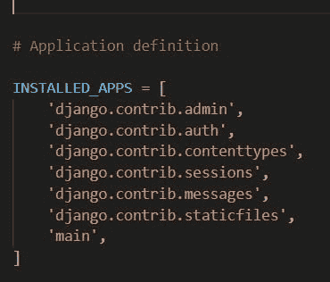
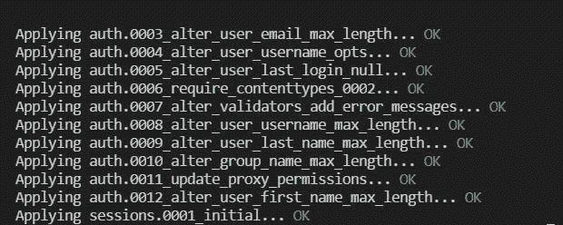

# 使用 Django 创建天气应用程序

> 原文：<https://blog.devgenius.io/creating-a-weather-app-using-using-django-8f6d9d346f2b?source=collection_archive---------12----------------------->


这篇文章展示了如何使用 Weather API 创建一个天气应用程序，为我们提供实时天气数据。我们将使用 Django 后端框架。

1/创建天气项目

```
$ django-admin startproject weather
```

2/导航内部天气

```
$ cd weather
```

3/启动服务器，检查服务器是否正在运行

```
$ python manage.py runserver
```

在浏览器中输入 [http://127.0.0.1:800/](http://127.0.0.1:800/)

按 ctrl + c 停止服务器。

4/通过键入以下命令，在项目中创建一个名为“main”的应用程序:

```
$ python manage.py startapp main
```

5/转到主目录并创建“模板”文件夹。在此文件夹中创建“index.html”文件。这个文件用于在前端显示天气数据。目录结构将类似于:


```
<!DOCTYPE html>
<html lang="en" dir="ltr">

<head>
    <meta charset="utf-8">
    <title>Weather</title>
    <link rel="stylesheet" href="https://maxcdn.bootstrapcdn.com/bootstrap/3.4.0/css/bootstrap.min.css">
    <script src="https://ajax.googleapis.com/ajax/libs/jquery/3.4.1/jquery.min.js"></script>
    <script src="https://maxcdn.bootstrapcdn.com/bootstrap/3.4.0/js/bootstrap.min.js"></script>

    <style>
        body {
            background-color: #D3D3D3;
        }
    </style>

</head>

<body>
    <nav class="row navtitle" style="background: gray; color: white;">
        <h1 class="col text-center">How is the weather? </h1>
    </nav>
    <br />
    <br />
    <center class="row">

        <form method="post" class="col-md-6 col-md-offset-3">
            
            <div class="input-group">
                <input type="text" class="form-control" name="city" placeholder="Search">
                <div class="input-group-btn">
                    <button class="btn btn-default" type="submit"><i class="glyphicon glyphicon-search"></i></button>
                </div>
            </div>
            <form>

    </center>
    <div class="row">
        
        <div class="col-md-6 col-md-offset-3">
            <h3>City : {{city}}</h3>
            <h4>Country code : {{country_code}}</h4>
            <h5>Coordinate : {{coordinate}}</h5>
            <h5>Temperature : {{temp}}</h5>
            <h5>Pressure : {{pressure}} </h5>
            <h5>Humidity : {{humidity}}</h5>
        </div>
        
    </div>
</body>

</html>
```

6/将应用添加到“[设置. py](http://settings.py)



7/将网址添加到“天气”文件夹中的“[网址. py](http://urls.py) ”中。代码如下所示

```
from django.contrib import admin
from django.urls import path, include

urlpatterns = [
    path('admin/', admin.site.urls),
    path('', include('main.urls')),
]
```

8/在' main '文件夹中创建' [urls.py](http://urls.py) ，并添加以下代码来定义索引的路径

```
from django.urls import path
from . import views

urlpatterns = [
         path('', views.index),
]
```

9/现在，为应用程序创建视图。转到' [views.py](http://views.py) '文件并添加索引视图。我们可以从'[openweathermap.org/api'](https://openweathermap.org/api')得到一个 API 密匙

```
from django.shortcuts import render
import json  # import json to load json data to python dictionary
import urllib.request  # urllib.request to make a request to api

def index(request):
    if request.method == 'POST':
        city = request.POST['city']

        ''' api key might be expired use your own api_key
            place api_key in place of appid ="your_api_key_here "  '''
        # source contain JSON data from API
        source = urllib.request.urlopen('http://api.openweathermap.org/data/2.5/weather?q=' + city + '&appid=718bfb40fec2a75aee7767677f367613').read()

        # converting JSON data to a dictionary
        list_of_data = json.loads(source)

        # data for variable list_of_data
        data = {
            'city': city,
            "country_code": str(list_of_data['sys']['country']),
            "coordinate": str(list_of_data['coord']['lon']) + ' '
                        + str(list_of_data['coord']['lat']),
            "temp": str(list_of_data['main']['temp']) + 'k',
            "pressure": str(list_of_data['main']['pressure']),
            "humidity": str(list_of_data['main']['humidity']),
        }
        print(data)
    else:
        data ={}
    return render(request, "index.html", data)
```

10/进行迁移并迁移它。这一步是这个应用程序的可选步骤，因为我们没有制作任何模型。当我们需要改变数据库的配置时，我们在 Django 中进行迁移。我们可以通过输入命令来完成

```
$ python manage.py makemigrations$ python manage.py migrate
```



11/运行应用程序

```
$ python manage.py runserver
```

以下是最终结果:


GitHub [链接](https://github.com/Ugyenwangdi/DjangoWeather/tree/master)

主办于 [heroku](https://whatdowea.herokuapp.com/)

参考:[使用 django 的天气应用](https://www.geeksforgeeks.org/weather-app-using-django-python/)

*原载于*[*https://wulfi . hash node . dev*](https://wulfi.hashnode.dev/creating-a-weather-app-using-using-django)*。*