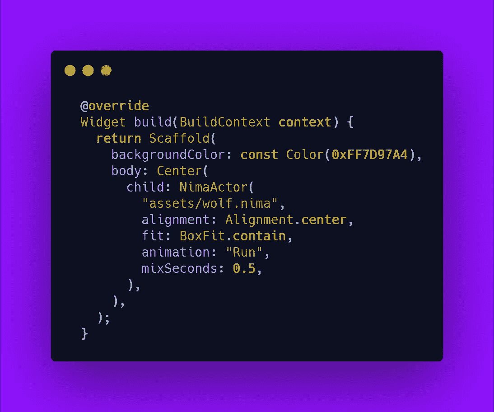

# 创建一个狼跑加载动画-颤振

> 原文：<https://blog.devgenius.io/creating-a-wolf-running-loading-animation-flutter-3cd1944df7fb?source=collection_archive---------11----------------------->

欢迎光临！今天我们将学习如何创建一个 ***牛逼*** 狼跑载入动画。

最近我在 Instagram 上写了更多的博客

 [## boring 开发者

### 欢迎回到 Instagram。登录查看您的朋友、家人和兴趣爱好捕捉和分享了什么…

www.instagram.com](https://www.instagram.com/theboringdeveloper/) 

# 我们开始吧

首先让我们看看它是什么样子的

## 很棒吧？:)

# 让我们建造它

**第 0 步。**从 ***Rive.app*** 下载动画资产

*   进入[https://rive . app/a/the boring developer/files/nima/wolf/preview](https://rive.app/a/theboringdeveloper/files/nima/wolf/preview)
*   打开**中的 *NIMA* 中的**
*   在右下角，点击导出图标
*   选择**导出到引擎**

*   将引擎更改为 ***通用*** 并点击导出

**第一步*。提取*** 下载的 zip 文件，重命名 ***。nma 的*** *扩展名文件为* ***。尼玛*** 并将图像资产文件名改为 ***低聚狼***

***注意:*** 通常你会用相同的名字命名这两个文件，但是在某些情况下这并不可行。

**第二步。**添加 ***尼玛*** 包依赖到 ***pubspec.yaml***

**步骤 3:** 将下载并重命名的文件添加到资产并加载它们

**第四步:**加载**演员资产**与*运行*动画运行

# 让我们检查输出

> 简单又酷，对吧？

Rive 有很多很酷的动画可以和 flutter 一起使用。一定要去看看。

将会分享更多酷炫的 flutter 内容。敬请期待:)

> 谢谢你坚持到最后。如果你喜欢，别忘了鼓掌。

# 更多激动人心的博客-

 [## 实时模板— Flutter

### 欢迎光临！今天我们将学习 flutter 的实时模板。

medium.com](https://medium.com/swlh/live-templates-flutter-6e48683e14e0)  [## 类似 Instagram 的应用内通知——Flutter

### 欢迎光临！今天我们将学习:如何像应用内通知一样添加 instagram。

medium.com](https://medium.com/dev-genius/instagram-like-in-app-notification-flutter-eb2ce6a10d88)  [## 更新应用程序— Flutter

### 欢迎来到本教程，为你的 flutter 应用程序添加更新应用程序

medium.com](https://medium.com/swlh/update-app-flutter-402c528235e4)  [## 简单易用的通用底部导航栏——Flutter

### 欢迎来到本教程，在 Flutter 中创建一个普通的底部导航栏。

medium.com](https://medium.com/swlh/common-bottom-navigation-bar-made-easy-flutter-199c9f683b29)  [## Twitter 旋转器——颤动

### 欢迎来到本教程，在 Flutter 中创建 Twitter Spinner

medium.com](https://medium.com/swlh/twitter-spinner-flutter-81ca13c0f00e)  [## 信用卡滑块变得简单——颤动

### 欢迎光临！今天我们将学习如何用简单的方法创建一个令人敬畏的信用卡滑块。

medium.com](https://medium.com/dev-genius/credit-card-slider-made-easy-flutter-6c0473d0e8bb)