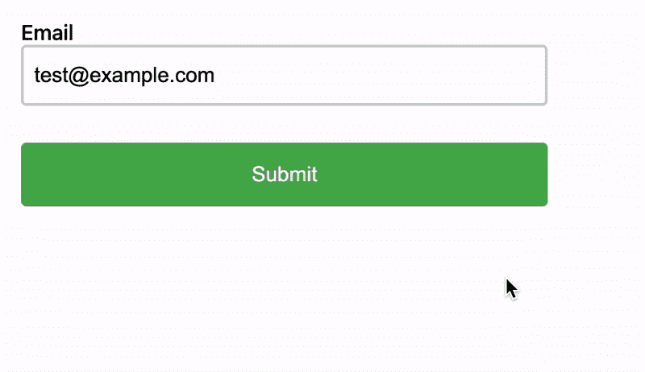

# 在 Next.js 中创建高级可重用表单

> 原文：<https://blog.devgenius.io/creating-advanced-reusable-forms-in-next-js-611325fb4eee?source=collection_archive---------1----------------------->


表格无处不在。设置页面、评论区、用户资料——它们都有表单支持。

在本指南中，我们将创建一个可以在整个产品中使用的表单。我们将从简单的东西开始，慢慢增加更多的复杂性，例如:

*   防止用户带着未保存的更改离开
*   不同类型的错误处理
*   提交时显示微调器
*   为成功干杯
*   易于扩展的模式

我们将使用 [Next.js](https://nextjs.org/) 、Typescript、 [React Hook Form](https://react-hook-form.com/) 、 [react-toastify](https://www.npmjs.com/package/react-toastify) 和 [SWR](https://swr.vercel.app/) ，我们开始创建一个新项目:

```
$ yarn create next-app --typescript
```

# 构建基本表单

我们将从构建尽可能简单的表单开始。如果您已经熟悉一个基本的 React 表单，请直接跳过。

为了简单起见，我将隐藏 CSS，但是这个表单看起来是这样的:


当您点击提交按钮时，您将被重定向到 **/api/form** 。这是因为表单需要适用于常规的 HTML 页面(例如，不是 React 或任何其他 SPA)，所以提交表单不是由 Javascript 完成的，而是由浏览器本身完成的。

我们可以通过覆盖表单的 **onSubmit** 方法来解决这个问题。

但是这又引出了另一个问题:我们如何从表单中获取数据来提交？为此，我们可以使用**使用状态**挂钩并切换到[受控组件](https://reactjs.org/docs/forms.html#controlled-components)。

这允许我们处理表单提交，防止重定向，并做我们想做的任何动作。让我们创建一个 POST 请求，但是我们将通过 Javascript 而不是重定向来创建它，并且我们将使用 JSON。

现在，当我们点击提交时， **saveFormData** 被调用，并向 **/api/form** 发出请求。我们稍后将解决处理错误。

# 使用反应钩子形式

我们当前的表单非常简单，但是随着时间的推移，我们会想要添加模式验证、显示提交微调器、拥有更复杂的状态等等。react-hook-form 将为我们减少很多样板文件。下面是用 react-hook-form 编写的与上面相同的示例:

这里有两点需要注意:

1.  每个输入字段需要[注册](https://react-hook-form.com/api/useform/register)，这将为我们添加名称标签和管理值。
2.  表单状态是为我们管理的，并自动传递给 **saveFormData** 。

# 提交时添加加载微调器

我们在上面看到，**使用表单**返回了**注册**，我们用它来注册我们的字段，以及**处理提交**，我们用它来发出一个 JSON HTTP 请求。

它还有[**formState**](https://react-hook-form.com/api/useform/formstate)**，您可以使用它来获取关于表单的信息。一个简单的例子是**问题提交**，我们可以使用它禁用提交按钮并添加一个加载微调器:**

****

# **用 react-hook-form 处理验证错误**

**这里我们将担心两种主要类型的错误:**

1.  ****验证错误**——类似于“我们要求字段至少有 8 个字符，但您的字段有 7 个字符”**
2.  ****意外错误** —如网络超时、一般服务器错误等。**

**可以用像[是的](https://github.com/jquense/yup)这样的库在客户端检查验证逻辑，但是你也应该总是在服务器端验证请求。我们可以扩展我们的提交函数来检查错误，如下所示:**

**现在让我们来处理验证错误。**

****setError** 用于告诉 **react-hook-form** 出现了错误。然后，我们可以使用来自 **formState** 的 **errors** 值来获取并向用户显示任何错误:**

**当用户再次提交表单时，由 **setError** 设置的错误将自动重置，所以这是我们为验证错误所需要做的一切。**

****

# **用 react-toastify 处理意外错误**

**意外错误略有不同。希望它们是临时的，并且每个页面可能希望以不同的方式显示它们。为了在任何页面上工作，我们可以使用 [react-toastify](https://www.npmjs.com/package/react-toastify) 在 toast 中显示一个通用错误消息。**

****

**因为 toast 非常通用，所以当表单成功保存时，我们也可以用它来显示一条成功的消息。**

# **异步加载默认状态**

**到目前为止，我们只处理过让用户填写表单并提交它。对于某些表单，比如设置页面，我们可能希望获取现有的值并预先填充表单。**

**一种方法是向**使用表单**挂钩提供一个**默认值**值:**

```
useForm({
  defaultValues: { email: "default@example.com" }
})
```

**这很好，但是有时您需要从 API 获取默认值。你可以在这里阅读更多关于它的异步默认值[，但是解决方案的要点是使用**使用表单**返回的**重置**，并允许你设置新的**默认值**。](https://github.com/react-hook-form/react-hook-form/issues/2492)**

**我们将使用 [SWR](https://swr.vercel.app/) 来获取数据，因为它提供了一个简单的接口，去掉了许多样板文件，我们将假设我们需要向 **/api/form** 发出一个 GET 请求**

**[https://gist . github . com/Andrew-propel auth/d 73855 c 6 BCA 295130 EFC 5031 de 053771](https://gist.github.com/andrew-propelauth/dc27cc17af17302017d88d2a16a6ae44)**

**然后每当**数据**改变时，我们可以调用**复位**。**

**最后，我们应该确保在返回表单之前处理好错误和加载状态:**

# **防止未保存表单数据的重定向**

****

**我们想要的最后一个功能是防止人们在有未保存的表单数据时离开页面。不出所料，useForm 在这里也提供了一些帮助，isDirty boolean 表示用户是否改变了表单的默认状态。**

**[本期 Github](https://github.com/vercel/next.js/issues/2694)深入描述了这个问题 [](https://github.com/vercel/next.js/issues/2694) 我们可以从那张票里抽出代码，把它变成一个钩子:**

**然后我们把它挂在我们的组件上:**

# **重构以使表单可重用**

**到目前为止，我们已经制作了一个执行以下操作的表单:**

*   **从 API 获取初始状态**
*   **提交时发出发布请求**
*   **禁用“提交”按钮，并在提交时显示微调器**
*   **处理验证错误、意外错误，并显示成功消息**
*   **如果用户有未保存的数据，则在重定向/刷新时确认用户想要离开**

**但是表单本身只是一个电子邮件地址。让我们把所有东西放在一起，使之通用，这样我们就可以显示任意数量的字段。**

**首先，这里是导入和助手函数:**

**接下来，我们有组件的类型。renderForm 是一个函数，当我们渲染一个表单的字段时，它会接受一些我们需要的值，并应该返回这些字段。**

**最后，组件本身:**

**现在我们已经写好了所有代码，我们可以编写下面的表单:**

**它不仅要求电子邮件地址，还要求日期！当您单击 submit 时，提交的 JSON 包括 email 和 date 字段。**

**显然，你可以变得更复杂，也许你甚至想这样写:**

**不管你怎么写，我们现在已经做了一个非常高级的表单，可以在我们的应用程序中使用。**

# **关于这种形式的假设的说明**

**一个简短的声明，这种形式是我称之为内部有用的抽象。我们对表单如何工作做了一些假设，但这些假设可能不适用于所有产品。举个例子，也许你不想展示一个成功的祝酒辞，而是做些别的事情。**

**我觉得这样的抽象很好，因为你可以根据你的应用程序定制它，并重用它，这样你的用户就能获得一致的体验。如果你需要更多的可定制性，你可以在**通用表单**中添加另一个道具，比如 **onSuccess** 。**