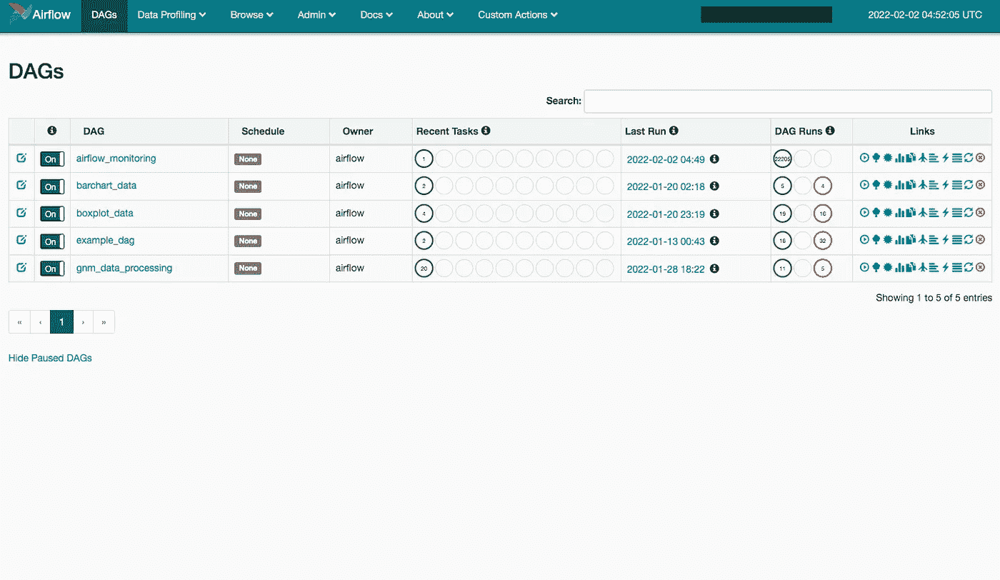
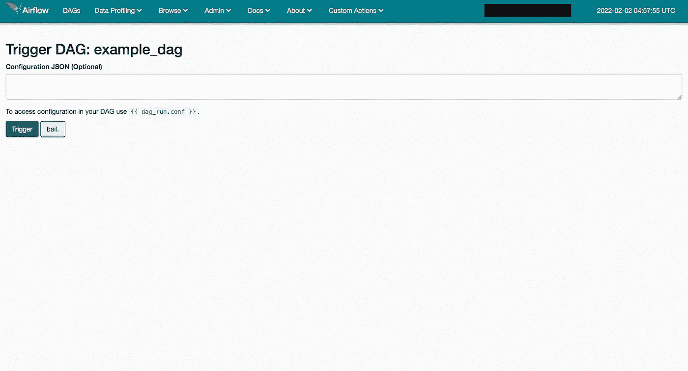
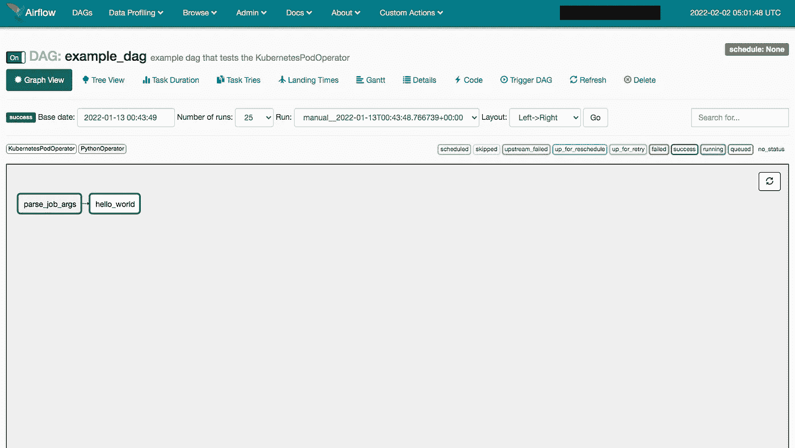

# 使用 Apache Airflow、Kubernetes 和 R 创建自动化数据处理管道—第 2 部分

> 原文：<https://blog.devgenius.io/creating-an-automated-data-processing-pipeline-with-apache-airflow-kubernetes-and-r-part-2-2e95c2e9ae5e?source=collection_archive---------7----------------------->


照片由[吸气送料](https://unsplash.com/@inspirationfeed?utm_source=medium&utm_medium=referral)在 [Unsplash](https://unsplash.com?utm_source=medium&utm_medium=referral) 上拍摄

在[第一部分](https://robert-a-gutierrez.medium.com/creating-an-automated-data-processing-pipeline-with-apache-airflow-kubernetes-and-r-part-1-925f99b812e7)中，我们设置了我们的 Cloud Composer 环境，我们的本地环境，并派生了模板库。

现在这个设置已经完成了，我们可以开始有趣的部分了:创建一个容器映像用于我们的任务窗格，创建一个 DAG 和 task，设置我们的任务文件以便在任务窗格中执行，部署我们的代码，并观看神奇的事情发生。

# 我们的第一天:开始到结束

我在报告中包含了一个示例 DAG 和容器映像。我们可以在这里走一走，看看所有的东西是如何连接在一起的。如果你想自己阅读 DAG 代码，你可以在`dags/example_dag.py`找到它。Dockerfile 文件和相关的图像资料可以在`images/my_data_processor`中找到。

## 步骤 1:容器图像

在任务执行之前，使用提供的容器映像启动一个 pod。如果我们知道我们的任务需要什么样的程序/库，我们可以将它构建到我们的容器映像中，这样我们的任务就可以使用它了。

让我们看看我提供的 docker 文件:

我们的图像基于令人敬畏的`rocker/tidyverse`图像，然后添加一些额外的 Python 和 R 的东西。我们还在设置`google-cloud-sdk`，这样我们就可以连接到谷歌云服务并使用它来执行操作。

请随意清理 R 包部分。我保留了我的团队一直在使用的所有软件包，但你可能不需要它们。

然后我们将`~/bin`添加到`PATH`中，复制我们的引导脚本，并将其设置为入口点。

和引导脚本:

你会注意到这里有一些环境变量。这些是在我们初始化我们的`KubernetesPodOperator`实例(我们的任务)时设置的。目前，您不需要接触这个脚本。它所做的只是使用 Google Cloud 进行认证，创建一些额外的目录，下载“任务文件”(这将是您为每个任务提供的一个 shell 脚本)，并执行它。

有了 Dockerfile 和 bootstrap 脚本，让我们创建图像并上传到 Google Cloud，这样我们就可以在我们的任务中使用它了。

在终端标签或窗口中，导航到项目目录，然后转到`images/my_data_processor`。如果你还没有安装 Docker Desktop 或者`docker`和`docker-machine`软件包，你现在应该这样做。

让我们建立图像。

```
$ docker build -t IMAGE_NAME .
```

我只使用 IMAGE_NAME 的文件夹名，这样更容易理解。

一旦构建了图像，我们需要标记它并将其推送到容器注册表(我们将使用 Google 容器注册表)。

```
$ docker tag IMAGE_NAME HOSTNAME/PROJECT-ID/IMAGE_NAME
$ gcloud auth configure-docker
$ docker push HOSTNAME/PROJECT-ID/IMAGE_NAME
```

`HOSTNAME`是您正在推送的容器注册中心的主机名(在我们的例子中，我们使用了`us.gcr.io`)。而`PROJECT-ID`就是你的谷歌云项目 ID。

**更新图像**

当您需要更新 Docker 映像时，只需重建并推送它:

```
$ docker build -t IMAGE_NAME .
$ docker push HOSTNAME/PROJECT-ID/IMAGE_NAME
```

如果您想完全重建图像，您可以将`--no-cache`传递给`docker build`命令。然后将图像推送到注册表。

或者，对于更彻底的解决方案，您可以删除旧映像并重新构建它。然后用力。

```
$ docker rmi --force IMAGE_NAME
$ docker build -t IMAGE_NAME .
$ docker tag IMAGE_NAME HOSTNAME/PROJECT-ID/IMAGE_NAME
$ docker push HOSTNAME/PROJECT-ID/IMAGE_NAME
```

如果您已经修改了 docker 文件，但`docker push`导致所有“层已经存在”消息，这将有所帮助。

**本地测试图像**

如果您正在本地测试`my_data_processor`图像或另一个类似的图像*，请注意 docker 文件中的`ENTRYPOINT`指令。如果您运行一个 shell 脚本作为入口点，那么每个启动的容器都会启动并立即关闭。为了解决这个问题，我们需要覆盖`ENTRYPOINT`指令来保持容器活动。然后，一旦它开始运行，我们就可以连接到它。*

*我们需要在这里运行两个命令。首先，启动一个容器并覆盖入口点:*

```
*$ docker run --name CONTAINER_NAME -dit --entrypoint=/bin/bash IMAGE_NAME*
```

*对于容器名称，使用独特的和/或与图像名称相关的内容。*

*一旦它开始运行，我们就可以初始化一个 shell 会话并连接到它:*

```
*$ docker exec -it CONTAINER_NAME /bin/bash*
```

*完成测试后，要停止并删除容器，请运行:*

```
*$ docker stop CONTAINER_NAME && docker rm CONTAINER_NAME*
```

## *步骤 2: DAG 和任务代码*

*让我们看一下 DAG 提供的示例:*

*我设置它的方式与文档略有不同。我继续将任务代码放入一个单独的`tasks`目录中，在这个目录中，有每个 DAG 的目录。由多个 Dag 使用的任何任务都在`tasks/common`文件夹中。*

*首先，我们创建 DAG，设置调度和超时间隔，并提供一些默认参数。接下来，我们通过传入刚刚创建的 DAG 来初始化我们的任务。最后，我们通过使用箭头操作符来定义 DAG 中任务的关系。如果任何任务有多个依赖项，我们将使用任务列表。*

```
*# a simple linear DAG
t1 >> t2 >> t3# a more complex DAG
t1 >> [t2a, t2b]
t2a >> t3a
[t2b, t3a] >> t4*
```

*这可能看起来令人困惑，但是当我们部署 DAG 并查看图形视图时，您将能够更清楚地看到这些关系。*

*可以忽略`trigger_arguments`属性。我将在本教程的下一部分解释这一点。*

*现在让我们看看任务代码:*

*我设置了一些函数来抽象和标准化一些任务初始化代码，并减少创建任务所需的行数。可以在`tasks/__init__.py`查看。*

*`generate_env_vars`设置应该传递给所有任务的默认环境变量，然后让我们定义特定于我们任务的环境变量。然后我们用`verify_env_vars`验证我们的变量，这也增加了依赖于先前设置的变量的额外变量(像`TASK_FOLDER`依赖于`TASK_ID`来构建完整路径)。最后，`generate_op_vars`对传递给 operator 类的变量做一些类似的事情，并让我们提供特定于任务的变量。*

*在`common`中还有另一个任务，称为`parse_job_args`，当我们手动触发一个任务时，它允许我们获取`conf`中指定的任何数据，并将其推送到 XCom，以便 DAG 中的所有下游任务可以使用它。我将在本教程的下一部分更详细地解释它。*

## *步骤 3:任务文件*

*现在让我们处理数据处理管道的“肉和土豆”,实际进行数据处理的脚本。*

*对于我们的 DAG 示例，我们将查看`task_files/example_dag/hello_world`文件夹。任务文件首先被分成 DAG 文件夹，然后是任务文件夹。至少，我们需要一个文件，一个 shell 脚本，它是由容器的引导脚本执行的。这允许我们执行任意数量的代码，并调用我们想要的任何程序。这个文件夹是我们放置 R 脚本的地方，我们从 shell 脚本中执行它们。我会告诉你我的意思:*

*我们的许多 shell 脚本以这种格式结束:从云存储中下载任务文件并`chmod`使它们可执行，下载任何需要的公共文件，执行我们的 R 脚本(示例中有一个普通的 R 脚本和一个 RMarkdown 脚本)，然后将输出上传到`runs`中的必要文件夹。*

*在云存储中，我选择保存每个任务的输出，以便于调试。该文件夹存储在`TASK_RESULTS_FOLDER`环境变量中，但格式如下:*

```
*$CLOUD_STORAGE_BUCKET/runs/$DAG_ID/$CUSTOM_RUN_ID/$TASK_ID*
```

*CUSTOM_RUN_ID 是我在一个插件中定义的东西，我将在本教程的下一部分谈到它。你可以使用气流产生的`run_id`变量。*

## *步骤 4:部署*

*现在我们准备在气流中测试它！*

*使用我们方便的部署脚本轻松地将所有内容上传到云存储，以便 Airflow 可以读取并填充 UI。在终端选项卡或窗口中，导航到项目根目录并运行:*

```
*$ ./deploy.sh staging*
```

*部署应该非常快。*

*让我们拉起气流，看看我们的劳动成果。您可以通过转到 Cloud Composer 环境并单击顶部的 Open Airflow UI 来获取 Airflow 实例的 URL。*

**

*我团队的气流 UI。example_dag 在里面，还有一些其他的测试。*

*如果您已将 DAG 设置为按计划运行，它可能已经在运行。如果没有，我们可以手动触发。*

## *第五步:触发并观察*

*要触发我们的示例 DAG，请找到 example_dag 行，然后在最右边一列的图标集中找到“play button”图标。继续点击它。*

**

*手动触发 DAG 时看到的屏幕*

*在文本框中，我们可以编写一些 JSON，这些 JSON 将被复制到任务中可用的`conf`变量中。如果你想在这里写点什么，你可以，只要确保用括号括起来。*

```
*{"instantiator": "smith"}*
```

*单击触发器。您应该会返回到主页，但现在您会在 DAG Runs 列中看到一个绿色圆圈。单击它，您将会看到图形视图页面。*

**

*图形视图页面，DAG 的精彩视觉呈现。你将在这里呆很长时间。*

*每个盒子都是一项任务。您可以将鼠标悬停在这些框上以查看任务的状态，并单击它以查看任务实例的详细信息、任务的日志，以及手动更改状态(例如，如果您想要将其标记为失败并暂停执行)。*

*你做到了！一旦任务全部完成，您可以导航到云存储空间，转到`runs`中的相关文件夹并查看输出。*

# *总结*

*您已经成功部署了 Cloud Composer 环境；设置您的第一个容器映像、DAG 和任务。部署您的容器映像、DAG 和任务。在气流中奔跑！有了这些知识，您就可以开始构建自己的 DAGS，并为您的工作负载修改或创建新的映像。气流是一个强大的工具，加上`KubernetesPodOperator`和自定义容器图像的附加功能，可能性是无穷的！*

*在本教程的下一部分，我们将查看样例插件，它为手动触发 Dag 和向任务传递参数提供了一个很好的 UI。*