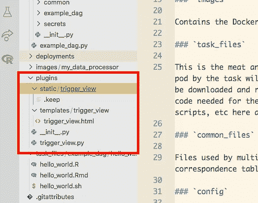
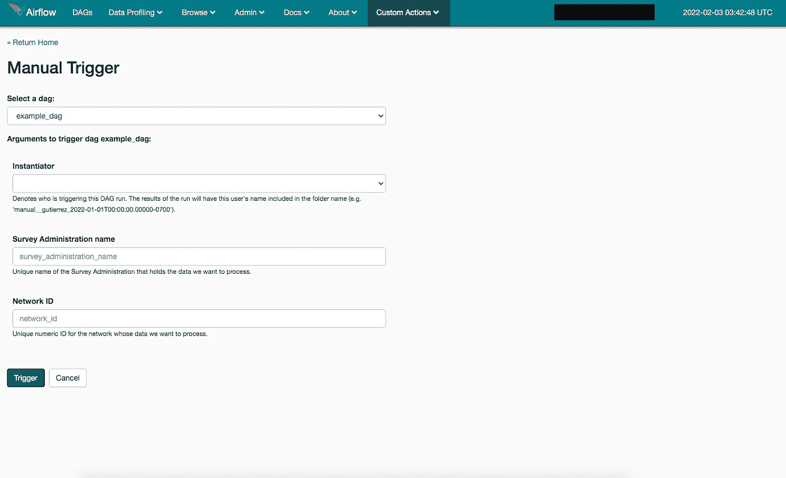
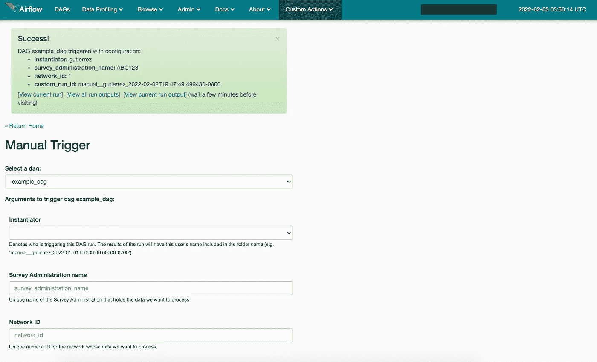

# 使用 Apache Airflow、Kubernetes 和 R 创建自动化数据处理管道—第 3 部分

> 原文：<https://blog.devgenius.io/creating-an-automated-data-processing-pipeline-with-apache-airflow-kubernetes-and-r-part-3-cc2a113e4c27?source=collection_archive---------9----------------------->


泰勒·维克在 [Unsplash](https://unsplash.com?utm_source=medium&utm_medium=referral) 上的照片

在本教程的第一部分的[中，我们设置了我们的 Cloud Composer 环境，我们的本地环境，并创建了模板库。在第二部分](https://robert-a-gutierrez.medium.com/creating-an-automated-data-processing-pipeline-with-apache-airflow-kubernetes-and-r-part-1-925f99b812e7#a1b3-e616252e3faa)中，我们进入正题:建立我们的第一个容器映像；编写我们的第一个 DAG 和 task 将我们的容器映像、DAG 和任务部署到 Google Cloud 在气流中运行我们的 DAG！

在第三部分，我们将讨论插件。[插件](https://airflow.apache.org/docs/apache-airflow/stable/plugins.html)是我们扩展 Airflow 的方式，它们的功能可以包括创建自定义操作符、连接到 CRM 和数据库以及其他外部服务、挂钩和 UI 中的自定义页面。[Github 上有一个很大的插件列表](https://github.com/airflow-plugins/)，你可以查看；您可能会在那里找到您需要的东西，但我将带您了解如何创建一个小的 UI 插件:一个“手动触发”页面，它允许您通过使用一个方便的表单来手动触发 DAG，该表单包含每个参数的字段。

# 介绍

作为一名开发人员，当手动触发 Airflow 中的 DAG 并需要传递额外的参数时，我可以在触发 DAG 之前将纯 JSON 写入我们的`conf`变量。虽然这样做的界面很简单(一个带有“触发”按钮的文本框)，但它工作得足够好。随着我和我们的分析团队更好地定义我们的自动化管道的技术需求，每当我们触发 DAG 时，我们需要指定某些事情变得很清楚。这个 DAG 是我从去年开始为我们的网络健康调查报告(您可以在此处找到有关该项目的更多详细信息)自动生成数据的努力的高潮，它需要由两个参数触发:哪个调查管理机构引用传入的数据，以及我们正在为哪个学校网络处理数据。旧版本的管道使用来自调查管理部门*所有*学校网络的传入数据，而我们希望我们的新管道一次处理一个网络的数据。这样，我们可以为已经完成调查的学校生成报告数据，而不必等待所有学校完成调查。

我们最终得到了三个参数:`instantiator`，它表示触发 DAG 的人(以更好地分离云存储中的输出)；`survey_administration_name`，它是我们的网络健康调查门户为特定调查管理机构提供的唯一名称；以及`network_id`，它是标识学校网络的唯一整数。

为了让我们的分析人员使用 Airflow 更容易，似乎应该构建某种手动触发表单，用户可以从下拉列表中选择 DAG，查看预期的参数列表，输入值，然后触发 DAG。方便地链接到当前 DAG 运行的图形视图和云存储文件夹，期待输出似乎也是一个好主意。这最终体现在手动触发插件中。

这段代码的很大一部分来自本教程。我在这里对其进行了扩展，并提供了一些额外的功能。为了简单起见，我将使用本教程前一部分中的示例 DAG，并添加上面提到的参数。

# 创建气流 UI 插件

在本教程的前几部分，你已经看到了插件的内容，以及暗示我上面提到的手动触发插件的代码。让我们深入这个插件代码，并解释我们之前看到的那些位。



UI 插件的文件夹结构

这种文件夹结构在其他指南中被推荐，我认为它也是有意义的。Airflow UI 是在 Flask 上构建的，因此，与任何其他 Flask 应用程序一样，我们可以为静态资产定义一个位置，为模板定义一个位置，为视图定义一个位置。

视图模板生成一个具有如下形式的页面:我们的 Airflow 实例中所有 DAG 的下拉列表(默认情况下也可以选择一个)，通过选择一个 DAG，我们可以看到一组与我们为 DAG 指定的参数相匹配的字段。字段可以是必填的，也可以是可选的。在提交表单时，我们被重定向回该页面，但我们看到一条提示消息，通知我们触发成功。该消息读回我们的参数值，并包含一些有用的链接。

view 方法将接受我们的表单提交，过滤我们选择的 DAG，创建我们的自定义运行 ID，然后在将表单数据作为`conf`变量传递时触发 DAG。然后，它会生成结果的快速消息。

## 步骤 1: DAG 触发参数

正如我在上面发布的类似教程中所建议的，我已经为我们的 DAG 对象添加了一个新属性，`trigger_arguments`。让我们调出我们的示例 DAG，并将其添加进去。

`trigger_arguments`它仅仅是一本为我们的参数定义一些属性的字典吗？表单字段上方有一个用户友好的显示名称，一个字段类型(`enum`用于下拉菜单)，参数名称的复数形式，触发时是否需要，如果没有提供默认值，以及一个显示在表单字段下方的描述。

我们已经添加了我上面提到的三个参数。这取决于我们的模板以一种漂亮的方式显示它们。

## 第二步:模板

模板文件使用 Jinja 语法，为了拥有完整的气流 UI，我们需要在文件中包含一些东西。省略它们将意味着一个空白的页面，当你从气流中来到页面时，这是不和谐的。

我们需要导入一些东西，包括一些块，尽管这是相当标准的东西。我们现在拥有的是一个带有 Dag 下拉列表和一组与这些 Dag 的`trigger_arguments`匹配的字段的表单。一些 Javascript 控制这些字段集的切换以及打开 HTML5 表单验证。还有一点 CSS 的一般样式，我添加了 Bootstrap 的动画微调图标。

Airflow 使用 Bootstrap 作为它的外观和感觉，所以如果我们愿意，我们可以在布局或页面以及一些 jQuery 中使用 Bootstrap 模式。

## 第三步:查看方法

现在让我们看看我们的视图方法代码。

这份文件有点长，但我会从头到尾看一遍。

我们定义了一个函数来帮助我们正确地触发 DAG，提供 Airflow 期望的所有属性，并将我们提交的参数放入`conf`。然后，我们有一个定义自定义运行 ID 的函数。由 Airflow 创建的默认运行 ID 类似于“<TRIGGER _ TYPE>_<DATETIME _ AS _ ISO>”，所以您最终得到的 ID 类似于

```
manual__2022-01-27T09:56:01.162295+0000
```

首先，日期时间总是采用 UTC 格式，其次，通过查看这个 ID 不可能知道是谁触发了 DAG 运行。因此，我创建了一个自定义的运行 ID，添加了`instantiator`并将日期时间转换为我们的本地时区。您可以将自定义跑步 ID 代码更改为您想要的任何值，只要它是唯一的。

我们的`FlaskAdminTriggerView`类中的 view 方法保存了大部分代码，但是它的设置和其他 Flask view 方法一样。我们建立一个 DAG IDs 和它们各自的 trigger_arguments 的字典，然后为任何`enum`类型的参数添加下拉选择。对于`instanstiator`的选择，在 Airflow 中创建一个变量并将列表定义为`valid_instantiators`是有意义的。

当提交表单时，我们只过滤掉我们选择的 DAG 的字段。我们为`instantiator`设置一个默认值，添加我们的`custom_run_id`，然后将其全部发送给我们的触发函数。我们构建了我们漂亮的小 flash 消息，添加了一些有用的链接，然后全部呈现出来。

现在我们得到了我们的`FlaskAdminTriggerView`类的一个实例，这里的属性确保我们可以从导航菜单访问我们的新页面。`category`让我们向导航中的现有下拉菜单添加一个菜单项*或*添加一个新的下拉菜单。`name`是菜单项的名称，`endpoint`是页面的路径名。

定义一个`Blueprint`让我们使用我们创建的文件夹设置，静态资产和模板被分离出来。如果需要，我们可以在 Docs nav 项下添加一个到 Github repo 的链接。

最后，我们定义了 plugin 类，它允许我们将插件“插入”到 Airflow 中，这样它就可以加载到 UI 中了。

## 步骤 parse _ job _ args 任务

让我们简单地看一下`parse_job_args`任务，您可能已经在示例 DAG 中看到过，并且包含在`tasks/common`文件夹中。

这个特殊任务利用`PythonOperator`及其`provide_context`参数来获取我们提交给`conf`变量的值。

我们希望传递给`conf`的参数可以被 DAG 中的所有任务访问，因此我们将利用一个名为 XComs 的气流特性。XComs 基本上形成一个 DAG“状态”, DAG 中的所有任务都可以访问它。它们的工作原理是将变量“推入”状态以存储它们，然后“拉出”它们以读取它们。它们最适合用于小的、可序列化的数据，因此避免推送数据帧或其他大型任务输出。这些可以很容易地上传到云存储，然后由未来的任务下载。

在这种情况下，我们希望在 DAG 的第一个任务中推送我们的参数，以便所有其他任务都可以访问这些值。在我们的`PythonOperator`中，我们定义了一个可调用函数，并将`provide_context`设置为`True`。现在，在我们的 callable 中，我们可以访问 Airflow 传递给模板的所有[变量。我们将使用`kwargs`作为字典来访问它们。`conf`来自 DAGRun 对象`dag_run`，任务实例`ti`是我们推送 XComs 的地方。](https://airflow.apache.org/docs/apache-airflow/stable/templates-ref.html)

既然我们的参数值已经保存，我们如何在其他任务中访问它们呢？我们需要对代码做一点小小的修改。拉起`tasks/__init__.py`，查看`DEFAULT_ENV_VARS`字典。

这是我隐藏传递给任务的环境变量的地方。正如您可能在[气流模板参考页面](https://airflow.apache.org/docs/apache-airflow/stable/templates-ref.html)上看到的，我们可以访问`task_instance`对象，并且我们可以以类似 Jinja 的方式使用它。任务实例对象是我们可以利用`xcom_push`和`xcom_pull`的地方。我们可以在这里添加之前作为环境变量保存的三个参数。

我将这三个参数作为“默认”环境变量的一部分，因为我在任何地方都使用它们，但是将它们放在任务定义中可能更有意义。

## 第五步:测试

是时候看看我们所有的努力为我们赢得了什么！



我们完成的手动触发页面

简单却有效。切换下拉列表中的 DAG 将相应地交换表单字段(如果您有多个 DAG)。如果您试图在任何必填字段丢失数据时单击 Trigger，浏览器将会报错。如果所有字段都已填写，并且您单击 Trigger，您将在按钮内看到一个漂亮的微调图标。

为什么我们不触发我们的 DAG？



我们的手动触发页面，在触发 DAG 后

成功！“即时消息”不是世界上最漂亮的东西，但它表达了一个观点。第一个链接将带您到您当前运行的 DAG 的图形视图，而第二个链接向您显示云存储中所有预览运行的输出，第三个链接将是您当前运行的输出。

# 总结

您已经成功创建了您的第一个 Airflow 插件，这是一个 UI 插件，它提供了一个“手动触发”页面来帮助手动触发带有参数的 Dag。

我计划学习更多关于 Spark 的知识，所以将来我可能会写一些关于如何在 Google Dataproc 中运行 Spark 工作流并从 Airflow DAG 中触发它的东西。敬请期待！

在这里找到本教程以前的部分:[第一部分](https://robert-a-gutierrez.medium.com/creating-an-automated-data-processing-pipeline-with-apache-airflow-kubernetes-and-r-part-1-925f99b812e7)和[第二部分](https://robert-a-gutierrez.medium.com/creating-an-automated-data-processing-pipeline-with-apache-airflow-kubernetes-and-r-part-2-2e95c2e9ae5e)。