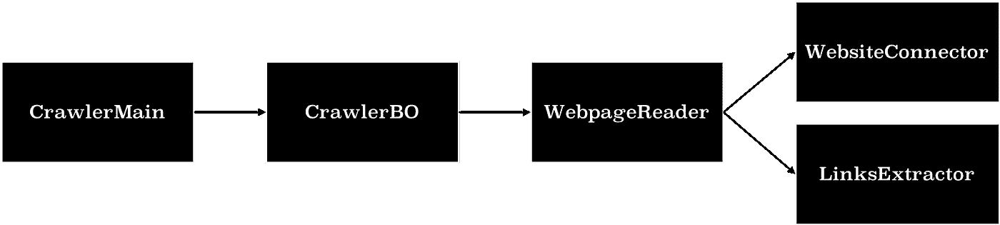
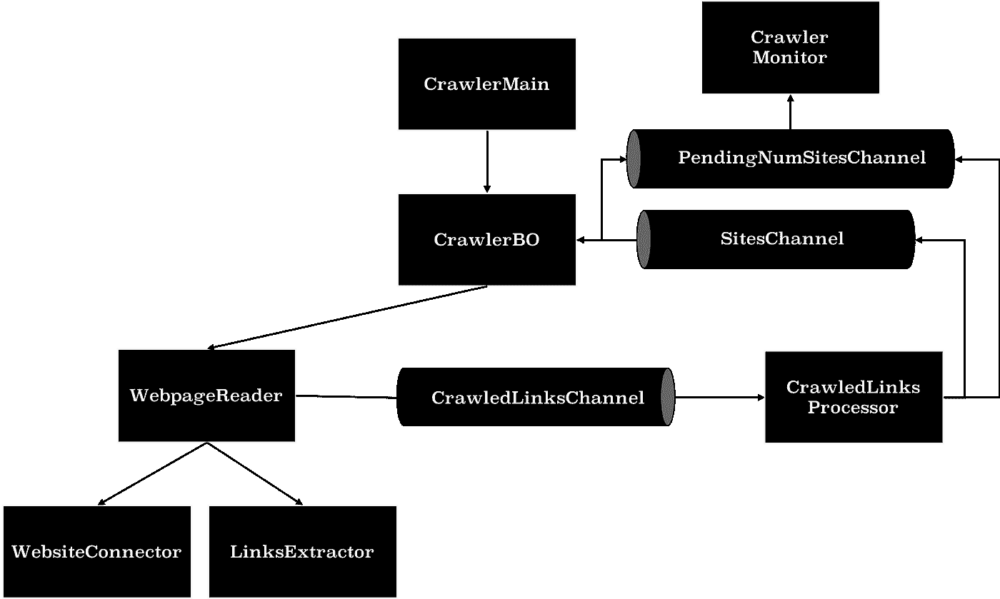

# 在 Go 中创建生产就绪的网络爬虫

> 原文：<https://blog.devgenius.io/creating-an-efficient-web-crawler-in-go-e4eec36bbf8c?source=collection_archive---------2----------------------->

## 去编程

## 使用 GoRoutines、通道和更多构造

对于大多数程序员来说，网络爬虫是一个基本的工具。它允许你抓取和处理任何网站的内容。在我编程的最初几天，通过抓取一个网站，我可以从中获得关键的见解，而不需要太多的人工努力。从亚马逊搜索页面，我可以很容易地解析价格，平均。查看所有产品的评级和品牌，并以表格形式呈现。你问“为什么”吗？让我解释一下..对大多数程序员来说，最基本的要求是自动化日常流程。在我通常浏览多个网站来收集数据并做出决定的情况下，网络爬虫会自动完成部分工作。将它与其他数据分析工具相结合，它可以释放更多的功能。你也可以浏览“中等”网站，找出流行趋势或热门话题。你可以抓取多个新闻网站并整理结果，建立文字云等。这完全给了你一种错误的权力感！价格跟踪网站是使用网络爬虫建立的，在那里他们抓取各种网站产品页面并存储每天的产品价格，等等。应用是无限的。

格伦·卡斯滕斯-彼得斯在 [Unsplash](https://unsplash.com?utm_source=medium&utm_medium=referral) 上拍摄的照片

# 爬行不同于刮擦！

在了解如何创建一个网络爬虫之前，请检查一下爬虫和抓取器之间的区别。**网络爬行**是搜索引擎做的事情:浏览网页，寻找任何信息，点击每一个可用的链接。Web scraper 的主要目的是从网页中提取数据。现在你知道了区别，让我们看看如何建立一个有效的网络爬虫。

# 网络爬虫设计

要构建一个用于生产的网络爬虫，你需要在设计上花时间。确保适应实现中的变化，使其可扩展，以便能够轻松添加新功能。这是我的系统的设计，但不要局限于此，根据你的需求和功能来设计。

通过创建具有独立功能的方法来模块化代码总是更好。在这个例子中，我将创建多个方法，其中一个方法包含连接到网站的逻辑，并返回指针以提取内容。从网站提取链接的另一种方法和连接所有这些独立方法的另一种方法，本质上包含了程序的业务逻辑。

创建的组件是-

1.  CrawlerMain:触发程序的主要方法。
2.  CrawlerBO(业务对象) :包含网络爬虫的业务逻辑。协调其他组件之间的调用。
3.  WebpageReader:将网页 Url 作为输入，连接并提取内容。
4.  WebsiteConnector:包含创建 http 连接的逻辑，并返回到网站的连接，以提取内容。
5.  LinksExtractor:将网站作为输入，包含从网站中提取超链接的逻辑。

根据 web crawler 的功能，您可以添加更多提取器。如果你想计算单词的数量，创建一个提取器来返回单词图。通过这种方式，您可以轻松地添加更多提取器组件来扩展 web 爬虫的功能，而无需更新和复杂化代码库。

在这个网络爬虫中，当它从一个网站提取链接时，我也想抓取这些链接。为了有效地执行这一点，我们需要使程序并发。然后，我可以增加线程的数量来并行抓取提取的链接。为此，我们将添加 3 个通道-

1.  Sites Channel:包含要抓取的网站 URL。
2.  CrawledLinks Channel:包含在已爬网网站上找到的链接。
3.  PendingNumSites Channel:包含要爬网的挂起网站的数量。

我们需要 CrawledLinksChannel，这样我们可以在提交它进行爬网之前过滤掉重复的链接。这样，它就不会进入循环。我们将维护一个内存映射来存储抓取的网站列表，以过滤重复的网站。要使它为生产做好准备，请使用分布式数据库，而不是内存映射。

PendingNumSites 频道有助于了解是否有更多的网站要爬网。当一个链接被添加到 SitesChannel 时，它将为 PendingNumSites 添加+1，当被爬网时，它将为 pending numsites 添加-1。我们将设置一个监视器来维护当前计数，当计数达到 0 时，它将关闭所有通道，从而终止程序。

通过添加所有这些组件，设计看起来会像-

# 网络爬虫实现

## 使用 Goroutines、频道和等待组

WebCrawlerMain 为 web crawler 创建所有必需的组件，并通过添加要爬网的站点来触发爬网。在这里，我创建了 50 个 *goroutines* 来抓取网站。 *WaitGroups* 允许主程序等待，直到所有线程完成执行。如上所述，它创建了 3 个*频道*，并向 sitesChannel 添加了一个站点。

CrawlerBO 是包含网络爬虫业务逻辑的核心组件。

网页阅读器连接到网站，提取链接并添加到频道。

## 过滤重复网站

这是防止程序进入无限循环的重要一步。

当 CrawlerBO 从 sitesChannel 中读取内容时，将该站点添加到其中会提交该站点进行爬网。

## 关闭频道

所有网站抓取成功后，它要关闭所有频道。

你可以在这里找到完整的代码实现。

# 结论

正如我上面提到的，创建一个网络爬虫并不困难，它提供了许多可能性。此外，这对于学习编程语言的各个方面也是一个非常好的工具。生产就绪代码与其他代码的主要区别在于，能够轻松扩展或更新功能，以及代码的可读性和可维护性。我已经提供了一种构建代码的方法，但是还有许多方法可以有效地编写代码并将功能划分到不同的组件中。一定要创建自己的网络爬虫，尝试各种功能，并拥有一个创建自己的网络工具的平台。