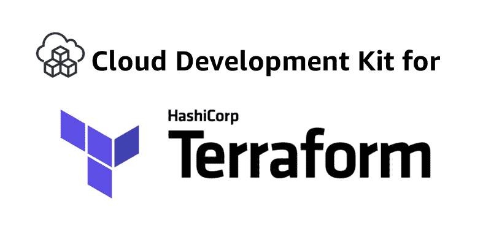
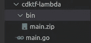
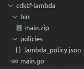

# 在 Go 中用 CDKTF 创建和部署 Lambda 函数

> 原文：<https://blog.devgenius.io/creating-and-deploying-a-lambda-function-with-cdktf-in-go-79779771195e?source=collection_archive---------4----------------------->

# 介绍

我会长话短说。所以我假设您已经熟悉了开发环境。

如果你不是，看看我的另一个关于[开始使用 CDKTF 的故事。](https://jcdan3.medium.com/getting-started-with-terraform-cdk-f7e728403ca2)

# 要求

拥有适当的文件结构需要什么:

*   你的 main.go 根(CDKTF main)，这段代码将描述你的基础设施。
*   编译后的源代码在 *bin/main.zip* 这个代码是 lambda 运行的实际代码。
*   这里假设你的 lambda 函数也是用 go 写的。如果不是这样，只需更改 LambdaFunctionConfig 结构的运行时。

该结构应该类似于以下内容:

以下是 main.go 的代码:

*policies/lambda_policy.json*中的 lambda _ policy . JSON 应该是这样的:

现在您有了一个策略，文件夹层次结构应该如下所示:

# 安装和设置 AWS CLI

**注意:**如果已经设置了 AWS CLI，您可以安全地跳过这一步。

现在，按照这些说明安装 AWS CLI。您可能希望将 AWS CLI 添加到路径中。

然后在您的 AWS 帐户中，生成一个访问密钥和秘密密钥。

为此，只需打开位于用户菜单(右上角)的*安全凭证*。单击创建访问键并保存这两个值。

现在，运行以下命令来配置 AWS CLI:

当系统提示时，添加我们刚刚生成的值。

# 部署

就是这样！