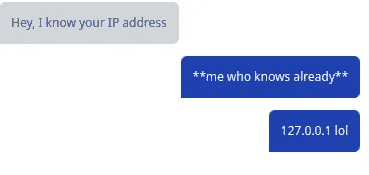
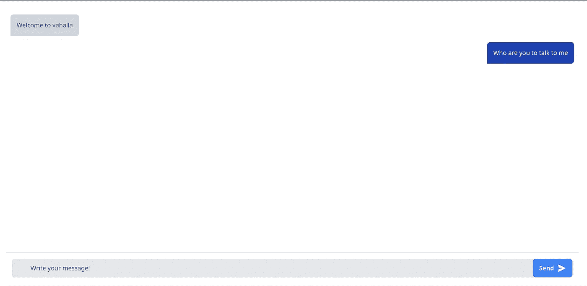
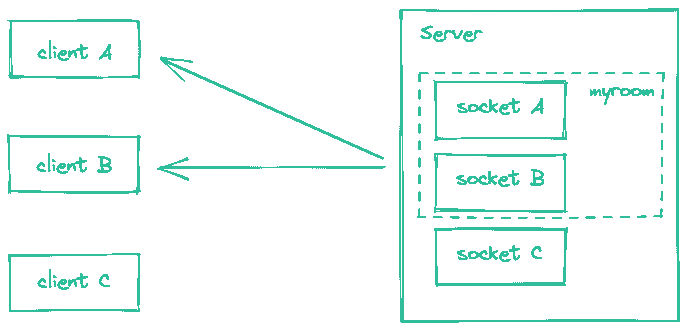
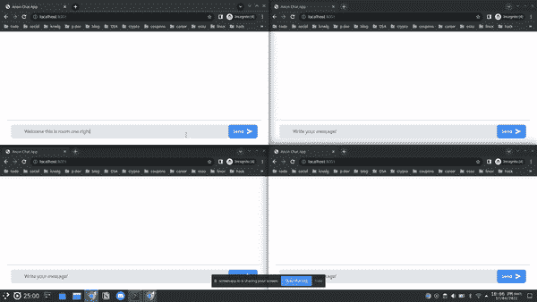

# 用 Socket.io 和 Express.js 创建匿名聊天室

> 原文：<https://blog.devgenius.io/creating-anonymous-chat-rooms-with-socket-io-and-express-js-f565897b5c?source=collection_archive---------13----------------------->

在本文中，我们将创建一个聊天应用程序，它将人们两两一组地匿名连接到不同的房间。聊天应用程序将使用 [Express.js](https://expressjs.com/) 作为服务器端代码，使用 [Socket.io](https://socket.io/) 监听 web socket 通信，客户端将使用普通 JavaScript 开发。



# 设置我们的项目

*   我们将创建一个名为`chat-app`的目录，并使用命令将该目录更改为目录。

```
$ mkdir chat-app && cd chat-app
```

*   通过运行命令初始化我们的节点应用程序。

```
$ yarn init -y
```

*   通过运行命令，使用 yarn 在我们的项目中安装 express。

```
$ yarn add express
```

*   我们将创建一个名为`app.js`的 JavaScript 文件，并创建一个简单的节点 HTTP 服务器。
*   接下来，我们将把 express 导入到我们的应用程序中，创建一个 express 应用程序并启动服务器来监听端口`8001`上的请求。

```
// app.js
const http = require("http")
const express = require("express")const app = express()app.get("/index", (req, res) => {
    res.send("Welcome home")
})const server = http.createServer(app)server.on("error", (err) => {
    console.log("Error opening server")
})server.listen(8001, () => {
    console.log("Server working on port 8001")
})
```

*   现在，我们可以通过运行命令来启动应用程序。

```
$ node app.js
```

您可以在浏览器上访问`[http://localhost:8001/index](http://localhost:8001/index)`来测试应用程序是否工作。


# 在服务器端初始化 [socket.io](http://socket.io/)

要在服务器端初始化套接字，请遵循以下步骤。

*   通过运行命令，将 [socket.io](http://socket.io/) 依赖项安装到我们的应用程序中。

```
$ yarn add socket.io
```

*   将 [socket.io](http://socket.io/) 导入到我们的代码中，创建一个新的套接字服务器，然后向套接字添加一个事件监听器，以监听是否建立了连接。

```
*// app.js*const http = require("http");const { Server } = require("socket.io");const express = require("express");const app = express(); app.get("/index", (req, res) => { res.send("Welcome home");}); const server = http.createServer(app);const io = new Server(server);io.on("connection", (socket) => { console.log("connected");}); server.on("error", (err) => { console.log("Error opening server");}); server.listen(8001, () => { console.log("Server working on port 3000");});
```

# 在客户端初始化 [socket.io](http://socket.io/)

我们将使用普通的 JavaScript 创建一个简单的 UI，并将网页作为 express 应用程序中的静态文件。

我们将创建一个包含文件的公共目录来构建我们的 UI，使我们的项目结构看起来像这样。

```
chat-app/
     |- node_modules/
     |- public/
            |- index.html
            |- main.js
            |- app.js
            |- package.json
            |- yarn.lock
```

> 我们将利用 [Tailwind CSS](https://tailwindcss.com/) 来设计客户端 UI 的样式，以减少我们将要编写的自定义 CSS 的数量。

在`index.html`中，为我们的聊天窗口创建一个模板。

```
<!-- index.html -->
<!DOCTYPE html>
<html lang="en">
<head>
    <meta name="viewport" content="width=device-width, initial-scale=1.0">
    <script src="https://cdn.tailwindcss.com"></script>
    <title>Anon Chat App</title>
</head>
<body>
    <div class="flex-1 p:2 sm:p-6 justify-between flex flex-col h-screen">
        <div id="messages" class="flex flex-col space-y-4 p-3 overflow-y-auto scrollbar-thumb-blue scrollbar-thumb-rounded scrollbar-track-blue-lighter scrollbar-w-2 scrolling-touch">
        </div>
        <div class="border-t-2 border-gray-200 px-4 pt-4 mb-2 sm:mb-0">
           <div class="relative flex">
              <input type="text" placeholder="Write your message!" class="w-full focus:outline-none focus:placeholder-gray-400 text-gray-600 placeholder-gray-600 pl-12 bg-gray-200 rounded-md py-3">
              <div class="absolute right-0 items-center inset-y-0 hidden sm:flex">
                 <button type="button" class="inline-flex items-center justify-center rounded-lg px-4 py-3 transition duration-500 ease-in-out text-white bg-blue-500 hover:bg-blue-400 focus:outline-none">
                    <span class="font-bold">Send</span>
                    <svg  viewBox="0 0 20 20" fill="currentColor" class="h-6 w-6 ml-2 transform rotate-90">
                       <path d="M10.894 2.553a1 1 0 00-1.788 0l-7 14a1 1 0 001.169 1.409l5-1.429A1 1 0 009 15.571V11a1 1 0 112 0v4.571a1 1 0 00.725.962l5 1.428a1 1 0 001.17-1.408l-7-14z"></path>
                    </svg>
                 </button>
              </div>
           </div>
        </div>
     </div>
         <script src="/socket.io/socket.io.js"></script>
     <script src="./main.js"></script>
</body>
</html>
```

在上面的 HTML 文件中，我们包含了两个 JavaScript 文件，第一个用于在客户端初始化 [socket.io](http://socket.io/) ，另一个`main.js`用于编写我们的定制 JavaScript 代码。

然后在`main.js`文件中，我们将创建一个能够向聊天框添加消息的函数。函数`createMessage`需要两个参数。第一个参数是消息字符串，第二个参数是布尔值，用于确定消息是来自用户还是来自另一个外部用户。

```
// main.js
const messageBox = document.querySelector("#messages");function createMessage(text, ownMessage = false) {
  const messageElement = document.createElement("div");
  messageElement.className = "chat-message";
  const subMesssageElement = document.createElement("div");
  subMesssageElement.className =
    "px-4 py-4 rounded-lg inline-block rounded-bl-none bg-gray-300 text-gray-600";
  if (ownMessage) {
    subMesssageElement.className += " float-right bg-blue-800 text-white";
  }
  subMesssageElement.innerText = text;
  messageElement.appendChild(subMesssageElement); messageBox.appendChild(messageElement);
}createMessage("Welcome to vahalla");
createMessage("Who are you to talk to me", true);
```

更改服务器应用程序`app.js`中的代码，并使用静态文件来呈现客户端 UI。

```
// app.js
const http = require("http");
const { Server } = require("socket.io");
const express = require("express");
const path = require("path");const app = express();app.use(express.static(path.join(__dirname, "public")));const server = http.createServer(app);const io = new Server(server);io.on("connection", (socket) => {
  console.log("connected");
});server.on("error", (err) => {
  console.log("Error opening server");
});server.listen(8001, () => {
  console.log("Server working on port 8001");
});
```

> 注意:要查看我们的应用程序中所做的更改，我们必须停止正在运行的服务器应用程序，然后重新运行它，以使新的更改生效。所以我们正在利用`nodemon`来为我们自动化这个过程。

通过运行以下命令安装 nodemon。

```
$ npm install -g nodemon
```

然后使用 nodemon 运行节点应用程序。

```
$ nodemon ./app.js
```

在你的浏览器上打开`[http://localhost:8001](http://localhost:3000)`,看看这个聊天应用会是什么样子。



# 为 Web 套接字通信创建不同的房间

为了跟踪创建的房间和连接到每个房间的用户数量，我们将创建一个`Room`类来管理这些数据。

我们将在项目的根目录下创建一个名为`room.js`的新文件。然后我们创建`Room`类，并让构造函数初始化一个属性来保存我们房间的状态。

```
// room.js// the maximum number of people allowed in each room
const ROOM_MAX_CAPACITY = 2;class Room {
  constructor() {
    this.roomsState = [];
  }
}module.exports = Room;
```

`roomsState`是一个对象数组，保存关于创建的每个房间 ID 和该房间中用户数量的信息。所以一个典型的`roomsState`应该是这样的。

```
// rooms state
[
    {
        roomID: "some id",
        users: 1
    },
    {
        roomID: "a different id",
        users: 2
    }
]
```

接下来，添加加入房间的方法。该方法将在房间中循环，以检查是否有任何房间的用户数量少于每个房间中允许的最大参与者数量。如果列表中的所有房间都被占用，它将创建一个新房间，并将该房间中的用户数量初始化为 1。

为了生成一个惟一的 id，我们将在应用程序中使用一个名为 [uuid](https://www.npmjs.com/package/uuid) 的包。

通过在我们的终端中运行这个命令来安装 uuid。

```
$ yarn add uuid
```

然后通过如下运行将包导入到我们的应用程序中。

```
// room.js
const { v4: uuidv4 } = require("uuid");class Room {
  constructor() {
    /**/
  } joinRoom() {
    return new Promise((resolve) => {
      for (let i = 0; i < this.roomsState.length; i++) {
        if (this.roomsState[i].users < ROOM_MAX_CAPACITY) {
          this.roomsState[i].users++;
          return resolve(this.roomsState[i].id);
        }
      } // else generate a new room id
      const newID = uuidv4();
      this.roomsState.push({
        id: newID,
        users: 1,
      });
      return resolve(newID);
    });
  }
}module.exports = Room;
```

> 注意:利用数组来管理房间的状态显然不是最好的方法。想象一下，在您的应用程序中有数千个房间，您必须为每个连接请求遍历每个房间。它将在 O(n)处执行。出于本教程的目的，我们将坚持这种方法。

我们将向`Room`类添加另一个方法`leaveRoom()`，以减少特定房间中的用户数量。

```
// room.js
class Room {
  constructor() {
    /**/
  } joinRoom() {} leaveRoom(id) {
    this.roomsState = this.roomsState.filter((room) => {
      if (room.id === id) {
        if (room.users === 1) {
          return false;
        } else {
          room.users--;
        }
      }
      return true;
    });
  }
}module.exports = Room;
```

`leaveRoom()`方法获取一个房间 ID，并在房间数组中循环查找是否有房间匹配参数中提供的 ID。

如果它找到匹配的房间，它检查房间中的用户是否是其中之一，以便删除该特定的房间状态。如果房间中的用户数大于 1，`leaveRoom()`方法只是将该房间中的用户数减 1。

最后，我们的`room.js`代码应该与此类似。

```
// room.js
const { v4: uuidv4 } = require("uuid");// the maximum number of people allowed in a room
const ROOM_MAX_CAPACITY = 2;class Room {
  constructor() {
    this.roomsState = [];
  } joinRoom() {
    return new Promise((resolve) => {
      for (let i = 0; i < this.roomsState.length; i++) {
        if (this.roomsState[i].users < ROOM_MAX_CAPACITY) {
          this.roomsState[i].users++;
          return resolve(this.roomsState[i].id);
        }
      } const newID = uuidv4();
      this.roomsState.push({
        id: newID,
        users: 1,
      });
      return resolve(newID);
    });
  } leaveRoom(id) {
    this.roomsState = this.roomsState.filter((room) => {
      if (room.id === id) {
        if (room.users === 1) {
          return false;
        } else {
          room.users--;
        }
      }
      return true;
    });
  }
}module.exports = Room;
```

# 进出房间。

为了在我们的聊天应用程序中为用户创建不同的频道，我们将为他们创建房间。

[socket.io](http://socket.io/) 允许我们创建套接字可以加入和离开的任意通道。它可用于向客户端子集广播事件。



*来源:**)*

要加入一个房间，我们需要加入一个具有唯一房间 ID 的房间。

```
io.on("connection", socket => {
    // join a room
  socket.join("some room id"); socket.to("some room id").emit("some event");
});
```

在我们的服务器应用程序中，一旦新用户加入连接，`Room.joinRoom()`就会返回一个惟一的 ID，这是我们惟一的房间 ID。因此，我们可以加入和离开我们的房间如下。

```
// app.js
io.on("connection", async (socket) => {
  const roomID = await room.joinRoom();
  // join room
  socket.join(roomID); socket.on("disconnect", () => {
    // leave room
    room.leaveRoom(roomID);
  });
});
```

# 发送和接收消息

现在，我们将回到客户端代码，为从客户端发送的消息发出事件。还可以监听来自服务器的消息事件，并将消息写入我们的聊天框。

```
// main.js
socket.on("receive-message", (message) => {
  createMessage(message);
});sendButton.addEventListener("click", () => {
  if (textBox.value != "") {
    socket.emit("send-message", textBox.value);
    createMessage(textBox.value, true);
    textBox.value = "";
  }
});
```

> 注意:在我们的聊天应用程序中，我们直接将来自用户的消息添加到聊天框中，而不确认消息是否被 socket 服务器接收到。通常情况不是这样。

然后在我们的快递申请表上。

```
// app.js
io.on("connection", async (socket) => {
  const roomID = await room.joinRoom();
  // join room
  socket.join(roomID); socket.on("send-message", (message) => {
    socket.to(roomID).emit("receive-message", message);
  }); socket.on("disconnect", () => {
    // leave room
    room.leaveRoom(roomID);
  });
});
```

最终使我们的 express 应用程序代码看起来像这样。

```
// app.js
const http = require("http");
const { Server } = require("socket.io");
const express = require("express");
const path = require("path");
const Room = require("./room");const app = express();app.use(express.static(path.join(__dirname, "public")));const server = http.createServer(app);const io = new Server(server);const room = new Room();io.on("connection", async (socket) => {
  const roomID = await room.joinRoom();
  // join room
  socket.join(roomID); socket.on("send-message", (message) => {
    socket.to(roomID).emit("receive-message", message);
  }); socket.on("disconnect", () => {
    // leave room
    room.leaveRoom(roomID);
  });
});server.on("error", (err) => {
  console.log("Error opening server");
});server.listen(8001, () => {
  console.log("Server working on port 8001");
});
```

我们的客户端 JavaScript 是这样的。

```
// main.js
const messageBox = document.querySelector("#messages");
const textBox = document.querySelector("input");
const sendButton = document.querySelector("button");function createMessage(text, ownMessage = false) {
  const messageElement = document.createElement("div");
  messageElement.className = "chat-message";
  const subMesssageElement = document.createElement("div");
  subMesssageElement.className =
    "px-4 py-4 rounded-lg inline-block rounded-bl-none bg-gray-300 text-gray-600";
  if (ownMessage) {
    subMesssageElement.className += " float-right bg-blue-800 text-white";
  }
  subMesssageElement.innerText = text;
  messageElement.appendChild(subMesssageElement); messageBox.appendChild(messageElement);
}const socket = io();socket.on("connection", (socket) => {
  console.log(socket.id);
});socket.on("receive-message", (message) => {
  createMessage(message);
});sendButton.addEventListener("click", () => {
  if (textBox.value != "") {
    socket.emit("send-message", textBox.value);
    createMessage(textBox.value, true);
    textBox.value = "";
  }
});
```

# 测试我们的聊天应用

为了向我们的聊天应用发送文本，我们将打开四个不同的浏览器来确认两个房间已创建。



# 结论

如果你看到这个，这意味着我们到目前为止已经阅读了，并且可能已经在我们的机器上运行了聊天应用程序。

您可以在这个 [GitHub 资源库](https://github.com/zt4ff/chat-app)中找到本文的代码。

为了包含更多的挑战，您可以在聊天应用程序中包含这些功能

*   通知用户是否有人离开或加入房间
*   将房间状态数组重构为更有效的数据结构
*   允许基于主题选择进行配对(您需要在房间对象中进行配置)

要了解更多关于 [socket.io](http://socket.io/) 的内容，可以访问官方文档。

如果你喜欢读这篇文章，你可以考虑[请我喝杯咖啡](https://www.buymeacoffee.com/kayode)。