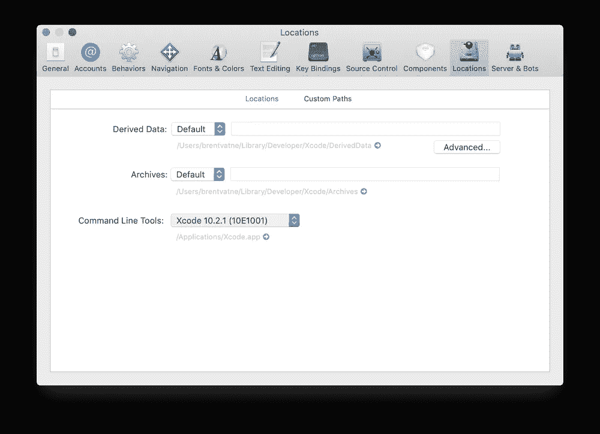
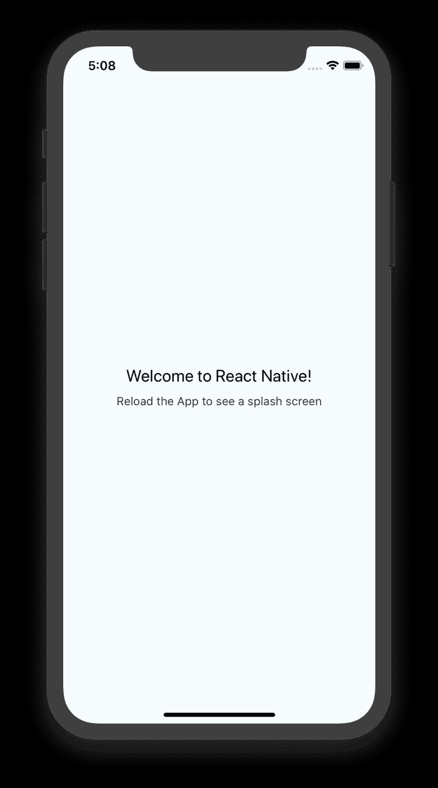

# 使用 iOS 模拟器在 React Native 中创建应用

> 原文：<https://blog.devgenius.io/creating-apps-in-react-native-with-an-ios-simulator-39bab189bbee?source=collection_archive---------3----------------------->

*注意:本博客假设你运行的是装有 macOS 的苹果台式机/笔记本电脑*

[React Native](https://reactnative.dev/) 是基于 [React](https://reactjs.org/) 为前端移动开发打造的框架。与 Swift 或 Java 不同，用 React Native 编写的应用程序可以在 Android 和 iOS 设备上使用，无需为多个设备重新编写代码。为了测试代码，Javascript 和 React 的开源平台 [Expo](http://expo.io) 可以用来测试您的代码，方法是将 Expo 应用程序下载到您的 iOS 或 Android 设备上。

但是，如果您不想在每次想要检查代码变更时都更换机器，该怎么办呢？你可以在你的机器上运行一个设备模拟器。我最近创建了我的第一个 React 本地应用，[一个 Snake](https://github.com/tdonovan79/snake) 的实现，并发现了一些关于如何设置模拟的冲突信息。在这里，我们将使用 Xcode 和 Expo 在 Mac 上设置和运行一个 iOS 模拟器。

# Xcode 下载和设置

从 App Store [这里](https://developer.apple.com/download/more/?q=xcode)下载 Xcode(注:Y *你需要有一个苹果开发者账户。如果你没有，你可以免费注册一个。*)。这个链接将列出几个可供下载的 xCode 版本。最新版本是 Xcode 11，但这只能在 macOS Mojave 10.14.4 或更高版本上运行。如果您不确定您的 macOS 版本，请单击屏幕左上角的苹果图标，然后单击下拉菜单中的“关于这台 Mac”。如果您运行的是早期版本的 macOS，请搜索您的 OS 支持的最新 Xcode 版本，并下载相应的 Xcode 版本(以下步骤适用于绝大多数 Xcode 版本)。下载后，安装 Xcode。

Xcode 偏好设置菜单

打开 Xcode 并导航到“偏好设置”菜单，然后选择“位置”标签。在命令行工具下选择最新版本，以安装 Xcode 命令行工具。这将允许您从命令行使用 Xcode 的功能。

# 安装节点、看守者和博览会

注意:本节假设您已经安装了 Homebrew 并更新到了最新版本。如果没有，如何操作的说明在[这里](https://brew.sh/)。

如果你还没有，你必须安装[节点](https://nodejs.org/en/)、[守望者](https://facebook.github.io/watchman/)和 Expo(以上链接)。Node 将让您访问 npm，节点包管理器，这将让您能够下载模块，并使用运行应用程序所需的某些功能。Watchman 将观察代码和文件的变化，并保持您的模拟更新。Expo 将让你进入 Metro Bundler，它充当中间人，并为你在模拟手机上运行应用程序。如果您已经安装了其中的任何一个，您可以跳过下面的安装。要安装，请在终端中输入以下命令:

**节点:**

> brew 安装节点

**守夜人:**

> brew 安装 watchman

**博览会:**

> npm install -g expo-cli

# 创建 React 本机应用程序

现在，导航到您想要创建第一个应用程序的目录，并在您的终端中键入以下内容:

> npx react-native 初始化您的项目

启动您的 npm 服务器:

> npm 开始

最后，开始地铁捆绑和开放博览会:

> 世博会开始— ios

这最后一个命令应该会自动打开 Xcode 并为您运行一个电话模拟器。如果这是你第一次打开模拟器，它会问你想模拟哪个设备，给出几个不同型号的 iPhones 的选项。Expo 应用程序将自动下载到这个模拟手机上，默认的 React 本地页面将会显示出来。

默认反应本机屏幕

您现在已经准备好开始使用 React 原生应用程序了！通过 Watchman，只要 npm 和 Expo 都在运行，对代码的任何更改都会自动显示在模拟电话上。如果你想在你的苹果设备上运行这个，在命令行运行“expo register”来创建一个帐户。将 Expo 应用程序下载到您的手机或平板电脑上，使用您的凭证登录，您的所有项目都将可以运行。React Native 有[很棒的文档](https://reactnative.dev/docs/getting-started)解释如何创建你的第一个基础应用，以及如何进一步探索。