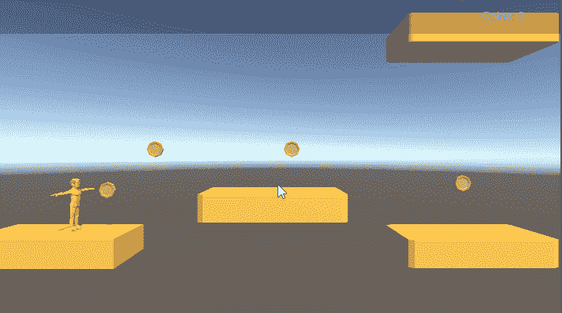
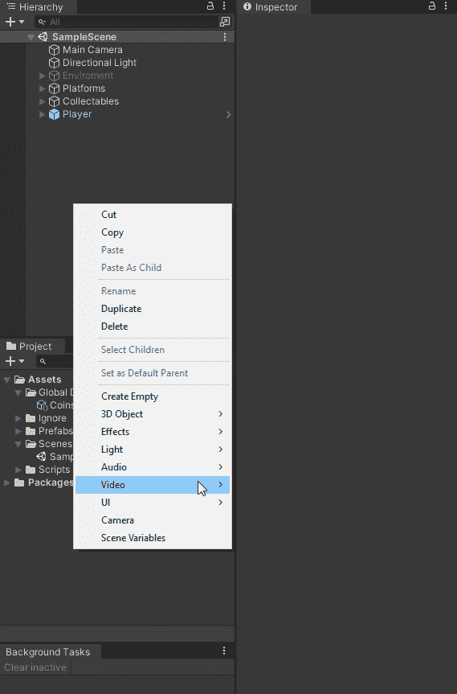
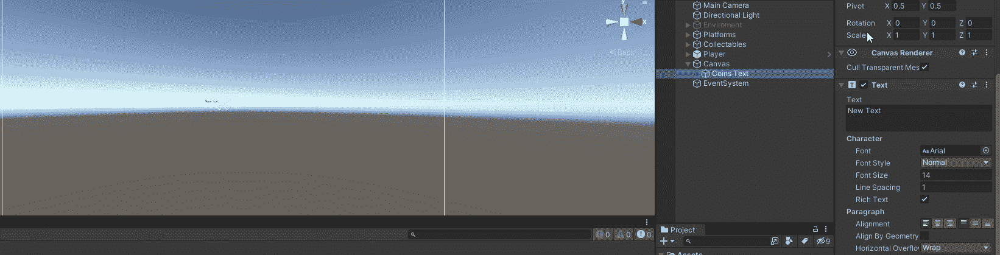
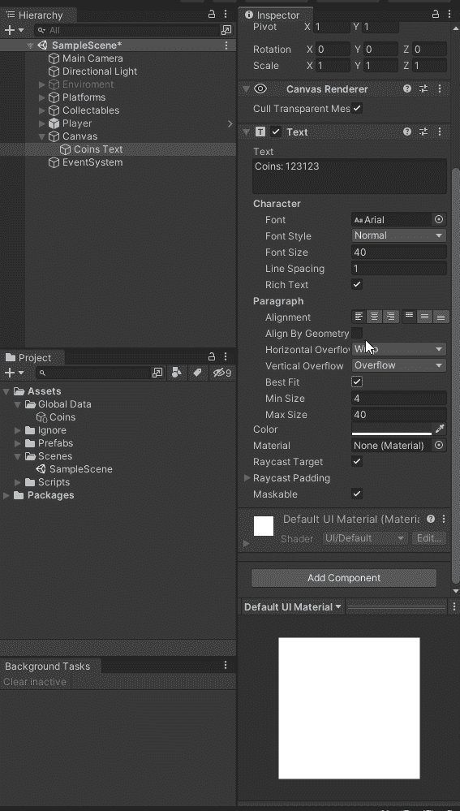
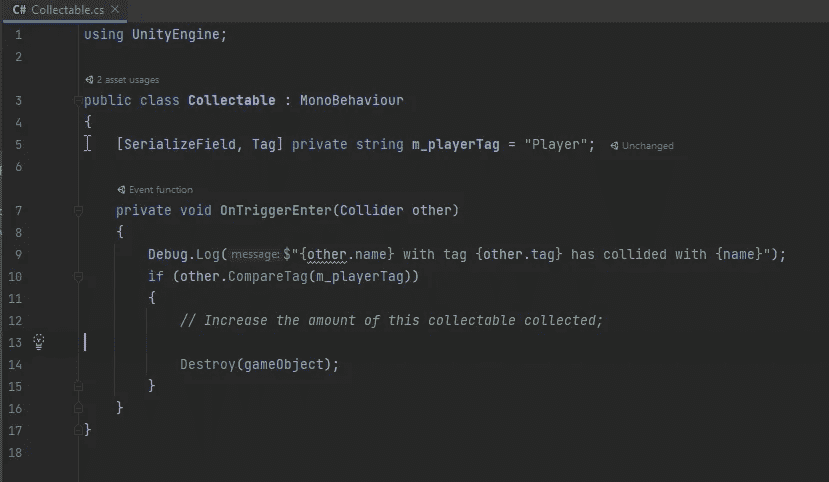
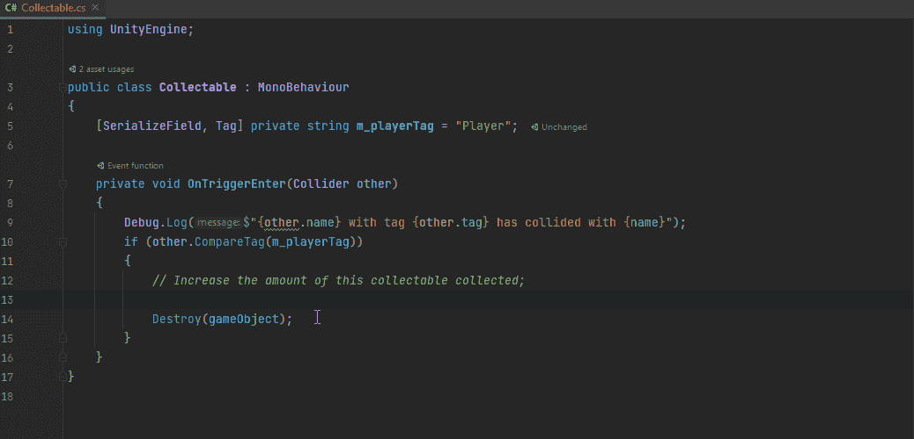
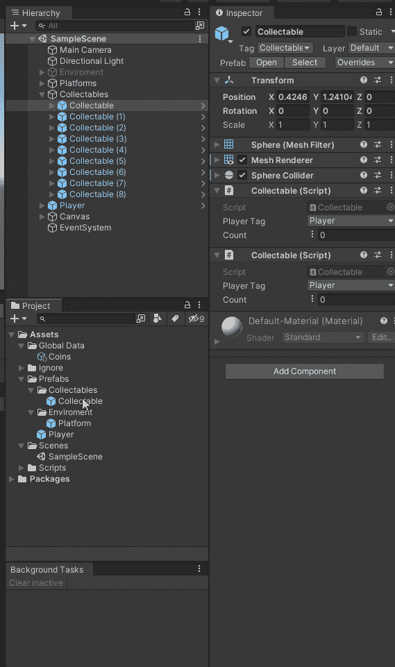

# 在 Unity 中创建收藏

> 原文：<https://blog.devgenius.io/creating-collectables-in-unity-3291e6b96521?source=collection_archive---------4----------------------->

## 模块化收藏品。

我的游戏里有收藏品。我需要一种方法在玩家与它们发生碰撞时收集它们。我还需要一种向玩家显示这些信息的方法。为此我将使用一个 [**ScriptableObject Int 变量**](/script-communication-in-unity-using-scriptable-objects-ad2ef0d99c59) 。

# 用户界面

我创建了一个名为硬币文本的文本用户界面。

我把它设置在屏幕的右上角，并把文字做得足够大，以便阅读。

然后我添加 Display Int 变量组件。我还添加了 Coin Int 变量作为我想要显示的变量。我还将文本设置为硬币。

# 值得收藏的行为。

我从一串要检查的标签开始。

在 On Trigger 方法中，我比较了进入触发器的碰撞器的标签。如果那个标签是玩家标签，我就销毁这个收藏品。

我希望能够增加这种类型的收藏品的数量，并与其他游戏对象交流价值。为此，我使用了一个 Int 引用变量。在触发输入方法中，在我破坏游戏对象之前，我增加了数量。

然后我编辑可收集的预置，确保有一个可收集的脚本，设置硬币脚本对象的计数。

现在我可以收集硬币，或者任何我选择加入游戏的收藏品。

要改变集合的类型，我所要做的就是改变使用的 int 值。