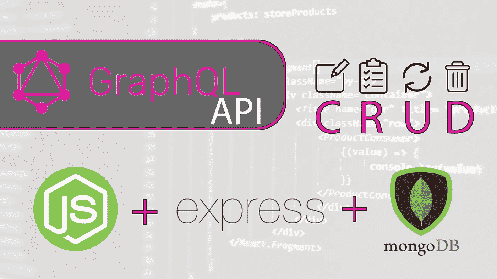
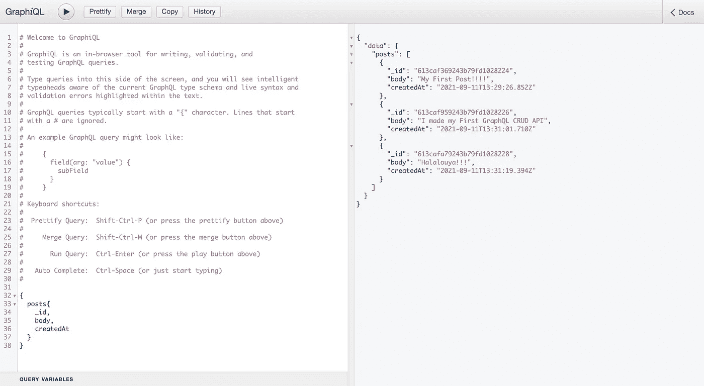
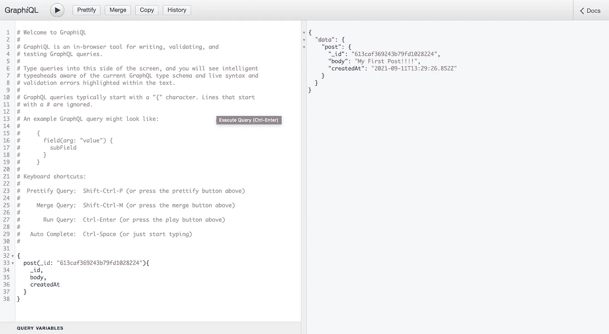
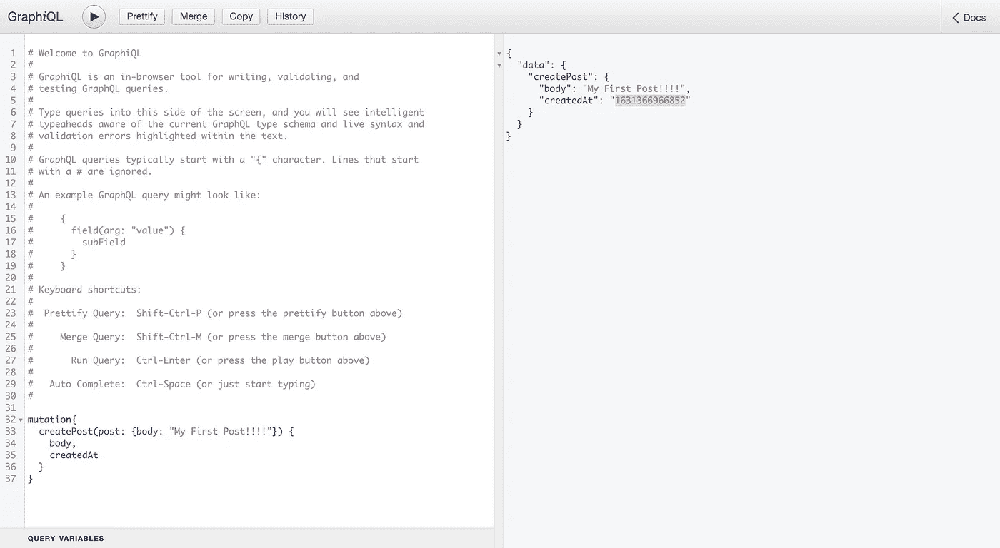
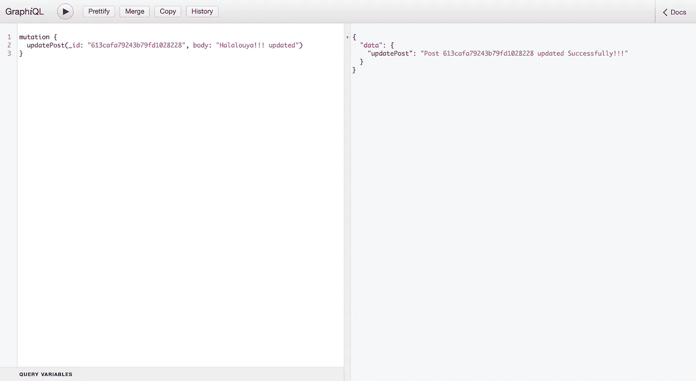
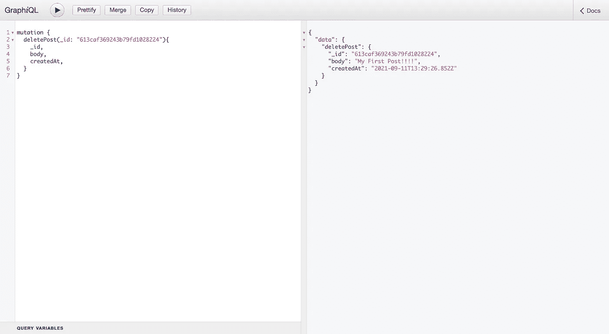

# 使用 Nodejs、Express 和 MongoDB 创建 CRUD GraphQL API

> 原文：<https://blog.devgenius.io/creating-crud-graphql-api-with-nodejs-express-mongodb-16c97e20e212?source=collection_archive---------1----------------------->

## 在本教程中，我们将了解 GraphQL，并使用 NodeJS、Express 和 MongoDB 构建一个简单的 CRUD GraphQL API。



今天，我将带您进入一个平行世界，探索 GraphQL。

在过去的 20 年里，REST APIs 已经在 web 应用程序领域占据了一席之地，而 GraphQL 则体现了这一流派的复兴。我们将立即找出原因！

> GraphQL，设计 API 的另一种方式

让我们从头说起。

通常，为了设计一个 API，我们会关注于创建由端点和数据表示物化的资源。

以下是通过 curl 命令在 [**TMDB API**](https://www.themoviedb.org/documentation/api) 上查找电影《人类之怒》的描述的查询示例:

```
curl — location — request GET 'https://api.themoviedb.org/3/search/movie?api_key={YOUR_API_KEY}&query=Wrath%20Of%20Man'=> {
 “page”: 1,
 “results”: [
 {
   “adult”: false,
   “backdrop_path”: “/9DZlZvgh9dIGcri79hv3KtHiq5K.jpg”,
   “genre_ids”: [
           28,
           80,
           53
    ],
    “id”: 637649,
    “original_language”: “en”,
    “original_title”: “Wrath of Man”,
    “overview”: “A cold and mysterious new security guard for a Los Angeles cash truck company surprises his co-workers when he unleashes precision skills during a heist. The crew is left wondering who he is and where he came from. Soon, the marksman’s ultimate motive becomes clear as he takes dramatic and irrevocable steps to settle a score.”,
    “popularity”: 665.016,
    “poster_path”: “/M7SUK85sKjaStg4TKhlAVyGlz3.jpg”,
    “release_date”: “2021–04–22”,
    “title”: “Wrath of Man”,
    “video”: false,
    “vote_average”: 7.8,
    “vote_count”: 2148
  }
 ],
  “total_pages”: 1,
  “total_results”: 1
}
```

这个例子说明了今天在 web 上可以找到的大多数 API。我们请求一个端点访问一个预定义的数据结构(我们隐式地使用 HTTP GET here)。如果您想要访问其他资源，则需要请求另一个端点，可能需要传递其他参数。当然，其他动作也是可能的，但是今天 web APIs 的基本作用是提供一个 CRUD。

GraphQL 为我们提供了一种完全不同的方法，允许我们只检索我们需要的数据。

由脸书在 2012 年创建，用于处理其 API 设计中反复出现的问题，第一次公开发布将在三年后进行。

GraphQL 不仅仅是一个新标准，它还是一种 web APIs 的查询语言。

如果你发现了，这里有两件重要的事情需要考虑:

*   我们只定义一个端点(例如`http://example/graphql`)。
*   由于这是一种查询语言，所有的动作都是通过一个`POST`来完成的。

因此，GraphQL 将允许您消除端点管理——有时很难记录和维护——并创建适合您需要的查询来处理数据，同时在代码本身中添加文档。

因此，前端开发人员在工作中获得了灵活性，因为他们能够以他们认为合适的方式操纵查询和处理数据。

## **整合？让我们更深入地理解**

GraphQL 定义了三种查询方式:

*   查询:我们将寻找特定的数据(相当于一个`GET`，但是选择我们选择的属性)
*   突变:我们想要改变数据(我们可以将其与`POST, PUT, and DELETE`动作进行比较)
*   订阅:有点特殊的情况，允许你通过使用 *WebSockets* 来保持与远程服务器的连接

最后一种情况在**web API**领域相当新颖，因为它允许我们克服无状态的概念。提醒一下，这个概念指的是服务器缺乏对客户机状态的管理。因此，在传统的 *REST* 架构中，有必要随每个请求发送信息(例如认证)，这往往会增加通过网络的信息量，并显著影响性能。

GraphQL 主要基于模式的概念。模式包括几个元素，包括查询等操作的定义、允许您定义对象属性的对象类型的定义，我们将能够使用 GraphQL 操作这些属性，甚至允许您列出字段的输入。可作为请求的参数访问。

此外， [GraphQL 有它自己的 SDL](https://graphql.org/learn/schema/) ，但是没有什么可以阻止您以其他方式声明它，如下例所示:

下面是使用 GraphQL 的 SDL 的同一个例子:

请注意，这里使用了 JavaScript 中的文字模板来包装我们的模式定义，还使用了引号来附加一个描述，这个描述将在本教程后面的 GraphQL 开发接口中找到。

最后，有必要建立解析器，其目标是检索和处理数据。

## 说够了，表演时间到了:

正如所料，我们将使用 Node.js 甚至 Express.js 框架和 MongoDB 来体验 GraphQL 的乐趣。我们的任务是制作一个 API，允许我们创建帖子并将它们存储在 MongoDB 数据库中，并且我们也能够获取和删除它们。

为此，我们首先创建一个新的节点项目

*   创建一个新目录并转到那里
*   运行`npm init`来配置新项目
*   运行`npm install`来创建我们的 package.json 文件
*   创建一个 server.js 文件(另一个名字也可以),作为我们服务器的入口点。
*   创建一个`src/schema`目录和一个包含业务逻辑的 index.js 文件
*   创建一个`src/resolvers`目录和一个 index.js 文件。
*   创建一个`src/models`目录和一个 post.js 来保存一篇文章的样子。

我将在本教程中使用`npm`，但你也可以用`yarn`来代替。一切都取决于你。

```
mkdir graphql-crud-api **&&** cd $_
npm init
npm i
touch server.js
mkdir -p src/schema **&&** touch src/schema/index.js
mkdir src/resolvers **&&** touch src/resolvers/index.js
mkdir src/models **&&** touch src/models/post.js
```

您项目的结构应该如下:

```
├── src
│   ├── schema
│   │   └── index.js
│   ├── resolvers
│   │   └── index.js
│   └── models
│       └── index.js
├── package-lock.json
├── package.json
└── server.js
```

现在是时候添加这个项目所需的依赖项了:

```
npm install --save express express-graphql graphql body-parser

*# Bonus =>* you can also install Nodemon locally to avoid having to restart your server with each change
npm install --save-dev nodemon
```

> 注意:如果您使用的是 **nodemon** ，不要忘记通过添加一个命令来更新 package.json 以启动服务器，如下所示。你只需要运行 ***npm start*** 命令来启动你的服务器。

```
“scripts”: { “start”: “nodemon server.js”, … }
```

现在我们将从定义 API 的模式开始。

# (计划或理论的)纲要

该模式将允许我们定义我们的 GraphQL 对象，并通过我们的 API 列出不同的可用操作。

这里我们将设置两个查询:

*   一个获取所有帖子的函数，它应该返回一个数组，并且每个帖子必须匹配类型`Post`。
*   另一种是通过 id 检索帖子。

。/src/schema/索引. js

让我们试着看得更清楚一点。

首先，我们声明一个 PostType 类型，它将包含我们想要的属性列表。请注意不同的标量类型，如“ID”或“String”以及“！”的使用以指示该字段不能为空。要了解更多信息，我邀请您查阅有关 [*标量类型*](https://graphql.org/learn/schema/#scalar-types) 和 [*对象类型*](https://graphql.org/learn/schema/#object-types-and-fields) 的 GraphQL 官方文档。

然后是输入类型，它指定预期的输入应该如何出现。这是用户创建新帖子时应该输入的信息。

顾名思义，GraphQL 查询用于指定查询类型。为了获得数据，我们将使用查询*‘posts’*。

为了能够检索文章，我们必须首先将它们保存在我们的数据库中。这意味着我们必须创造它们。我们在 GraphQl 突变的帮助下实现了这一点。这是一个在数据存储中(创建/更新/删除)数据并返回值的查询。

*   在这种情况下,`createPost`突变用于生成新帖子。它接受一个 PostInput 类型的条目，并从中创建一篇文章。
*   `deletePost`通过 id 来删除帖子的突变。
*   `updatePost`变异用于更新帖子，它需要两个参数`_id`和新的`body`。

最后，我们需要建立另一个模式，或者更准确地说，一个模型，以保证发送到 MongoDB 的数据符合 GraphQL 模式。

# 制作我们的猫鼬模型

我们将使用`mongoose`与我们的 MongoDB 数据库进行交互，这将使事情变得更容易。

我们需要在终端上运行以下命令来安装`mongoose`包:

```
npm install mongoose
```

接下来，我们可以通过将下面的代码添加到文件`src/model/post.js`来创建我们的模型

。/src/models/post.js

要做一个数据模型，首先要导入 mongoose 并访问 Schema 方法。现在，我们可以为特定的帖子构建一个模式。我们的 GraphQL 模式包括一些必填字段"！"，所以我们将使用必要的属性来遵守 GraphQL 标准。除了`_id`之外，我们不必将它作为字段添加到我们的模式中，因为它会自动生成。

接下来，我们再次使用`mongoose`并将模型的名称和模式作为参数传递给 model()方法。

# 分解器

解析器是一组生成 GraphQL 查询响应的函数。简单地说，这是一个 GraphQL 查询处理程序。每个查询或变异的名称必须与解析函数的名称完全匹配。这意味着如果我们有一个名为`posts`的查询，我们应该有一个名为`posts()`的解析函数。

现在，在我们完成了所有的工作之后，看起来我们已经拥有了为 API 创建 GraphQL 解析器所需的一切。

所以，我们开始吧。

帮我把下面这段代码添加到`src/resolvers/index.js`文件中。

。/src/resolvers/index.js

等一下，首先，我们需要弄清楚这个代码是什么意思。如果您还记得在我们的模式(`src/shcema/index.js`)中，我们创建了一个名为 posts 的查询，它返回一组帖子。
posts 方法使用用`mongoose`创建的模型向 MongoDB 发送请求。因此，我们现在可以使用 find()从数据库中检索所有文章。因为返回的响应是一个数组，所以我们必须对它进行循环并返回文档，用`mongoose`覆盖`_id`，并将 createdAt 字段更改为每个条目的更用户友好的日期。您可能知道，这个过程可能需要一段时间，这就是为什么我们使用 async/await 来处理请求。

我们的模式中前面描述的变异将由第二个解析器函数 createPost 处理。它将 post 对象作为输入，并使用它根据 post 模型创建一个新的 Post。
为了将它保存在 MongoDB 中，我们只需要使用另一个 mongoose 助手,`save()`函数，并按照模式中的预期返回新生成的 post。

MongoDB 响应有一些元数据，这就是为什么我在两个方法中都直接返回了`_doc`属性。

要删除一篇文章，作为一个参数，我们只声明 id 的字段。在解析器中，我们执行助手`findByIdAndDelete`，允许我们删除帖子，并返回已删除的帖子。

对于`updatePost`，我们通过`_id`和新的身体作为参数，然后，当然，我们将再次使用另一个`mongoose`助手，`findByIdAndUpdate`就像变魔术一样。但是这一次我们将只返回一个成功的消息。

我们现在有了 API 的模式和解析器，这几乎是我们进入下一阶段并构建服务器和端点所需的一切。

# 创建服务器并连接 MongoDB

将这段代码添加到`server.js`文件中。

`server.js`

如您所见，我们已经导入了之前创建的模式和解析器。需要使用它们。这是一个需要一些选项的`express-graphql`方法，在本例中，是模式和解析器。我还启用了`graphiql`，这是一个用于查询测试的有用工具。
代码的最后一部分是建立到 MongoDB 的连接，但是首先，您需要在 [**MongoDB Atlas**](https://www.mongodb.com/fr-fr/cloud/atlas) 上创建一个新的集群，并获得数据库名称、登录名和密码。

之后，在你的项目文件夹的根目录下创建一个新的文件`nodemon.json`，这个文件将被用来存储我们的环境变量。

```
{ 
  “env”: { 
            “MONGO_USER”: “your_username”, 
            “MONGO_PASSWORD”: “your_password”, 
            “MONGO_DB”: “your_database” 
         }
}
```

答对了。我们已经把所有的部分放在一起，现在我们有一个功能 API。

# 考验的时候到了！

现在我们已经完成了代码，我们将能够通过 GraphQL 提供的开发接口来测试我们的查询。

让我们从控制台启动服务器:

```
npm start
```

那我们就去下面这个地址我们最喜欢的浏览器:`http://localhost:4000:graphql`

关于这个接口，需要知道一些事情:

*   自动完成:在 Mac 上，我们用`CTRL+SPACE`激活自动完成
*   文档(从代码中检索)可通过右侧的侧菜单获得
*   其余的都是关于快乐:语法高亮、实时错误报告、查询结果等。

我们现在可以直接从界面尝试我们的查询:



获取所有帖子



获取发布 bu ID



创建新帖子



更新帖子



按 ID 删除帖子

您可以随心所欲地进行试验，通过创建突变来添加其他数据持久性逻辑，甚至尝试订阅！也有可能像流行的 [**Apollo**](https://www.apollographql.com/docs/) 一样利用第三方库。

好了，我希望你喜欢这篇介绍，甚至让你想尝试 GraphQL，在我看来它有真正的潜力。

> 你可以在 [Github](https://github.com/crayOmn/graphql-crud-api) 上找到源代码。