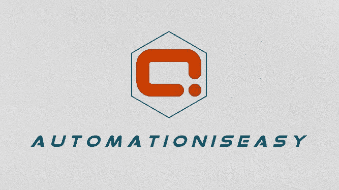

# 用 Python 创建自定义加密(编码)和解密程序

> 原文：<https://blog.devgenius.io/creating-custom-encrypting-encoding-and-decrypting-program-in-python-5a607bd8b67?source=collection_archive---------9----------------------->

> 在当今世界，没有比加密数据更好的安全协议了。

数据安全一直是热门话题。最近，我遇到了一个挑战，我需要在 RPA 中处理敏感数据。要输入的数据将由某些用户维护，但是团队中的所有员工都可以看到包含数据的文件。为了防止这些未经授权的用户访问有价值的敏感信息，我想到了使用 Python 中的加密库来加密和解密数据，这样数据就可以被机器人看到和维护。

但是，创造一个我们自己的加密算法怎么样？很有趣，对吧？我知道，要发明一种全新的加密算法，需要非常扎实的数学和统计背景知识，以及对位操作语言的丰富知识。有时候没有什么比一个好的挑战更好的了，只是为了好玩。请注意，我们在这篇教程/文章中创建的函数和我们的实现可能被认为是密码“弱”的。但是我们要为我们自己的每个字符定义加密值，这在某种程度上是安全的。有了这个，让我们开始吧。

# 📖介绍

让我们先了解一下**编码**和**加密**的区别。虽然加密确实涉及到对数据进行编码，但这两个术语是不可互换的，加密总是用于指已经安全编码的数据。编码数据仅在讨论未安全编码的数据时使用。

简单来说，**加密**就是对数据进行安全编码的过程，这样只有知道密钥或密码的授权用户才能恢复原始数据，对于其他人来说，这些数据只是垃圾。它用于维护数据机密性。一些流行的算法有— AES、RSA 和 Blowfish。
**编码**是将数据转换成一种格式的过程，这种格式可以被不同类型的系统使用公开可用的算法。它用于维护数据的可用性。一些流行的算法是-ASCII，UNICODE，URL 编码，Base64。

加密有两种基本类型:**对称密钥**和**非对称密钥**

在**对称密钥**加密中，数据使用相同的密钥进行编码和解码，就像密码一样。这是最简单的加密方式。
在**非对称密钥**加密中，一个密钥用于加密数据(公钥)，另一个密钥用于解密数据(私钥)。

在本教程中，我们将使用**简单对称密钥**创建一个自定义程序来加密和解密数据，即相同的密钥(数据表)将用于加密和解密数据。

# **入门**

让我们来了解一下我们将在这个程序中创建的函数。我们需要一个函数来读取密钥，一个函数来加密文本，另一个函数来解密文本，就是这样！

## 📙读取密钥

让我们为每个字符创建加密值。为了便于理解，下面的 CSV 表仅包含数字字符的加密值。您可以为每个字符定义自己的值。这里，为了使算法稍微复杂一点，我为每个字符定义了两个加密密钥，它们将组合使用。

让我们创建一个函数，它是这个程序的核心算法，它实际上修改了上面的键，而不是按原样使用这些键。

上面的代码片段包含组合 columns key 中加密值的替代值以在内部生成新密钥的逻辑。

*1 号线* —导入熊猫包读取 CSV 表。
*第 2 行* —创建一个带一个参数的函数，即存储加密密钥的文件(在 CSV 文件之上)。
*第 3 行* —定义一个空字典来存储后期的数据。
*第 4 行* —读取 CSV 表。
*第 5–8 行* —将列“Key1”和“Key2”转换为字符串，并将列“Key2”反转
*第 9–14 行* —通过组合两个密钥列，创建一个与每个字符相关联的新密钥作为加密密钥。
*第 15 行*——将字符和关键列转换成字典并在*第 16 行*返回。

上面的算法也可以用不同的逻辑写成你需要怎么加密数据。人们也可以使用数学公式来加密每个字符。在这里，我从两列中取出交替的加密字符。

## 📙加密字符串

这是我们要创建的第二个函数，调用它会生成加密文本。

在上面的代码片段中，

*第 1 行* —定义函数`**encrypt_string**`，带两个参数:
*keyFile*—包含每个字符的加密密钥的文件。这用于通过调用我们在上一节中讨论的函数 generate_keys 来生成密钥。
*stringToEncrypt*—需要加密的文本信息。
*第 3 行* —通过调用函数`**generate_keys**`创建加密密钥并将其存储在名为“keys”的字典中。
*第 4–6 行* —获取输入字符串中的每个字符，并通过查看其在字典中的“值”从字典中获取相关的“键”。
*第 7 行* —返回最终的加密输出。

让我们通过传递要加密的字符串' 560100 '作为第二个参数，传递我们在第一步中构建的密钥文件作为第一个参数，来看看输出会是什么样子。

`***In [1]:* print(encrypt_string(‘EncodedKey.csv’,’560100'))**`

`***Out:* CfQ3=2=JC+A7=y=gBZA+=7=9DoQb=+=ABZA+=7=9BZA+=7=9**`

## 📙解密字符串

这个函数通过引用相同的密钥来解密加密的值。让我们来理解这个功能-

这是一个有点棘手的函数。在上面的代码片段中-

第 1 行—创建一个函数`**decrypt_string**` ，它有两个参数:
*keyFile*—包含每个字符的加密密钥的文件。这用于通过调用我们在上一节中讨论的函数 generate_keys 来生成密钥。
*string code crypt*—需要解密的加密消息。
*第 3 行* —通过调用函数`**generate_keys**`创建加密密钥并将其存储在名为“keys”的字典中。
*第 4- 6 行* —如果您还记得在构建 CSV 文件时，我们已经从两个关键列中定义了总共八个字符。因此，这里我们一次从加密值中取出 8 个字符，并从字典中寻找合适的值。
*第 7 行* —返回最终解密输出。

让我们看看输出是什么样子的，通过传递我们在上面的部分中得到的加密字符串“cfq 3 = 2 = JC+A7 = y = gBZA+= 7 = 9 doqb =+= ABZA+= 7 = 9 bza+= 7 = 9”作为第二个参数和我们在第一步中构建的密钥文件作为第一个参数。

`***In [1]:* print(decrypt_string(‘EncodedKey.csv’,‘CfQ3=2=JC+A7=y=gBZA+=7=9DoQb=+=ABZA+=7=9BZA+=7=9’))**`

`***Out*: 560100**`

## 👢包扎

因此，在本教程中，我们看到了如何创建一个定制的对称密钥加密程序。这里，我们在两列中使用了编码值，称为 Key1 和 Key2。可以修改列的数量，实际上可以通过组合多个列来调整算法以生成复杂的键。此外，使用数学方程或改变组合多个列的逻辑，可以创建复杂的算法。

# 感谢阅读❤️继续分享📚

# python #加密#解密# roboticprocessautomation # rpa #算法#自定义# automation anywhere # netapp # netapp cloud #编码#解码#字典# pandas #密码 2022 #密码#对称

> ***#自动化简单***

