# 创建在 Unity 中使用的自定义软件包

> 原文：<https://blog.devgenius.io/creating-custom-packages-for-use-in-unity-7dfbaa49e4b4?source=collection_archive---------1----------------------->

## 使用你的代码而不扰乱你的项目

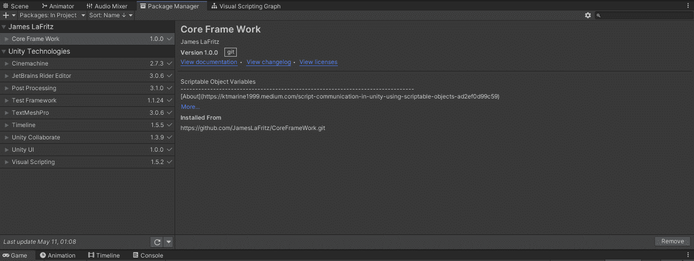

你有在你的上一个项目中创建的代码，你想在你所有的包中容易地使用吗？你是否为一个在每个项目中都使用的基本代码集的公司工作？如果以上任何一个问题的答案是肯定的，那么你可能要考虑创建你自己的软件包，可以从 Unity 的软件包管理器安装。

根据 [**统一手工创建自定义套餐**](https://docs.unity3d.com/Manual/CustomPackages.html)

> Unity 软件包管理器是 Unity 的官方软件包管理系统。它执行以下操作:
> 
> 允许 Unity 快速轻松地发布新功能和更新现有功能。
> 
> 为用户提供一个发现和共享可重用组件的平台。
> 
> 促进 Unity 成为一个可扩展的开放平台。
> 
> 您可以使用包管理器来定义项目**依赖关系**，解析包依赖关系，根据需要下载和添加包，并将内容集成到您的项目中。
> 
> 有关什么是软件包以及 Unity 软件包管理器如何工作的一般信息，请参见[软件包](https://docs.unity3d.com/Manual/Packages.html)文档。
> 
> 要创建新的包:
> 
> 1.使用以下方法之一为包创建一个空壳:
> 
> [*设置一个嵌入式包](https://docs.unity3d.com/Manual/CustomPackages.html#EmbedMe)。
> 
> [*设置本地包](https://docs.unity3d.com/Manual/CustomPackages.html#LocalMe)。
> 
> 2.实现您的工具、库以及您的包需要的任何资产。
> 
> 3.确保您的软件包布局遵循 Unity 软件包的[软件包布局惯例](https://docs.unity3d.com/Manual/cus-layout.html)。
> 
> 4.将[测试](https://docs.unity3d.com/Manual/cus-tests.html)添加到您的包中。测试对于确保软件包在不同情况下按预期工作至关重要:
> 
> *在`Tests/Editor`中编写所有编辑器测试。
> 
> *在`Tests/Runtime`中编写所有的 Playmode 测试。
> 
> 5.重命名并更新[装配定义文件](https://docs.unity3d.com/Manual/cus-asmdef.html)。
> 
> 6.您可以在每次发布新版本时更新`CHANGELOG.md`文件。每个新特性或错误修复都应该在这个文件中有一个痕迹。有关所选变更日志格式的更多细节，请参见[保存变更日志](http://keepachangelog.com/en/1.0.0/)文档。
> 
> 对于不共享的包，这是可选的，但是对于共享的包，强烈建议这样做，以便用户知道哪个版本最适合他们的需要。
> 
> 7.您可以[将许可证和第三方通知](https://docs.unity3d.com/Manual/cus-legal.html)包含在`LICENSE.md`和`THIRD PARTY NOTICES.md`文件中。
> 
> 对于不共享的包，这是可选的，但是对于共享的包，强烈建议这样做，这样你的用户就不会误用你的包或者违反任何第三方许可。
> 
> 8.[分享](https://docs.unity3d.com/Manual/cus-share.html)你的套餐。

# 为包创建一个空壳

我已经创建了 ScriptableObject 变量和自定义属性，我希望在我的所有项目中使用它们，我将按照 [**创建一个新的本地包**](https://docs.unity3d.com/Manual/CustomPackages.html#LocalMe) 来创建我的包。

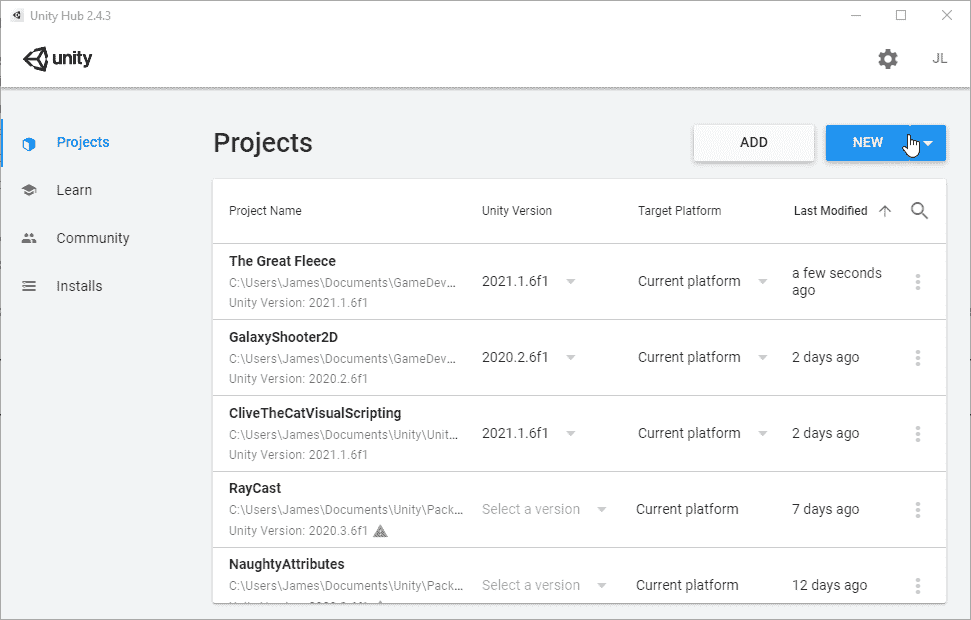

# 实现您的工具、库以及您的包需要的任何资产。

[**包装布局**](https://docs.unity3d.com/Manual/cus-layout.html)

> `<root>
> ├── Editor
> │ └── EditorExample.cs
> ├── Runtime
> │ └── RuntimeExample.cs`

我将我想要的**行为/类**复制到适当的文件夹中

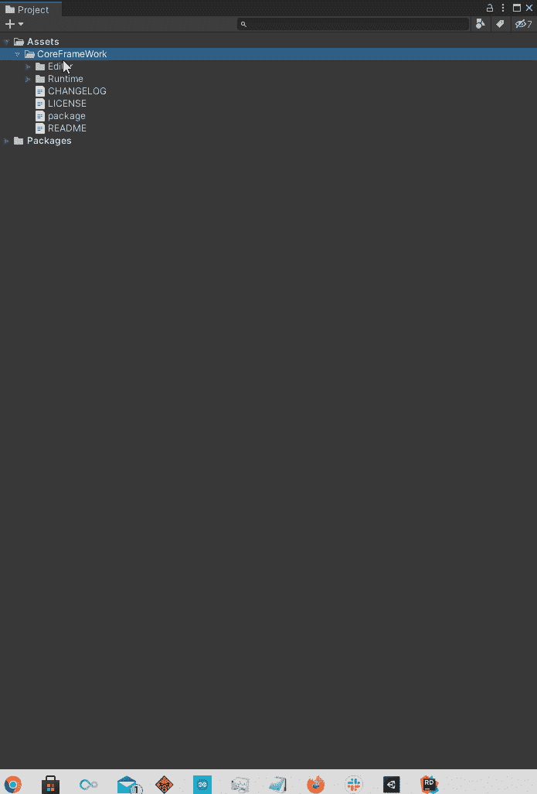

# 确保您的软件包布局遵循 Unity 软件包的软件包布局惯例。

统一有其他需要满足的要求 [**包装布局**](https://docs.unity3d.com/Manual/cus-layout.html)

```
<root>
  ├── [package.json](https://docs.unity3d.com/Manual/upm-manifestPkg.html)
  ├── README.md
  ├── CHANGELOG.md(Optional)
  ├── LICENSE.md(Optional)
  ├── THIRD PARTY NOTICES.md(Optional)
  ├── Editor
  │   ├── Unity.[YourPackageName].Editor.asmdef
  │   └── EditorExample.cs
  ├── Runtime
  │   ├── Unity.[YourPackageName].asmdef
  │   └── RuntimeExample.cs
  ├── Tests
  │   ├── Editor
  │   │   ├── Unity.[YourPackageName].Editor.Tests.asmdef
  │   │   └── EditorExampleTest.cs
  │   └── Runtime
  │        ├── Unity.[YourPackageName].Tests.asmdef
  │        └── RuntimeExampleTest.cs
  └── Documentation~
       └── [YourPackageName].md
```

[**package.json**](https://docs.unity3d.com/Manual/upm-manifestPkg.html) 要求有名称和版本。

显示名称、描述和 unity 都是可选的，但是 [**Unity 声明这些是必需的**](https://docs.unity3d.com/Manual/upm-manifestPkg.html#mandatory) 。

这个文件中其余的属性都是 [**可选**](https://docs.unity3d.com/Manual/upm-manifestPkg.html#optional) 。

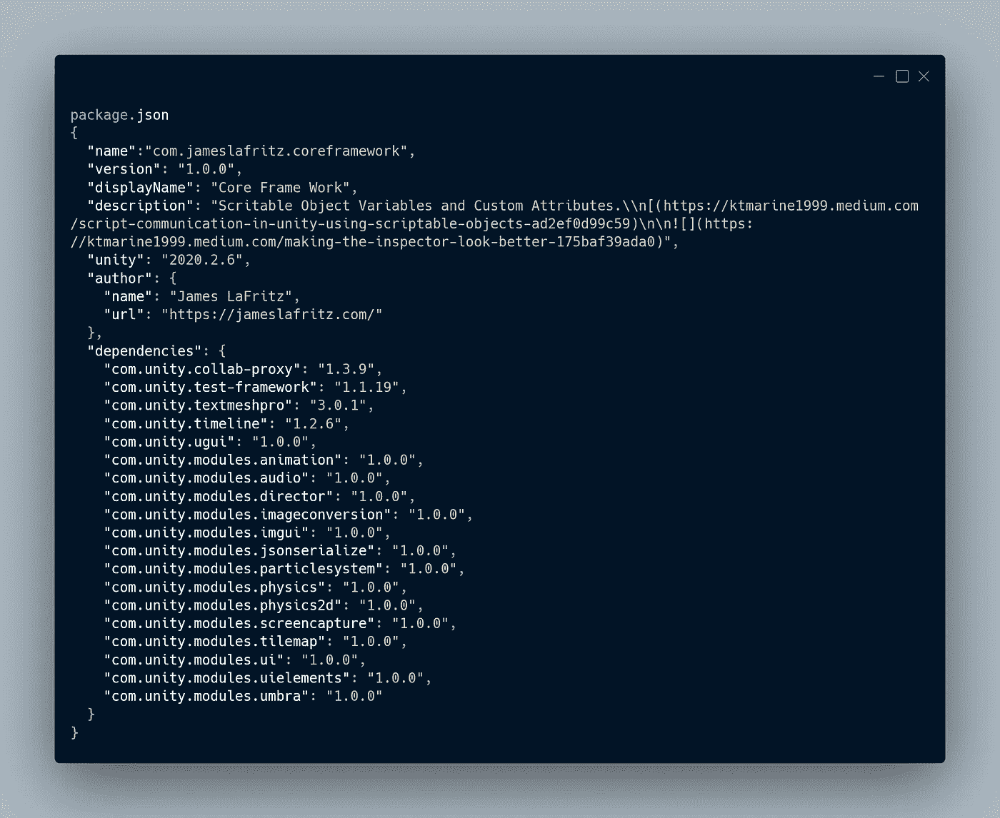

`[**package.json**](https://docs.unity3d.com/Manual/upm-manifestPkg.html)`

自述文件是典型的自述文件。

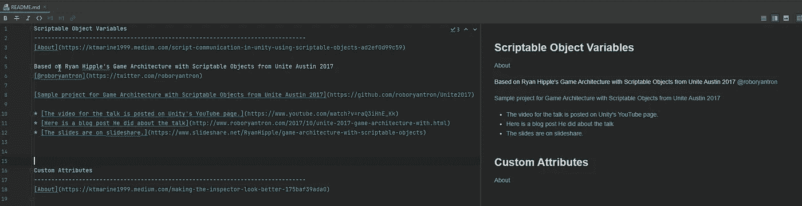

# 重命名并更新程序集定义文件。

脚本必须与[装配定义文件](https://docs.unity3d.com/Manual/cus-asmdef.html)相关联。

## 运行时脚本

运行时脚本必须在`Runtime/MyCompany.MyFeature.Runtime.asmdef`中

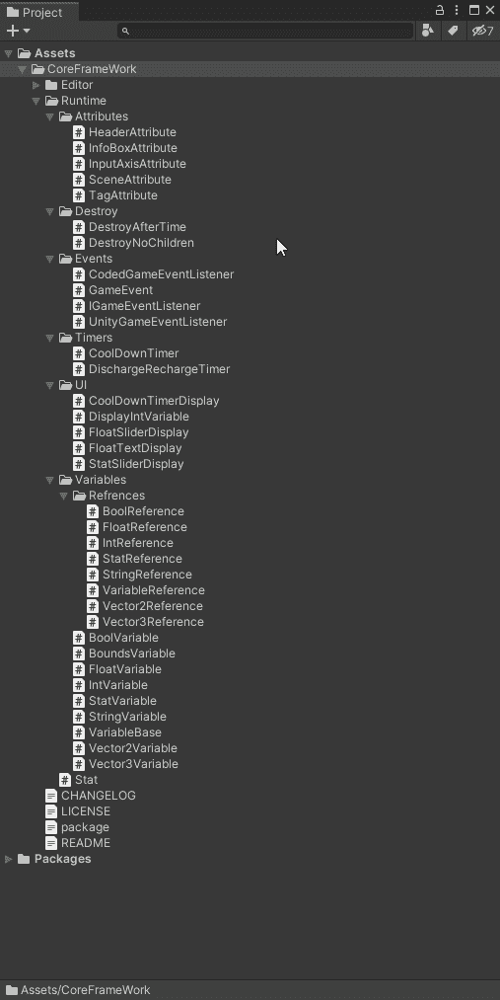

现在我需要确保我引用了 Unity Mathematics 作为汇编引用。

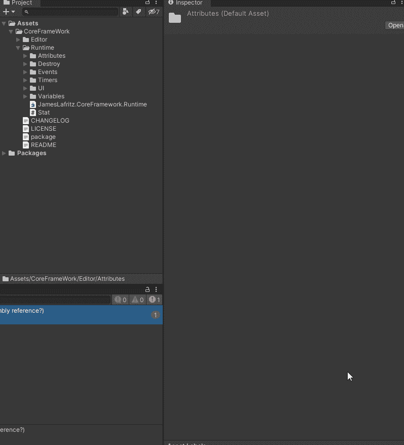

如果需要，您可以更改这里其他设置。

## 编辑器脚本

编辑脚本必须在`Editor/MyCompany.MyFeature.Editor.asmdef`

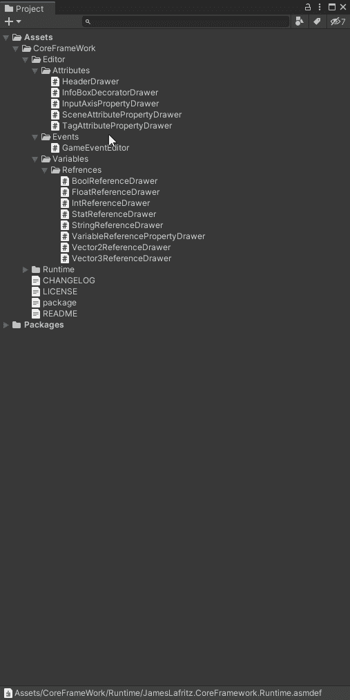

不要忘记添加所需的程序集定义引用

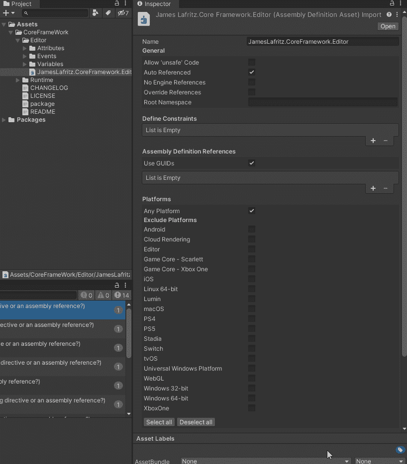

# 共享您的包。

[**分享**](https://docs.unity3d.com/Manual/cus-share.html) 你的套餐有几种方式。取决于它如何共享，取决于您如何将它添加到您的项目中。

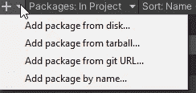

要将它从硬盘添加到您的项目中，请使用包管理器中的从磁盘添加包。

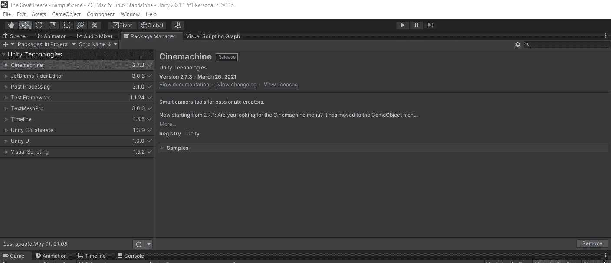

如果您已经使用 Git 共享了它，您可以通过从 git URL 添加它来安装它。你可以通过使用[https://github.com/JamesLaFritz/CoreFrameWork](https://github.com/JamesLaFritz/CoreFrameWork)进行测试

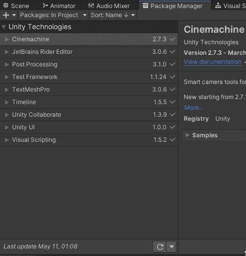