# 使用 AWS S3、Glue 和 Athena 创建数据湖

> 原文：<https://blog.devgenius.io/creating-data-lake-using-aws-s3-glue-and-athena-9543849cb81d?source=collection_archive---------1----------------------->


照片由[áRPád Czapp](https://unsplash.com/@czapp_arpad)在 [Unsplash](https://unsplash.com/) 上拍摄

本文将在 AWS S3 存储桶中存储大量数据，并使用 AWS glue 来存储这些数据的元数据。最后，使用 AWS Athena 通过标准 SQL 查询这些大量数据。

> **注**:如果你在这篇文章中发现了一个错别字，通读一遍以寻找理由。*😊*

# 先决条件

1.  AWS 帐户
2.  AWS S3 的背景
3.  数据库背景(任何 RDMS)
4.  ☕，来杯咖啡就好了

# AWS 雅典娜是什么？

当我们处理大量数据时，我们需要一些工具来查询和分析这些大数据。AWS 雅典娜的角色来了。我们可以使用 Amazon Athena 作为查询服务，这使得分析亚马逊 S3 中的数据变得很容易。这里最好的部分是，我们不需要学习任何其他查询语言来查询这些数据，因为 Athena 支持标准 SQL。此外，Athena 是无服务器的，这意味着我们不需要管理基础设施，我们只为运行的查询付费。

对于查询数据和可视化结果，雅典娜是易于使用和集成与亚马逊 S3。我们只需要将数据指向 S3，定义模式，然后开始使用标准 SQL 进行查询。大多数查询的结果会在几秒钟内送达。使用 Athena，不需要创建提取、转换和加载(ETL)作业来准备用于分析的数据，因为任何具有 SQL 技能的人都可以快速分析这个大规模数据集。

# **使用 AWS Athena 的好处**

## **易于使用**

在内部，Athena 使用 Presto 作为 SQL 查询引擎，用于对各种规模的数据源执行交互式查询。它支持以下数据格式:

1.  拼花地板(优化的行列)
2.  JSON
3.  Avro
4.  战斗支援车
5.  优化的行列

这允许 Athena 运行复杂的查询，包括窗口函数、嵌套查询、大型连接等。

## **无服务器**

Athena 是无服务器的，这意味着我们可以快速查询数据，而无需配置或管理任何基础架构。此外，随着数据集的增长，我们不必担心查询失败、软件更新以及服务器或数据仓库的扩展。

## **按执行的查询付费**

有了 Amazon Athena，我们只需要为我们执行的查询和每个查询扫描的数据量付费。为了降低成本，我们可以将数据分区、压缩并转换成列格式。而且，由于查询是直接在 AWS S3 中执行的，因此没有额外的存储费用。

最好的部分是对于**失败的查询没有增加费用**。但是，如果手动取消**查询**，将向用户收取查询取消前扫描的**数据量的费用。**

## **快速性能**

Athena 可以并行运行查询，并在几秒钟内获得结果。它可以自动伸缩，即使查询很复杂，也能提供高性能。

# AWS 红移 vs AWS Athena(一种查询服务)

*   当我们需要将来自不同数据源(如库存服务、订单服务或零售服务)的数据转换成一种通用格式，并长期存储时，像 AWS Redshift 这样的数据仓库是我们的最佳选择。我们存储这些数据，以便根据历史数据生成复杂的业务报告；那么像亚马逊红移这样的数据仓库是我们最好的选择。
*   像 Amazon Athena 这样的查询服务使得直接在 Amazon S3 中对数据进行交互式查询变得很容易，而不用担心格式化数据或管理基础设施。例如，如果我们只需要在一些博客上运行快速查询来解决我们的应用程序的性能问题，Athena 就很棒。有了查询服务，我们可以快速开始。我们只需为数据定义一个表，并开始使用标准 SQL 进行查询。

> 数据仓库从整个公司收集数据，并作为报告生成和分析的**“单一事实来源”。数据仓库从许多来源提取数据，对其进行格式化和组织，存储，并支持复杂、高速的查询以生成业务报告。Amazon Redshift 中的查询引擎已经过优化，在这个用例中表现得特别好——我们需要运行连接大量非常大的数据库表的复杂查询。Redshift 运行复杂查询的速度比针对非结构化数据优化的查询服务快 20 倍。当我们需要对高度结构化的数据运行查询时，如果这些数据在很多非常大的表上有很多连接，我们应该选择 Amazon Redshift 而不是 Amazon Athena。**
> 
> **我们也可以一起使用这两种服务。如果在将数据加载到 Amazon Redshift 之前，我们将数据存放在 Amazon S3 上，那么这些数据也可以注册到 Amazon Athena 并由 Amazon Athena 查询。**

# ****使用亚马逊 Athena 管理控制台从 S3 读取数据的步骤****

1.  ****上传 CSV 文件到 S3 桶—** 我从[网站](http://data.gov.in/)下载了一个 CSV 文件样本(你也可以从[这里](https://www.stats.govt.nz/assets/Uploads/Annual-enterprise-survey/Annual-enterprise-survey-2019-financial-year-provisional/Download-data/annual-enterprise-survey-2019-financial-year-provisional-size-bands-csv.csv)下载)。现在将这个 CSV 文件上传到 S3，创建一个名为“我们的数据湖”的存储桶，然后按“下一步”完成所有步骤。**

**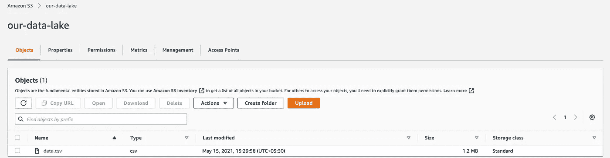**

****2。创建一个 IAM 角色—** 我们需要创建一个角色，为不同的登录用户授予权限。**

*   **转到[https://console.aws.amazon.com/iam/](https://console.aws.amazon.com/iam/)点击“角色”,然后点击“创建角色”按钮。**
*   **选择“粘合”并点击下一步。**

**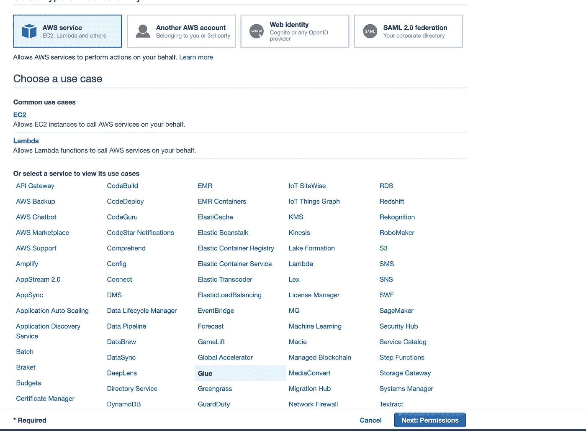**

*   **然后给胶水和 S3 许可。**

**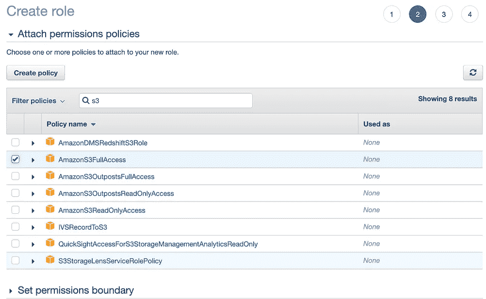****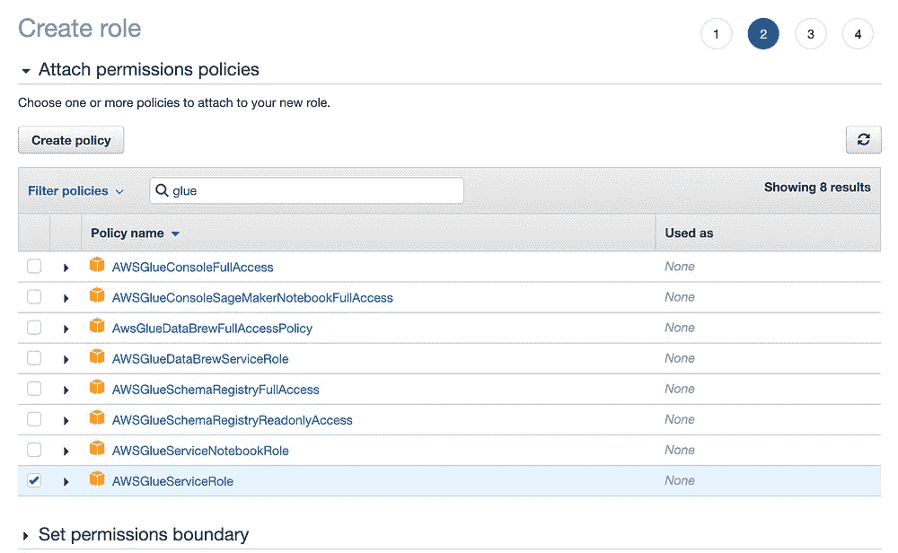**

*   **输入一个角色名称(例如 AWSGlueServiceRole)并给出一些关于角色的描述，然后单击“创建角色”按钮，这样就创建了一个新角色。**

**3.**配置 AWS Glue 操作—** 我们使用 AWS Glue 来组织、清理、验证和格式化存储在 S3 的数据。**

*   **在 [AWS 控制台](https://aws.amazon.com/console) e 中搜索“AWS Glue”并点击“crawlers”。**

**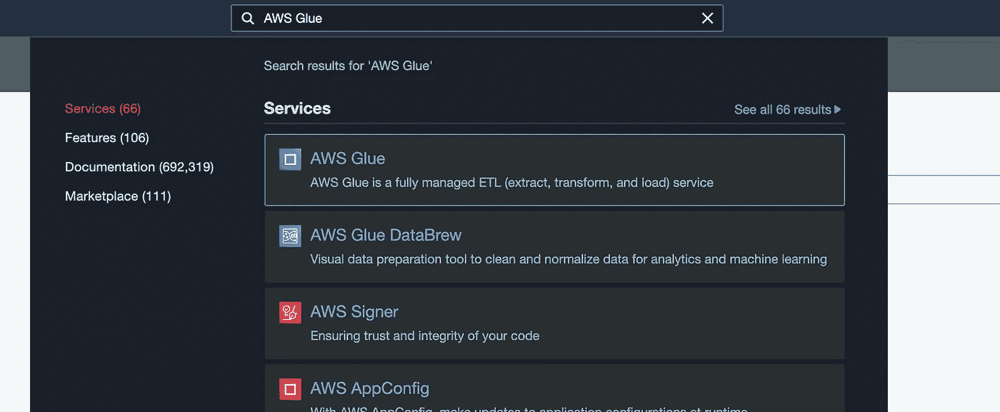**

*   **单击 Add Crawler 并输入 Crawler 名称(如 dataLakeCrawler ),然后单击“Next button”。**

**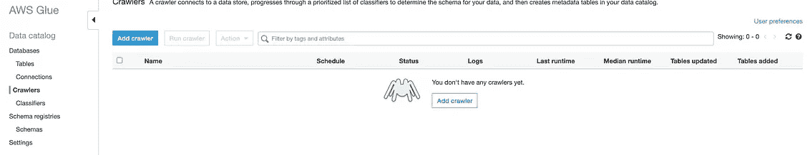****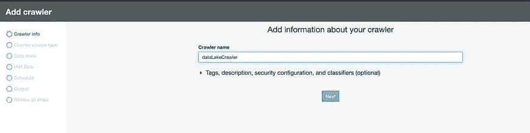**

*   **选择数据存储为“S3 ”,并给出我们存储在 S3 存储桶中的数据的路径，然后单击“下一步”。现在，跳过添加另一个数据存储，单击“Next”。**

**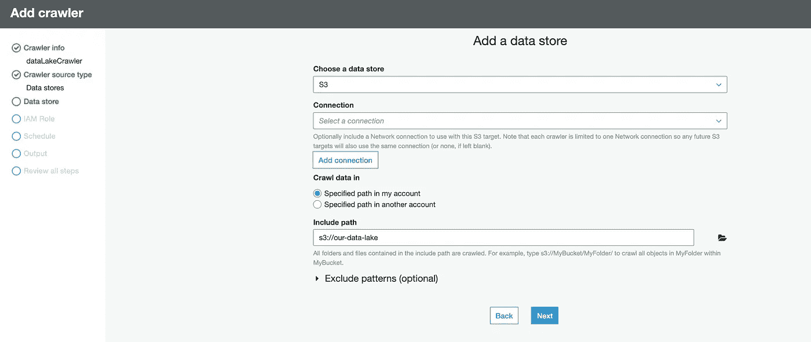**

*   **选择我们之前创建的 IAM 角色，然后单击“Next”。**

**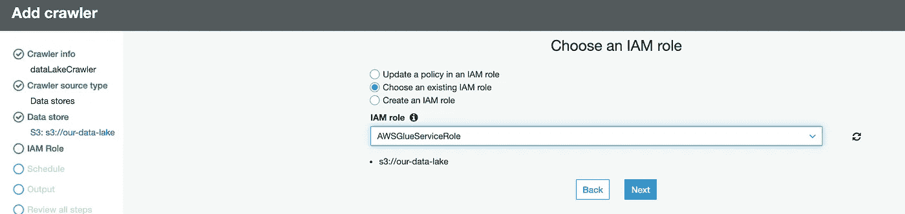**

*   **选择“按需运行”选项，然后单击“下一步”。**

**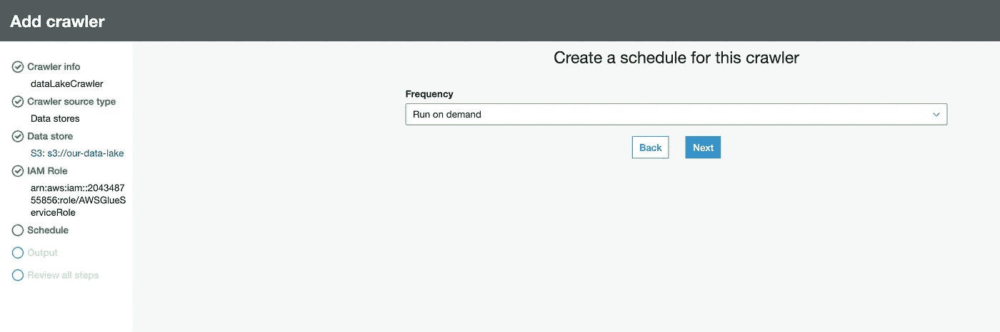**

*   **点击“添加数据库”,命名为“数据湖数据库”,然后点击“下一步”。**

**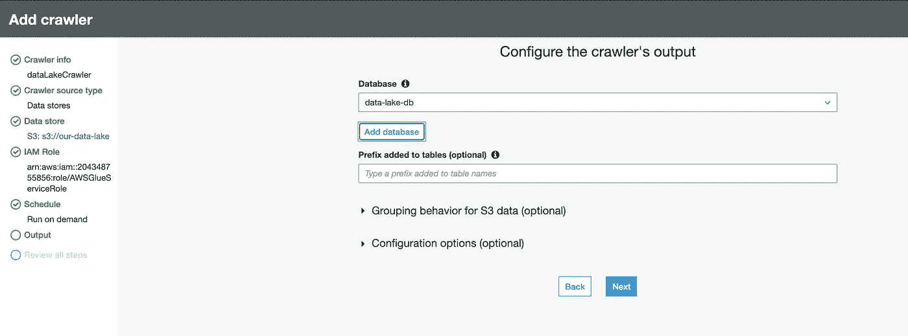**

*   **在这一步中，我们必须检查 AWS Glue crawler 配置，然后单击“Finish”。**

**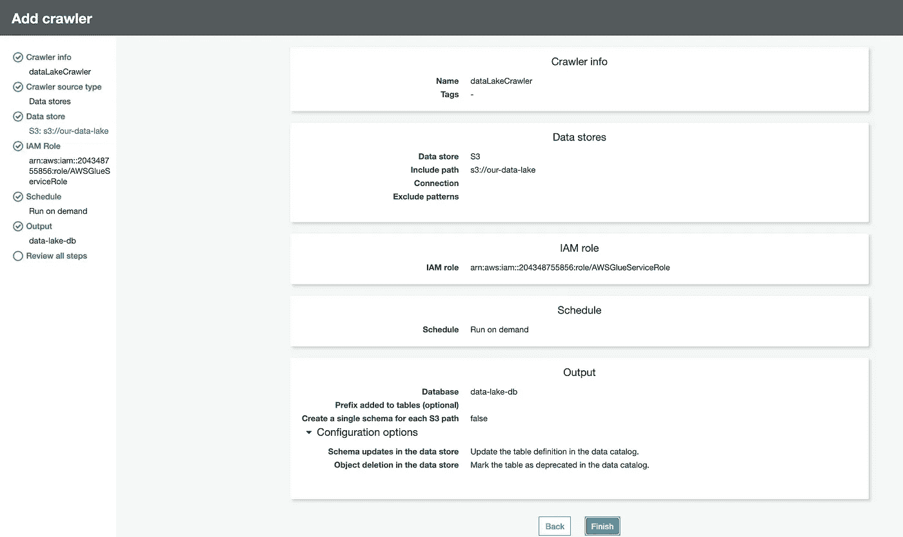**

****4。在 AWS Athena 管理控制台中运行查询—** 我们现在可以转到 AWS Athena，选择上面创建的数据库(data-lake-db ),并使用标准 MySQL 执行我们的查询:**

```
SELECT * FROM “data-lake-db”.”our_data_lake” limit 10;
```

**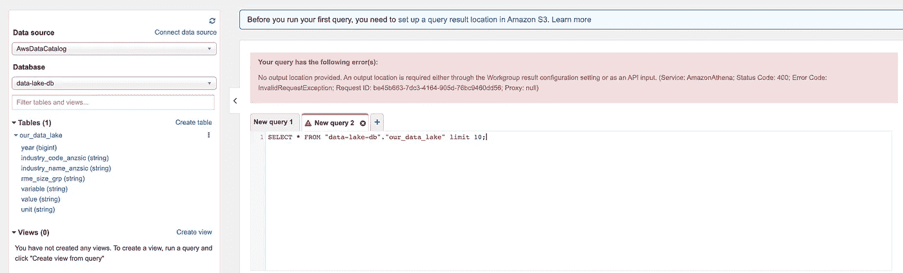**

**但是等待我们得到一个错误，说明我们需要在执行查询之前提供“输出位置”。这就是问题所在！**

> **Amazon Athena 自动**存储在我们在亚马逊 S3 指定的查询结果位置**运行的每个查询的查询结果和元数据信息。**

**现在，我们创建一个名为“athena-data-lake-output”的 S3 存储桶，并通过单击 athena 管理控制台上的“setup a query result location in Amazon S3”选项卡将查询的输出存储在这个存储桶中。**

**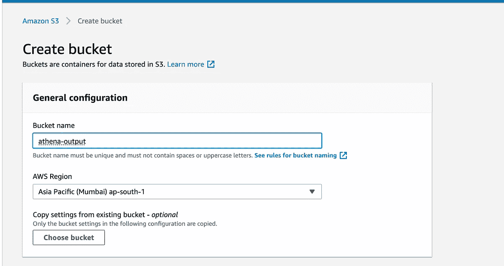****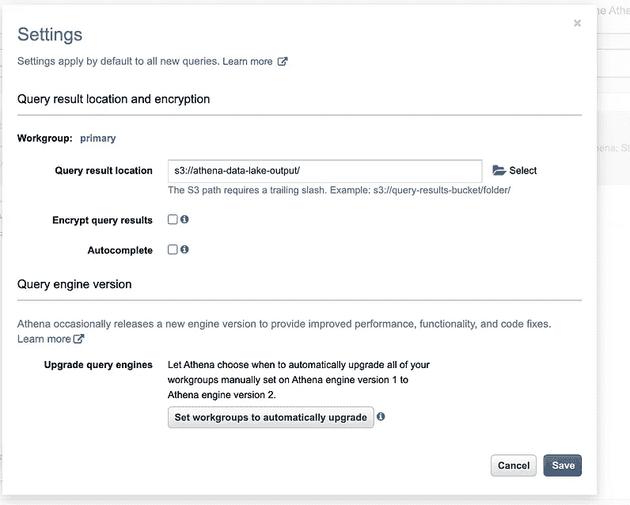**

**最后，我们可以运行相同的查询并分析输出。**

**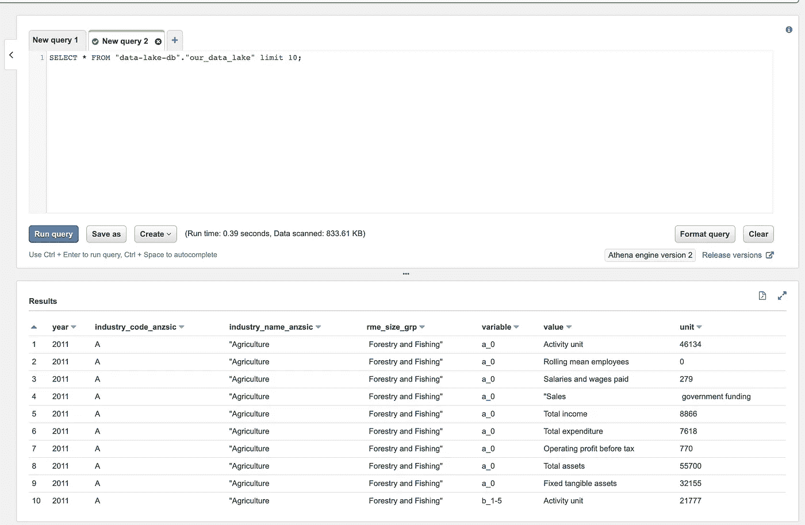**

# **恭喜你。🙂**

***我们已经成功地将我们的数据加载到 S3 存储桶中，并配置 AWS Athena 使用标准 MySQL 查询如此大量的数据。***

****

# **摘要**

**为了这篇文章的完整性，让我们快速回顾一下到目前为止我们所学的内容。**

1.  **什么是 AWS Athena，为什么使用它？**
2.  **使用 AWS Athena 的好处。**
3.  **AWS Athena 什么时候适合我们的用例？**
4.  **如何使用 AWS Athena 查询数据？**

> **如果你喜欢这篇文章，别忘了给它一个掌声！**

****

**请随时在 [**Linkedin**](https://www.linkedin.com/in/shubham-kaushik-temp/) 上 ping 我，敬请期待下一期！**

# ****参考文献****

**[1] AWS 雅典娜文件[https://docs.aws.amazon.com/athena/](https://docs.aws.amazon.com/athena/)**

**[2] AWS 控制台[https://aws.amazon.com/console](https://aws.amazon.com/console)**

**[2] Sqlhack 网站[https://www.sqlshack.com/an-introduction-to-aws-athena/](https://www.sqlshack.com/an-introduction-to-aws-athena/)**