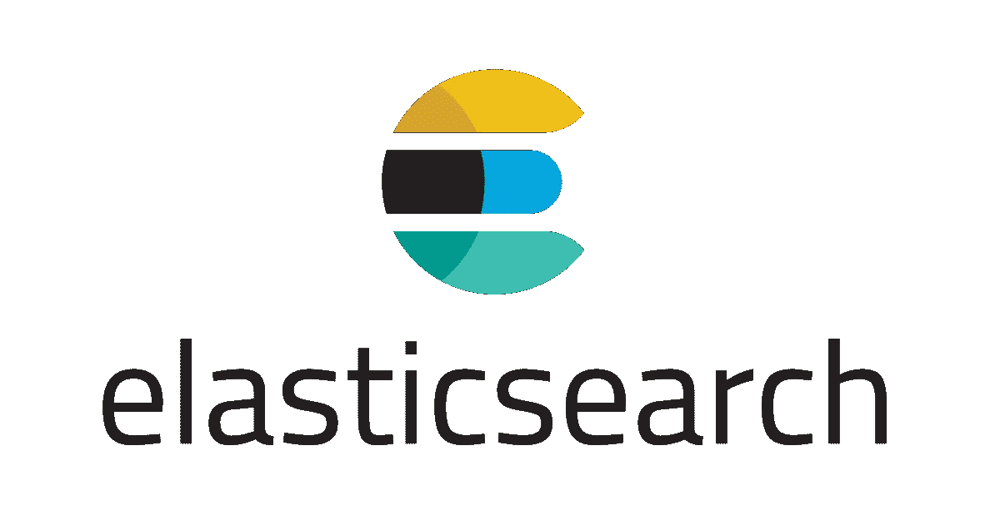

# 以编程方式创建弹性搜索分析器

> 原文：<https://blog.devgenius.io/creating-elasticsearch-analyzers-programmatically-b37fff196ee3?source=collection_archive---------1----------------------->



Elasticsearch(以及底层的 Lucene)在其强大的搜索引擎中提供了强大的文本分析功能。您可以在 Elasticsearch 上选择一个预配置的分析器，或者配置您的自定义分析器来分析文本并获取其标记，甚至不需要配置索引或插入文档。然而，你需要一个 Elasticsearch 实例，还需要进行远程调用(HTTP 或 TCP)来分析文本。

在这篇博文中，我将讨论如何通过编程创建一个定制的分析器，而不需要部署 Elasticsearch。我们所需要的就是在我们的类路径中包含 Elasticsearch 和几行代码。这个实现是用 Kotlin 实现的，但是可以很容易地转换成 Java 或任何 JVM 语言。

# 分析仪成分

在这一点上，重温与 Elasticsearch (Lucene)文本分析器相关的概念可能是有用的。文本分析器由以下组件组成:

*   标记器(强制)
*   字符过滤器列表(可选)
*   令牌过滤器列表(可选)

Elasticsearch 默认提供了各种记号赋予器、字符过滤器和记号过滤器实现。您可以组合它们中的任何一个来创建您的定制分析器或者实现您的分析器。

Tokenizer 是分析器中的核心组件，它将输入文本分解成标记。空白和标准记号赋予器是 Elasticsearch 提供的最流行的两种。

字符过滤器用于在标记器处理文本之前对文本进行预处理。使用字符过滤器，可以删除 HTML 元素(HTML 条形过滤器)或替换某些字符(模式替换过滤器)。

令牌过滤器用于操作由令牌化器生成的令牌。您可以通过应用一系列令牌过滤器，将生成的令牌转换为小写，删除停用词，扩展/减少同义词，执行词干分析或许多其他操作。

如需全面的文档，请访问 [Elasticsearch Reference](https://www.elastic.co/guide/en/elasticsearch/reference/current/analysis-custom-analyzer.html) 。

# 我们的定制分析仪

在本例中，我们将实现一个满足以下要求的定制分析器:

*   HTML 字符被剥离。
*   文本由空格标记。

令牌过滤规则描述为:

*   标记被转换成小写。
*   标记“a”、“an”和“on”被视为停止字，并从输出中删除
*   “blogpost”被认为是同义词，被简化为“Blog post”。

因此输入，*在<b>elastic search</b>"*上的一篇博文被分析为以下令牌:

*   博客帖子
*   弹性搜索

注意，首先过滤 HTML 标签；然后文本被标记化。所有标记都被转换成小写，停用词“a”和“on”被移除，并且“blog post”通过同义词减少被转换成“blogpost”。

# 履行

## 属国

Elasticsearch 应该被添加到依赖项中的类路径中，你可以看到一个如下的 gradle.kts 版本:

```
*implementation*(“org.elasticsearch:elasticsearch:7.8.1”)
```

## 标记器

Elasticsearch Analyzer 中的组件是为每个分析请求创建的。出于这个原因，分析器不是由组件本身组成，而是由负责实例化这些组件的工厂组成。

下面你可以看到一个记号赋予器工厂是如何作为一个匿名对象被创建的。

## 字符过滤器

与 TokenizerFactory 类似，我们创建一个 CharFilterFactory 对象数组。在下面的示例中，您可以看到如何创建这样的数组，以及如何添加 HTMLStripCharFilter 的工厂。

## 令牌过滤器

与字符筛选器类似，必须为自定义分析器创建一个 TokenFilterFactory 对象数组。在下面的代码中，您可以看到小写过滤器、停用词过滤器和同义词过滤器的工厂是如何创建的。

对于停用词和同义词，请注意我们在过滤器中硬编码停用词和同义词词典。

## 将它们结合在一起

一旦我们创建了记号赋予器和过滤器工厂，我们就可以将它们组合起来创建我们的定制分析器，如下所示:

## 调用分析器

创建分析器之后，您可以看到如何使用它将文本分解成标记。

内部分析器组件的工作类似于[责任链](https://en.wikipedia.org/wiki/Chain-of-responsibility_pattern)，每个令牌都被传递给链中的下一个组件。在每次递增( *incrementToken()* )时，分析器链提取并使用下一个令牌。在链的末端，分析器链已经设置了一组属性。在上面的例子中，我们提取 CharTermAttribute(即:令牌的文本)并添加到我们的结果列表中。也有可能提取其他信息，如位置信息等。从代币上。

当所有的令牌都被消耗掉后，我们就可以返回我们分析过的令牌列表了。

下面您可以看到一个单元测试中的分析器调用示例:

# 摘要

在本文中，我们讨论了如何在不部署 Elasticsearch 集群的情况下以编程方式实现 Elasticsearch/Lucene 分析器。为此，我们手动配置了一个 Tokenizer、一组 CharFilterFactory 和 TokenFilter 实例来创建一个分析器，并将文本分析作为一种方法公开。你可以在这个 github [repo](https://github.com/itasyurt/elastic7-analyzers) 中找到完整的源代码。