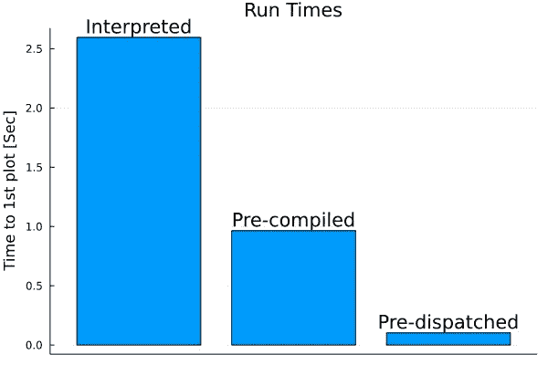

# 通过在测试期间调度来创建快速运行的 Julia 可执行文件。

> 原文：<https://blog.devgenius.io/creating-fast-running-julia-executables-by-dispatching-during-testing-de56301d2bf1?source=collection_archive---------12----------------------->

作者:@jmmshn



与 Python 这样的解释语言相比，Julia 的主要优势之一是编译代码的执行速度更快。虽然编译代码的执行速度更快，但 Julia 的实时(JIT)编译行为(这使得这种神奇的事情成为可能)导致了比解释语言更长的“首次绘图时间”。在本教程中，我们将详细介绍设置 Julia 代码的预编译可执行文件的步骤，与直接在 Julia 解释器中运行代码相比，它可以快 20 倍。

本教程将使用朱莉娅·REPL 和 bash 终端。朱莉娅·REPL 的代码将遵循一个`julia>`提示，bash 终端的代码将遵循一个`%`提示。

首先，我们必须用`PkgTemplates`建立代码的框架。导航到你想工作的目录，启动一个朱莉娅·REPL。从朱莉娅·REPL，确保安装了`PkgTemplates`:

```
julia> using Pkg; Pkg.add("PkgTemplates")
```

安装 PkgTemplates 后，使用以下命令加载它:

```
using PkgTemplates
```

一个`Template`对象可以使用朱莉娅·REPL 交互式创建，我们想要提供的字段可以通过按`Enter`来选择。按`d`确认字段开始填写所需信息:

```
julia> tpl = Template(interactive=true)("MyPkg")
Template keywords to customize:
[press: d=done, a=all, n=none]
   [X] user
   [X] authors
 > [X] dir
   [ ] host
   [ ] julia
   [ ] plugins
Enter value for 'user' (String, required): myname
Enter value for 'authors' (Vector{String}, comma-delimited, default="myname <myname[@gmail.com](mailto:jmmshn@gmail.com)> and contributors"):
Enter value for 'dir' (String, default="~/.julia/dev"): ./
```

在这个基本示例中，创建一个名为`MyPkg`的新包，并用个人信息修改`user`和`authors`字段。当提示`dir`字段时，用`./`回复，将包作为子目录放在当前文件夹中。之后，检查`MyPkg`子目录是否填充了以下内容(在 Linux 中使用`tree`命令显示):

您可以通过确认`./Manifest.toml`文件已创建来确认环境已创建。创建子目录后，使用`cd`在子目录中导航，并使用`pwd`确认您位于 MyPkg 子目录中:

```
julia> cd("MyPkg"); pwd()
"/home/myname/repos/working_dir/MyPkg"
```

从这个目录中，我们可以激活当前目录中的 Julia 环境，并安装本教程剩余部分所需的惟一依赖项(`UnicodePlots`)。

```
julia> Pkg.activate("./"); Pkg.add("UnicodePlots")
```

在本教程的剩余部分，我们将从这里运行所有的命令，打开 bash 终端并导航到同一个`MyPkg`目录也会有所帮助。您可以通过检查`./Manifest.toml`来确认软件包已经安装，并确保它已经用新的软件包进行了更新。

在`./src/MyPkg.jl`文件中，我们将用下面的简单代码替换模板代码:

注意这里的`MyPkg.julia_main()`是最终可执行文件中调用的函数的默认名称。注意，返回类型必须被指定为`Cint`，这样函数才能被正确调度。该函数将读取第一个命令行参数，并在模块内部调用相应的函数。

有了源代码，我们已经可以看到它作为一个标准的 Julia 脚本的表现了。这可以通过在终端中发出以下命令来实现:

```
% time julia --project="./" -e \
"using MyPkg; MyPkg.julia_main()" helloHello, from MyPkg!
julia --project="./" -e "using MyPkg; MyPkg.julia_main()" hello  1.68s user 0.48s system 131% cpu **1.579** total
```

这里，我们将短程序`using MyPkg; MyPkg.julia_main()`作为 Julia 脚本运行，并将`hello`作为唯一的参数，并使用 Linux 程序`time`来检查性能。为了获得正确的时间度量，我们应该发出几次命令，因为第一次运行包含定制代码的 Julia 包会产生少量开销。我们可以用`plot`作为参数来检查同一个脚本的运行时间:

```
% time julia --project="./" -e "using MyPkg; MyPkg.julia_main()" plot
      ⡤⠤⠤⠤⠤⠤⠤⠤⠤⠤⠤⠤⠤⠤⠤⠤⠤⠤⠤⠤⠤⠤⠤⠤⠤⠤⠤⠤⠤⠤⠤⠤⠤⠤⠤⠤⠤⠤⠤⠤⠤⢤
    1 ⡇⠀⠀⠀⠀⠀⠀⡰⠊⠉⠉⠑⢄⠀⠀⠀⠀⠀⠀⠀⠀⠀⠀⠀⠀⠀⠀⠀⠀⠀⠀⠀⠀⠀⠀⠀⠀⠀⠀⠀⠀⢸
      ⡇⠀⠀⠀⠀⢀⠎⠀⠀⠀⠀⠀⠈⢢⡀⠀⠀⠀⠀⠀⠀⠀⠀⠀⠀⠀⠀⠀⠀⠀⠀⠀⠀⠀⠀⠀⠀⠀⠀⠀⠀⢸
      ⡇⠀⠀⠀⢠⠊⠀⠀⠀⠀⠀⠀⠀⠀⠑⡄⠀⠀⠀⠀⠀⠀⠀⠀⠀⠀⠀⠀⠀⠀⠀⠀⠀⠀⠀⠀⠀⠀⠀⠀⠀⢸
      ⡇⠀⠀⢀⠏⠀⠀⠀⠀⠀⠀⠀⠀⠀⠀⠹⡀⠀⠀⠀⠀⠀⠀⠀⠀⠀⠀⠀⠀⠀⠀⠀⠀⠀⠀⠀⠀⠀⠀⠀⠀⢸
      ⡇⠀⠀⡞⠀⠀⠀⠀⠀⠀⠀⠀⠀⠀⠀⠀⢳⠀⠀⠀⠀⠀⠀⠀⠀⠀⠀⠀⠀⠀⠀⠀⠀⠀⠀⠀⠀⠀⠀⠀⠀⢸
      ⡇⠀⡜⠀⠀⠀⠀⠀⠀⠀⠀⠀⠀⠀⠀⠀⠀⢣⠀⠀⠀⠀⠀⠀⠀⠀⠀⠀⠀⠀⠀⠀⠀⠀⠀⠀⠀⠀⠀⠀⠀⢸
      ⡇⢰⠁⠀⠀⠀⠀⠀⠀⠀⠀⠀⠀⠀⠀⠀⠀⠈⡆⠀⠀⠀⠀⠀⠀⠀⠀⠀⠀⠀⠀⠀⠀⠀⠀⠀⠀⠀⠀⠀⠀⢸
      ⡇⠧⠤⠤⠤⠤⠤⠤⠤⠤⠤⠤⠤⠤⠤⠤⠤⠤⠼⡤⠤⠤⠤⠤⠤⠤⠤⠤⠤⠤⠤⠤⠤⠤⠤⠤⢤⠤⠤⠤⠤⢸
      ⡇⠀⠀⠀⠀⠀⠀⠀⠀⠀⠀⠀⠀⠀⠀⠀⠀⠀⠀⠱⡀⠀⠀⠀⠀⠀⠀⠀⠀⠀⠀⠀⠀⠀⠀⢀⠇⠀⠀⠀⠀⢸
      ⡇⠀⠀⠀⠀⠀⠀⠀⠀⠀⠀⠀⠀⠀⠀⠀⠀⠀⠀⠀⢣⠀⠀⠀⠀⠀⠀⠀⠀⠀⠀⠀⠀⠀⠀⡎⠀⠀⠀⠀⠀⢸
      ⡇⠀⠀⠀⠀⠀⠀⠀⠀⠀⠀⠀⠀⠀⠀⠀⠀⠀⠀⠀⠈⢆⠀⠀⠀⠀⠀⠀⠀⠀⠀⠀⠀⠀⡜⠀⠀⠀⠀⠀⠀⢸
      ⡇⠀⠀⠀⠀⠀⠀⠀⠀⠀⠀⠀⠀⠀⠀⠀⠀⠀⠀⠀⠀⠈⡆⠀⠀⠀⠀⠀⠀⠀⠀⠀⠀⡰⠁⠀⠀⠀⠀⠀⠀⢸
      ⡇⠀⠀⠀⠀⠀⠀⠀⠀⠀⠀⠀⠀⠀⠀⠀⠀⠀⠀⠀⠀⠀⠈⡆⠀⠀⠀⠀⠀⠀⠀⠀⡰⠁⠀⠀⠀⠀⠀⠀⠀⢸
      ⡇⠀⠀⠀⠀⠀⠀⠀⠀⠀⠀⠀⠀⠀⠀⠀⠀⠀⠀⠀⠀⠀⠀⠈⢢⠀⠀⠀⠀⠀⠀⡔⠁⠀⠀⠀⠀⠀⠀⠀⠀⢸
   -1 ⡇⠀⠀⠀⠀⠀⠀⠀⠀⠀⠀⠀⠀⠀⠀⠀⠀⠀⠀⠀⠀⠀⠀⠀⠀⠑⢄⣀⣀⡠⠎⠀⠀⠀⠀⠀⠀⠀⠀⠀⠀⢸
      ⠓⠒⠒⠒⠒⠒⠒⠒⠒⠒⠒⠒⠒⠒⠒⠒⠒⠒⠒⠒⠒⠒⠒⠒⠒⠒⠒⠒⠒⠒⠒⠒⠒⠒⠒⠒⠒⠒⠒⠒⠒⠚
      ⠀0⠀⠀⠀⠀⠀⠀⠀⠀⠀⠀⠀⠀⠀⠀⠀⠀⠀⠀⠀⠀⠀⠀⠀⠀⠀⠀⠀⠀⠀⠀⠀⠀⠀⠀⠀⠀⠀⠀7⠀
julia --project="./" -e "using MyPkg; MyPkg.julia_main()" plot  2.60s user 0.52s system 120% cpu **2.596** total
```

查看`total`运行时间，我们看到将`julia_main`中的代码作为脚本运行只需要不到 1.5 秒的时间来运行`hello`参数，而使用`plot`参数运行的时间几乎是前者的两倍。

使用`PackageCompiler`我们可以将 Julia 环境的整个状态转换成二进制文件，直到调用`julia_main`函数，这将在`app`子目录中创建一个可执行文件:

```
julia> using PackageCompiler; PackageCompiler.create_app("./", "app")
```

这里要注意的是，`incremental=true`标志意味着你不必每次都从头开始，这样可以大大加快编译二进制文件的速度。编译完成后，您应该会在`./app/bin/MyPkg`看到一个可执行文件

```
time ./app/bin/MyPkg hello
Hello, from MyPkg!
./app/bin/MyPkg hello  0.33s user 0.43s system 319% cpu **0.238** total
```

你好

```
% time ./app/bin/MyPkg plot
      ⡤⠤⠤⠤⠤⠤⠤⠤⠤⠤⠤⠤⠤⠤⠤⠤⠤⠤⠤⠤⠤⠤⠤⠤⠤⠤⠤⠤⠤⠤⠤⠤⠤⠤⠤⠤⠤⠤⠤⠤⠤⢤
    1 ⡇⠀⠀⠀⠀⠀⠀⡰⠊⠉⠉⠑⢄⠀⠀⠀⠀⠀⠀⠀⠀⠀⠀⠀⠀⠀⠀⠀⠀⠀⠀⠀⠀⠀⠀⠀⠀⠀⠀⠀⠀⢸
      ⡇⠀⠀⠀⠀⢀⠎⠀⠀⠀⠀⠀⠈⢢⡀⠀⠀⠀⠀⠀⠀⠀⠀⠀⠀⠀⠀⠀⠀⠀⠀⠀⠀⠀⠀⠀⠀⠀⠀⠀⠀⢸
      ⡇⠀⠀⠀⢠⠊⠀⠀⠀⠀⠀⠀⠀⠀⠑⡄⠀⠀⠀⠀⠀⠀⠀⠀⠀⠀⠀⠀⠀⠀⠀⠀⠀⠀⠀⠀⠀⠀⠀⠀⠀⢸
      ⡇⠀⠀⢀⠏⠀⠀⠀⠀⠀⠀⠀⠀⠀⠀⠹⡀⠀⠀⠀⠀⠀⠀⠀⠀⠀⠀⠀⠀⠀⠀⠀⠀⠀⠀⠀⠀⠀⠀⠀⠀⢸
      ⡇⠀⠀⡞⠀⠀⠀⠀⠀⠀⠀⠀⠀⠀⠀⠀⢳⠀⠀⠀⠀⠀⠀⠀⠀⠀⠀⠀⠀⠀⠀⠀⠀⠀⠀⠀⠀⠀⠀⠀⠀⢸
      ⡇⠀⡜⠀⠀⠀⠀⠀⠀⠀⠀⠀⠀⠀⠀⠀⠀⢣⠀⠀⠀⠀⠀⠀⠀⠀⠀⠀⠀⠀⠀⠀⠀⠀⠀⠀⠀⠀⠀⠀⠀⢸
      ⡇⢰⠁⠀⠀⠀⠀⠀⠀⠀⠀⠀⠀⠀⠀⠀⠀⠈⡆⠀⠀⠀⠀⠀⠀⠀⠀⠀⠀⠀⠀⠀⠀⠀⠀⠀⠀⠀⠀⠀⠀⢸
      ⡇⠧⠤⠤⠤⠤⠤⠤⠤⠤⠤⠤⠤⠤⠤⠤⠤⠤⠼⡤⠤⠤⠤⠤⠤⠤⠤⠤⠤⠤⠤⠤⠤⠤⠤⠤⢤⠤⠤⠤⠤⢸
      ⡇⠀⠀⠀⠀⠀⠀⠀⠀⠀⠀⠀⠀⠀⠀⠀⠀⠀⠀⠱⡀⠀⠀⠀⠀⠀⠀⠀⠀⠀⠀⠀⠀⠀⠀⢀⠇⠀⠀⠀⠀⢸
      ⡇⠀⠀⠀⠀⠀⠀⠀⠀⠀⠀⠀⠀⠀⠀⠀⠀⠀⠀⠀⢣⠀⠀⠀⠀⠀⠀⠀⠀⠀⠀⠀⠀⠀⠀⡎⠀⠀⠀⠀⠀⢸
      ⡇⠀⠀⠀⠀⠀⠀⠀⠀⠀⠀⠀⠀⠀⠀⠀⠀⠀⠀⠀⠈⢆⠀⠀⠀⠀⠀⠀⠀⠀⠀⠀⠀⠀⡜⠀⠀⠀⠀⠀⠀⢸
      ⡇⠀⠀⠀⠀⠀⠀⠀⠀⠀⠀⠀⠀⠀⠀⠀⠀⠀⠀⠀⠀⠈⡆⠀⠀⠀⠀⠀⠀⠀⠀⠀⠀⡰⠁⠀⠀⠀⠀⠀⠀⢸
      ⡇⠀⠀⠀⠀⠀⠀⠀⠀⠀⠀⠀⠀⠀⠀⠀⠀⠀⠀⠀⠀⠀⠈⡆⠀⠀⠀⠀⠀⠀⠀⠀⡰⠁⠀⠀⠀⠀⠀⠀⠀⢸
      ⡇⠀⠀⠀⠀⠀⠀⠀⠀⠀⠀⠀⠀⠀⠀⠀⠀⠀⠀⠀⠀⠀⠀⠈⢢⠀⠀⠀⠀⠀⠀⡔⠁⠀⠀⠀⠀⠀⠀⠀⠀⢸
   -1 ⡇⠀⠀⠀⠀⠀⠀⠀⠀⠀⠀⠀⠀⠀⠀⠀⠀⠀⠀⠀⠀⠀⠀⠀⠀⠑⢄⣀⣀⡠⠎⠀⠀⠀⠀⠀⠀⠀⠀⠀⠀⢸
      ⠓⠒⠒⠒⠒⠒⠒⠒⠒⠒⠒⠒⠒⠒⠒⠒⠒⠒⠒⠒⠒⠒⠒⠒⠒⠒⠒⠒⠒⠒⠒⠒⠒⠒⠒⠒⠒⠒⠒⠒⠒⠚
      ⠀0⠀⠀⠀⠀⠀⠀⠀⠀⠀⠀⠀⠀⠀⠀⠀⠀⠀⠀⠀⠀⠀⠀⠀⠀⠀⠀⠀⠀⠀⠀⠀⠀⠀⠀⠀⠀⠀⠀7⠀
./app/bin/MyPkg plot  0.93s user 0.41s system 164% cpu **0.965** total
```

我们可以看到，对于，我们在`hello`获得了很小的性能提升(从 **1.579** → **0.238** 秒)，但是对于`parse`参数，性能提升非常显著(从 **2.596** → **0.965** 秒)。虽然这令人印象深刻，但它似乎没有达到 Julia 承诺的“读起来像 python，运行起来像 C++”的要求。这里的问题是内核在每次可执行文件被调用时都要重新启动，并且在下一次调用可执行文件时不能访问在调用`julia_main`时创建的 JIT 编译的对象。所以在某种意义上，即使我们的代码使用`PackageCompiler`预编译，方法仍然没有被“分派”,所以当可执行文件被调用时，有一个 Julia 代码表示但是没有可用的机器代码。关于调度工作的更多信息，请阅读[文档](https://docs.julialang.org/en/v1/manual/methods/)。

由于 Julia 只在执行过程中遇到特定的调用签名后才真正编译代码，所以我们只需确保在创建可执行文件之前至少调用一次我们包中的函数。`PackageCompiler`通过`precompile_execution_file`标志允许这种确切的用法，它运行指定的 Julia 脚本，以便在创建可执行文件之前生成所有的 JIT 代码。虽然这可以是任何一个 Julia 脚本，但是这里一个明显的选择是使用由`PkgTemplates`创建的`runtests.jl`脚本，它可以作为单元测试和预编译脚本。在我们的示例中，我们可以将以下基本测试放在`runtests.jl`文件中:

然后，我们可以运行测试，以确保一切工作正常:

```
julia> Pkg.test()
```

现在可以创建一个完全预调度版本的应用程序，并将其放在一个名为`app_pc`的文件夹中。

```
julia> PackageCompiler.create_app("./", "app_pc", precompile_execution_file="./test/runtests.jl")
```

现在，我们可以对更新后的应用进行计时，以查看性能差异。

对于基本的`hello`选项，预调度代码在 **0.097** 秒内完成运行。

```
% time ./app_pc/bin/MyPkg helloHello, from MyPkg!
./app_pc/bin/MyPkg hello  0.09s user 0.06s system 106% cpu **0.097** total
```

对于更复杂的`plot`选项，预调度代码在 **0.103** 秒内运行。

```
time ./app_pc/bin/MyPkg plot
      ⡤⠤⠤⠤⠤⠤⠤⠤⠤⠤⠤⠤⠤⠤⠤⠤⠤⠤⠤⠤⠤⠤⠤⠤⠤⠤⠤⠤⠤⠤⠤⠤⠤⠤⠤⠤⠤⠤⠤⠤⠤⢤
    1 ⡇⠀⠀⠀⠀⠀⠀⡰⠊⠉⠉⠑⢄⠀⠀⠀⠀⠀⠀⠀⠀⠀⠀⠀⠀⠀⠀⠀⠀⠀⠀⠀⠀⠀⠀⠀⠀⠀⠀⠀⠀⢸
      ⡇⠀⠀⠀⠀⢀⠎⠀⠀⠀⠀⠀⠈⢢⡀⠀⠀⠀⠀⠀⠀⠀⠀⠀⠀⠀⠀⠀⠀⠀⠀⠀⠀⠀⠀⠀⠀⠀⠀⠀⠀⢸
      ⡇⠀⠀⠀⢠⠊⠀⠀⠀⠀⠀⠀⠀⠀⠑⡄⠀⠀⠀⠀⠀⠀⠀⠀⠀⠀⠀⠀⠀⠀⠀⠀⠀⠀⠀⠀⠀⠀⠀⠀⠀⢸
      ⡇⠀⠀⢀⠏⠀⠀⠀⠀⠀⠀⠀⠀⠀⠀⠹⡀⠀⠀⠀⠀⠀⠀⠀⠀⠀⠀⠀⠀⠀⠀⠀⠀⠀⠀⠀⠀⠀⠀⠀⠀⢸
      ⡇⠀⠀⡞⠀⠀⠀⠀⠀⠀⠀⠀⠀⠀⠀⠀⢳⠀⠀⠀⠀⠀⠀⠀⠀⠀⠀⠀⠀⠀⠀⠀⠀⠀⠀⠀⠀⠀⠀⠀⠀⢸
      ⡇⠀⡜⠀⠀⠀⠀⠀⠀⠀⠀⠀⠀⠀⠀⠀⠀⢣⠀⠀⠀⠀⠀⠀⠀⠀⠀⠀⠀⠀⠀⠀⠀⠀⠀⠀⠀⠀⠀⠀⠀⢸
      ⡇⢰⠁⠀⠀⠀⠀⠀⠀⠀⠀⠀⠀⠀⠀⠀⠀⠈⡆⠀⠀⠀⠀⠀⠀⠀⠀⠀⠀⠀⠀⠀⠀⠀⠀⠀⠀⠀⠀⠀⠀⢸
      ⡇⠧⠤⠤⠤⠤⠤⠤⠤⠤⠤⠤⠤⠤⠤⠤⠤⠤⠼⡤⠤⠤⠤⠤⠤⠤⠤⠤⠤⠤⠤⠤⠤⠤⠤⠤⢤⠤⠤⠤⠤⢸
      ⡇⠀⠀⠀⠀⠀⠀⠀⠀⠀⠀⠀⠀⠀⠀⠀⠀⠀⠀⠱⡀⠀⠀⠀⠀⠀⠀⠀⠀⠀⠀⠀⠀⠀⠀⢀⠇⠀⠀⠀⠀⢸
      ⡇⠀⠀⠀⠀⠀⠀⠀⠀⠀⠀⠀⠀⠀⠀⠀⠀⠀⠀⠀⢣⠀⠀⠀⠀⠀⠀⠀⠀⠀⠀⠀⠀⠀⠀⡎⠀⠀⠀⠀⠀⢸
      ⡇⠀⠀⠀⠀⠀⠀⠀⠀⠀⠀⠀⠀⠀⠀⠀⠀⠀⠀⠀⠈⢆⠀⠀⠀⠀⠀⠀⠀⠀⠀⠀⠀⠀⡜⠀⠀⠀⠀⠀⠀⢸
      ⡇⠀⠀⠀⠀⠀⠀⠀⠀⠀⠀⠀⠀⠀⠀⠀⠀⠀⠀⠀⠀⠈⡆⠀⠀⠀⠀⠀⠀⠀⠀⠀⠀⡰⠁⠀⠀⠀⠀⠀⠀⢸
      ⡇⠀⠀⠀⠀⠀⠀⠀⠀⠀⠀⠀⠀⠀⠀⠀⠀⠀⠀⠀⠀⠀⠈⡆⠀⠀⠀⠀⠀⠀⠀⠀⡰⠁⠀⠀⠀⠀⠀⠀⠀⢸
      ⡇⠀⠀⠀⠀⠀⠀⠀⠀⠀⠀⠀⠀⠀⠀⠀⠀⠀⠀⠀⠀⠀⠀⠈⢢⠀⠀⠀⠀⠀⠀⡔⠁⠀⠀⠀⠀⠀⠀⠀⠀⢸
   -1 ⡇⠀⠀⠀⠀⠀⠀⠀⠀⠀⠀⠀⠀⠀⠀⠀⠀⠀⠀⠀⠀⠀⠀⠀⠀⠑⢄⣀⣀⡠⠎⠀⠀⠀⠀⠀⠀⠀⠀⠀⠀⢸
      ⠓⠒⠒⠒⠒⠒⠒⠒⠒⠒⠒⠒⠒⠒⠒⠒⠒⠒⠒⠒⠒⠒⠒⠒⠒⠒⠒⠒⠒⠒⠒⠒⠒⠒⠒⠒⠒⠒⠒⠒⠒⠚
      ⠀0⠀⠀⠀⠀⠀⠀⠀⠀⠀⠀⠀⠀⠀⠀⠀⠀⠀⠀⠀⠀⠀⠀⠀⠀⠀⠀⠀⠀⠀⠀⠀⠀⠀⠀⠀⠀⠀⠀7⠀
./app_pc/bin/MyPkg plot  0.11s user 0.06s system 121% cpu **0.103** total
```

这些都是非常简单的函数，与作为脚本运行相比，当这些函数被预先调度时，性能提高了 20 倍以上！！对于调度结构更复杂的更复杂的包，潜在的性能增益甚至会更大。