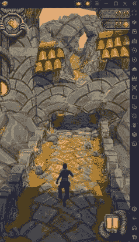
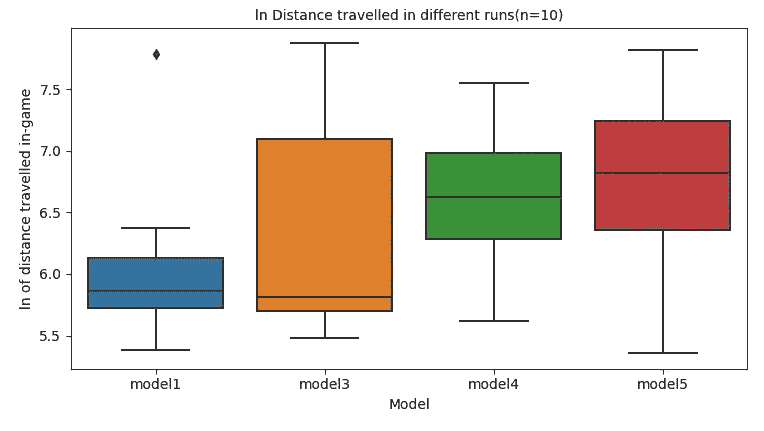
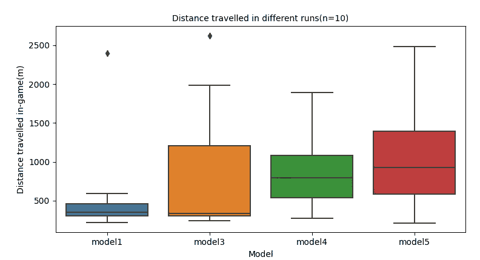

# 使用监督模仿学习创建游戏人工智能

> 原文：<https://blog.devgenius.io/creating-game-ai-using-supervised-imitation-learning-c8aaf1e357bd?source=collection_archive---------20----------------------->

## 用深度学习玩神庙逃亡 2

使用一个简单的卷积神经网络，我创建了一个可以在 Temple Run 2 中实现 2000+米跑的 AI。这绝对是简单卷积神经网络的一个不常见的应用。如果你对这个项目有任何疑问，欢迎在评论中提问。

## 什么是神庙逃亡 2？

Temple run 2 是一款无限跑者游戏，玩家必须跳跃、闪避并向左/右转弯以克服障碍。

# 什么是监督模仿学习？

“我想教一个神经网络玩神庙逃亡”

这是典型的强化学习任务，但是̶i̶̶h̶a̶v̶e̶̶n̶o̶̶i̶d̶e̶a̶̶h̶o̶w̶̶r̶e̶i̶n̶f̶o̶r̶c̶e̶m̶e̶n̶t̶̶l̶e̶a̶r̶n̶i̶n̶g̶̶w̶o̶r̶k̶s̶，我们也可以把它重新表述为监督学习任务。

模仿学习是当一个模型看到另一个实体执行一项任务(例如，一个人玩视频游戏)，并学习预测该实体将采取的行动，有效地“模仿”该实体的行为。

例如在 OpenAI 的这个[帖子](https://openai.com/blog/vpt/)中，一个模型根据游戏的几帧画面预测了游戏中玩家的行为*《我的世界》*，让模型模仿人类的行为。

在 Temple Run 的上下文中，我决定训练一个模型来预测玩家是否应该跳跃、闪避、左转、右转等。基于游戏的单个框架。我收集了许多障碍物的数据，并给它们贴上了相应的标签。

这一帧被标记为“w ”,表示鸭子，表示玩家应该在这一点上低头。

在监督模仿学习之后，该模型通常会在真实的游戏场景中进行微调。然而，我并没有在这个项目中追求这一点。

# 技术设置

项目的总体设置如下:

*   我用了一个 android 模拟器 Bluestacks 来玩《神庙逃亡》
*   我用 pyautogui 与电脑进行交互，并对游戏进行截图。
*   我在 pytorch 训练我的模特。

# 型号选择

对于我的模型，我决定使用预先训练的 Shufflenet V2 模型进行迁移学习。

这款机型针对速度进行了优化，专为移动设备设计。因此，它可以在一秒钟内实时做出许多预测，非常适合我的项目。

由于我的训练数据有限，我使用了一个预训练的模型，并进行了一些迁移学习，教它对我收集的数据集中的图像进行分类。

# 主要问题

我在训练模型时遇到了一些问题

## 过度拟合

特别是对于小数据集，过度拟合是一个问题。

我使用了以下方法来处理过度拟合

*   对训练图像应用随机变换
*   使用批处理规范化(已经存在于模型架构中)
*   收集更多训练数据
*   切换到更小的 Shufflenet 0.5x 型号，以获得更简单的架构

然而，我最想优化的是准确性，因为当面对游戏中的障碍时，模型会因为做出错误的决定而受到严重惩罚。因此，我会允许一些过度拟合发生。

## 不平衡障碍等级

在每个类别中(如跳跃)，有许多不同类别的障碍(如有缺口的桥，不同种类的墙等)。)

当在游戏中运行模型时，我很快注意到它似乎在与特定的障碍进行斗争。我推测，这是因为在训练数据中很少有这些障碍的图像，如果模型有点过度拟合，这些障碍就会不成比例地出现。

我对这个问题的解决方案是手动收集更多模型遇到的障碍的数据，以平衡这些类别。

在游戏的某些部分，玩家进入矿车或河流，障碍会完全改变。这些部分出现的概率很低，因此我缺乏这些部分的训练数据，当它们出现在游戏中时，模型几乎总是会死亡。

## 数据的概化

当赛跑者继续跑时，游戏改变速度。所以随着游戏的进行，跳跃的时机是不一样的。这是我的模型无法预料的问题，它降低了它的准确性，因为它一次只能查看一帧，并且没有办法判断游戏的速度。

为了减轻这个问题的影响，我从游戏的早期收集了更多的数据，以保证模型有良好的平均时间。因此，根据早期和晚期游戏数据训练的模型的早期迭代有很高的概率在早期死亡，但也能够设定高分。这些模型是在我注意到这个问题之前创建的。

后来的迭代更关注早期的游戏和获得像样的平均分数。我平衡了一下数据集，增加了更多早期游戏的数据。

# 最终的模型

对于每个模型，我运行了 10 次，并绘制了结果。

我使用 log distance(每次跑步的 ln 距离)作为我的性能指标。这是因为游戏随着时间的推移而加速，所以游戏中后来的 500 米比游戏中早些时候的 500 米快得多(并且障碍更少)。

然而，我在这里也包括了行程距离图。

(注意，除了这些记录的运行，我还在测试期间多次观察了这些模型的性能)

第一个模型是根据一些数据天真地创建和训练的。它通常跑<500m, but occasionally, and I mean *非常*偶尔，达到 2000 米以上的成绩。几乎没有中间环节。

第二个模型(模型 3)使用许多技术来处理过拟合，并使用与模型 1 相同的数据集。它表现类似，但现在有一些运行在 500 和 2000 米之间。

第三个模型(模型 4)在更多的早期游戏训练数据上被训练。它有更好的平均跑步距离，但无法达到令人印象深刻的(> 2000 米)跑步。总的来说，这个模型并没有给我留下深刻的印象。与其他 x1.0 型号相比，这个型号也是一个 Shufflenetx0.5，所以较小的型号架构可能影响了它在游戏中的性能。

在最终的模型(模型 5)中，我增加了一些游戏后期的数据，平衡了一些障碍等级。我还将该模型恢复为 Shufflenet x1.0。该模型能够获得更好的平均时间，也可以接近 2000 米。但从未超过 2000m。

# 结论

完整的文章和代码可以在[这里](https://github.com/dungwoong/Temple-Run-AI/blob/main/TempleRun%20Writeup.pdf)找到。目前，我计划通过创建一个可以同时查看游戏的多个帧的模型来扩展这个项目。

在真实的游戏场景中看到一个分类模型的表现是令人瞩目的，并且令人鼓舞的是发现它可以很好地通过障碍。总的来说，我对问题有了更好的理解，并且在追求这个项目后对 ConvNets 有了更好的理解。

如果您有任何问题，请不要犹豫地问，因为它们可能会帮助我扩展项目。