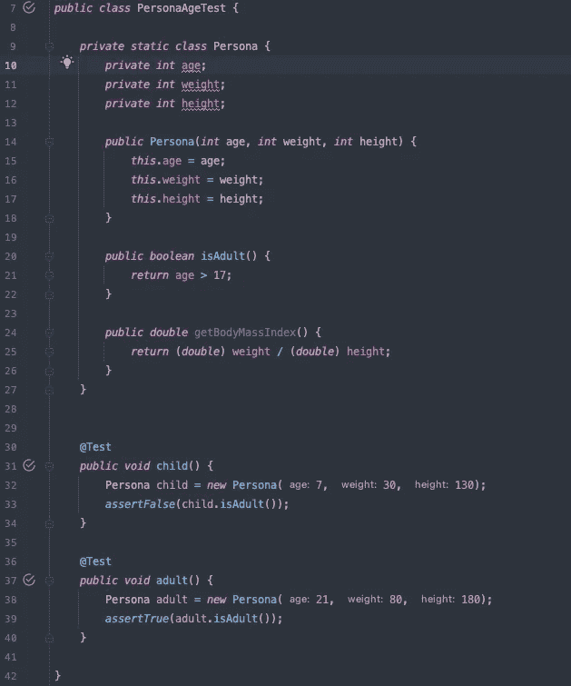
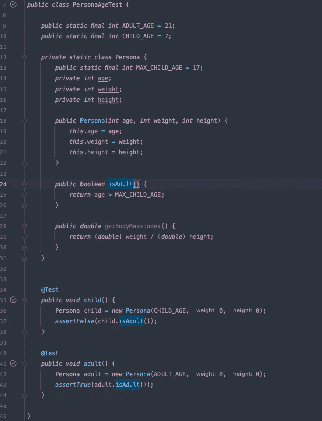

# 创建良好的代码文档

> 原文：<https://blog.devgenius.io/creating-good-code-documentation-eaa614cb489f?source=collection_archive---------2----------------------->

我认为测试是文档，它们是一个软件所做的活的例子。但是好的文档需要谈论相关的细节，避免无关的细节，以免让读者不知所措。

除了其他特征之外，测试是我们代码的一个很好的文档。它们是我们自己或我们的管道非常频繁地编译、运行和评估的代码的活生生的例子。失败的测试是出错的信号，我们必须修复失败的原因，这迫使我们更新文档或代码。测试可以是不相关的(因为其他测试)，它们可能难以阅读，但它们不会说谎。这就是为什么我们必须对抗[片状剥落](/flakiness-in-tests-b586c056e0a8?sk=22ad01266811dbe0f43f4aa997ac26e1)，我们不能信任的测试是无用的。

测试实际上是为我们的 SUT(测试中的服务)定义的一个假设场景，以及当我们运行我们的 SUT 时，在该条件下应该发生什么的一组断言。我们的 SUT 由我们的测试认证，但是我们的 SUT 也证明我们在这些测试中可以信任多少。
生产代码决定测试通过或失败，所以如果所有这些测试都通过了，如果它们是绿色的，它们就是我们代码如何工作的完美例子。
这就是为什么我称它们为 live documentation，代码和测试有一种亲密的信任关系。我们可以信任它们中的每一个，因为另一部分会验证它。

最好的文档是代码，测试是代码。如果我们不理解一段代码，而我们有测试，让我们试着用它们来理解它。我们可以读取测试，执行测试，调试测试，甚至创建新的测试来验证我们对代码的假设。

这给了我们测试的另一个维度，我们应该创建测试来记录我们的代码。

## 命名测试

我们说过一个测试应该覆盖一个场景，所以让我们用那个场景来命名我们的代码。我知道有一种倾向，将测试命名为:

“yyyy 的时候应该 xxx”

我并不反对，但我认为更重要的是定义我们试图涵盖的场景，应该发生什么写在断言中。在这种情况下，我更喜欢将测试命名为“yyyy”。你可以说如果在 SUT 下有多种行为要测试会发生什么，如何理解我们覆盖哪一个？。这与我们如何对测试进行分组有关，我不喜欢按语言的类或单元来创建测试，我更喜欢按行为对测试进行分组。我还认为，这有助于理解我们想要实现的目标，而不管这些单元是如何相互通信的。

通过这种方式，我们可以折叠所有的测试，只关注测试本身所覆盖的场景，阅读它们，这将会给我们一个被测代码正在做什么的总体概念。

## 测试中的细节

有两种类型的细节，相关和不相关的细节。相关的细节是我需要在断言和我的 SUT 的输入之间进行匹配，以理解测试在做什么。

不相关的细节是那些因为与我的测试无关的其他原因而出现的细节。
例如，在这段代码中:

我们测试的行为与“isAdult”方法相关，我们测试的唯一重要值是“年龄”，“体重”和“身高”与我们的测试无关。
但也与 18 岁以上或 18 岁以下的任何年龄无关。因此，年龄是相关的，但在满足这一条件时，价值本身是无关紧要的。
那么这个呢:

在第二个选项中，我们为体重和身高设置了一个虚拟值。这是一个无关紧要的细节，但我也决定用 0。
[我一直建议使用空值作为有效的虚拟值](https://blog.thecodewhisperer.com/permalink/null-design-tool)。空值是有害的，但是在这种情况下，它们是很好的虚拟值，用来证明没有人使用这些值。我喜欢用非常假的值来标记不相关的细节的想法，这样我们就可以决定我们是否需要为那个行为重构代码。
我想回答本代码读者的问题是:这是否遵循了接口隔离原则？。通常我也是读者，所以这标志着我以后在重构的时候应该看哪里。但是如果我认为这样很好，我会让另一个人考虑并决定，甚至讨论为什么要违背这个原则。

在前面的例子中，“儿童年龄”和“成人年龄”是相关的细节，在不同的场景/断言中与“isAdult”方法相匹配。我们正在命名一个神奇的数字，给它一个存在的理由，并把它与我们的一些行为联系起来。
更重要的是，我们可以说，并不是所有地方的成年人都是 18 岁以上的人，如果我们的抽象需要，这也是需要注意的事情，文档可以帮助你看到这些与你的代码相关的事情，并发起对话。

好的文档也能让你提出问题并找到更好的答案。

## 反馈

测试还可以帮助你了解设置一些模块、对象或其他东西需要什么，如何与客户进行交互需要与 SUT.
他们给你那些测试的客户的观点，他们的体验是什么。他们正在记录管理你的单位有多困难，它们或其他气味有多少耦合。
确实代码不好解释“为什么”，但是有时候你可以通过好的测试从好的代码中推断出它们。
记录“为什么”是另一个层面，我认为不应该用代码来完成。这并不意味着文档需要远离代码库。
成功记录“为什么”的好例子是[ADR](https://www.thoughtworks.com/en-es/radar/techniques/lightweight-architecture-decision-records)。

总的来说，动态文档是你能创建的最好的文档，因为它需要经常更新。过时的文档是一件非常危险的事情。