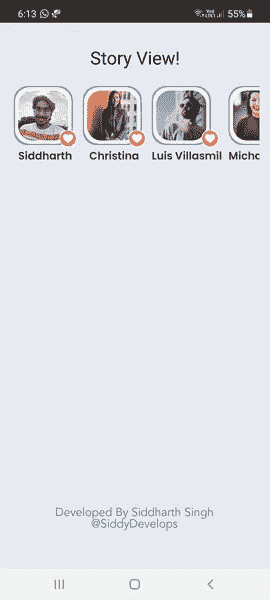
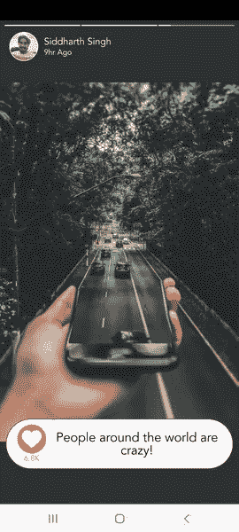
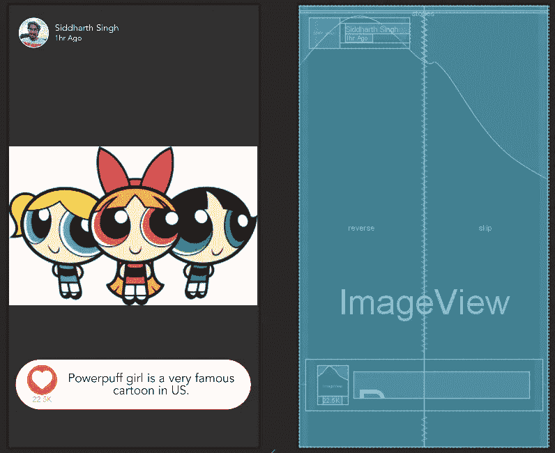

# 在 Android 中创建 Instagram 故事视图

> 原文：<https://blog.devgenius.io/creating-instagram-story-view-in-android-b5e4dbb27185?source=collection_archive---------0----------------------->


Instagram 是智能手机中使用最多的应用程序之一，其功能再次成为开发人员讨论的热门话题。故事现在正成为许多不同应用程序中最常见的功能之一，如 WhatsApp、LinkedIn、Instagram 等。如今，Instagram like stories 广泛用于显示新闻、教育内容以及与用户互动的应用程序中。我已经创建了一个 android 库，只需要 3-4 行代码就可以实现完整的故事功能。您可以查看该库并阅读它的文档，以了解它的工作方式并将其包含在您的应用程序中。

[](https://github.com/SiddyDevelops/InstaStoryView) [## GitHub-SiddyDevelops/InstaStoryView:一个 android 库，它提供了一个渐进的和动态的…

### InstaStoryView 是一个定制的 Android 库，托管在 Jitpack 上。这个库允许用户轻松地使用…

github.com](https://github.com/SiddyDevelops/InstaStoryView) 

但在这篇博客中，我不会谈论我的库和它的功能，而是我们将看看如何为我们的 Android 应用程序创建一个我们自己的自定义故事视图。我们可以开始了吗？


> **创建我们的应用程序:Touch Base**

为了查看我们的故事，我们将需要项目/图标，用户可以点击它，看到渐进的故事图像。我们将需要一个 *RecyclerView* 来显示视图图标，点击后会使故事查看器膨胀。*回收视图*放置在*主活动*内。*回收视图*的 *layout_item.xml* 设计如下:



MainActivity 内部的 RecyclerView

***代号为***[**story _ icon _ item . XML**](https://gist.github.com/SiddyDevelops/68d47a7b5e31deca3cdb54d55d48a9b0)***为 RecyclerView:***

**代码为**[**RecyclerViewAdapter.java**](https://gist.github.com/SiddyDevelops/d43c25aa792cf71f31ddc1c54064f6d8)**显示故事条目的图标:**

***代号为***[](https://gist.github.com/SiddyDevelops/5cc042673e484438963e85214b39629b)***[**activity _ main . XML**](https://gist.github.com/SiddyDevelops/6994c4c7d01d0074476482e433e0618c)***:******

> *****创建我们的定制模板*****

***我们将有一个基本模板，其中将包含*图像视图*，*文本视图*和一个类似的按钮。在所有的故事中，我们将通过一个适配器来改变这些视图中的内容。所以所有进步的故事将遵循相同的模板，在视图中有不同的内容。这就是我们的模板的样子:***

******

***故事视图的模板设计***

***感谢 Android 开源社区，我找到了一个优秀的库，基于这个库，我们将可以控制顶部的进度条，它将控制像*on cause*、 *onTouch* 、 *onResume* 这样的方法。这个库也将帮助我们根据每个故事中图片的数量将顶部的进度条分成几个部分。闲聊到此为止，让我们开始编写自定义的故事视图。***

***[](https://github.com/shts/StoriesProgressView) [## GitHub-shts/stories progress view:像 instagram stories 一样展示横向进度。

### 像 Instagram stories 一样显示横向进度的库。^She 是小林要看一个故事如何进展…

github.com](https://github.com/shts/StoriesProgressView) 

*第一步。*第一步是在我们的*构建中包含库依赖。格雷德*。

```
// Inside build.gradle(Project:app)
allprojects {
    repositories {
        ...
        maven { url "https://jitpack.io" }
    }
}
// Inside build.gradle(Module:app)
dependencies {
    ...
    implementation 'com.github.shts:StoriesProgressView:3.0.0'
}
```

*第二步。*需要一个带有 *NoActionBar* 的主题，因此，在 *theme.xml* 中，将根样式改为:

```
Theme.MaterialComponents.DayNight.NoActionBar
```

*步骤三。*现在是我们为故事查看器设计基础模板的时候了。创建一个包含此模板*的新活动。*在新的布局中，我们将这样设计和编码我们的布局:



***代号为***[***activity _ story _ player . XML******:***](https://gist.github.com/SiddyDevelops/9414d270bb67445e413fb1d9bbbbab16#file-activity_story_player-xml)

第四步:现在是最重要的一步，我们需要为我们的活动和故事播放器编写功能代码。在这里，我们将包括像跳过故事，暂停和恢复故事，到下一个故事或返回到上一个故事的功能。([StoryPlayerActivity.java](https://gist.github.com/SiddyDevelops/72fe612020664cc6d03d8ac630c212ba#file-storyplayeractivity-java))

就是这样！现在你的应用程序有了 Instagram stories，它具有缓存和强大的功能。恭喜你！您现在拥有了一个与 Instagram story viewer 具有相同行为的应用程序。

感谢您阅读文章！如果你喜欢这篇文章，一定要保存下来，并给它一些掌声。敬请关注更多类似本文的精彩文章。在那之前享受编码吧！🚀 🔥

[](https://github.com/SiddyDevelops/InstaStory-Blog)

*[***了解我***](https://siddydevelops.github.io/)****