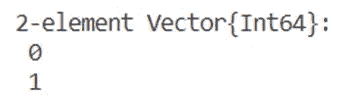
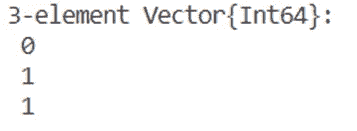
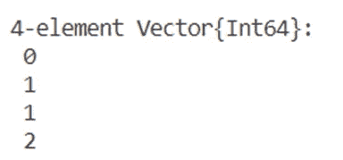

# 在 Julia 中为斐波那契数列创建宏和函数

> 原文：<https://blog.devgenius.io/creating-macros-and-functions-for-fibonacci-numbers-in-julia-9e197869fdb8?source=collection_archive---------5----------------------->


照片由[像素](https://www.pexels.com/photo/worms-eye-view-of-spiral-stained-glass-decors-through-the-roof-161154/?utm_content=attributionCopyText&utm_medium=referral&utm_source=pexels)的[皮克斯拜](https://www.pexels.com/@pixabay?utm_content=attributionCopyText&utm_medium=referral&utm_source=pexels)拍摄

**简介**

这篇文章旨在展示我们如何在 Julia 编程语言中创建 Fibonacci 函数和宏。理解宏和函数之间的区别也很有趣，因此，我们将为 Fibonacci 数构造函数和宏。最后但并非最不重要的，我们将提出，此外，朱莉娅宏，可以给我们的时间，我们的功能或宏需要运行。

**斐波那契数列有哪些？**

斐波纳契数列是一个数列，其中每个数字都是前面两个数字的和。他们在数学中出现得如此频繁，以至于有一整本杂志专门介绍他们的研究，名为《斐波纳契季刊》。我们可以在植物和动物的结构中找到斐波那契数(比如在很多植物上，花瓣的数量就是一个斐波那契数)。这些数字也被称为自然的普遍规律，或自然的秘密代码。

**历史**

斐波那契数列最早是在印度数学中被描述的。它们是由意大利数学家比萨的莱昂纳多命名的，后来被称为斐波那契。

1202 年，比萨的莱昂纳多出版了一本名为《自由阿巴西》的书，书中使用了斐波那契数列来计算兔子数量的增长。

给定一个理想的兔子数量，斐波那契做如下假设:

我们在田地里有一对新生的兔子(雄性和雌性)，兔子能够在出生后一个月大时交配，这样在第二个月结束时雌性可以生下一对兔子，兔子永远不会死，从第二个月开始，每对兔子每月生下一对新的兔子(一公一母)。

斐波那契提出的问题是:一年内会有多少对兔子出生？

你可以自己思考来回答这个问题，因为如果我们在这篇文章中解释它，我们将失去它的目的。

**简而言之，斐波那契数列，是:**

0, 1, 1, 2, 3, 5, 8, 13, 21, 34, …

例如，第九个斐波那契数列是 34。

**有趣的事实**

*   这个数列被称为斐波那契数列，它是一个无穷数列。
*   斐波纳契数列中的每个数字都表示为 Fn。

**数学公式**

计算斐波纳契数列中第(n + 1)个数的公式可以给出为，

*Fn = Fn-1 + Fn-2*

在哪里，

n > 1

Fn-1 →第 n 个斐波那契数

fn-2 →( n-1)次斐波那契数

斐波纳契数列中的第一个数字表示为 F0 = 0，第二个数字表示为 F1 = 1。

**方法 1 —功能**

我们来解释一下`for`循环。

对于 n = 4

*   i = 2

c = 0 + 1 =1

a = 1

b = 1

*   i = 3

c = 1 + 1 = 2

a = 1

b = 2

*   i = 4

c = 1 + 2 = 3

a = 2

b = 3

所以，第四个斐波那契数是 3。正确！

0，1，1，2，3 (F0 = 0，F1 = 1，F2 = 1，F3 = 2，F4 = 3)。

```
fibo(4)
```

输出:3

让我们看看我们的函数找到 n = 80 需要的时间。

```
fibo(80)
```

输出:23416728348467685

使用 [BenchmarkTools.jl](https://github.com/JuliaCI/BenchmarkTools.jl) 中的`@ btime`宏找到时间。

```
using BenchmarkTools
@btime fibo(80) #counts run time 
```

输出:2.100 ns (0 分配:0 字节)

**方法 1 —宏**

我们就把上面的函数当做一个宏吧。

让我们看看我们的宏找到 n = 80 需要的时间。

```
@time @fibo(80) #counts run time
```

输出:0.000001 秒

好多了！

**方法 2—功能**

在这个方法中，我们的函数存储到目前为止计算出的斐波纳契数。

我们做一个向量(一维数组)有两个元素:0 和 1。

所以，我们的 f 向量是:



for 循环呢？

对于 i= 3 (n = 0)

```
push!(f, f[3-1] + f[3-2])
```

输出:



对于 n = 3，我们取 I 从 3 到 n+1 = 4

```
push!(f, f[3-1] + f[3-2]) #sums the (3-1) array element with the (3-2) array elementpush!(f, f[4-1] + f[4-2])
```

(3–1)数组元素为 1。

(3–2)数组元素为 0。

`push!`向现有数组中添加一个元素。

❗️Keep 记住，与其他语言不同，Julia 中的数组从 1 开始，而不是从 0 开始。❗️

输出:



```
print(f[n+1])
```

输出:2

(F0 = 0，F1 = 1，F2 = 1，F3 = 2)正确！

开始计数:

我们向量的第一个元素(一维数组)，

1: 0 (F0)

2: 1 (F1)

3: 1 (F2)

4: 2 (F3)

打印第四个元素。

第四个是什么？第二点。

在 **python** 中，我们会有:

0: 0 (F0)

1: 1 (F1)

2: 1 (F2)

3: 2 (F3)

求 n = 80 时我们的函数需要运行的时间。

```
using BenchmarkTools
@btime fibo(80) #counts run time
```

输出:55.600 微秒(9 次分配:2.11 KiB)

**方法 2 —宏**

求 n = 80 时我们的函数需要运行的时间。

```
@time @fibo(80) #counts run time
```

输出:0.000001 秒

**比较**

*   功能

方法一比方法二快。方法二创建了许多小的临时数组，导致分配，结果是运行时间变慢。

*   宏指令

这两种方法都很快，但是还是用方法一比较好。

*   宏与函数

宏比函数快，尤其是当小代码重复多次时。

**@ btime**

这个宏将在一次初始编译运行后多次重新运行我们的函数，然后它将给出所需时间的平均值。

**结论**

在本文中，我们给出了两种方法(每种方法都有函数和宏)来更好地理解斐波那契数列的逻辑。同时，为了比较小代码中的函数和宏，我们对运行时间做了一个小的引用。

感谢您的阅读！🤗