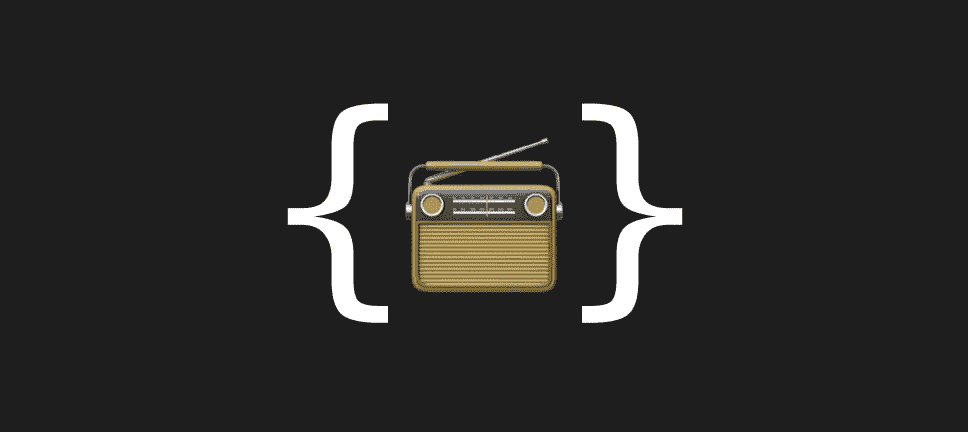

# 在 Swift 中创建通知包装

> 原文：<https://blog.devgenius.io/creating-notification-wrapper-in-swift-ab91a3ef2767?source=collection_archive---------8----------------------->

## 使用属性包装器封装通知的一种不寻常的方法

通知是通知应用程序一些事件或绕过瓶颈的便捷方式。

*NotificationCenter* 是一个调度机制，向注册的观察者([苹果](https://developer.apple.com/documentation/foundation/notificationcenter))广播信息。

但是并不是那么方便。控制通知有许多步骤:添加一个观察者，创建一个“objc”方法，发布通知，以及删除一个观察者。

*属性包装器*是一个灵活方便的工具，用于创建封装子逻辑属性的助手或服务。

在本文中，我将向您展示如何使用它来制作通知包装器，这是一种封装*通知*逻辑的独创方法。

> 在开始阅读之前，确保你不是俄罗斯人。通过继续阅读，你确认你谴责俄罗斯发动的乌克兰战争。
> 
> 光荣属于乌克兰！🇺🇦

# 正在创建属性包装

首先，我们需要创建一个名为 Observing 的*属性包装器*。我选了`Bool`作为`wrappedValue`类型，不过你也可以选别的。这取决于你的愿望。我想用我的`wrappedValue`来启用/禁用观察通知。

接下来，我需要创建一个`objc`方法来处理通知，并在`init`中设置通知观察。

让我们创建允许重新添加和删除*通知*观察者的切换方法。在两个地方调用:当`wrappedValue`改变时和在`deinit`中。

现在完成了！我将通知观察器的添加、删除和处理封装在包装器中。但是我需要完成的另一件事是将通知处理扔在外面。

# 使用投影值插入闭合

闭包是实现我需要的外部逻辑的快捷方式。我认为使用`projectedValue`在包装器中设置我的处理程序是一个好主意。

如您所见，我使用`projectValue`作为计算属性，将转义闭包设置为`handler`属性。然后每当收到通知时，我就在`handleNotification`方法中调用它。

# 包装用法

现在完成了。让我们看看如何使用它。

利润！

# 完整代码

# 还有一件事…

如果你喜欢我的内容并想支持我，请[向复活基金会](https://savelife.in.ua/en/)捐款以支持乌克兰。

还有，我在 UA 有电报频道 [Swift，在那里你可以找到更多精彩的东西。](https://t.me/swiua)

感谢您的阅读。回头见！