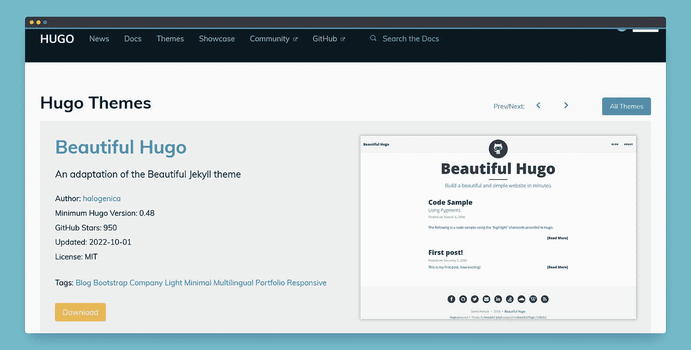
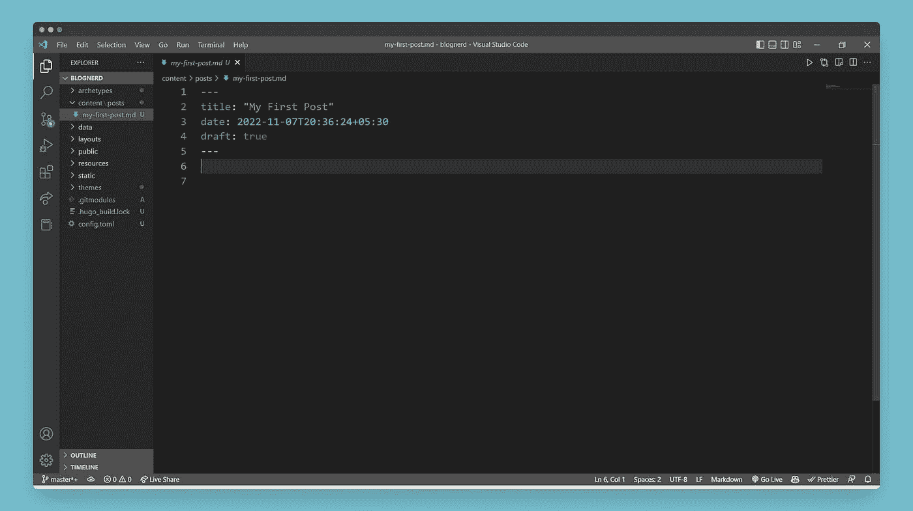
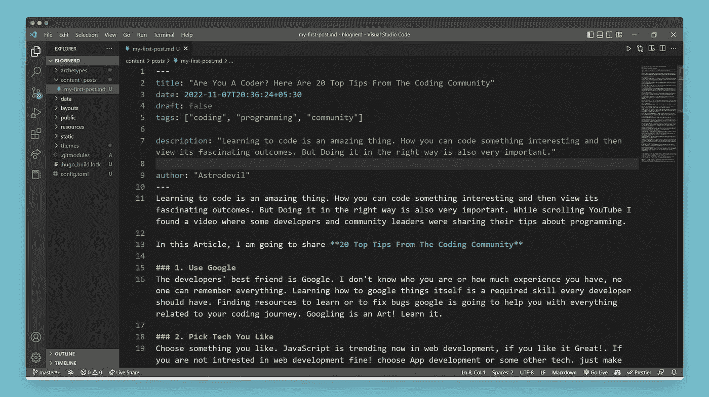

# 与 Hugo 和 Netlify 一起创建个人博客

> 原文：<https://blog.devgenius.io/creating-personal-blog-with-hugo-and-netlify-9b3b918f9ae3?source=collection_archive---------6----------------------->


在这篇文章里！我将分享我在使用静态站点生成器 [**Hugo**](https://gohugo.io/) 并将其部署到 **Netlify** 时遵循的一步一步的方法。在这个过程中，我遇到了一些小错误，我会好好考虑的。让我们开始吧。

由于我使用的是 windows，命令可能会有所不同，在使用 Hugo 建立自己的网站时，请遵循[官方文档](https://gohugo.io/documentation/)。另外，我在 git bash 上运行所有命令。

# 第一步

在桌面上创建任意文件夹并打开`git bash`。现在该安装 hugo 了。

```
choco install hugo -confirm
```

或者如果你需要“扩展的”萨斯/SCSS 版本:对于一些支持的主题。最好以管理员身份从`cmd`安装。

```
choco install hugo-extended -confirm
```

# 第二步

现在是时候创建一个新的网站，并添加一个很酷的主题。您可以从 Hugo 主题库中选择任何主题。运行以下命令。

```
// Choose your site name in place of blognerdhugo new site blognerd
```

以上将在一个名为`blognerd`的文件夹中创建一个新的 Hugo 站点。

是时候给网站添加主题了。请参见[主题库](https://themes.gohugo.io/)了解要考虑的主题列表。我正在使用`Beautiful Hugo`主题。

```
cd blognerd
git init
```



你可以通过点击主题页面上的下载按钮来访问 GitHub repo 主题，如上图所示。现在，从 GitHub 下载主题并将其添加到站点的主题目录中。

```
git submodule add https://github.com/halogenica/beautifulhugo.git  themes/beautifulhugo
```

现在，将主题添加到站点配置中:

```
echo theme = \"beautifulhugo\" >> config.toml
```

# 第三步

是时候向新创建的站点添加一些内容了。您也可以手动添加它们，但我是使用命令创建的。

```
hugo new posts/my-first-post.md
```

现在在任何代码编辑器中打开整个文件夹，我正在使用 VS 代码，按照你的意愿编辑你的帖子。下面可以看到我编辑器的截图，供帖子文件参考。



以上内容可能会因您使用的主题而异。例如，我将把我的一篇文章内容添加到这篇文章中，请看下面的截图。您可以相应地编辑`---`之间的元数据。



# 第四步

现在，是时候通过运行 Hugo server 来测试我们创建的站点了。

```
hugo server -D  //run only this command Start building sites …
hugo v0.105.0-0e3b42b4a9bdeb4d866210819fc6ddcf51582ffa+extended windows/amd64 BuildDate=2022-10-28T12:29:05Z VendorInfo=gohugoio | EN
-------------------+------
  Pages            |  10
  Paginator pages  |   0
  Non-page files   |   0
  Static files     | 184
  Processed images |   0
  Aliases          |   2
  Sitemaps         |   1
  Cleaned          |   0Built in 4884 ms
```

您可以在`[http://localhost:1313/](http://localhost:1313/)`查看实时视图

这是我的实景…


# 第五步

是时候对新创建的网站进行最后的润色了。你可以通过在文本编辑器中打开`config.toml`来定制主题或配置站点，并进行相应的编辑。在这个主题中，我从他们的 GitHub 自述文件中获得了帮助。

现在，是时候构建静态站点了。按`Ctrl+c`关闭 hugo 服务器后运行以下命令

```
hugo -D  //run only this commandStart building sites …
hugo v0.105.0-0e3b42b4a9bdeb4d866210819fc6ddcf51582ffa+extended windows/amd64 BuildDate=2022-10-28T12:29:05Z VendorInfo=gohugoio | EN
-------------------+------
  Pages            |  16
  Paginator pages  |   0
  Non-page files   |   0
  Static files     | 184
  Processed images |   0
  Aliases          |   5
  Sitemaps         |   1
  Cleaned          |   0Total in 763 ms
```

# 第六步

一切都准备好了。您可以添加更多的博客内容或根据您的要求定制网站。现在最后的工作是将它部署到**网络**。

我已经安装了 Netlify CLI，所以我将进入最后一步，您可以通过访问 Netlify 官方文档并登录您的帐户来安装它。

安装后，运行以下命令:

```
netlify dev
```

它将在`http://localhost:8888`上打开 Netlify live 服务器。检查完网站上的所有内容后，按`Ctrl+c`关闭 netlify 服务器。部署时间到了..

```
netlify deploy  //run only this command This folder isn't linked to a site yet
? What would you like to do? (Use arrow keys)
> Link this directory to an existing site
  +  Create & configure a new site
```

按照指示选择`(.)`目录。现在部署生产。

```
netlify deploy --prod// select public directory
```

万岁！现在，您可以从 Netlify dashboard 使用 Netlify 域访问您的实时网站。我已经创建了另一个网站，它的部署，检查我的网站[在这里…](https://bloggeek.netlify.app/)

## 如果你❤️我的内容！在推特[上联系我](https://mobile.twitter.com/Astrodevil_)或者通过[给我买一辆 Coffee☕](https://www.buymeacoffee.com/Astrodevil) 来支持我