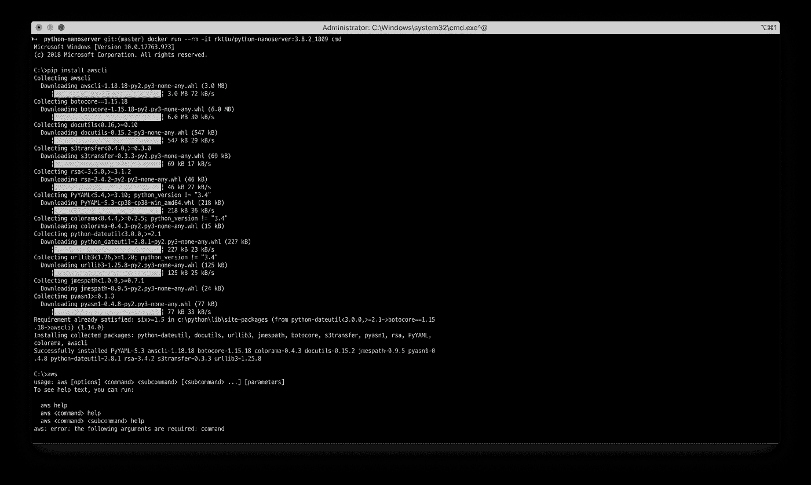
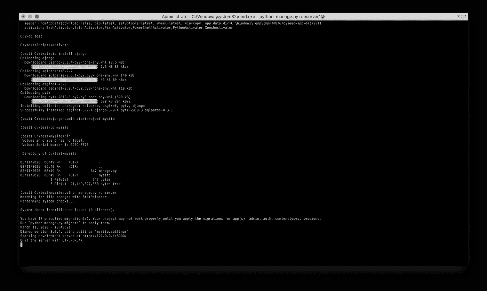
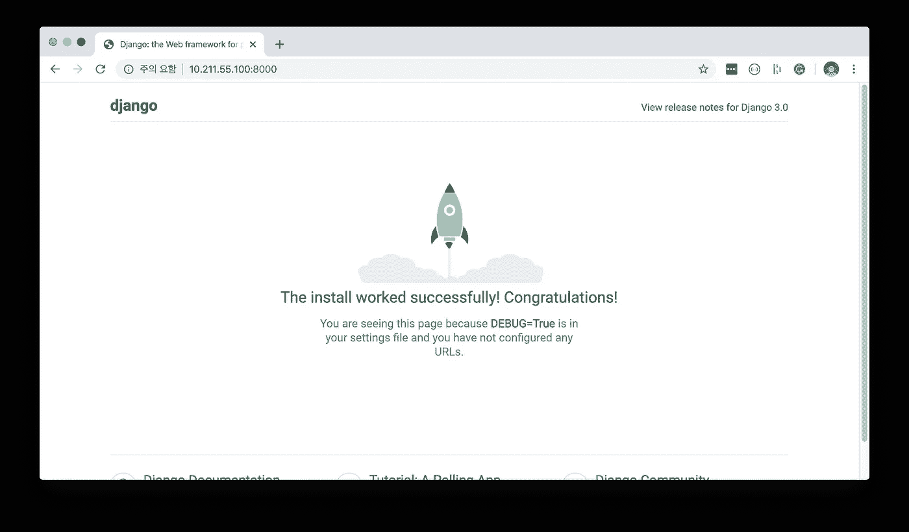

# 为 Windows Nano Server 创建 Python Docker 映像

> 原文：<https://blog.devgenius.io/creating-python-docker-image-for-windows-nano-server-151e1ab7188a?source=collection_archive---------0----------------------->


图片来源:[https://unsplash.com/photos/9-ohfp-Dicg](https://unsplash.com/photos/9-ohfp-Dicg)

我的公司 DEVSISTERS 是韩国及其游戏行业 Windows container 和 Windows Kubernetes 的早期采用者。最近，我们的团队在有限的时间内运营了一个基于 Windows stack 的游戏软件封闭测试版。([相关链接，韩语](http://game.donga.com/94460/))

在封闭测试阶段，我们经常收集应用程序转储文件来调试和改进服务器应用程序。最初，我们用 PowerShell 和 FileSystemWatcher 编写了一个脚本。

但如你所知，FileSystemWatcher 和 PowerShell 有时无法正常工作。此外，在 Windows 环境中，PowerShell 将是正确的选择，但我们的大多数团队成员并不熟悉。

最初，用 Python 编写了一个简单的自动化脚本。目前，Python 官方镜像只打包了 Windows 服务器核心镜像，没有 Nano 服务器镜像。这个选项使得容器化的 Python 应用程序消耗更多的内存和资源，这造成了相当大的开销。

在大多数情况下，人们心甘情愿地接受这种限制，因为与传统的 Windows Server SKU 相比，Nano server 的功能太有限了。如果您尝试在 Nano Server 中运行 Python 应用程序，您将很快面临一个非常棘手的问题。这些差异会导致过度劳累，浪费你的时间。

但是我决定努力工作，因为我想在 Windows 容器环境下优化 Python 工作负载。所以我用了大约两个工作日的时间，把工作做得很有魅力。:-)

# Dockerfile 文件—构建阶段

我使用了多阶段构建来最小化输出图像的大小。我定义了一些环境变量，并将默认 shell 更改为 PowerShell。

```
FROM mcr.microsoft.com/windows/servercore:1809ENV PYTHON_VERSION 3.7.4ENV PYTHON_RELEASE 3.7.4# if this is called "PIP_VERSION", pip explodes with "ValueError: invalid truth value '<VERSION>'"ENV PYTHON_PIP_VERSION 20.0.2# [https://github.com/pypa/get-pip](https://github.com/pypa/get-pip)ENV PYTHON_GET_PIP_URL [https://github.com/pypa/get-pip/raw/d59197a3c169cef378a22428a3fa99d33e080a5d/get-pip.py](https://github.com/pypa/get-pip/raw/d59197a3c169cef378a22428a3fa99d33e080a5d/get-pip.py)WORKDIR C:\\TempSHELL ["powershell", "-Command", "$ErrorActionPreference = 'Stop'; $ProgressPreference = 'Continue'; $verbosePreference='Continue';"]
```

然后，下载 Python Windows 版本的嵌入式版本，并解压缩 ZIP 文件。另外，我还下载了 get_pip.py 脚本文件。在此之前，我修改了 SecurityProtocol 属性，以允许与 GitHub URL 进行通信。

```
RUN [System.Net.ServicePointManager]::SecurityProtocol = [System.Net.SecurityProtocolType]::Tls12; \
    Invoke-WebRequest -UseBasicParsing -Uri "https://www.python.org/ftp/python/$env:PYTHON_RELEASE/python-$env:PYTHON_VERSION-embed-amd64.zip" -Out 'Python.zip'; \
    Expand-Archive -Path "Python.zip"; \
    Invoke-WebRequest -UseBasicParsing -Uri "$env:PYTHON_GET_PIP_URL" -OutFile 'Python\get-pip.py';
```

我使用了 Python 的嵌入式版本，因为官方的 Win32 安装程序无法在 Nano Server 上运行。这是最难的部分。

这一阶段应用了一些复杂的配置。我会解释这是怎么回事。

```
RUN [String]::Format('@set PYTHON_PIP_VERSION={0}', $env:PYTHON_PIP_VERSION) | Out-File -FilePath 'Python\pipver.cmd' -Encoding ASCII; \
    $FileVer = [System.Version]::Parse([System.Diagnostics.FileVersionInfo]::GetVersionInfo('Python\python.exe').ProductVersion); \
    $Postfix = $FileVer.Major.ToString() + $FileVer.Minor.ToString(); \
    Remove-Item -Path "Python\python$Postfix._pth"; \
    Expand-Archive -Path "Python\python$Postfix.zip" -Destination "Python\Lib"; \
    Remove-Item -Path "Python\python$Postfix.zip"; \
    New-Item -Type Directory -Path "Python\DLLs";
```

*   我创造了 PIPVER。CMD 文件将 PYTHON_PIP_VERSION 环境变量传递给 Nano 服务器。
*   为了减少硬编码的部分，我在 python 可执行文件中查找了 Win32 资源表，做了一个后缀字符串。这个后缀字符串连续地用于提取编译后的 Python 库存档文件和删除 _PTH 文件。
*   由于 3.7.x 版之后的 _PTH 文件，嵌入式 Python 不支持系统路径变量(PYTHONPATH)。移除此文件会使嵌入式 Python 像传统 Python 一样工作。
*   我将存档的预编译 Python 库解压到 Libs 目录。
*   最后，为了以后的使用，我单独创建了 dll 目录。pip 和 virtualenv 使用的这个目录。

唷！最困难的部分已经过去了。到目前为止，在这个构建阶段，我创建了一个临时目录，并手动构建了一个 Python 安装目录。

# Dockerfile —纳米服务器

让我们深入了解一下纳米服务器。

```
FROM mcr.microsoft.com/windows/nanoserver:1809COPY --from=0 C:\\Temp\\Python C:\\PythonUSER ContainerAdministrator
```

默认情况下，Windows 容器使用 Container uses 帐户。出于安全原因，即使在容器中，用户也没有所有权限。如果要修改 Windows 容器中的注册表和系统设置，应该将用户帐户更改为 ContainerAdministrator。

```
ENV PYTHONPATH C:\\Python;C:\\Python\\Scripts;C:\\Python\\DLLs;C:\\Python\\Lib;C:\\Python\\Lib\\plat-win;C:\\Python\\Lib\\site-packagesRUN setx.exe /m PATH %PATH%;%PYTHONPATH% && \
    setx.exe /m PYTHONPATH %PYTHONPATH% && \
    setx.exe /m PIP_CACHE_DIR C:\Users\ContainerUser\AppData\Local\pip\Cache && \
    reg.exe ADD HKLM\SYSTEM\CurrentControlSet\Control\FileSystem /v LongPathsEnabled /t REG_DWORD /d 1 /f
```

我在本地定义了 PYTHONPATH 环境变量。然后，我将 PATH，PYTHONPATH 环境变量配置为系统范围的。此外，我设置了 PIP_CACHE_DIR 环境变量，用于从容器根路径中隐藏 PIP 缓存目录。

最后一行配置 Windows 操作系统的长路径支持。

```
RUN assoc .py=Python.File && \
    assoc .pyc=Python.CompiledFile && \
    assoc .pyd=Python.Extension && \
    assoc .pyo=Python.CompiledFile && \
    assoc .pyw=Python.NoConFile && \
    assoc .pyz=Python.ArchiveFile && \
    assoc .pyzw=Python.NoConArchiveFile && \
    ftype Python.ArchiveFile="C:\Python\python.exe" "%1" %* && \
    ftype Python.CompiledFile="C:\Python\python.exe" "%1" %* && \
    ftype Python.File="C:\Python\python.exe" "%1" %* && \
    ftype Python.NoConArchiveFile="C:\Python\pythonw.exe" "%1" %* && \
    ftype Python.NoConFile="C:\Python\pythonw.exe" "%1" %*
```

在 AWS CLI 的情况下，它需要"。PY”文件扩展名应该直接与 Python 解释器相关联。这些命令分别在主要的 Python 文件扩展名和 Python 解释器之间进行映射。

```
RUN call C:\Python\pipver.cmd && \
    %COMSPEC% /s /c "echo Installing pip==%PYTHON_PIP_VERSION% ..." && \
    %COMSPEC% /s /c "C:\Python\python.exe C:\Python\get-pip.py --disable-pip-version-check --no-cache-dir pip==%PYTHON_PIP_VERSION%" && \
    echo Removing ... && \
    del /f /q C:\Python\get-pip.py C:\Python\pipver.cmd && \
    echo Verifying install ... && \
    echo   python --version && \
    python --version && \
    echo Verifying pip install ... && \
    echo   pip --version && \
    pip --version && \
    echo Complete.
```

剩下的部分相对简单。只需使用— disable-pip-version-check、— no-cache-dir 调用 get-pip 脚本，并指定 pip 版本。PIP 安装完成后，删除临时文件并验证 Python 和 PIP 是否正常工作。

```
RUN pip install virtualenvUSER ContainerUserCMD ["python"]
```

在官方的 Python Windows Server 核心镜像中，为了方便起见，添加了 virtualenv 包。所以我简单地添加了它，以在 Nano 服务器容器中提供 virtualenv 工具。

然后，再次将用户更改为 ContainerUser。这种配置使集装箱更加安全。

最后，我将这个图像的默认命令指定为 Python 解释器。

# 试飞— AWS CLI 和虚拟环境

首先，我测试了 AWS CLI 的安装。



然后，我在虚拟环境中测试了 Django 的安装。



看起来工作正常。

# 试飞— Django 网络应用

最后，我用 Nano 服务器创建了一个简单的 Django 示例网站。我编写了一个简单的 Dockerfile 文件来实现这一点。

首先，我创建一个新的 Django 项目。

```
django-admin startproject helloworld
```

然后，我修改了 settings.py 文件以允许所有主机。在这种情况下，我没有使用任何反向代理服务器，所以我需要调整安全设置，以启用到 Windows 容器的传入连接。

```
...# SECURITY WARNING: don't run with debug turned on in production!
DEBUG = TrueALLOWED_HOSTS = ["*"]...
```

最后，我创建了一个 docker 文件来构建 docker 映像。

```
FROM rkttu/python-nanoserver:3.7.4_1809EXPOSE 8000
RUN pip install djangoWORKDIR C:\\website
ADD . .ENV DJANGO_DEBUG=1
CMD python -Wall manage.py runserver --insecure 0.0.0.0:8000
```

让我们启动基于 Nano 服务器的 Django 应用程序！

```
docker build -t helloworld:latest .docker run --rm -d -p 8000:8000 helloworld:latest
```

瞧啊。启动容器后，我可以浏览 Django 应用程序。



从现在开始，您可以在 Nano 服务器容器中运行普通的 Python 应用程序。它使你的基于 Windows 的 Python 应用程序更加精简，运行速度更快。

# 您想使用该图像吗？

我发布了一个公共的 Git 存储库和 Docker Hub 存储库。您可以立即克隆代码或提取图像。

*   GitHub 资源库网址:【https://github.com/rkttu/python-nanoserver 
*   Docker Hub: `docker pull rkttu/python-nanoserver:3.7.4_1809`或`docker pull rkttu/python-nanoserver:3.8.2_1809`

并且一如既往的欢迎各种投稿！

[](https://www.buymeacoffee.com/rkttu)