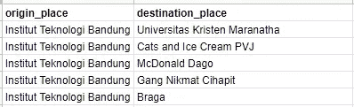
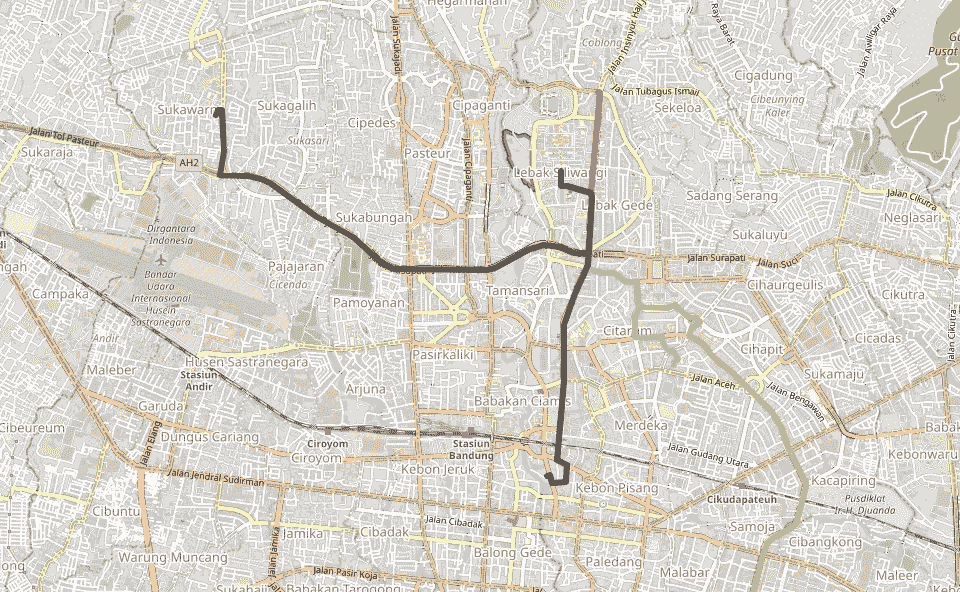

# 使用 Folium 和 HERE API 可视化路线折线

> 原文：<https://blog.devgenius.io/creating-route-polyline-using-folium-and-here-api-256fcf46ef9c?source=collection_archive---------7----------------------->

写这篇文章的时候，我正打算为我的万隆之行做一个行程计划。我列出了几个我想去的地方。然而，我对我应该租一辆摩托车还是坐一辆 *ojol* (在线出租车)感到困惑。因此，我计算了从我的酒店到这些地方的路线距离。此外，如果我能把路线可视化就更好了，这样我就能瞥一眼它们，并确定我是否能让它更有效率。


由[安妮·斯普拉特](https://unsplash.com/@anniespratt?utm_source=medium&utm_medium=referral)在 [Unsplash](https://unsplash.com?utm_source=medium&utm_medium=referral) 上拍摄

在用 Google Colab 处理之前，我把所有的数据都放在 Google Sheets 中，使用下面的代码，但是你可以访问这里的[来查看完整的教程](https://morioh.com/p/5edaf66e9e33)。

```
from google.colab import auth
auth.authenticate_user()import gspread
from google.auth import default
creds, _ = default()gc = gspread.authorize(creds)
worksheet = gc.open('**<GSHEET FILENAME>**').worksheet('**<SHEET NAME>**')*# get_all_values gives a list of rows.*
rows = worksheet.get_all_values()*# Convert to a DataFrame and render.*
import pandas as pd
df_source = pd.DataFrame.from_records(rows[1:], columns=rows[0])
df_source.head()
```

出于模拟目的，我们将“ITB(万隆技术研究所)”作为我们的原点(ITB 位于-6.8918336，107.6103212)。然后我们将参观万隆的 5 个受欢迎的地方。数据如下所示。



接下来，我们需要从[这里的开发者](https://developer.here.com/)那里获取 API 密匙。我们为什么用这里？因为它免费且易于使用，数量有限:

1.  *此处地理编码 API* :每月最多免费 3000 次通话。
2.  *HERE Routing API* :每月最多可免费拨打 5000 个电话(针对小型摩托车/2W)或 30000 个电话(针对汽车/4W)。

你可以点击这里的[完整教程](https://developer.here.com/documentation/identity-access-management/dev_guide/topics/dev-apikey.html)来获取你的 API 密匙。或者，只需[在您注册/登录后访问此链接](https://platform.here.com/admin/apps)，点击“注册新应用”并注册，然后点击“API 密钥(第 0 个，共 2 个)”选项卡，最后点击“创建 API 密钥”。复制你得到的 API 密匙，我们准备在我们的模拟中使用它。

## 使用此处的地理编码 API 将地名(或地址)转换为 Latlong


```
import requests, jsonapikey = '**<YOUR-API-KEY-HERE>**'
url = 'https://discover.search.hereapi.com/v1/discover'
headers = {'Content-Type': 'application/json'}origin_point = '-6.8918336,107.6103212' #write latlong without space
latlong_destination = []for i, data in df_source.iterrows():
  # your place name is defined below
  place_name = data.destination_place my_params = {'at':origin_point,
               'limit':1,
               'apikey':apikey,
               'q':place_name}
  r = requests.get(url, params=my_params ,headers=headers)
  output = json.loads(r.text)
  latlong_dict = output['items'][0]['position']
  latlong = ','.join(map(str, latlong_dict.values()))
  latlong_destination += [latlong]
```

上面代码的输出是我们的目的地的列表，如下所示。接下来，我们将创建从起点到每个目的地的路线。

```
['-6.8868,107.58127',  '-6.95907,107.64829',  '-6.88506,107.61356',  '-6.90843,107.62006',  '-6.9179,107.60918']
```

**注意:**这个 API 的局限性，它不如 Google Geocoding API 高级。查询时必须给出详细的地名或更好地使用地址细节。如果你的目的地不多，我建议你用谷歌地图手动搜索 latlong。根据上面的输出，我们在第二个索引上有 1 个错误的 latlong(应该是-6.8891834，107.5959322)。

## 使用 HERE 路由 API 进行路由数据检索

我们将在这一步使用`flexpolyline`,因为从这里得到的折线结果仍然是编码的。然而`polyline`并没有默认安装在我们的 Colab 系统上，所以我们必须先用`!pip install flexpolyline`安装它。

```
import flexpolyline as fpapikey='**<YOUR-API-KEY-HERE>**'
url = 'https://router.hereapi.com/v8/routes'
headers = {'Content-Type': 'application/json'}origin_point = '-6.8918336,107.6103212'
distance_result = []
route_result = []for destination_point in latlong_destination:
  my_params = {'origin':origin_point,
               'destination':destination_point,
               'apikey':apikey,
               # change the transportMode below as your needs
               'transportMode':'scooter',
               'return':'summary,polyline,elevation'} r = requests.get(url, params=my_params ,headers=headers)
  output = json.loads(r.text)
  polyline = output["routes"][0]['sections'][0]['polyline']
  length = output["routes"][0]['sections'][0]['summary']['length']
  # Decode the polyline result to latlong tuple
  poly_decode = fp.dict_decode(polyline)
  latlong_tuple = [(el['lat'], el['lng']) for el in poly_decode]
  # Collect the result (distance and route)
  distance_result += [length]
  route_result += [latlong_tuple]
```

输出将是用于路由可视化的 ori-dest 距离列表和 latlong 元组列表。因此，我们可以移动到我们的最后一步，这是可视化我们的路线。

## **路线折线可视化使用**

在下面的代码中，我们定义了`random_color()`函数来为每条路线赋予随机颜色。如果需要，您可以指定自己的颜色。

```
import folium
import randomdef random_color():
  color = "#%06x" % random.randint(0, 0xFFFFFF)
  return color# Load map using your origin latlong
my_map = folium.Map(location=[-6.8918336,107.6103212],
                    zoom_start=14,
                    tiles='OpenStreetMap')for i in range(len(df_source)):
  folium.PolyLine(route_result[i],
                  tooltip=f"{df_source.destination_place.iloc[i]} - {distance_result[i]}",
                  color=random_color(),
                  weight=6).add_to(my_map)my_map
```

输出如下所示。



## 进一步发展和建议

我们上面的代码仍然需要进一步开发，所以我们可以有更多的功能，特别是如果你想使用它们的任何生产目的。以下是我的建议:

1.  在调用 API url 时使用“try-catch ”,这样无论何时发生错误，我们都可以跳过它。
2.  使用聚类方法将所有附近的点分组到一个聚类中。因为我们没有必要一直从原点出发。我们可以从一个目的地移动到另一个目的地。

干杯！