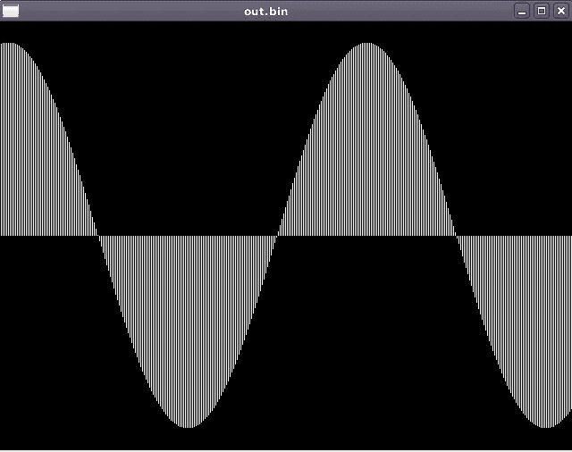

# 使用 Go 从头开始创建声音

> 原文：<https://blog.devgenius.io/creating-sound-from-scratch-with-go-9cef90b62370?source=collection_archive---------6----------------------->

在本帖中，我们将使用 Go 从头开始创建声音(二进制格式)。这个帖子的最终结果是播放一个特定频率、采样率和持续时间的声音。我们还将应用指数衰减，使声音逐渐减弱。最后，声音应该变成这个视频中的声音:

# 第一步:什么声音？

最简单的形式是，声音对计算机来说可以被认为是一种简单的数字编码波。在声音到达您的耳朵之前，它会经过一个数模转换器，本质上是将数字信号转换为耳机/扬声器的电流。

例如，注释 A 如下所示:


[http://www-users.math.umn.edu/~rogness/math1155/soundwaves/](http://www-users.math.umn.edu/~rogness/math1155/soundwaves/)

第一步，让我们试着用 go 创建一个正弦波。

我们可以使用`math.Sin(x)`生成它，并将 x 作为弧度传递。我们将不得不在一个范围内迭代以得到正弦波。为了停留在音频编程的领域，我们将绘制到正弦波的“点”的数量是我们的样本。

(如果你想跳过前面，这篇文章的所有代码都在 github:[https://github.com/DylanMeeus/MediumCode/blob/master/Audio](https://github.com/DylanMeeus/MediumCode/blob/master/Audio/FirstSound/main.go))

```
const nsamps = 50 // samples to generate
func generate() {
     tau = math.Pi * 2
     var angle float64 = tau / nsamps
     for i := 0; i < nsamps; i++ {
         samp = math.Sin(angle * float64(i))
         fmt.Printf("%.8f\n", samp)
     }
}
```

注意，我们将样本打印到 stdout，我们可以将这个输出通过管道传输到一个文件(`go run main.go > out.txt`)。该文件中的输出如下所示:

```
-0.00000000
-0.12533323
-0.24868989
-0.36812455
-0.48175367
-0.58778525
.. 
```

有点看不清这里发生了什么。但是使用`gnuplot`我们可以更容易地可视化这个文件。在`gnuplot`中，运行:

`plot "out.txt" with lines`


gnuplot 的输出

这看起来像是一个完美连续的正弦波，但这是 gnuplot“用线条”可视化它的方式。如果我们绘制柱状图，我们可以看到一个稍微不同的视图。(`plot "out.txt" with boxes`)


带横条的 gnuplot

既然我们能产生正弦波，我们就有了发声的基础。虽然在这一点上这只是浮点数，但我们实际上可以把它变成可以播放的原始音频文件。

# 第二步:产生声音

为了把这个正弦波变成真实的声音，我们必须介绍一些东西。

*** *采样率****

首先，声音以一定的采样率存储。采样率告诉你每秒有多少样本被用来编码你的声音。CD 质量的录音具有 44100 赫兹的采样率，允许高达 22.05KHz 的频率。考虑到人耳听到 20Hz 到 20KHz 之间的声音，这已经足够了(假设你只针对人类听众😛).

虽然其他格式也是可能的，例如 48Khz 用于 DVD 视频质量或 96KHz 用于 DVD 音频质量，但我们现在将坚持 CD 质量。正如你将看到的——改变这一点是微不足道的。你可以自己随意摆弄一下，看看是否能听出声音的不同。

因此，我们需要至少 44100 个样本，而不是使用我们的`nsamps = 50`。为了调整声音的持续时间，我们还将为此添加一个变量。

```
const (
      Duration = 2
      SampleRate = 44100
)
```

****频率****

接下来，我们将引入一个频率。现在我们将使用 440 赫兹的频率，它被定义为“音高标准”。这是中 c 以上音符 A 的标准调音。为了不偏离我们创作音乐的目标，如果你对我们为什么使用这个频率感到好奇，请查看这个维基页面。

加上这个，我们将再次扩展我们的常量:

```
const (
      Duration   = 2
      SampleRate = 44100
      Frequency  = 440  // Pitch Standard
)
```

****存储声音*****

我们现在有了产生声音的基本成分，但是我们缺少了一个重要的部分。我们如何存储这些数据，以便我们的计算机可以将其解释为声音？

我们在步骤 1 中生成的 floats 确实可以使用，但是我们必须将它们存储为二进制表示。这里一个棘手的部分是，你必须以你的计算机可以读取它们的方式存储它们——这意味着你必须在 BigEndian 机器上使用 BigEndian，否则使用 LittleEndian。

在 linux 系统上，这可以通过您的终端发现(在 macOS 上可能是相同的命令，不要验证！).

```
dylan@devuan:~$ lscpu | grep "Byte Order"
Byte Order:            Little Endian
```

****代码！****

现在我们知道该做什么，并设置了我们的常数，让我们修改生成函数来把它们联系在一起。声音将存储在您机器上名为“out.bin”的文件中。*(为了简洁，我已经去掉了错误处理！)*

```
func generate() {
	nsamps := Duration * SampleRate
	var angle float64 = tau / float64(nsamps)
	file := "out.bin"
	f, _ := os.Create(file)
	for i := 0; i < nsamps; i++ {
		sample := math.Sin(angle * Frequency * float64(i))
		var buf [8]byte
		binary.LittleEndian.PutUint32(buf[:],
                       math.Float32bits(float32(sample)))
		bw,_ := f.Write(buf[:])
		fmt.Printf("\rWrote: %v bytes to %s", bw, file)
	}
}
```

使用`ffplay`我们现在可以播放这个文件，尽管我们需要指定我们的采样率和格式。指定我们的`showmode`我们也可以想象正在播放的声音:

```
ffplay -f f32le -ar  44100 -showmode 1 out.bin
```



使用 ffplay 播放我们的文件

听起来是这样的:

或者，您也可以使用 Audacity，将我们的二进制文件作为“原始音频文件”导入。只要确保你选择单声道和正确的编码。😉

这就是我们如何创建音高标准。虽然一个小的改进将是篡改接近尾声的声音。这比持续的信号感觉更“自然”。为了实现这一点，我们可以在信号接近结束时引入指数衰减。

# 扩展 1:指数衰减

我们不需要增加很多就能得到指数衰减。我们想淡出我们的信号，所以我们将定义一个开始和结束“振幅”来产生一个衰减因子。接下来，在每次迭代中，我们将通过乘以衰减因子来修改信号的实际幅度。

在函数的顶部，我们将定义这些变量:

```
func generate() {
     var (
         start float64 = 1.0
         end float64   = 1.0e-4
     )
     nsamps = Duration * SampleRate
     decayfac := math.Pow(end/start, 1.0/float64(nsamps))
     ..
```

一旦我们设置好了它们，在生成波形的循环中，我们可以在每次迭代中修改样本

```
sample := math.Sin(angle * Frequency * float64(i))
sample *= start
start *= decayfac
```

当我们把这些放在一起，我们的功能就变成了:

```
func generate() {
	var (
		start float64 = 1.0
		end   float64 = 1.0e-4
	)
	nsamps := Duration * SampleRate
	var angle float64 = tau / float64(nsamps)
	file := "out.bin"
	f, _ := os.Create(file)
	decayfac := math.Pow(end/start, 1.0/float64(nsamps))
	for i := 0; i < nsamps; i++ {
		sample := math.Sin(angle * Frequency * float64(i))
		sample *= start
		start *= decayfac
		var buf [8]byte
		binary.LittleEndian.PutUint32(buf[:],
                       math.Float32bits(float32(sample)))
		bw, _ := f.Write(buf[:])
		fmt.Printf("\rWrote: %v bytes to %s", bw, file)
	}
}
```

现在，如果我们播放这个声音，我们可以从这篇文章顶部的视频中获得声音。😃

所有代码都在 GitHub 上:[https://GitHub . com/dylanmeus/medium code/blob/master/Audio/first sound/main . go](https://github.com/DylanMeeus/MediumCode/blob/master/Audio/FirstSound/main.go)

如果你喜欢这篇文章💙去为好，考虑:

*   跟着我来到这里，在媒体上
*   或者推特[推特](https://www.twitter.com/DylanMeeus)