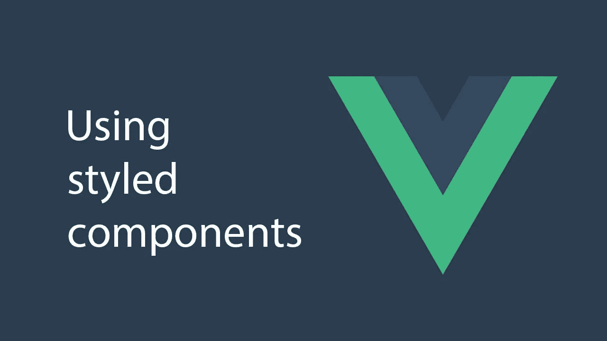

# 用 vue 样式组件创建样式化的 Vue 组件

> 原文：<https://blog.devgenius.io/creating-styled-vue-components-with-vue-styled-components-aa1ebab0684d?source=collection_archive---------5----------------------->



要用几行代码创建带有内置样式的组件，您可以使用 vue 样式的组件来创建它们。

# 入门指南

首先，通过运行以下命令安装软件包:

```
npm i vue-styled-components
```

然后，您可以创建一些基本组件，例如:

```
import styled from "vue-styled-components";

export const StyledTitle = styled.h1`
  font-size: 1.5em;
  text-align: center;
  color: palevioletred;
`;

export const StyledHeader = styled.header`
  padding: 4em;
  background: yellow;
`;
```

您只需要导入包，然后使用代码附带的模板标签来创建新的样式元素。

您可以更改标签的字体大小、文本对齐方式和其他内容。

标签制作了一个 h1 元素。

制作一个样式化的标题元素。

然后，您可以通过注册组件并使用它来使用它:

```
<template>
  <div id="app">
    <styled-header>
      <b>header</b>
    </styled-header>
    <styled-title>hello</styled-title>
  </div>
</template>

<script>
import { StyledTitle, StyledHeader } from "./components";

export default {
  name: "App",
  components: {
    "styled-title": StyledTitle,
    "styled-header": StyledHeader
  }
};
</script>
```

你只需在`components`注册它们，并在我们的模板中引用它们。

字符串中的样式会自动应用。

# 小道具

像任何其他组件一样，您可以向它们传递道具。

例如:

```
import styled from "vue-styled-components";

export const StyledInput = styled.input`
  font-size: 1.25em;
  padding: 0.5em;
  margin: 0.5em;
  color: palevioletred;

  &:hover {
    box-shadow: inset 1px 1px 2px red;
  }
`;
```

然后你可以写:

```
<template>
  <div id="app">
    <styled-input v-model="val" placeholder="val"/>
    <p>{{val}}</p>
  </div>
</template>

<script>
import { StyledInput } from "./components";

export default {
  name: "App",
  data() {
    return {
      val: ""
    };
  },
  components: {
    "styled-input": StyledInput
  }
};
</script>
```

您输入的任何内容都会显示在其下方。

这是因为它接受`value`道具，并像其他组件一样发出`input`事件。

还会应用您指定的样式。

`placeholder`道具也起作用，占位符被应用。

# 基于道具的改编

您可以根据传入的道具更改样式。

例如:

```
import styled from "vue-styled-components";

const btnProps = { primary: Boolean };

export const StyledButton = styled("button", btnProps)`
  font-size: 1em;
  border: 2px solid palevioletred;
  border-radius: 3px;
  background: ${props => (props.primary ? "green" : "white")};
  color: ${props => (props.primary ? "white" : "red")};
`;
```

让你的组件带道具。

你可以指定`btnProps`对象让你的`StyledButton`拿道具。

`btnProps`指定我们的组件使用的道具。您指定您的组件采用`primary`属性。

然后你可以通过写来使用它:

```
<template>
  <div id="app">
    <styled-button primary>button</styled-button>
  </div>
</template>

<script>
import { StyledButton } from "./components";

export default {
  name: "App",
  data() {
    return {
      val: ""
    };
  },
  components: {
    "styled-button": StyledButton
  }
};
</script>
```

您将`primary`属性设置为`true`，因此您将获得绿色背景和白色文本。

# 结论

您可以用 vue 样式组件创建样式组件。

这个包允许您创建应用了样式的元素，因此您可以将它们用作 Vue 组件。