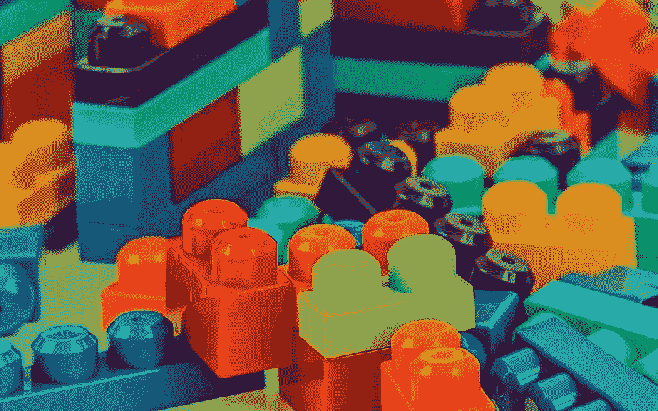

# 创建错误的软件可能是创建正确软件的最快方法

> 原文：<https://blog.devgenius.io/creating-the-wrong-software-can-be-fastest-way-to-create-the-right-software-95df7c90979c?source=collection_archive---------1----------------------->

## 你只能在看到软件的时候才知道需求是错的

史蒂夫布

> 软件就像家具或衣服，在你尝试之前，你不能确定它们是否适合你

创建错误的软件是创建正确软件的最快方法，它帮助用户理解他们想要什么，以及这是否是他们想要的。这是创建软件的过程，很困难，有时很痛苦，但结果是正确的软件。

用户可能只有在向他们展示了他们想要的东西，并且知道这不是他们创造的东西之后，才知道他们想要什么。软件不应该工作的方式有很多，但必须工作的方式只有一种。

反馈是创建软件和解决需求的最快方法。被动反馈通过需求、文档和讨论，很容易达成一致而看不到设计的问题。

# **软件开发商创造**

[软件开发是一个创造性的过程](/software-development-is-a-creative-process-an-original-masterpiece-not-a-paint-by-numbers-1700e05e6d7b)。需求是输入，软件是输出。

软件开发是昂贵的，因为软件对于客户、现有的解决方案、组织、团队、标准、行业和其他因素是独特的。

如果有现成的解决方案，客户会选择它，并节省大量资金来创建适合其业务和流程的独特软件。

软件开发人员创造

*   软件
*   特征
*   代码或定制
*   集成
*   用户界面
*   报告
*   文档

上面的项目可能是相似的，但是它们对于正在创建的软件是独特的。您可以修改现有文档，但必须针对项目进行更改。

开发人员总是在创造，而创造会有对错之分，这是推动项目前进的输出

# **造物主的诅咒**

很难不对我们创造的结果产生依恋感，也很难感觉到反馈是针对我们而不是我们的创造。

重要的是创建软件和其他项目的过程。我们无法控制人们如何接受我们的创作。开发人员应该意识到反馈可能是痛苦的，但这是学习、改进和创建正确软件的最快方式。

创造者沉浸在任务中，他们不再能以公正的视角来看待他们的创造。开发人员花在代码或文档上的时间太长了，以至于他们看不到细节(见树不见林)。

对我们的创造缺乏主观看法是造物主的诅咒。你太了解你的创造物了，移除部分会让你痛苦。作为一个创造者，你很容易受到伤害，因为有人将要评估你的创造，不会放过你的感受。

# 糟糕的结果是最好的出路

有些项目我们可以控制产量。当我们的代码进行代码评审时，会使用公认的标准进行评估。我们根据商定的模板创建文档，如果不遵循它，它将被剔除。

软件的创建并不简单，因为当用户看到软件时，它会帮助他们意识到需求是错误的。当需求是错误的，软件也是错误的，但是通常你可以在软件被创建出来之前就知道。

当开发人员创建文档时，围绕格式、语法和措辞的反馈中存在主观噪音。

用户界面很难在纸上设计，因为需求忘记了用户将如何使用屏幕。理论上看似合理的东西在实践中可能会显得笨拙和难以使用。

欢迎反馈，这意味着我们得到了真实的需求；我们离创造正确的软件又近了一步。

反馈可能意味着我们必须撤销一些开发，并以不同的方式进行。项目可能落后于项目计划，但是软件开发的目标不是满足项目计划；目标是创建所需的软件。

这就是为什么软件项目计划不能帮助创建软件的原因，因为项目中一半的人不了解软件开发，只关注项目计划，而不是软件。

# **软件不对路**

瑞安·哈乐迪的《障碍是前进的道路》一书告诉我们，障碍是前进的道路。开发团队创建的错误软件是创建正确软件的方式，你不会得到正确的解决方案。

开发人员需要理解这是过程的一部分，尽管很痛苦，但这种反馈是创建用户需要的正确软件的最快方式。创造和负反馈或正反馈是获得真正需求的途径。

项目结束时的最终软件永远不会与最初的需求相同，因为除非您重新创建现有的软件，否则了解软件应该如何工作的唯一方法就是尝试它。