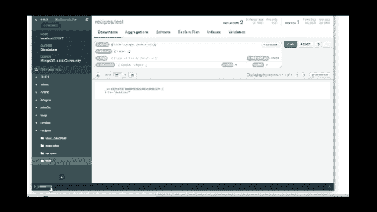

# 创建和处理 MongoDB 文档

> 原文：<https://blog.devgenius.io/creating-updating-and-deleting-mongodb-documents-94c12219783f?source=collection_archive---------11----------------------->

在我的上一篇文章中，我提供了 MongoDB 的[简介。如果您还没有检查，我建议您继续进行快速扫描，以便于后续操作。](https://medium.com/@ibtissam.makdoun/from-rdbms-to-non-relational-databases-119f4007b214)

现在是时候弄脏我们手边的文件和收藏品了。在本教程中。我会告诉你怎么做。

*   创建 MongoDB 文档；
*   查询文档；
*   创建 MongoDB 集合；
*   MongoDB 中的数据类型。

好了，我们开始马拉松吧。

## 创建文档:

MongoDB 中的文档被简单地定义为存储在 JSON 中的字段-值对，类似于 BSON 格式，代表二进制 JSON。

MongoDB 中的文档

事实上，它们类似于数据库表中的行。

现在让我们发现如何创建文档并将它们保存在数据库中，同样，我们在这里关注 MongoDB Compass 的使用。如果你想要这个教程的命令行版本，你可以参考[视频](https://www.youtube.com/watch?v=jIFU9b-TiGA)。

首先，让我们在文本编辑器中定义我们的文档:

现在，您可以使用它在 MongoDB 中创建一个文档。

现在，文档已存储在您的收藏中，您可以通过以下方式轻松找到它:

此外，您可以在查询的末尾添加漂亮的内容，以得到一个格式良好的文档。

## 使用查找查询文档

Find 是 MongoDB 中的基本注释之一。我们可以将其与 SQL 中的 SELECT *语句进行比较。使用 find 查询我们的文档和查找特定的数据非常容易。

要在 MongoDB 中查找文档或查询集合，我们使用术语[查找](https://docs.mongodb.com/manual/reference/command/find/)。术语“查找”包括*选择标准*和*投影作为参数。*

*   **选择标准:**指定要从集合中检索哪个文档。若要返回集合中的所有文档，请使用空文档({})。
*   **投影:**指定文档中符合选择条件的返回字段。

例如，如果我们想要集合中的所有文档，我们使用:

如果我们想问一些具体的问题，比如我们之前插入的文档，我们可以使用:

我们拿回文件:

按标题筛选文档

我们也可以添加条件，如果我们想匹配一个以上的东西。例如我们也可以验证*烹饪时间*

按标题和烹饪时间过滤数据

有时，文档可能包含比您想要的更多的信息，所以您需要指定或缩小您想要返回的字段。这就是为什么需要在 find 中提供第二个参数。所以我们可以使用:

查询中的一个代表真实。我们这样做，就像这样:

仅使用标题选择文档

我们也可以排除字段，例如为了排除标题我们只将查询中的 1 改为 0。

有时，尤其是当用户或客户端插入数据时。它往往是混乱的，不尊重某种格式。因此，为了搜索文档，我们可能会错过一些文档，因为它们是用大写或小写字母书写的。所以我们需要运行一个不区分大小写的查询。这就是为什么 MongoDB 也使用正则表达式，使用 [*操作符$regex*](https://docs.mongodb.com/manual/reference/operator/query/regex/) 。

## 数据类型 MongoDB:

MongoDB 文档可以存储各种各样的数据类型，这通常使开发更容易。到目前为止，我们一直在处理文本字段和数字，这与关系数据库中的情况非常相似。但是，如果想要更大的灵活性呢？以这个食谱为例。如果你感谢它，食谱有很多结构和数据，我们可以在下面的图片中看到，并在我们的脑海中分类。

配方文件示例

要保存此文档，我们可以复制所有这些文档，并将其作为文本粘贴到描述码中。但是，随后我们放松了粒度和选项，不知道以后如何处理我们的数据。比方说，我们想改变这个食谱的尺寸或份量。此时，如果我们将菜谱保存为文本，我们将有大量的重构工作要做。

有了 MongoDB，我们可以混合和匹配不同的数据类型，并按照图片上的样子存储菜谱。

让我们从指令开始，它们就像步骤和顺序问题，有点像下面的代码。

现在，对于配料，我们可以将配方中的配料存储为:

如您所见，成分值是一个数组，但这次不是字符串数组，而是一个对象数组。你也可以看到它是一个客体的客体。

现在，如果我们想通过命令行将这个文档插入 MongoDB，我们可以使用。

在 MongoDB 中通过命令行插入文档

嗯，就这样吧！

现在您知道了如何在 MongoDB 文档上创建和运行简单的查询。接下来我们将讨论如何使用操作符查询 MongoDB 文档。

如果你喜欢这个内容，我邀请你关注我，并查看我的 [YouTube](https://www.youtube.com/channel/UCIW5oGyAJ6rwo91BDacDqlg) 频道以获得更多教程。

对于我来说，我要煮一些我在写这篇教程时一直渴望的香辣虾和动物。

> 感谢您的时间，并保持安全！。