# 信用卡客户流失预测分析

> 原文：<https://blog.devgenius.io/credit-card-customer-churn-predictive-analytics-b012ff8c385d?source=collection_archive---------0----------------------->

EDA 和机器学习建模

斯蒂芬·菲利普斯-Hostreviews.co.uk 在 [Unsplash](https://unsplash.com?utm_source=medium&utm_medium=referral) 上的照片

世界上大多数银行都提供信用卡服务。这项服务很受欢迎，因为使用信用卡是支付账单、杂货、房租或任何你需要的东西的便捷方式。信用卡的工作方式类似于短期贷款，你必须在账单周期结束时的到期日之前支付账单。在这个项目中，一位银行经理对越来越多的客户离开他们的信用卡服务感到不安。我们将尝试通过创建一个**监督学习模型来解决这个问题，该模型可以预测客户是否会流失**。该模型可以帮助经理通过特别关注预期会流失的客户来降低客户流失率。

# 目录

*   [数据集和工具](#69d7)
*   [数据清理](#7a3c)
*   [探索性数据分析(EDA)](#6f82)
*   [机器学习的数据预处理](#c1af)
*   [机器学习建模](#18e9)
*   [结论](#f8d9)

# 数据集和工具

数据集是从 [Kaggle](https://www.kaggle.com/datasets/sakshigoyal7/credit-card-customers) 获取的。它有 23 个功能，包括客户档案和信用卡使用。它有 10，127 行。使用的工具是 Jupyter Notebook 和 Python。我不会在这篇文章中写所有的 python 脚本，但是你可以在这个 [GitHub](https://github.com/triesonyk/credit-customer-churn) 链接上查看完整的 python 脚本。

# 数据清理

在我们分析数据集之前，我们必须确保我们的数据没有重复，并且具有正确的数据类型。

## 复制

让我们首先检查我们的数据集是否有重复。正如我们在下面的图片中看到的，我们没有任何重复。

`raw.duplicated().sum()`

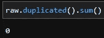

## **无用功能**

并非所有的特征都有助于分析，这就是为什么我们将删除这些无用的特征，以简化我们的下一步。有 3 个我认为没用的特性:

*   `CLIENTNUM`:客户身份证号
*   这是使用朴素贝叶斯的另一个分析的结果
*   `Naive_Bayes_Classifier_Attrition_Flag_Card_Category_Contacts_Count_12_mon_Dependent_count_Education_Level_Months_Inactive_12_mon_2`:与上一功能相同

# 探索性数据分析

在进入机器学习部分之前，我将先做一点 EDA。EDA 是分析的一个良好开端，它帮助我们发现模式，检查假设，并发现异常值等奇怪的数据点。我不会展示每个特性的所有图表和统计数据，只展示一些我认为有趣或对业务推荐有用的图表和统计数据。

## 收入类别

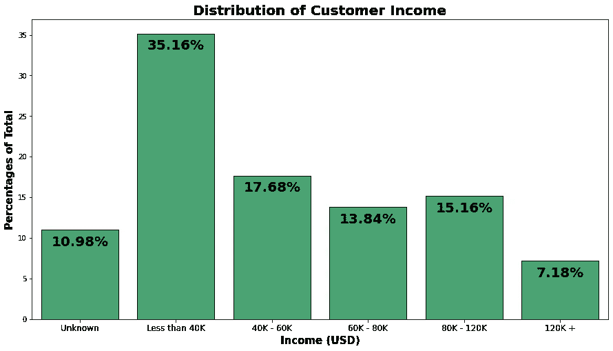

收入少于 40，000 美元的人的信用卡客户比例最高。这一人群是我们的主要目标，所以我们不把重点放在向高收入人群推销信用卡上，而是通过向收入低于 4 万美元的人推销来赢得客户。

## 教育水平

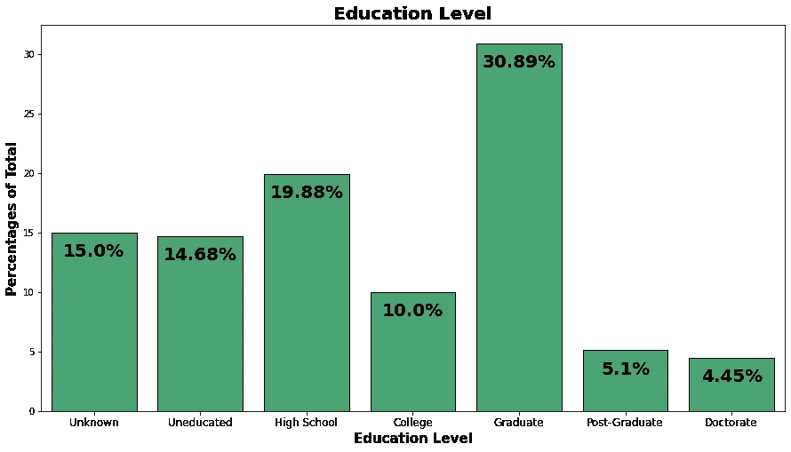

大学毕业的人(研究生)是我们最大的市场。就像收入类别的洞察力一样，我们应该优先向这一类别的人(毕业生)推广，这将提高我们的获得率。

## 交易总数

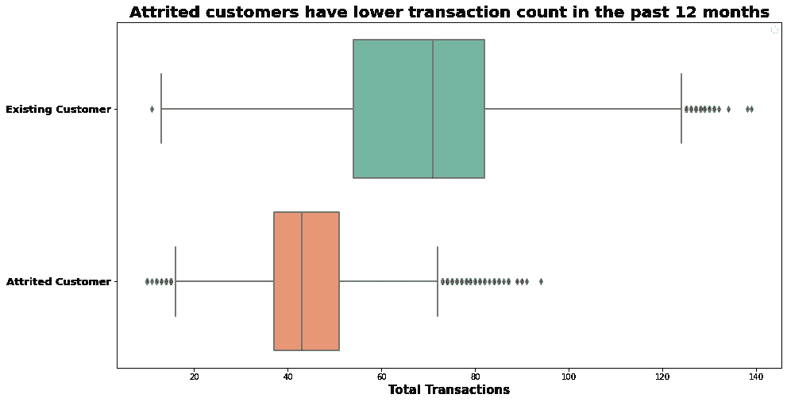

在过去的 12 个月中，流失/流失的人的总交易次数较少。为了防止流失，我们可以给予特别的关注，比如对每一笔可以兑换礼品或优惠券的交易给予积分。

## 交易计数与交易金额

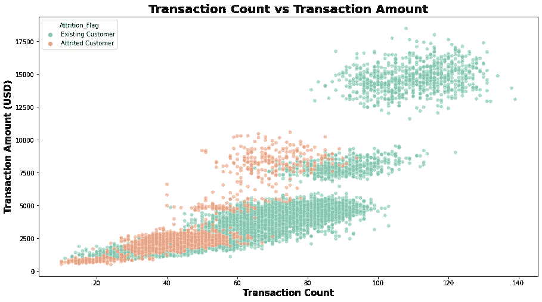

从视觉上，我们可以看到基于交易计数和交易金额的 3 个聚类，这可以使用无监督学习进行进一步分析，但仅从该图中，我们可以看到交易计数和交易金额高的人流失的机会较低，甚至没有一个人从右上方的聚类流失/流失。中间和底部的集群有一些人流失了，如果可能的话，可以进一步分析和调查这些集群，以降低他们的流失率。

## 卡片类别

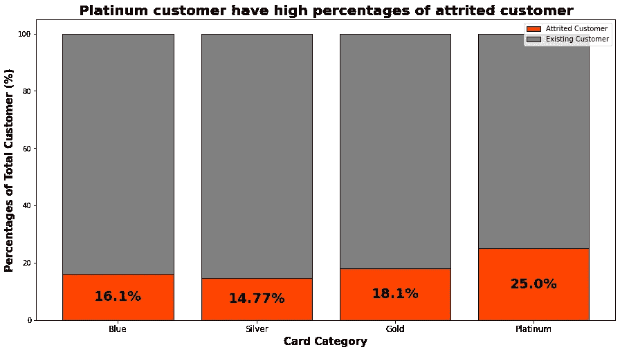

这张图表向我们展示了白金客户的一个问题，因为我们可以看到他们的流失率高达 25%。这可能意味着我们的白金产品不能让我们的客户满意。我们可以增加白金卡的收益，例如降低流失率。

# 机器学习的数据预处理

在我们创建机器学习模型之前，首先我们必须预处理数据。对数据进行预处理是为了让机器能够正确读取我们的数据。

## 缺少值

缺失值会降低我们的机器学习模型的可靠性，我们的模型可能会有偏差。这就是为什么我们必须在创建机器学习模型之前处理缺失值。有几种方法可以处理缺失值，包括:

*   删除数据点。不建议使用这种方法，尤其是当我们没有很多数据点时，这可能会导致信息丢失。我通常只删除那些有很多缺失值的数据点。
*   用中位数、众数或平均数填充。这种方法很简单，但使用时要小心，并确保我们有充分的理由选择正确的统计数据。
*   用与相似数据点相同的值填充它。您可以手动创建一个与其他功能相关的简单 IF 函数，或者您可以创建一个机器学习模型来填充缺失的值，但这不切实际，而且需要更多时间。
*   用基于商业知识的假设来填充它。对我来说，这是最好的方法，例如，如果我们缺少某个项目的评分值，这可能是因为没有人对该项目进行评分，或者可能没有人购买该项目，如果我们用 0 填充缺少的值，这意味着我们假设该项目真的很差，但如果我们用 5 填充缺少的值，这意味着我们假设该项目真的很好，所以如果我们用 3 或 4 填充缺少的值会更好。

我不认为有最好的或“正确的”方法来处理缺失值，这完全取决于数据集和情况，所以选择一种最符合您需求的方法。要检查我们是否有丢失的值，我们可以使用下面的代码:

`dfMissing.isna().sum()`

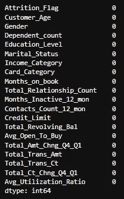

我们没有任何缺失值。来自 Kaggle 的大部分数据已经被清理了，但是真实的数据通常需要大量的预处理。

## 特征编码

进行特征编码是为了让我们的机器能够读取我们的分类数据。到目前为止，机器只能读取数字，这就是为什么我们必须将分类数据转换为数字数据。我知道有两种编码方式:

*   **标签编码**。当特征具有序数值时，我使用标签编码，例如在我的数据集中，我有`Card_Category`，该特征具有序数值，其中蓝色是最低级别，白金是最高级别。标签编码也可用于只有两个唯一值的分类特征。

要进行标签编码，您可以使用 sklearn 的 LabelEncoder，但我通常会像这样手动编码我的特征:

`mapAttrition = {‘Attrited Customer’:1, ‘Existing Customer’:0}
mapGender = {‘M’:1, ‘F’:0}
mapCard = {‘Blue’:0, ‘Silver’:1, ‘Gold’:2, ‘Platinum’:3}`

`dfLabel[‘Attrition_Flag’] = dfLabel[‘Attrition_Flag’].map(mapAttrition)
dfLabel[‘Gender’] = dfLabel[‘Gender’].map(mapGender)
dfLabel[‘Card_Category’] = dfLabel[‘Card_Category’].map(mapCard)`

`dfLabel[[‘Attrition_Flag’,’Gender’,’Card_Category’]].sample(5)`

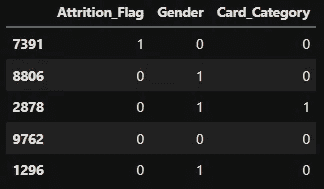

*   **一键编码**。我对其他不符合标签编码标准的特性使用了一键编码。使用一次性编码时要小心，与标注编码不同，一次性编码将创建与唯一值数量一样多的新要素/列。例如，如果我们有一个具有 100 个唯一值的要素，该要素将被拆分为 100 个新要素/列。

Sklearn 也提供了一种一键编码特性的方法，但是在这个项目中，我使用了另一种方法，使用 pandas 的`get_dummies`。我推荐使用 sklearn 的`OneHotEncoder` 而不是`get_dummies`，因为它也可以处理我们的训练数据集中不存在的新的独特特征。

`cat = list(dfOHE.describe(include=’object’).columns)
for feature in cat:
onehots = pd.get_dummies(dfOHE[feature], prefix=feature)
dfOHE = dfOHE.join(onehots).drop(feature, axis=1)
dfOHE.sample(3)`

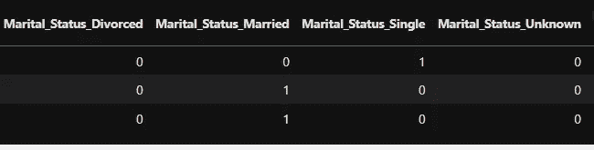

# 机器学习建模

我们的数据已经经过预处理，这意味着现在我们可以开始我们的机器学习建模。

## 列车测试分离

为了确保我们的数据不会过度拟合，我们将使用一个简单的 80:20 比例的训练测试分割。

`xtrain, xtest, ytrain, ytest = train_test_split(x, y, test_size= 0.2, random_state=42, stratify=y)
xtrain.shape, xtest.shape, ytrain.shape, ytest.shape`

## 使标准化

我们的一些特征具有不同的单位和不同的值范围，例如，Credit_Limit 具有数千美元的值，而 Customer_Age 值低于 100，一些算法会认为 Credit_Limit 对超过 Customer_Age 的目标具有更大的影响，这就是为什么我们必须标准化所有特征以确保我们的模型没有偏差。注意，不是所有的算法都对这个问题敏感，所以如果你使用某个算法或库，你不需要标准化你的特性。

`sc = StandardScaler()
xtrain_sc = sc.fit_transform(xtrain)
xtest_sc = sc.transform(xtest)`

## 过采样

我的数据集目标是不平衡的，这在欺诈或流失数据集方面发生了很多，因为没有很多欺诈或流失的客户。要解决这个问题，我们可以使用几种方法，包括:

*   **欠采样。**这种方法将去除一些多数阶层，使多数阶层与少数阶层的比例相等或至少不失衡(我认识的一些人使用 2:1 的阈值比例)
*   **过采样。**这将乘以或复制少数类的一些数据。
*   **使用 SMOTE 进行过采样。**与普通过采样类似，但 SMOTE 不是使用来自少数类的相同数据点，而是从少数类创建新的合成数据。

`smt = SMOTE(sampling_strategy=0.5)
xtrain_scsm, ytrain_scsm = smt.fit_resample(xtrain_sc, ytrain)`

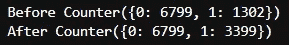

我使用 1:2 或 0.5 的比率，这就是为什么在使用 SMOTE 进行过采样后，我的少数类数据点增加到 3399。

## 拟合和模型评估

我在这个项目中尝试了几种算法，包括逻辑回归、KNeighbor 分类器、决策树、随机森林、XGBoost 和 CatBoost。所有模型使用默认参数的结果如下:

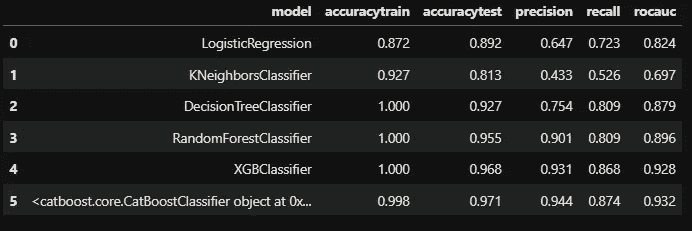

所有模型的性能都非常好，但这只发生在像我们这样的合成数据上，真实数据往往在第一次尝试时就有糟糕的结果。我会选择 XGBoost 作为我们的模型，因为它具有良好的召回率。当我们想要最小化假阴性时，回忆是好的，不同的问题需要不同的度量评估，因此相应地挑选。

## 超参数调谐

为了提高我们的模型性能，我们可以进行超参数调整，我通常使用 RandomizedSearchCV 或 GridSearchCV 来做这件事，但在这个项目中，我使用 HyperOpt 来寻找最佳的超参数。将要调整的参数有

*   **最大深度**。指定将要构建的每棵树的最大深度
*   **伽马**。指定进行分割所需的最小损失减少量
*   **reg_alpha。** L1 正则化项上的权重
*   **注册 _λ。** L2 关于权重的正则化项
*   **colsample_bytree。**每次拆分的列的子样本比率
*   **最小 _ 子 _ 体重。**一个孩子所需的所有观察值的最小权重和
*   **n _ 估计量。**树木数量

每个参数的定义来自[分析报告](https://www.analyticsvidhya.com/blog/2016/03/complete-guide-parameter-tuning-xgboost-with-codes-python/)。我发现这些是最好的参数:

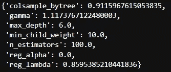

在找出最佳参数后，我们使用新的参数对模型进行了重新调整，结果是

*   精确度:0.968 → 0.968
*   精度:0.931 → 0.852
*   回忆:0.868 → 0.942
*   rocauc: 0.928 → 0.957

我们可以看到，除了精度，其他指标都在增加。精确度和召回率通常是成反比的，召回率的增加会降低精确度。

## 特征重要性

我们创建了一个机器学习模型，从该模型中，我们可以发现哪些特征对减员有很高的影响。根据所有测试的模型，过去 12 个月的交易数量(Total_Trans_Ct)是一个对流失有很大影响的特性。利用这些信息，我们可以通过特别关注在过去 12 个月中交易量较低的客户来减少流失的机会。

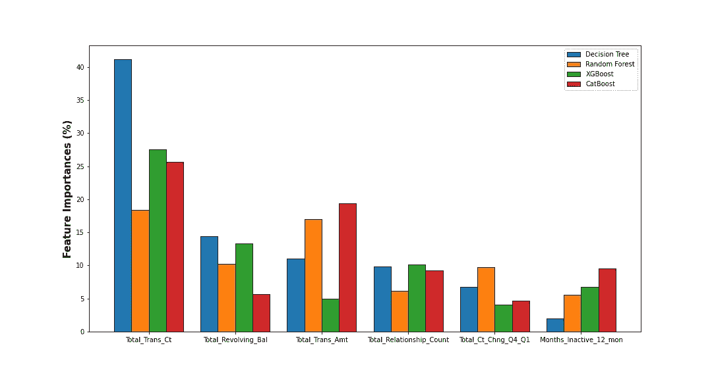

# 结论

*   我们创建了一个机器学习模型，可以使用 XGBoost 以 96.8%的准确率和 94.2%的召回率预测流失
*   过去 12 个月的交易数量被认为是对预测流失最有影响的特征
*   白金卡用户的流失率最高，为 25%。我们需要对该产品进行更多的分析，也许会给白金用户带来更多的好处。
*   收入少于 40K 并且拥有研究生学位的人是我们的潜在客户。这两个细分市场应该是我们营销的重点。