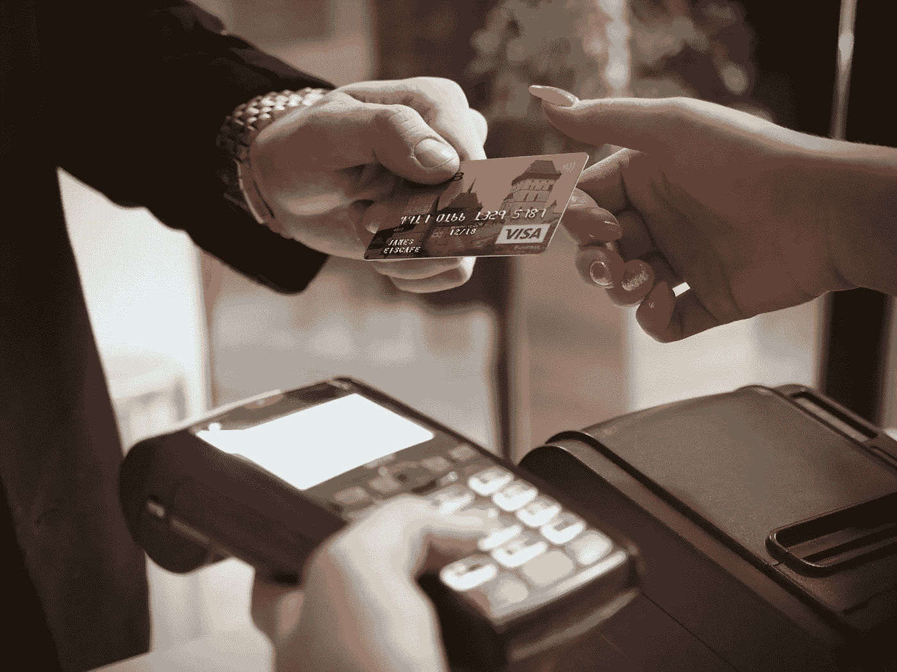

# 信用 CS50

> 原文：<https://blog.devgenius.io/credit-cs50-100c71ee10a1?source=collection_archive---------5----------------------->

来自 energepic.com 的 IMG 乘坐 [Pexels](https://www.pexels.com/es-es/foto/terminal-de-pago-negro-2988232/)

在这里，我们介绍了 Luhn 的算法，该算法允许我们确定信用卡号码在语法上是否有效，对于现实世界的问题，数据库检查也是必要的，但是 Luhn 的算法所做的是:

1.  从数字的倒数第二个数字开始，每隔一个数字乘以 2，然后将这些乘积的数字相加。
2.  将总和加到没有乘以 2 的数字的总和上。
3.  如果总数的最后一位是 0(或者，更正式地说，如果总数模 10 等于 0)，则该数字有效！

上面的算法是我们必须在程序中实现的。看起来很简单对吗？

让我们来看看主体的第一部分。我们需要做的第一件事是从用户那里获得卡号，我们使用函数`get_long`我们不能使用`int`因为信用卡号码有太多的字符，`get_long`已经处理了像字母或其他不计数的字符这样的输入，我们需要获得信用卡的长度，我们声明两个变量`length`等于 0，它将存储总的卡长度，`a`将存储卡号。

我决定使用一个`do while`循环，将一个数除以 10 会去掉它的最后一个数字，所以`while` `a`大于 0 我们会去掉`a`的最后一个数字，并且我们会增加`length`变量来得到输入的 CC 的长度

在 main 的第二部分，我们检查卡是否有效。我们需要打印无效的，或者如果有效，我们需要打印公司的名称。

卡号只能有 13、15 或 16 位，所以这是我们用`if`语句检查的第一件事。

在那之后，我们初始化并声明一些我们稍后会用到的变量，其中一个是`last`，它存储每个`do while`循环后的最后一个数字，我们稍后需要求和在`last`用`last = x % 10;`存储当前的最后一个数字之后，我们删除当前的最后一个数字，然后我们对每个循环中的最后一个数字求和，*这将是 Luhn 算法的第二部分(将总和加到没有乘以 2.0 的数字的总和上)*,我们将其存储在

现在我们必须做 Luhn 算法的第一部分，做第二部分可能会有点混乱，但我发现这样做更容易，我们需要*将“每隔一个数字乘以 2，从数字的倒数第二个数字开始，然后将那些乘积的数字加在一起”。*在上一部分之后，我们删除了最后一位数字，所以现在我们有了存储在变量中的倒数第二位*数字，然后我们删除它，我们调用函数`sumDoubledNumber`负责将乘法所得的两位数相加，然后我们将乘积相加，循环再次开始，直到没有剩余的卡数字，并且添加了`doubledSum and notDoubledSum`。*

在 main 的第三部分，我们检查品牌名称，这一部分的第一个检查是"*如果总数的最后一位是 0(或者更正式地说，如果总数模 10 等于 0)，则该数字有效！"，*如果通过，我们检查品牌，我们做的第一个是 VISA，唯一有 13 个数字的卡是 VISA，所以如果`length`是 13，我们打印 VISA，或者如果卡号从 4 开始，有 16 个数字作为`length`，它也应该是 VISA，这里`secondToLast`作为卡号的第一个数字。

如果该号码符合签证的要求，我们检查它是否是美国运通卡，该卡必须有 15 个数字，具有`checkAMEX`功能。

如果号码有 16 位，我们用`checkMC` 功能检查是否是主卡，这样就完成了我们的主功能。

## 功能。

第一个函数是处理两位数的数字，如果乘以 2 返回一个两位数的数字，我们需要分别对它们求和，为此我们使用模运算符去掉第二个数字，然后用 1 求和，因为一个数字乘以 2 最高可以是 18，否则我们只返回和。它在每次循环中都将倒数第二个数字作为参数。

第二个函数将检查卡是否是美国运通卡，以卡号作为参数，在这种情况下，所有的美国运通卡都以 **37 开始，**我决定做一个`do while`循环，当最后一位数超过 38 时，继续丢弃数字，如果最后两位数等于 **34 或 37** ，则该卡是美国运通卡，否则无效。

第三个函数将检查该卡是否为主卡，基本上与上面的算法相同，我们只是将数字替换为 **56、51 和 55** 。

现在我们的程序完成了，应该可以通过测试了。这里有一些号码来检查您的程序:378282246310005 作为美国运通，5105105105105 作为万事达卡，401288888881881 作为 VISA，5673598276138003 作为无效

感谢阅读。如果这有帮助，请随意鼓掌两次，如果你觉得淘气，请跟我来。).