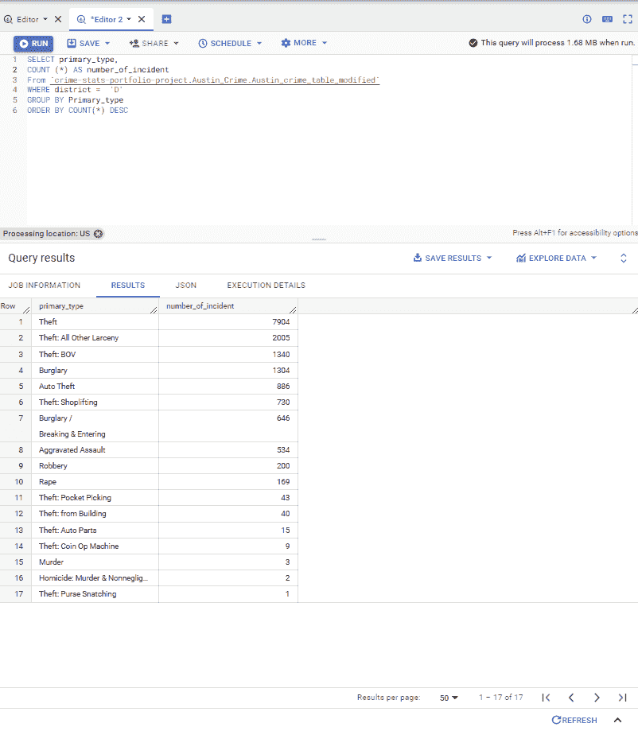

# 使用基本 SQL 查询的犯罪数据集分析

> 原文：<https://blog.devgenius.io/crime-dataset-analysis-using-basic-sql-queries-d81d4e7caa52?source=collection_archive---------5----------------------->

嗨！

在这篇文章中，我使用了我在谷歌数据分析认证项目中学到的一些基本 SQL 查询来分析一个公共犯罪数据集。

这个数据集在 BigQuery 上有:[big query—Project C5 w1—Google Cloud console](https://console.cloud.google.com/bigquery?project=project-c5w1&ws=!1m5!1m4!4m3!1sbigquery-public-data!2saustin_crime!3scrime)

也可以在 kaggle 上找到:[奥斯丁犯罪统计| Kaggle](https://www.kaggle.com/datasets/jboysen/austin-crime)

该表及其模式的快速预览显示它有 18 列和 116，675 行，如下所示。如此庞大的数据集意味着可以从中获得大量见解，并且可以运行大量查询。

我的第一步是决定我想从这个庞大的数据集中获得什么样的见解。这个数据分析阶段是**提问**阶段。

以下是我想到的问题:

1.  哪个警区的整体犯罪事件数量最多？
2.  上面那个区什么犯罪率最高？
3.  哪一年这个地区的犯罪率最高？
4.  在这一特定罪行发生率最高的年份，这一罪行的破案率是多少？
5.  计算通过逮捕清除每个事件的时间长度(以天为单位)。

接下来，我进入了数据分析的下一阶段。**准备**阶段。在这里，我创建了一个表，它只包含我从这个庞大的数据集中需要的列和行。

对于我想从这个数据集中获得的洞察力，我只需要 *unique_key、address、district、primary_type、description、timestamp、year、clearance_date 和 clearance_status 这几列。*

我使用下面的查询来选择所需的列。我还使用 CAST 函数将 timestamp 和 clearance_date 列从 datetime 格式更改为 date only。

我将结果保存为新的 BigQuery 表:

我移动到这个新表，并继续进行数据分析的**过程**阶段。在这里，我按照下面列出的步骤对新表进行了一些清理。

首先，我检查了每一列的空值。

我从第一列 *unique_key* 开始，运行下面的查询。唯一键列有一个空值，如下所示。

我对新表中的所有列重复这个过程，发现 clearance_date 和 clearance_status 列中有 5114 行包含 null 值。我发现 clearance_date 列中的 null 值在 column_status 日期中有对应的 null 值。

由于我的见解包括使用不同类型的许可状态进行计算，并且样本大小为 116，675 个事件，因此我从表中删除了 5115 个空行(1 个 unique_key 行和 5114 个 clearance_status/date 行)，从而将样本大小减少到 111，560。

我再次运行查询来检查空值，以验证所有的空值都已被删除。

数据清理过程的下一步是找出我的数据集中有多少个警区。我使用了下面的查询，显示了 12 个不同的警区。

我还运行了一个查询来揭示数据集中不同类型的犯罪。这揭示了 18 种不同类型的犯罪。

在上面的结果中，除了 Agg 攻击，还有严重攻击。快速的谷歌搜索显示这两个词是相同的。因此，为了保持一致，我使用下面的查询将所有具有 Agg 攻击的行更改为严重攻击。这使得*初级 _ 类型*一栏中的 3932 行从 Agg 攻击变为加重攻击，并将*初级 _ 类型*从 18 减少到 17。

我再次运行查询以显示不同的 primary_type，以确保我的数据得到更新，并且只有 17 种不同的 primary _ type 犯罪

.

然后我进入了数据分析过程的**分析**阶段。

问题 1: **哪个警区的整体罪案数字最高？**

为了回答这个问题，我使用了下面的查询，该查询显示“D”区有 15，831 起事件。

这意味着我想从该数据集获得的所有见解都将基于 d 区。

问题 2: **以上区(D 区)什么犯罪发案率最高？**

我使用了下面的查询，结果显示盗窃犯罪率最高，共有 7904 起。

好的，这意味着进一步的分析将基于 D 区的盗窃犯罪。

问题 3: **哪一年这个地区的犯罪率最高？(D 区盗窃案)**

首先，我使用下面的查询来查找整个数据集覆盖的 D 区的不同年份，结果显示年份范围从 2014 年到 2016 年。

下一步是找出 d 区每年发生的 7904 起盗窃事件中有多少起。

下面的查询显示盗窃发生在 2015 年和 2016 年。

2014 年的盗窃事件没有结果起初很奇怪，但 2015 年的 4035 起盗窃事件和 2016 年的 3869 起盗窃事件加起来总共有 7904 起盗窃事件。

我有兴趣找出为什么 2014 年没有盗窃犯罪，但这将偏离我计划回答的问题，所以希望我会在另一篇文章中深入探讨这个问题。

这意味着后续分析将基于 D 区 2015 年的盗窃事件。

问题 4: **这一特定犯罪在最高年份的结案率是多少？**

我使用下面的查询计算了 2015 年 D 区盗窃事件的 clearance_status，得到了下面的结果。

这表明，2015 年在 D 区发生的 4035 起盗窃事件中，只有 585 起通过逮捕得以清除。

(注:我把所有的通关状态数字加起来，以确保我的数字加起来是 4035)

问题 5: **计算通过逮捕清除每个事件的时间长度(以天为单位)。**

为此，我使用了简单的 SQL 计算和提取函数，如下面的查询所示:

最右边一栏中的结果显示了 2015 年 D 区每起盗窃事件实施逮捕所需的时间长度(以天为单位)。

从所有这些问题中可以进行很多深入的分析，但我的目标是使用大约 8 条 SQL 语句。对于这个分析，我最终使用了 SELECT DISTINCT、CAST、UPDATE、GROUP BY、ORDER BY、EXTRACT、DELETE、COUNT 和 COUNT(*)函数/语句。

欢迎反馈和建议。

谢谢大家！