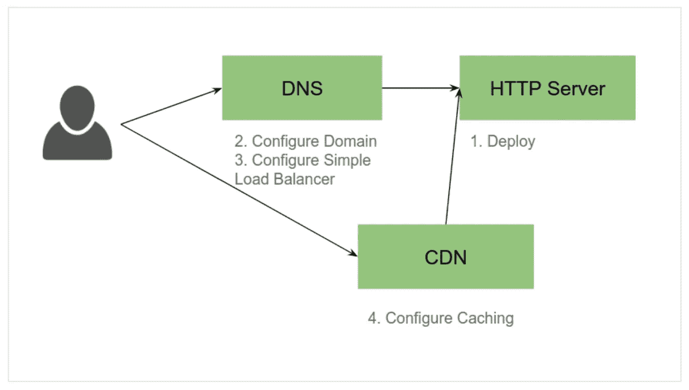
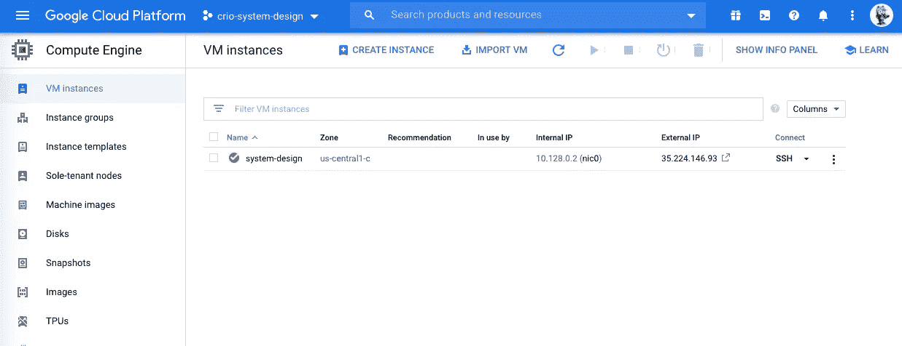
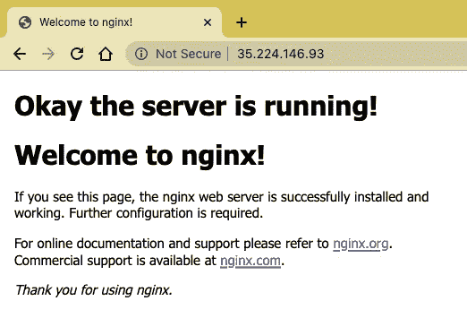
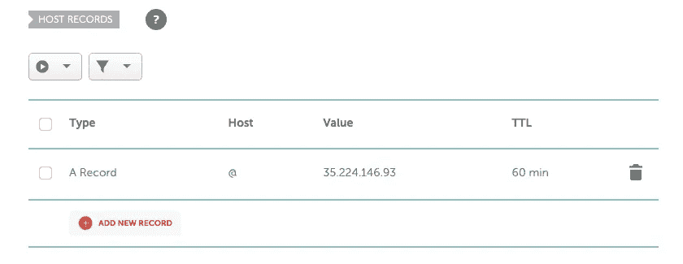
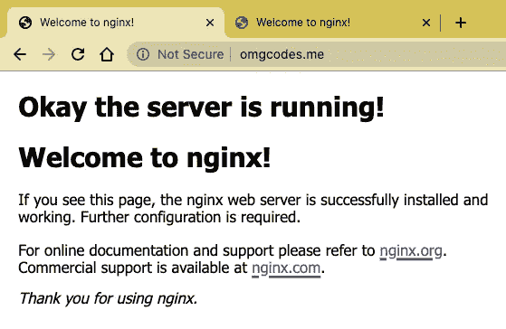
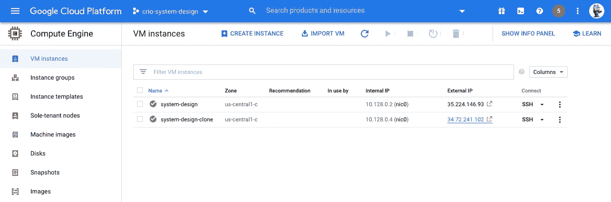
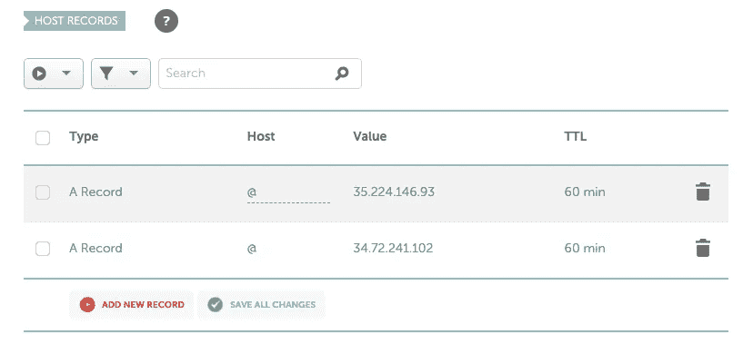
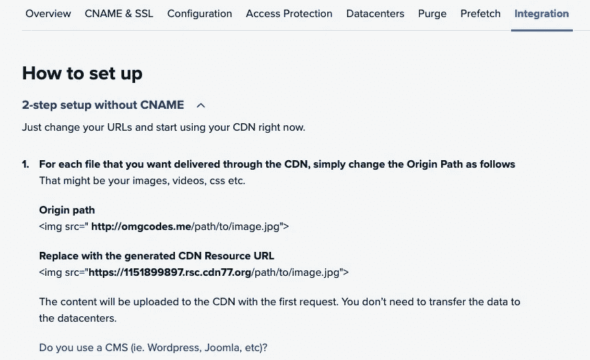

# Crio.do QPrep 系统设计微体验🌻

> 原文：<https://blog.devgenius.io/crio-do-qprep-system-design-micro-experience-36ca8330252?source=collection_archive---------13----------------------->

## 通过边做边学的方法，我扩展了我在系统设计领域的知识。


照片由[乔丹·哈里森](https://unsplash.com/@jordanharrison?utm_source=medium&utm_medium=referral)在 [Unsplash](https://unsplash.com?utm_source=medium&utm_medium=referral) 上拍摄

刚开始这个微体验的时候，对系统设计和工作原理都不熟悉？以及其他与此相关的事情。但是是的！我很好奇，让我们来探索这一点，学习一些对我来说完全新的东西。在这个微观的经验中，我学到了如果你是系统设计领域的新手所必需的所有基本原理。还有，当你面对系统设计面试的时候，要记住的所有基本点。 ***我最棒的部分是我正在学习的东西，我必须亲自接触所有的东西。我喜欢这种方法。👩🏻‍💻***

嗯，我要在这个我身上实现一些新的东西，比如-

*   在云中创建一个虚拟机(VM)并部署一个 HTTP 服务器。**(部署 web 服务器)**
*   理解当你点击一个 URL 时发生的一系列事件。**(配置域)**
*   使用 DNS 配置一个简单的负载平衡器，并理解负载平衡的概念。尝试设置 HTTP 负载平衡器作为额外的挑战。(**配置简单负载平衡器)**
*   找到一个解决方案来处理你的网站流量超载的问题。**(配置缓存)**


[资料来源:Crio.do](http://crio.do)

# 我从这个我身上学到了什么？

客户端-服务器架构、HTTP、DNS、NS、负载平衡、缓存、数据一致性等等。✨

**先决条件**:基本 Linux

# 我在 QPrep 系统设计微体验中做过什么？

在本 ME 中，有四个模块，其中一个介绍性模块将清楚地解释系统设计的基本要点。你将从这个我身上学到什么。好吧！因此，我不会简单地分享所有内容，但我肯定会添加所有资源来跟进。你应该自己尝试一切，因为这是国际台的主要关注点。

如果有任何疑问，即使你认为这是一个愚蠢或初级的问题，也请在论坛上提问。crio.do 导师总是在那里帮助你:)当我完成这个模块时，我发现它非常困难，但感谢所有 crio 导师、朋友和帮助我解决问题的人。此外，您必须成功完成每个模块，才能解锁下一个模块。所以我们来过一遍系统设计的每个模块(耶！我太激动了)🤩

这是我们将在这个 ME 中学习的所有内容的基本架构图:



来源:Crio.do Workspace

# 模块 1:在云中托管 web 服务器

本模块的任务是首先在谷歌云平台(GCP)中创建一个虚拟机(VM)。☁️:是的，你当然可以选择不同的云提供商。之后，在虚拟机中部署和配置一个 NGINX HTTP 服务器。我已经通过以下方式开始着手这项工作:



展示系统设计虚拟机的 GCP

1.  在 GCP 上创建了一个账户。如果您是学生，请点击此[链接](https://edu.google.com/programs/students/?modal_active=none)创建一个学生 google cloud 帐户。
2.  在 GCE 上创建一个虚拟机。您可以按照这个 [***谷歌指南***](https://codelabs.developers.google.com/codelabs/cloud-create-a-vm/index.html?index=..%2F..index#0) 在您选择的云提供商中创建一个虚拟机。
3.  [***为您的虚拟机配置一个静态外部 IP***](https://cloud.google.com/compute/docs/ip-addresses/reserve-static-external-ip-address) ，使其在每次重启后都不会改变。并将虚拟机防火墙规则配置为接受 HTTP & HTTPS 流量。
4.  通过使用以下命令安装和配置 NGINX 服务器来运行 HTTP 服务器-

```
#Start the server-
sudo apt -y install nginx#Check the status of server-
sudo service nginx status#Confirm that your web server is working by checking if the port 80 is open from within the VM-
telnet localhost 80
```

5.在您的笔记本电脑浏览器中键入 ***http://vm-ip*** ，看看您是否能够使用 Nginx 查看您刚刚托管的网页。

6.下一步也是最后一步是改变你网站的 HTML 内容。耶！你会看到这样的东西:



nginx 服务器已安装并正在运行👀

**了解到:** Web 服务器、GCP、NGINX HTTP 服务器、虚拟机、Ping 和 Telnet

# 模块 2:在一个域中托管你的站点并理解相关的协议

本模块的任务是理解 HTTP 如何工作的深层含义，并配置 DNS 服务器将域名指向您的 IP。所以，我已经开始着手这项工作:

1.  ***采购一个域*** 。(嗯哼！如果你有 GitHub 帐户，注册 GitHub 学生开发者包，并获得一年的免费域名，那就没问题。💁🏻‍♀️)嗯，我用了便宜的名字。
2.  第二步是在浏览器上打开开发者工具，导航到网络部分。我可以说这是本模块最有趣的部分。我 ***玩了一圈网络段*** 详细了解了请求头、响应头、响应体等。
3.  现在， ***配置 DNS 指向你的站点*** 。您可以通过打开您的域的管理部分来完成此操作。



正在添加 DNS“A”记录

*   添加一个***DNS‘A’记录*** ，指向你的 ***vm-address*** 。
*   如果你的网站已经有“A”记录，删除它们，并添加一个新条目。
*   添加您的虚拟机 IP 地址和 TTL。
*   等待几分钟，您应该可以通过键入 http://(在浏览器中)来访问您的 web 服务器。这是外观



在我的域上运行的 nginx 服务器( [omgcodes.me](http://omgcodes.me) )🙈

**了解到:** HTTP 协议、DNS、HTTP 错误代码

# 模块 3:负载平衡器的乐趣

该模块的任务是配置 DNS 负载均衡**配置一个 HTTP 负载均衡器。负载平衡器所做的是，如果一台服务器出现故障，负载平衡器会将流量重定向到其余的在线服务器。当一个新的服务器被添加到服务器组时，负载平衡器自动开始向它发送请求。所以，我已经开始着手这项工作:**

1.  *****克隆你的虚拟机******创建一个复制的 VM*** ，它将服务于第二台 HTTP 服务器。你可以按照这个[指令](https://geekflare.com/clone-google-cloud-vm/)去做。**

****

**克隆虚拟机🙆🏻‍♀️**

**2. ***配置 DNS 负载均衡*** 通过映射您域中的两个 IP。增加了一个指向你克隆的 ***虚拟机地址的***DNS‘A’记录。**

****

**VM1 和 VM2 的样本“A”记录**

**3.现在当你 ***ping <域名>*** 时。你会在你的终端上注意到，你的网站现在由 VM1 或 VM2 提供服务。**

> **DNS 服务器在这里做了什么？**
> 
> **它开始**在它所映射到的多个 IP 地址上循环**你的请求。这叫做 **DNS 负载均衡**。**
> 
> **即使当您的一个虚拟机关闭时，您的网站将继续运行(由另一个虚拟机提供服务)。)这样，您可以了解如何实现服务的高可用性。**

****了解到:**负载均衡器**

# **模块 4:利用 CDN 扩展您的服务器性能**

**该模块的任务是**了解性能瓶颈**和**配置内容分发网络(CDN)** 以提高服务器性能。与其他模块相比，这个模块对我来说有点难，我只用了 1-2 天就完成了。所以，我已经开始着手这项工作:**

1.  *****选择免费的 CDN 提供商*** 。(我选了这个[https://www.cdn77.com/](https://www.cdn77.com/))**
2.  **下一步是 ***配置 webserver 来服务大型图像。*** 我已经下载了主目录中的大图，并将其添加到 HTML 内容中。之后，重新加载网站，看看大图。嗯，它需要更多的时间来加载，因为它是一个大文件。于是，我 ***配置 DNS*** 和 ***检查网站的基准性能*** 。比如缓存或不缓存需要多少时间。**
3.  **现在， ***配置 CDN*** 看看当我们从 HTTP 服务器提供大型图像时会发生什么，以及当我们从 CDN 提供商提供相同图像时会发生什么。(是的，您必须设置 CDN 资源才能完成此步骤)**

****

**设置 CDN 提供商**

**4.现在，最后一步是了解数据的最终一致性，如缓存如何工作以及多个数据源是否提供相同的数据。我通过一个例子了解到了这一点。**

**5.阿雅！这就是我在本模块中所做的全部工作。🎉**

> **在配置 CDN 时，它所做的是缓存图像、视频和您的页面，然后在 HTTP 服务器上提供这些内容。**

****了解到:** CDN、缓存、数据一致性等等**

# **在这个自我中，我知道了一些重要的事情**

*   **如果你有系统设计的知识，那么确保你对典型的 web 架构的复杂性有更好的理解。**
*   **深入了解了一些最重要的事情，比如当我们键入 [www.crio.do](http://www.crio.do) (任何 URL)时，浏览器后端会发生什么？**

*****丫！以上就是我的 qp-系统设计边做边学的经历。最后，我要感谢 Crio 为我们制作了两个免费的我，并组织了如此令人惊叹的***[***# IBelieveInDoing challenge***](https://www.linkedin.com/posts/archanaserver_ibelieveindoing-ibelieveindoing-learnbydoing-activity-6677078666884857857-i-el)***。✌🏻期待更多这样惊艳的挑战。😍*****

*****另外，再次感谢 Crio 和 Crio Dev 社区组织此次系统设计研讨会。我发现这真的很有趣，也很有帮助，尤其是挑战。我也明确了很多概念，学到了很多新东西。😌*****

****

**[来源:Crio.do](http://crio.do) ***💖*****

****你也可以在这里试试免费的我:**[**https://crio.do/#tryouts**](https://crio.do/#tryouts)**

**感谢您阅读本博客！如果你觉得欣赏我的作品 有帮助 ***请鼓掌，你知道你可以按下“鼓掌”👏按钮 50 次😉。如果有任何帮助，请在以下网站上找到我: [Twitter](https://twitter.com/archanaserver) ， [LinkedIn](https://www.linkedin.com/in/archanaserver/) ， [GitHub](https://github.com/archanaserver) 。我们连线吧！🤝*****

**保持安全和健康🌸**