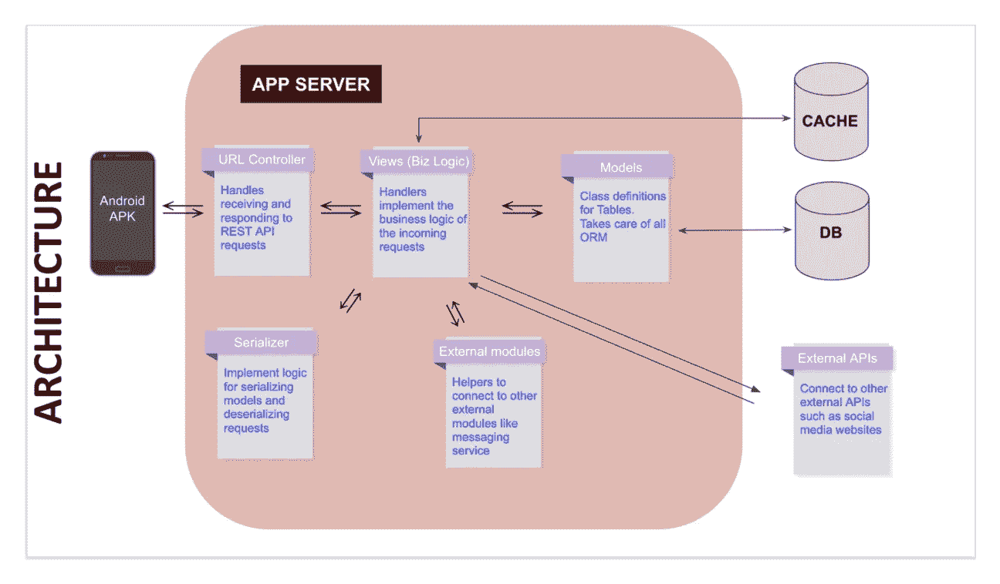
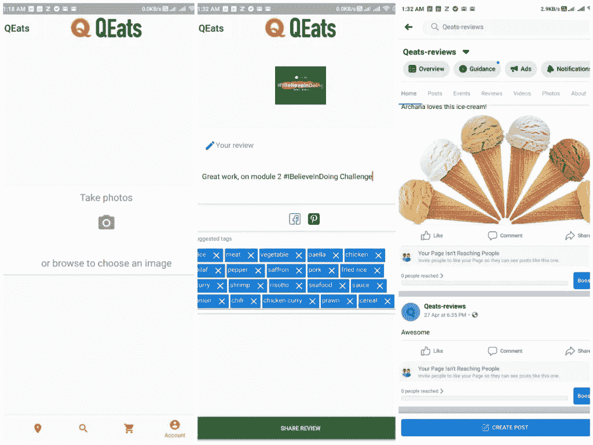

# Crio QReview 微体验🐝

> 原文：<https://blog.devgenius.io/crio-qreview-micro-experience-c8eb8edcafda?source=collection_archive---------15----------------------->

## 通过“边做边学”的方法，我扩展了自己在 API 实现、Postman、cURL 方面的知识，还学习了面向对象编程技术的实际实现。

在这个“我”中，我在各种社交媒体网站上创建了一个 QEats 评论页面。并使用一系列 REST APIs 将用户提交的评论发布到 QEats 评论页面。并以一个人工智能支持的分类器来建议相关的评论标签。👩🏻‍💻

好吧！我要分享我在这个我中学到的东西，以及我是如何实现 API 的(没有剧透)。QEats 应用程序(Android)包括几个功能，如:

*   用户可以从他们选择的餐馆点他们喜欢的菜。
*   他们可以点击他们收到的订单的照片，写下引人注目的标题，并添加相关标签，使他们的评论容易被发现。

在开始实施过程之前，我想分享一些事情(关于 crio.do):

资料来源:Crio.do

# 什么是微体验？

Crio MEs workspace 通过以下工作为开发人员提供相关技能:

*   *现实世界的问题*
*   *计划执行*
*   *自适应制导*
*   *绩效评估*

给你一个提示在开始任何 ME 的 ***之前，一定要反复仔细地阅读所有的说明*** *(是的仔细)*直到你明白为止。💪🏻同样在一开始，如果你是一个初学者和沮丧的人，你会发现这有点困难，但不要担心**[***forum . crio . do***](http://forum.crio.do)***向你的朋友*** 询问你的疑问(但要确保你正在学习所有的东西，否则做我是浪费)，并且 ***与其他开发者*** 。呀！在任何情况下，这些都是成功学习新事物的关键。**

****

**[Crio 社区](http://forum.crio.do)**

# **我从这个我身上学到了什么？**

**REST API、Python 请求模块、CURL、Postman、JSON 解析、脸书共享 API、Clarifai 预测 API 等等。**

# ****我在 QReview 微体验中学到了什么？****

**在这个自我中，有四个模块，其中一个介绍性模块将清楚地描述你要做什么？你要学什么？好了，你必须按顺序成功完成每个模块，同时获得显示**评估成功的实时评估状态！**(通过所有测试用例)开始下一个模块。**

> ****注意:**QReview 后端提供了所有必要的功能，使用户能够从附近的餐馆订购他们喜欢的菜肴。**

**这是 QEats 应用服务器的架构及其工作原理**

****

**来源:Crio.do Workspace**

## **模块 1:向脸书页面发布消息**

**本模块的任务是编写一个 Python 程序，将消息发布到 QEats 的脸书预览页面。我已经开始研究这个了:**

1.  **通过**获取**Crio 工作空间上的源代码(vscode)。**
2.  **安装一些需要的**包**。**
3.  **使用 python **请求模块**将帖子发布到脸书页面。**
4.  **此外，使用[脸书图 API 文档](https://developers.facebook.com/docs/graph-api/reference/page/photos/#example-2)(这是一个基于 [HTTP 的 API](https://developers.facebook.com/docs/graph-api/overview) )来了解 ***请求*** 以及我必须选择哪个来将*消息发布到脸书页面。***
5.  **之后，我们学习了如何在 Python 上发出 HTTP 请求，为了与外部 API 或服务进行通信，需要发出 HTTP 请求。在 python 中，可以通过使用“请求”库来完成。**
6.  **最后，关于 cURL 命令及其到 Python 的转换。**

**这对我来说很棘手，因为我以前从未在 Python 上编码过，所以这需要时间。此外，我从我的朋友和 crio 社区得到了一些帮助。**

****了解到:**脸书图 API 端点，HTTP 请求使用 Python，cURL 命令**

## **模块 2:分享应用程序对脸书的评价**

**这里的任务是，通过使用前面的模块功能，将 QEats Android 应用程序的评论发布到脸书页面。通过以下方式开始实施:**

1.  **运行完整的 ***QEats 后端服务器*** 。**
2.  **在我的手机上安装 QEats 应用程序进行配置。**
3.  **将 QEats android 应用程序连接到 QEats 后端服务器。**
4.  **使用 ***POST API*** 将应用程序中的评论发布到 QEats 脸书页面。**
5.  **您还可以创建自己的脸书页面，生成一个 ***页面访问令牌*** ，并在自己的页面上发布 QEats 评论(使用页面 ID 和访问令牌)。**
6.  **我第一次使用 [Postman](http://postman.com) 将 ***短期访问令牌*** 转换为 ***长期访问令牌*** 。此外，如果有任何帖子添加到您的脸书页面，请使用它作为 ***验证令牌*** 。(我很享受)**

****

**在我的手机上运行 QEat android 应用**

****学过:** REST API，cURL，JSON，HTTP 错误码，Django web 框架。**

## **模块 3:分享 Pinterest 上的评论**

**该模块的任务是在 QEATs 的后端扩展支持，以便能够将评论发布到 Pinterest 板上。要在 Pinterest 上发布用户评论，你必须首先获得必要的认证证书。之后，你要用 **Pinterest 的 POST API** 来发布用户评论。开始此模块:**

1.  **通过解决**的*合并*的**冲突。**
2.  **然后，注册成为一名 [***Pinterest 开发者***](https://developers.pinterest.com/) ，并使用 Postman( *生成 HTTP 请求*)获得一个 ***访问令牌*。****
3.  **使用 [***Pinterest 创建图板 API***](https://developers.pinterest.com/docs/api/boards/?) 创建 Pinterest 图板。**
4.  **使用[***Pinterest API Explorer***](https://developers.pinterest.com/tools/api-explorer/?)尝试测试 API 端点，并向 QEats 评论板添加 pin。**
5.  **完成代码待办事项，并创建一个函数，应发布一个给定的消息和照片的 pin。**
6.  **此外，处理我从 android 应用程序共享到 Pinterest 的应用程序请求。**

****学会了:** Pinterest 分享 API，还有邮差。**

## **模块 4:使用人工智能服务建议查看标签。**

**呀！所以我去了最后一个 module(Wooohhh🥳)你猜怎么着，我对这个完全是陌生的。该模块的任务是使用第三方人工智能服务，根据用户上传的图像自动建议标签。当我第一次读它的时候，我像什么？！？！呃-哼！我该怎么做？我对人工智能一无所知。但谢天谢地，读完整个部分后，我开始得到一些要点。**

> **您将向 Clarifai 发送 QEats 评论图像，并收到潜在类别匹配的列表。然后，您将把这个类别列表作为建议#hashtags 发送给用户，让用户从中选择并添加到他们的评论中。**

**所以我开始研究这个模块:**

1.  **在[***clari fai***](https://www.clarifai.com/)报名，获取 ***API 密匙*** 。**
2.  **使用 Postman 和 [Clarifai API](https://www.clarifai.com/models/food-image-recognition-model-bd367be194cf45149e75f01d59f77ba7#documentation) 来获得你最喜欢的食物图片的类别匹配。(用过的 ***Clarifai 食品型号*** )**
3.  **按照说明对代码进行了更新和更改，以便将用户图像发送到 Clarifai 进行分类。编辑这些类别的列表，并将其发送到 QEats 应用程序，以#hashtag 建议的形式显示。**
4.  **Tadaa！🎊提交代码和**评估成功！****

****获悉:** Clarifai 预测 API**

**作为后端开发的初学者，我学到了很多新东西。对于每个测试案例，我都会起鸡皮疙瘩很多次。(什么感觉🤩).尽管通过所有测试需要 2-3 天，但一切都是值得的。我学到了很多。😍**

**呀！以上就是我总结的边做边学的经验。最后，我要感谢 Crio 为我们制作了免费的两个我，并组织了如此精彩的[**# ibelieveindong****挑战赛**](https://www.linkedin.com/posts/archanaserver_ibelieveindoing-ibelieveindoing-learnbydoing-activity-6677078666884857857-i-el) 。✌🏻**

****

**[资料来源:Crio.do](http://crio.do)**

**我想分享的另一件事是，我看了很多视频，看了很多博客来实现一些事情，但是我从来没有像现在这样满足过。我非常感谢 Crio 给我的一切。Crio 最好的部分是他们总是 ***专注于实现*** 无论你正在学习什么，你都必须实现并通过实践来展示。我真的很喜欢这种方法，它帮助我在一个人身上学到了很多东西。现在，我可以自豪地说，我是 Crio 平台的忠实粉丝。😌**

**感谢您阅读本博客！如果你觉得欣赏我的作品 有帮助 ***请鼓掌，你知道你可以按下“鼓掌”👏按钮 50 次😉。如果有任何帮助，请在以下网站上找到我: [Twitter](https://twitter.com/archanaserver) ， [LinkedIn](https://www.linkedin.com/in/archanaserver/) ， [GitHub](https://github.com/archanaserver) 。我们连线吧！🤝*****

**保持安全和健康🌸**