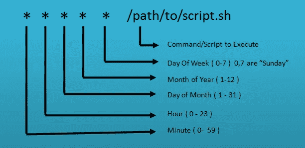

# Cron & logrotate:如何使用 Cron 自动化任务

> 原文：<https://blog.devgenius.io/cron-logrotate-how-to-use-cron-to-automate-tasks-a93069d9185c?source=collection_archive---------1----------------------->

如何管理 Linux/Unix 服务器中的日志文件

## 什么是 logrotate？


**图片 src:** [**极客玩意儿**](https://www.thegeekstuff.com/2010/07/logrotate-examples/)

***Logrotate*** 是一个用来管理系统进程创建的日志文件的工具。它自动压缩和删除日志，以最大限度地方便日志和保存系统资源。这是通过日志文件的自动旋转、压缩、删除和邮寄来实现的。

***Logrotate*** 旨在简化生成大量日志文件的系统的管理。它还为系统管理员提供了对如何以及何时处理日志轮转的广泛控制。每个日志文件循环可能每天、每周、每月处理一次，或者在日志文件变得太大时处理。正常情况下，logrotate 作为每日 ***cron*** 作业运行。

## Cron 是什么？

软件实用程序 ***cron*** 是一个基于时间的作业调度程序，在类似 Unix 的计算机操作系统中，包括 Linux 发行版。建立和维护软件环境的用户使用 ***cron*** 来调度作业( ***命令或 shell 脚本*** )以在固定的时间、日期或间隔定期运行。


**在**[**https://crontab.guru/**](https://crontab.guru/)了解更多关于 cron 的信息

Cron 在后台运行，用 cron 调度的任务称为“ ***cron 作业*** ”。

这些 cron 作业是自动执行的，这使得 cron 对于自动化系统维护相关的任务或管理任务非常有用。

在本文中，我将演示如何使用 cron 来自动化任务。但是，我不会深入研究 cron 和 logrotate 语法，因为它会根据您想要完成的任务而变化。了解有关特定日志旋转的 logrotate 和 crop 语法、表达式和配置设置的更多信息；只是 ***谷歌*** 而已。

# 如何以及何时使用 logrotate 或 cron 作业来自动化日志文件管理任务


因此，最近我需要清除多个备份服务器上的防火墙管理器和网关的旧备份文件。我想为每台有备份的服务器只保留一个月的备份日志文件。

> **假设:**
> 
> 对于本文的这一部分，我假设您熟悉 logrotate 和 cron 作业设置或配置

首先，我决定使用 ***logrotate*** ，并在/etc/logrotate.d 中为每台服务器设置一个 logrotate 文件，配置如下:

我的备份日志循环配置

所以几个星期后，我的日志轮换没有像预期的那样工作。我开始意识到我有一个概念和假设错误。

## logrotate 是如何工作的？

Logrotate 根据循环日志文件名的词汇排序列表中的顺序以及文件年龄(使用文件的上次修改时间)来删除文件。虽然 logrotate 确实可以旋转任何文件，但是如果不改变这个过程，logrotate 本身就不能正确旋转。日志文件。

在我的例子中，我处理的是 ***日志。tgz 存档文件。*** 这里的关键问题是，虽然 logrotate 可以旋转文件，但它不处理 ***。tgz 将文件*** 归档为一个文件。而是尝试逐个旋转它们，而不删除它们。

另一个问题是 logrotate 不能很好地处理同一个目录中多个文件的轮换。我试图对一个目录中的 3 个不同文件进行日志轮换，同时试图忽略同一目录中的其他文件。

因此，即使我在/etc/logrotate.d 中的配置是正确的，但它并没有做我认为 logrotate 应该做的事情。

> 当处理非日志文件时，删除旧备份文件的最佳方式是编写您正在尝试的任何逻辑操作的脚本，并设置一个 cron 作业来运行该脚本或命令。

因此，在我的情况下，我需要删除一个目录中所有超过 30 天的备份文件，该目录中只有 3 个特定的文件名，并且还有其他日志文件。下面是我为此编写的 PowerShell 脚本:

> ***通过运行命令行确保您的脚本是可执行的:*** `***chmod u+x /path/YourScript.sh***`

下一步是用 ***cron 调度您想要运行的作业。在我的例子中，我希望我的脚本在每个月的 1 号运行。***

现在， ***crontab*** 是一个特殊的文件，保存 cron 将要运行的作业的时间表。但是，不能直接对其进行编辑。相反，建议您使用`**crontab**`命令。

这允许你编辑你的用户档案的 crontab，而不需要用`sudo`改变你的权限。`crontab`命令还会让您知道 crontab 中是否有语法错误，而直接编辑则不会。

如果您想在编辑之前查看 crontab 的内容，可以使用以下命令:

```
crontab -l
```

使用以下命令编辑您的 crontab:

```
crontab -e
```

这将在用户配置文件的默认文本编辑器中打开 crontab，并允许您编辑或添加 cron 作业，如下所示:



在我的例子中，我添加了以下 cron 作业来运行我的脚本。它将在每个月的第一天早上 7 点运行，并将删除超过 30 天的文件。

```
**0 7 1 * * /path/delete_logs.sh > /dev/null 2>&1**
```

> 我还想运行我的脚本，但让它在后台运行。为此，我将脚本的输出重定向到一个空的位置，比如`/dev/null`，它会立即删除写入其中的所有数据。cron 作业还将 [*标准误差*](https://en.wikipedia.org/wiki/Standard_streams#Standard_error_(stderr)) —由`2`表示——重定向到标准输出(`>&1`)。因为标准输出已经被重定向到`/dev/null`，这实质上允许脚本静默运行(*来源:* [*数字海洋*](https://www.digitalocean.com/community/tutorials/how-to-use-cron-to-automate-tasks-centos-8) )。
> 
> *在 [cron 表达式生成器](https://www.freeformatter.com/cron-expression-generator-quartz.html)上检查这个有用的站点

你是 done🥳！

> 干杯！！！