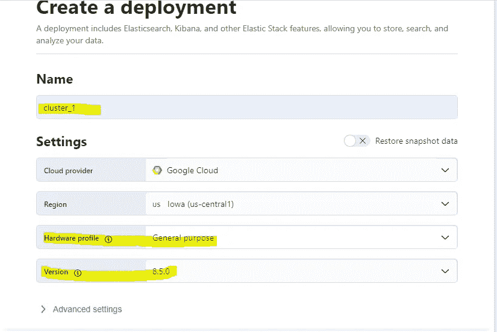
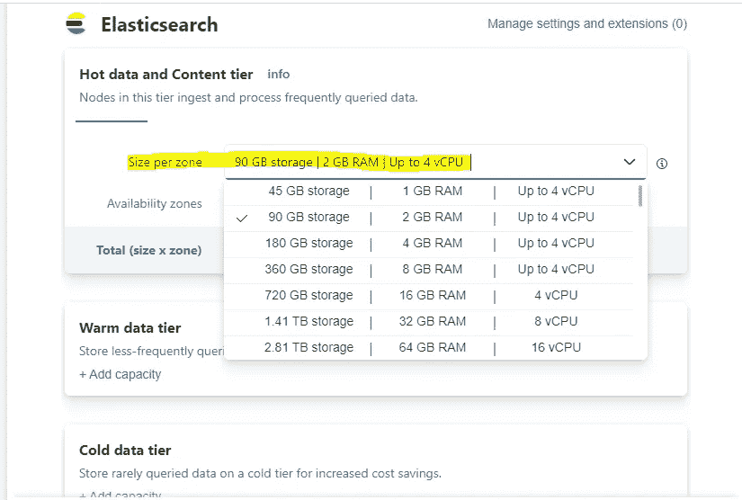
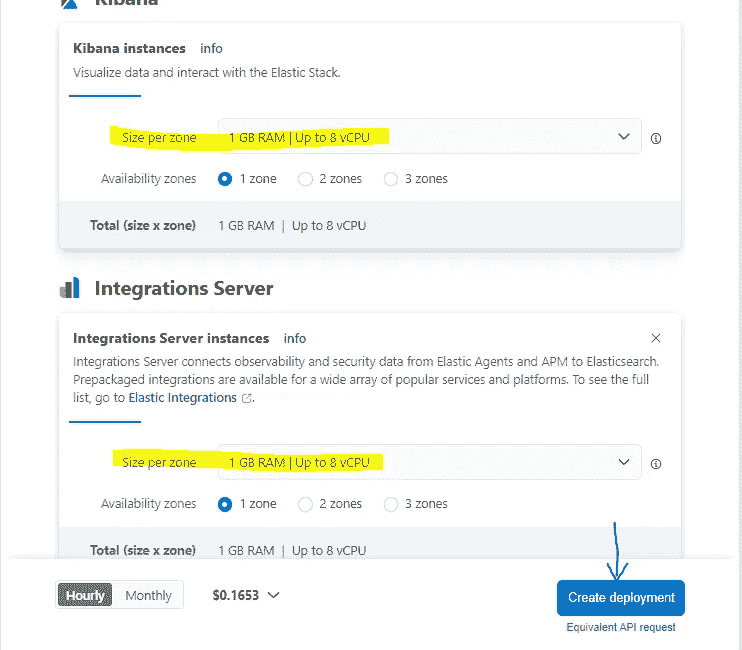
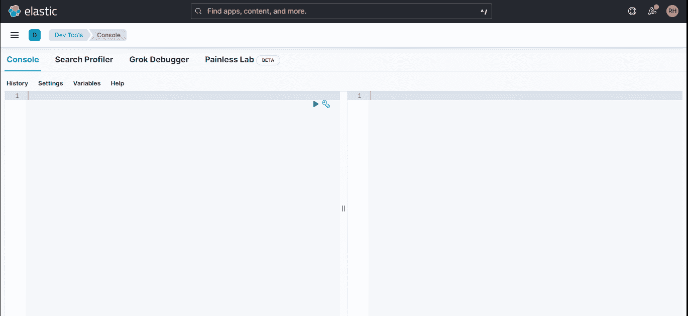
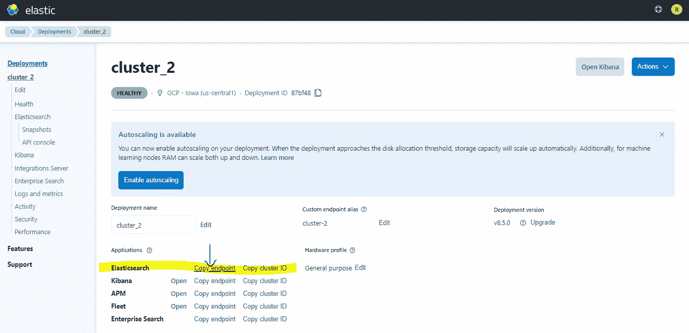
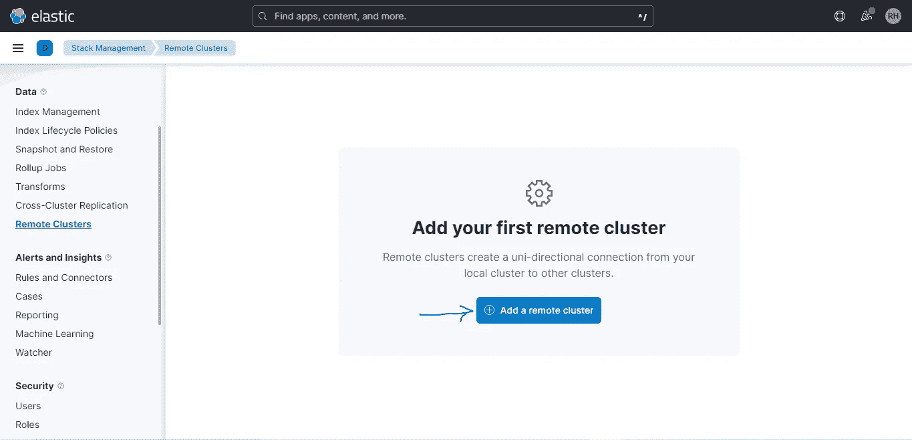
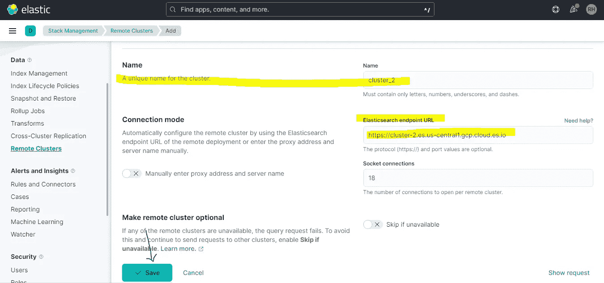
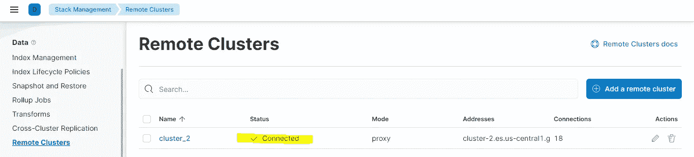

# 跨集群搜索:-搜索您的数据生活在多个集群在一杆

> 原文：<https://blog.devgenius.io/cross-cluster-search-search-your-data-living-in-multiple-clusters-in-one-shot-de42957df456?source=collection_archive---------18----------------------->


***本博客重点介绍在弹性云上实现跨集群搜索(CCS)。***

在典型的 Elastic 生产设置中，出于多种原因，您可能希望将数据索引到多个集群中，数据可靠性、可用性和灾难恢复是保持您的重要数据分布的主要原因。

***为什么要用 CCS？***

简单的答案是让用户能够对所有索引中的整个数据集进行分析，只需一个查询，而不必运行单独的查询，然后将它们合并成一个公共结果。在这方面，将日志文件保存在托管于不同数据中心的多个集群中，然后对它们进行分析和搜索是一个常见的场景。

本博客后面展示的演示的先决条件如下-

1.  您应该在弹性云上试用 14 天，以立即获得弹性部署，这里是登录的[链接](https://cloud.elastic.co/login)。
2.  请检查[版本兼容性矩阵](https://www.elastic.co/guide/en/elasticsearch/reference/current/modules-cross-cluster-search.html#ccs-supported-configurations)，以确保作为其他集群的远程集群的各种连接集群具有彼此兼容的版本。为了便于演示，以下演示中的所有群集都保留在 8.5.0 的相同版本上。

**步骤 1-** 创建两个集群，分别命名为 ***cluster_1*** 和 ***cluster_2*** 。“cluster_1”将用于查询分别存在于“cluster_1”和“cluster_2”两个集群中的数据。两个集群的硬件配置相同。



**步骤 2-** 在 cluster_1 和 cluster_2 上分别创建两个名为 test1 和 test2 的索引。

***步骤 2.1-*** 打开 cluster_1 进入开发工具，按顺序执行以下命令。

```
# Create an index in cluster_1 named test1

PUT test1 
{
  "settings": {
    "number_of_replicas": 1
  },
  "mappings": {
    "properties": {
      "name": {
        "type": "text"
      },
      "age": {
        "type": "integer"
      }
    }
  }
}

# Insert a dummy document in test1 index
POST test1/_doc
{
  "name": "hari",
  "age": 34
}

# Search for all documnents present inside test1 index

GET test1/_search
```

**步骤 2.2-** 打开 cluster_2，转到开发工具，按顺序执行以下命令-

```
# Create an index in cluster_2 named test2

PUT test2 
{
  "settings": {
    "number_of_replicas": 1
  },
  "mappings": {
    "properties": {
      "name": {
        "type": "text"
      },
      "age": {
        "type": "integer"
      }
    }
  }
}

# Insert a dummy document in test2 index
POST test2/_doc
{
  "name": "sam",
  "age": 10
}

# Serach for all documnents present inside test2 index

GET test2/_search 
```



在 cluster_1 中创建了名为 test1 的索引

**步骤 3-** 连接 ***cluster_2 作为 cluster_1 内部的远程集群。***

***步骤 3.1-*** ***转到 cluster_2*** 然后复制 Elasticsearch 端点它将在以后使用。您可以通过转到屏幕左上方的编辑部署来访问此信息。



***步骤 3.2——转到 cluster_1*** 然后转到堆栈管理——>远程集群，将 cluster_2 注册为其中的远程集群，名称为**“cluster _ two _ remote”。**



***上述过程也可以通过 cluster_1*** 内部的开发工具中的 API 调用来完成，请将以下命令粘贴到名为“cluster_1”的集群的开发工具内部。

```
PUT _cluster/settings
{
  "persistent": {
    "cluster": {
      "remote": {
        "cluster_two_remote": {
          "skip_unavailable": false,
          "mode": "proxy",
          "proxy_address": "cluster-2.es.us-central1.gcp.cloud.es.io:9400",
          "proxy_socket_connections": 18,
          "server_name": "cluster-2.es.us-central1.gcp.cloud.es.io",
          "seeds": null,
          "node_connections": null
        }
      }
    }
  }
}
```

**步骤 4-** 使用跨集群搜索，从名为“cluster_1”的集群的 ***开发工具中，搜索名为“cluster_2”的集群内名为“test2”的索引中存在的名称“sam”。***

下面给出了这样做的命令， ***将命令复制粘贴到名为“cluster_1”的集群的开发工具中。***

```
# Perform cross cluster search in cluster_1 to get documnets present in cluster_2
GET test1,cluster_two_remote:test2/_search
{
  "query": {
    "match": {
      "name": "sam"
    }
  }
}
```

下面给出了上述代码的响应，从 hits 部分可以明显看出，结果返回了名为“sam”的文档。

```
{
  "took": 17,
  "timed_out": false,
  "num_reduce_phases": 3,
  "_shards": {
    "total": 2,
    "successful": 2,
    "skipped": 0,
    "failed": 0
  },
  "_clusters": {
    "total": 2,
    "successful": 2,
    "skipped": 0
  },
  "hits": {
    "total": {
      "value": 1,
      "relation": "eq"
    },
    "max_score": 0.2876821,
    "hits": [
      {
        "_index": "cluster_two_remote:test2",
        "_id": "rXNhD4UBRmdocJva5PCO",
        "_score": 0.2876821,
        "_source": {
          "name": "sam",
          "age": 10
        }
      }
    ]
  }
}
```

您刚刚看到了 CCS 如何为一个连接的远程集群工作，但是相同的演示可以扩展到需要从多个连接的远程集群中搜索数据的用例。

根据 Elastic 最佳实践，为了确保您的集群始终支持 CCS，请使用一个专用集群，您打算在其中执行跨集群搜索，并将该特定集群保持在与您的 Elastic 设置中存在的所有其他集群相关的最新版本。

还建议在您的设置中保持集群版本的差异，使其只有一个次要版本。

跨簇搜索官方弹性文档[这里](https://www.elastic.co/guide/en/elasticsearch/reference/current/modules-cross-cluster-search.html#modules-cross-cluster-search)，供你深入挖掘。

如果你喜欢我的博客，请喜欢，分享和评论我的博客，并提供宝贵的反馈，不要忘记关注我，在弹性技术栈上获得更多这样令人兴奋的内容。

谢谢大家！