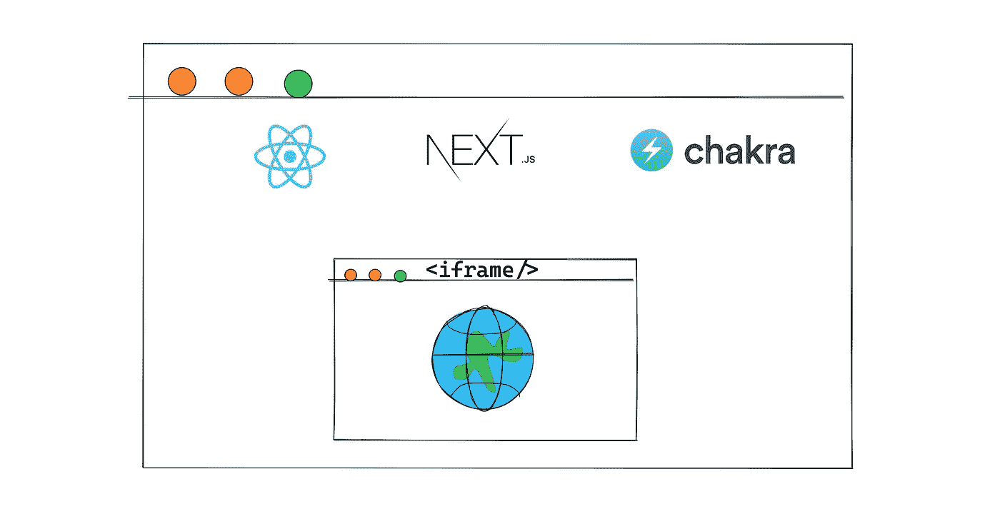
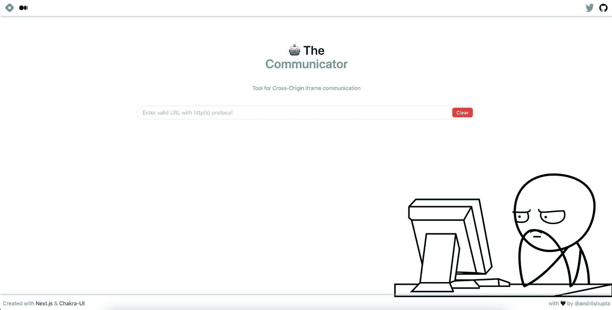
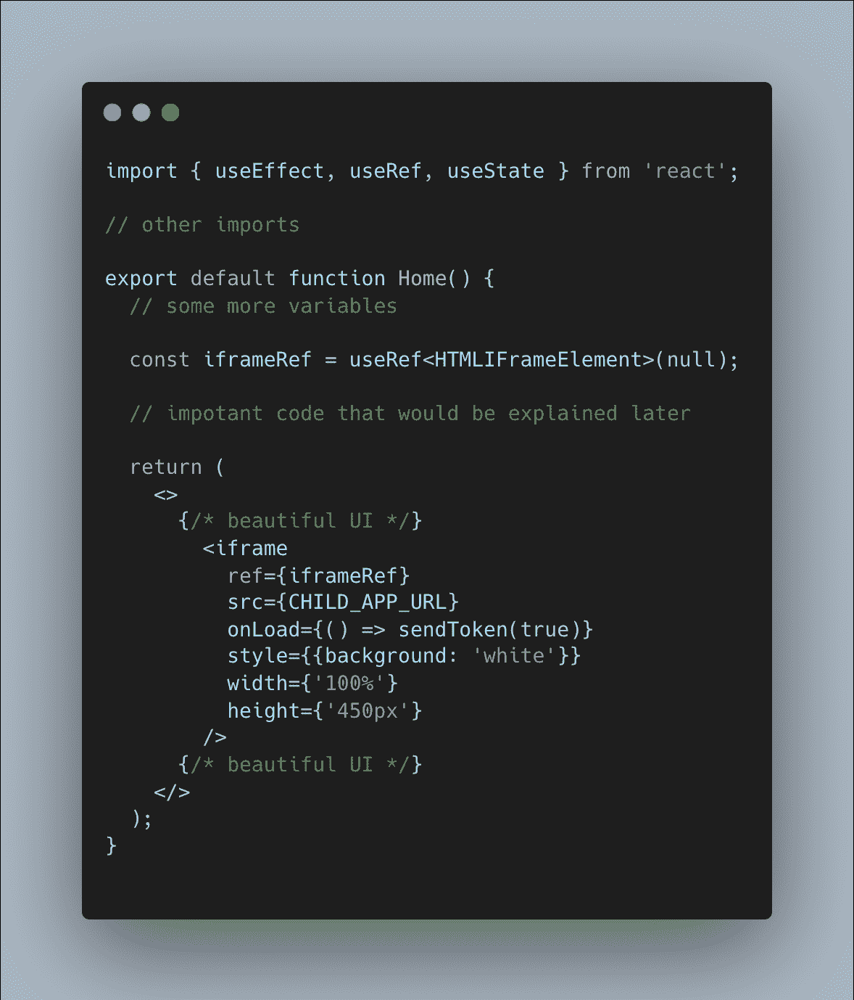
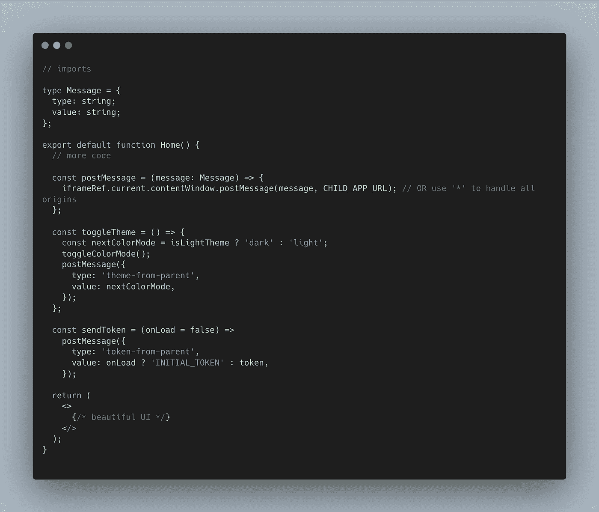
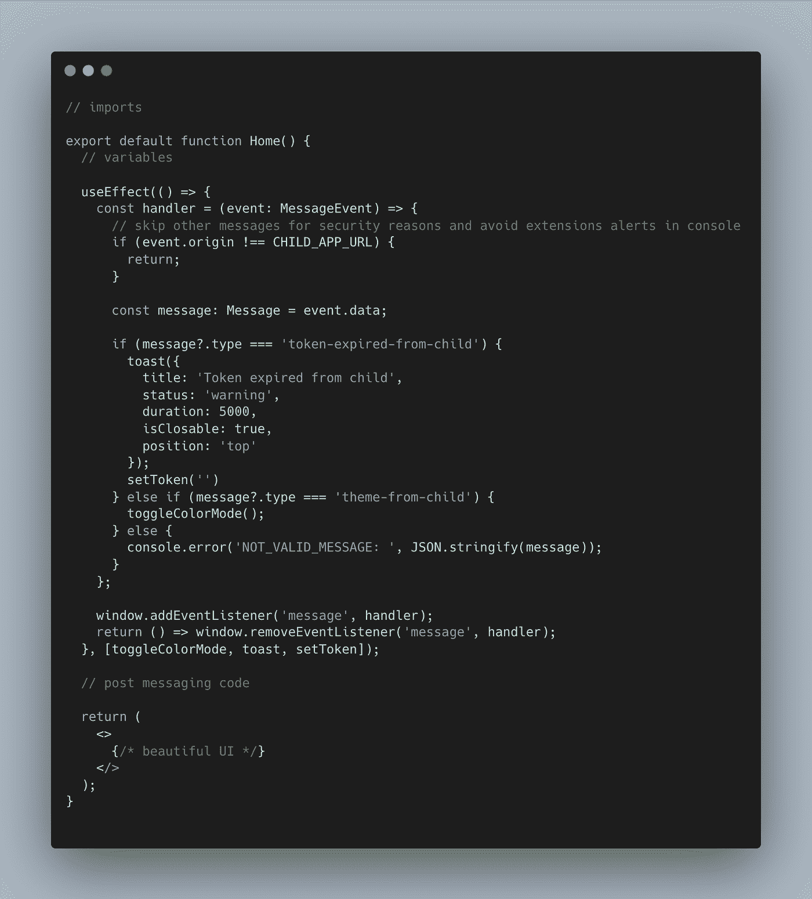
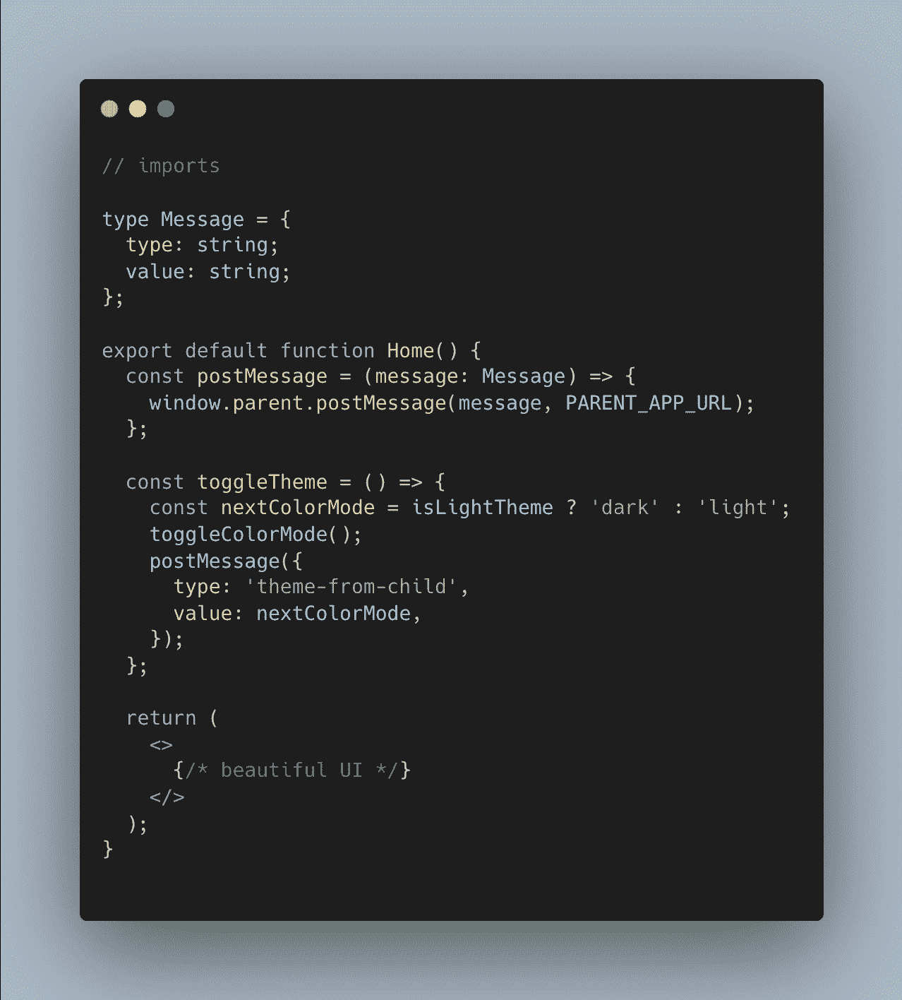
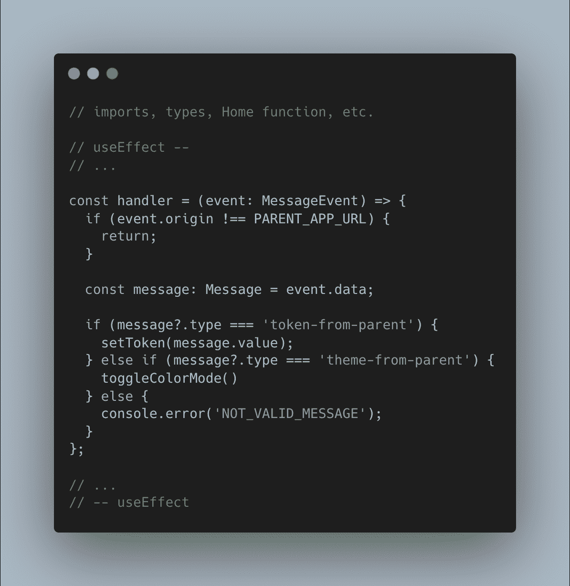

# 与 Window.postMessage 的跨源 iframe 通信

> 原文：<https://blog.devgenius.io/cross-origin-iframe-communication-with-window-postmessage-5b8648bbdff0?source=collection_archive---------9----------------------->

## 使用浏览器的 Web API 在页面和嵌入其中的 iframe 之间安全地传递消息



# 🤔为什么我们需要跨源 iframe 通信？

假设您需要集成将作为应用程序一部分的“第三方服务”。

你们两家公司都只是初创公司，我们没有种类齐全的工具可以让我们的生活变得更轻松，所以我们选择`iframe`作为第一选项。我们*必须*整合我们现有的测试版本。之后，我们将重构代码，并将使用 edge 技术，就像我们的经理承诺的那样(😉)

他们的应用程序(作为一个例子)可以显示私人信息，可能是一些实时的银行细节/运输/交易细节，只有在用户授权后才可用。

# 🤓有什么更好的解决方案？

最好的集成版本(IMHO)是获得一个包含组件、钩子、实用程序等的 react 库。，那将为我们做一切。例如，查看 [React Stripe.js 组件](https://stripe.com/docs/stripe-js/react)。退而求其次——采用开放 API(例如 [Stripe API](https://stripe.com/docs/api) )并实现我们自己的组件。

# 🤨我们要建造什么？

## 💭想法总结

作为父应用程序，我们希望使用某种令牌在`iframe`中登录，这样`iframe`就可以显示相关信息。每隔 N 分钟(本例中为 5 秒)，我们的令牌就会过期，而`iframe`需要请求另一个令牌。作为奖励，我们可以将一个主题从*暗*改为*亮*，这可能发生在双方。

大多数情况下，我会列出只与`iframe`和`Web API`部分相关的代码，而不会专注于创建应用程序或解释 [*“如何部署到 Vercel】*](https://nextjs.org/docs/deployment#managed-nextjs-with-vercel)。

父应用程序和子应用程序将是我们实际需要的实现。对于前端，我们将使用 [Next.js](https://nextjs.org/) 和 [Chakra-UI](https://chakra-ui.com/) 作为组件。我们将在 [Vercel](https://vercel.com/) 和 [Netlify](https://www.netlify.com/) 上部署应用程序(以实现真正的跨来源)。

此外，我会使用 Nrwl Nx 的工作区来实现 monorepo，保持运行/构建过程无缝。

# 👨‍💻代码(如果您不想阅读简介，请跳到这里)

# 🤖“通信员。”

🔗[iframe-communicator . vercel . app](https://iframe-communicator.vercel.app)

🔗github:[github.com/andriishupta/iframe-communicator](https://github.com/andriishupta/iframe-communicator)

这是一个“特殊”的应用程序，你可以用它来进行 ***真实世界的测试*** ，看看消息在你的应用程序中是如何工作的。



# 🧑父代码

🔗[将](https://cross-origin-iframe-communication-with-nextjs-parent-app.vercel.app/)链接到已部署的应用程序

🔗源代码可在处复制

至于父应用，我们肯定会有`iframe`呈现在我们这边。让我们从它开始:



*   iframeRef 是我们对 DOM 元素的 [React.js 引用](https://reactjs.org/docs/hooks-reference.html#useref)，所以我们可以稍后使用它
*   这将发送我的初始令牌

接下来:我们如何发送消息是 [Window.postMessage](https://developer.mozilla.org/en-US/docs/Web/API/Window/postMessage)

> window.postMessage()方法安全地启用窗口对象之间的跨原点通信；例如在页面和它所产生的弹出窗口之间，或者在页面和嵌入其中的 iframe 之间。



```
const postMessage = (message: Message) => { iframeRef.current.contentWindow.postMessage(message, CHILD_APP_URL); };
```

`postMessage`以一个`message: Message`作为参数——它是我们自己选择并与子 app 约定要通过的消息**种类**:

> *使用结构化克隆算法对数据进行序列化。这意味着您可以将各种各样的数据对象安全地传递到目标窗口，而不必自己序列化它们。*

为了发送实际的消息，我们使用`iframeRef.current.contentWindow`作为我们的`targetWindow`(来自文档)，该函数的第二个参数是`targetOrigin`:

> *指定要调度的事件的 targetWindow 的来源，可以是字符串“*”*

我知道我的`targetOrigin`，所以我通过它，并建议你不要忽视[安全风险](https://developer.mozilla.org/en-US/docs/Web/API/Window/postMessage#security_concerns)。

最后但同样重要的是，我们想听听来自孩子的信息！



安全和过滤:我们只接受我们确信的消息

现在，让我们从 *MessageEvent* 中获取数据，进行一些检查并按照业务逻辑行事:

**对于更多选项，这段代码可以用 switch/case(谁喜欢)、三元运算符或对象文字来改进。*

最后添加一个监听器并返回一个回调函数来移除，这样当一个组件关闭时，您可以导航到另一个页面，在那里您不需要监听一个`iframe`。

```
window.addEventListener('message', handler); return () = > window.removeEventListener('message', handler);
```

# 👶子代码

🔗[将](https://lustrous-donut-e3b29a.netlify.app)链接到已部署的应用程序

🔗此处可复制[的源代码](https://github.com/andriishupta/cross-origin-iframe-communication-with-nextjs/blob/main/packages/child-app/pages/index.tsx)

对于子应用程序来说，方法是相同的，只是在哪里调用 *postMessage* — `window.parent`。



而监听消息在`type`中有所不同。



🎨父应用:[跨来源-iframe-communication-with-next..](https://cross-origin-iframe-communication-with-nextjs-parent-app.vercel.app)

👨‍💻github:[github.com/andriishupta/cross-origin-iframe..](https://github.com/andriishupta/cross-origin-iframe-communication-with-nextjs)

🤖"沟通者":[iframe-Communicator . vercel . app](https://iframe-communicator.vercel.app)

👨‍💻“沟通者”的 github:[github.com/andriishupta/cross-origin-iframe..](https://github.com/andriishupta/cross-origin-iframe-communication-with-nextjs)

# 📝摘要

跨源 iframe 通信在特定情况下会非常方便，我们完全可以利用双向消息传递来使其更加动态。单击示例，自己检查一下。

感谢阅读！

*原载于*[*https://blog . andriishupta . dev*](https://andriishupta.dev/cross-origin-iframe-communication-with-window-post-message)*。*