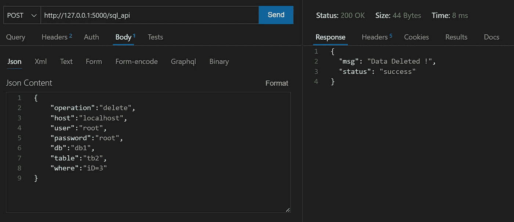

# 在 Flask、SQLAlchemy 和 Pandas 的帮助下，使用 API 对 MYSQL 数据库进行 CRUD 操作。

> 原文：<https://blog.devgenius.io/crud-operations-on-mysql-database-using-api-with-help-of-flask-sqlalchemy-and-pandas-636126993fbd?source=collection_archive---------3----------------------->


在本帖中，我们将创建一个简单的基于 API 的 CRUD 操作来对 MySQL 数据库执行不同的操作。

我们使用了用于 API 的 [**Flask**](https://flask.palletsprojects.com/en/2.2.x/) ，[**thunder Client**](https://www.thunderclient.com/)**(在 VS 代码中作为扩展提供)**来发出具有不同操作的请求，使用 [**SQLAlchemy**](https://www.sqlalchemy.org/) 在 MySQL 上执行 CRUD 操作

我们将执行下面不同的操作:
**1。创建—在 MySQL 中创建一个表。
2。插入-将数据插入表格(数据应该用逗号分隔)
3。更新—更新现有记录。
4。删除—删除现有记录。
5。批量—将 CSV 文件数据加载到表格中。6。下载-将表格数据加载为 CSV 文件。**

让我们开始吧，首先，我们将创建一个名为 **sql_api.py.** 的 python 文件，在其中，我们将导入所需的库，如 F **lask、Pandas 和 SQLAlchemy。**

```
# sql_api.py

from flask import Flask,jsonify,request
from datetime import datetime
import logging
import pandas as pd
from sqlalchemy import create_engine
```

现在我们将初始化 flask 并创建一个 API 路由 URL，在这里我们将为我们的 API 请求使用 **POST** 方法。在这里，我将对所有操作使用单个 api 路由 URL，即 **/sql_api** ，如果您愿意，您可以创建多个 API 路由 URL。

```
# sql_api.py

from flask import Flask,jsonify,request
from datetime import datetime
import logging
import mysql.connector

app=Flask(__name__)

#logging.basicConfig(filename='sqlapi.log', encoding='utf-8', level=logging.DEBUG,format='%(asctime)s %(message)s')

@app.route("/sql_api",methods=['POST'])         # POST method
def sql_api():
# Here we will write our code for all the operations
```

我们将把我们的代码打包在 **try …除了**中，以防任何失败，这也将帮助我们找到导致失败的实际错误。我们将在 API 响应中使用这些错误消息，以便更好地了解错误以及失败的原因。

我们将以下面的格式返回一个 JSON 响应。

```
{"status":"fail", "errors":f"Exception -{str(e)}"}
```

现在我们必须定义 API 请求的主体，即有效载荷。
以下是所有操作的完整有效载荷。

```
**# API Payloads****create**{
"operation":"create",
"host":"localhost",
"user":"root",
"password":"root",
"db":"db1",
"table":"tb2",
"columns":{"iD":"INT","Name":"VARCHAR(20)"}
}--------------------------------------------------------------------**insert**{
"operation":"insert",
"host":"localhost",
"user":"root",
"password":"root",
"db":"db1",
"table":"tb2",
"data":"(1,'abc'),(2,'xyz')"        #records seprated by comma
}--------------------------------------------------------------------**update**{
"operation":"update",
"host":"localhost",
"user":"root",
"password":"root",
"db":"db1",
"table":"tb2",
"set":"Name='xyz'",
"where":"iD=2 or Name='xyz'"
}--------------------------------------------------------------------**delete**{
"operation":"delete",
"host":"localhost",
"user":"root",
"password":"root",
"db":"db1",
"table":"tb2",
"where":"iD=1"
}--------------------------------------------------------------------**Download**{
"operation":"download",
"host":"localhost",
"user":"root",
"password":"root",
"db":"db1",
"table":"tb2",
"columns":"iD, Name",
"where":"iD=2"
}--------------------------------------------------------------------**Bulk**{
"operation":"bulk",
"host":"localhost",
"user":"root",
"password":"root",
"db":"db1",
"table":"tb2",
"columns":"iD,Name",    #column names seprated by comma
"filepath":"file_path"
}
```

这里第一个参数“**操作**”是我们必须执行的操作类型，基于此，它将执行插入、更新、删除等操作。

对于数据库连接，我们使用“**主机**”、“**用户**”、“**密码**”、“**数据库**”和“**表**”参数，使用这些信息我们将使用 SQLAlchemy 连接到 MySQL 数据库。
其他参数取决于操作类型，基于此，我们将使用“ **where** ”作为 where 条件，“ data ”用于插入记录，“ columns ”用于选择特定列，“ filepath ”作为 CSV 文件路径，“ set ”用于更新记录。

我们将在**中定义每个操作，如果…否则**。如果操作字符串与条件匹配，那么我们将执行那个特定的块，否则，我们将转到下一个条件。如果没有匹配的条件，那么我们将返回最后的 else 块消息。

```
if operation condition matched //execute statementselif operation condition matched //execute statementselse: //please put correct operation
```

我们将在调用 **POST** 方法时执行上述操作。为此，当 **POST** 方法调用时，我们还必须定义 flask app 路由，那时我们将收集数据库细节并与数据库建立连接。所有代码块都在**try…下，除了**之外，因此如果出现任何错误，我们都会收到错误信息，以便更好地理解。

```
try:

   if (request.method=='POST'):

       operation=request.json['operation']             
       host=request.json['host']                       
       user=request.json['user']                      
       password=request.json['password']              
       db=request.json['db']                           
       table=request.json['table']                    
       engine=create_engine(f"mysql://{user}:{password}@{host}/{db}")     

       if (operation=='create'):
          // create block
       elif (operation=='insert'):
          //  insert block
           ........
       else:                      #if operation is not given
           msg={"status":"fail", "msg":"Invalid Operation"}        
       return jsonify(msg)    #return success message in json format

except Exception as e:                #if any exception occurs
      return jsonify({"status":"fail", "errors":f"Exception -{str(e)}"})        
#return error message in json format with exception

if __name__=="__main__":                      #main function
app.run()                                      #run app
```

对于**创建、插入、更新和删除**，我们将使用 **SQLAlchemy** ，对于**批量和下载，**我们将使用 **Pandas DataFrame** 。

我们使用 **SQLAlchemy** 与数据库建立连接，并执行所有 CRUD 操作。我们也在使用 **SQLAlchemy** 为**熊猫**建立 MySQL 连接。

使用 **Pandas** 我们从表中读取数据，使用 **read_sql** 创建数据帧，并使用 **to_csv** 将数据存储为 CSV。同样，读取 csv 文件我们使用 **read_csv** ，上传 csv 数据我们使用 **to_sql** 。

所有必需的输入都是从 API 请求体中收集的。

下面是每个操作逻辑的完整代码。

当我们执行这个文件时，它将驻留在本地主机地址上，即 **http://127.0.0.1:5000**


现在我们的主机是[**http://127 . 0 . 0 . 1:5000**](http://127.0.0.1:5000)**app 路由 URL 是 **/sql_api。**所以我们要使用**[**http://127 . 0 . 0 . 1:5000/SQL _ API**](http://127.0.0.1:5000/sql_api)**URL 进行 API 请求。
作为我们的代码功能出现在 **/sql_api** 路径下，函数名为 **sql_api()********

****现在我们将使用 vs 代码中的**迅雷客户端**为不同的操作对每个有效负载发出 POST 请求。****

****方法**发布**和网址[**http://127 . 0 . 0 . 1:5000/SQL _ API**](http://127.0.0.1:5000/sql_api)****

1.  ******创建**
    我们将创建带有列
    **{"iD" : "INT "，" Name" : "VARCHAR(20)"，" Age" : "INT"}** 的表' **tb2******

********

****下面是 MySQL 中使用 API 创建的表的模式。****

```
**+-------+-------------+------+-----+---------+-------+
| Field | Type        | Null | Key | Default | Extra |
+-------+-------------+------+-----+---------+-------+
| iD    | int         | YES  |     | NULL    |       |
| Name  | varchar(20) | YES  |     | NULL    |       |
| Age   | int         | YES  |     | NULL    |       |
+-------+-------------+------+-----+---------+-------+**
```

******2。插入**
我们将数据插入到 MySQL 中创建的表 **tb2** 中。****

********

****MySQL 表，插入记录后。****

```
**mysql> select * from tb2;
+------+-------+------+
| iD   | Name  | Age  |
+------+-------+------+
|    1 | user1 |   22 |
|    2 | user2 |   23 |
|    3 | user3 |   33 |
+------+-------+------+**
```

******3。更新**
更新表“ **tb2** ”中年龄大于 30 的记录。****

********

****MySQL 表，更新记录后。****

```
**mysql> select * from tb2;
+------+--------------+------+
| iD   | Name         | Age  |
+------+--------------+------+
|    1 | user1        |   22 |
|    2 | user2        |   23 |
|    3 | User_updated |   33 |
+------+--------------+------+**
```

******4。删除**
从 ID 为 3 的表 **tb2** 中删除记录。****

********

****MySQL 表，删除记录后。****

```
**mysql> select * from tb2;
+------+-------+------+
| iD   | Name  | Age  |
+------+-------+------+
|    1 | user1 |   22 |
|    2 | user2 |   23 |
+------+-------+------+**
```

******5。从表' **tb2** '中下载**
下载数据为 CSV 文件。****

****

**将表 **tb2** 的数据下载为 CSV 文件。**

****

****6。批量**
将 CSV 文件数据批量插入到表“ **tb2** ”中。**

********

**批量插入 CSV 文件记录后的 MySQL 表。**

```
mysql> select * from tb2;
+------+-------+------+
| iD   | Name  | Age  |
+------+-------+------+
|    1 | user1 |   22 |
|    2 | user2 |   23 |
|    1 | user1 |   22 |
|    2 | user2 |   23 |
|    3 | user3 |   24 |
|    4 | user4 |   25 |
+------+-------+------+
```

**如您所见，我们通过正确的 CRUD 操作获得了正确的响应。您可以通过传递无效值并查看您将得到什么响应来探索更多内容。**

**在 SQLAlchemy、Pandas 和 MySQL 数据库的帮助下，我们已经成功地使用 Flask API 执行了 CRUD 操作。**

**如果你愿意，你也可以在这些 API 上提供 UI。您可以构建一个简单的 UI 来获取用户的输入，而不是使用 Thunder Client 传递信息。**

**下一篇文章再见😊！**

**编码快乐！！！**