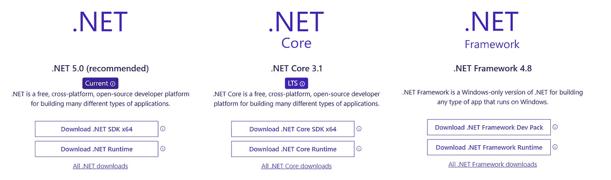
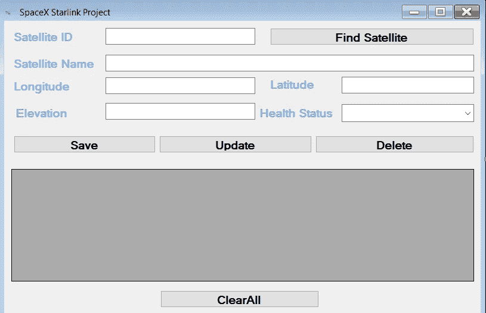
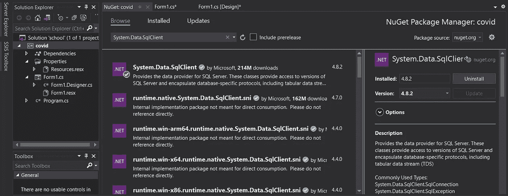
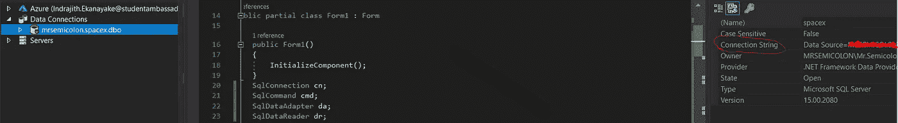
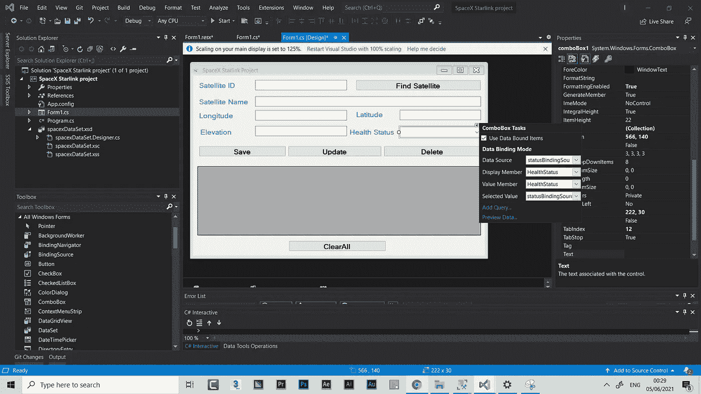

# C# WinForms 的 CRUD 操作(。Net 框架)

> 原文：<https://blog.devgenius.io/crud-operations-with-c-winforms-net-framework-bc10b1d6ae47?source=collection_archive---------0----------------------->

## 这是专门为我的学生编写的完整的 101 讨论，但这将有助于任何人开始使用 C# WinForms 应用程序。


Bret Kavanaugh 在 [Unsplash](https://unsplash.com) 上拍摄的照片

2020 年[微软宣布](https://devblogs.microsoft.com/dotnet/windows-forms-designer-for-net-core-released/)。Windows 窗体应用程序的 net Core(WinForms)哪个好？。在过去，唯一的选择是使用 [Mono](https://www.mono-project.com/docs/about-mono/dotnet-integration/) 为 macOS 开发 WinForm 应用程序。不幸的是，唯一的选择仍然是在 macOS 和 Linux 上使用 Mono😔。

> 根据微软高级项目经理 Olia Gavrysh 的说法，“Windows 窗体仍将是纯 Windows 平台，所以这些特性不会出现在 Mac 的 Visual Studio 中”

但是，朋友们，不要失去希望，使用有更多的好处。Net 核心进行开发。现在你可能想知道这家伙到底在说什么？不是。Net 框架和。网芯一样？简单的回答是**不**，他们不一样。都是。Net 框架和。Net Core 是构建应用程序的结构(在技术领域，我们称之为框架)。直到微软推出。Net Core，早在 2016 年我们就使用了。Net 框架来构建我们的桌面、移动和 web 应用程序。因此，你可以说。Net Core 是。Net 框架。是的，我同意你，但是它完全是重写的。。Net Core 是一个跨平台、开源、可扩展、轻量级、面向服务、速度更快的工具，基本上，它就像特斯拉的 Cybertruck。简单来说，更具未来感的版本，具有有趣的功能。



来源:[https://dotnet.microsoft.com/download](https://dotnet.microsoft.com/download)

**先决条件:**需要安装 Visual Studio(我用的是 [Visual Studio 2019 版本 16.10](https://docs.microsoft.com/en-us/visualstudio/releases/2019/release-notes#16.6.0) )。不需要以前的 c#经验，但你应该能够通过拖放为我们的 WinForms 应用程序创建简单的用户界面。最后，我更喜欢安装 SQL[Server Management Studio(SSMS)](https://docs.microsoft.com/en-us/sql/ssms/download-sql-server-management-studio-ssms?view=sql-server-ver15)来创建数据库。(非强制。默认情况下，Visual Studio 附带一个内置的 SQL server 实例。)现在让我们开始吧。

# 让我们把手弄脏吧

> 这是我 C#系列的第一篇文章。这里我们用广为人知的。Net Framework 4.7.2，希望在下一篇文章中我们可以讨论 WinForms。网芯。

## 步骤 1:设计用户界面

首先，我使用 Windows 窗体设计器工具设计了一个简单的 UI。我很有信心，没有任何支持，你们都能轻松做到。这是简单的拖放操作。所以，我的 UI 如下，



如上所示，我使用 WinForms 设计工具设计了一个简单的卫星跟踪表单。这是我们今天要实现的功能，

*   在左上角，我们可以通过 ID 搜索卫星。
*   我们在底部有 Datagridview 来检索数据。
*   基本上，我们从卫星收集 SatelliteID(int)、SatelliteName(string)、经度(float)、纬度(float)、高度(float)和健康状态(string - Combobox)。
*   “全部清除”按钮用于清除所有字段。
*   插入按钮用于插入新记录。
*   更新按钮用于更新现有记录。
*   删除按钮用于删除记录。

## 步骤 2:创建 SQL 数据库

在我的数据库中，我需要两个表。一个用于存储 Combobox 属性，另一个用于存储其余的数据。于是，我创建了一个名为 ***spacex*** 的数据库和两个表， ***卫星和*** ***状态*** 。

```
create database spacex;
use spacex;CREATE TABLE Satellites (
    SatelliteID int NOT NULL IDENTITY,
    SatelliteName varchar(300),
    Longitude float,
    Latitude float,
    Elevation float,
    HealthStatus varchar(300)
);CREATE TABLE Status(
 ID int NOT NULL IDENTITY,
 HealthStatus varchar(300)
);INSERT INTO Status(HealthStatus) Values('Good Condition'),('Avarage Condition'),('Poor Condition')
```

创建一个执行 CRUD 的存储过程，定义了 5 种操作类型，

1.  插入

2.更新

3.删除

4.选择特定记录

5.全选

```
GO
SET ANSI_NULLS ON
GO
SET QUOTED_IDENTIFIER ON
GOCREATE PROCEDURE spacex_pro
@SatelliteID int,
@SatelliteName varchar(300),
@Longitude float,
@Latitude float,
@Elevation float,
@HealthStatus varchar(300),
@OperationType intAS
BEGIN
SET NOCOUNT ON;
IF @OperationType=1
BEGIN
INSERT INTO Satellites VALUES (@SatelliteName,@Longitude,@Latitude,@Elevation,@HealthStatus)
END
ELSE IF @OperationType=2
BEGIN
UPDATE Satellites SET SatelliteName=@SatelliteName , Longitude=@Longitude ,Latitude=@Latitude, Elevation=@Elevation, HealthStatus=@HealthStatus WHERE SatelliteID=@SatelliteID
END
ELSE IF @OperationType=3
BEGIN
DELETE FROM Satellites WHERE SatelliteID=@SatelliteID
END
ELSE IF @OperationType=4
BEGIN
SELECT * FROM Satellites WHERE SatelliteID=@SatelliteID
END
ELSE
BEGIN
SELECT * FROM Satellites
END
END
```

## 步骤 3:连接到数据库并执行操作

连接到 SQL Server 数据源，需要导入 SQLClient 库`using System.Data.SQLClient;`。但是在某些情况下，我们需要安装 SQLClient NuGet 包才能使用它。您可以通过以下方式安装掘金包，

*   右键单击解决方案面板中的项目文件，然后单击 Manage NuGet Packages 选项。
*   在 NuGet 软件包管理器窗口中，选择浏览器选项卡。搜索系统。Data.SqlClient，然后按 enter 键
*   选择第一个选项“系统”。Data.SqlClient by Microsoft 单击安装按钮



安装 SQLClient NuGet 包

要添加数据源， ***转到服务器资源管理器选项卡>右键单击数据连接>添加连接>给出您的数据源名称(在我的情况下是 Microsoft SQL Server) >从您的 SSMS 复制服务器名称>选择您的验证类型(在我的情况下是 Windows 验证)>选择数据库名称>单击确定*** 。现在，Visual studio 已连接到数据源。最后，要获得连接字符串，您可以单击添加的数据连接，并从 properties 选项卡中复制连接字符串。



查找连接字符串

现在我们需要移动到 ***Form_Load*** 函数(只需在设计视图中双击您的表单)并添加连接字符串。连接字符串是一个基本字符串，它指定了关于数据源的信息，在我们的例子中是 SQL Server。下面是我的 ***Form_Load*** 函数，

```
cn = new SqlConnection(@"<Your_connecton_string_here>");
cn.Open();
//bind data in data grid view
GetAllSatelliteRecord();
//disable delete and update button on load
btnUpdate.Enabled = false;
btnDelete.Enabled = false;
```

最后，我们需要为 Datagridview 和 ComboBox 选择一个连接。最简单的方法是将 ***移动到 Windows 窗体设计器工具>单击 Datagridview 旁边的小箭头>单击选择数据源>单击添加项目数据源>选择数据库>选择数据集>选择连接>选择要显示的表*** 。(使用相同的方法选择 ComboBox 的数据源)



组合框任务选择

## 步骤 4:查找、保存、更新、删除和清除所有按钮功能

最后一步是编写查找、保存、更新、删除和清除所有按钮函数。实际上，这很简单，我们需要在 UI 模式下双击按钮，功能就会自动为我们创建。功能体是最关键的部分。这里我们需要写实际的逻辑。

**查找函数体:**

**保存函数体:**

**更新函数体:**

**删除函数体:**

**ClearAll 函数体:**

# 总结:

在我的 C#系列的第一篇文章中，我们讨论了如何使用 MsSQL 数据库执行简单的 CRUD 操作(使用存储过程)。在未来，我希望讨论实体框架来链接查询、变更跟踪和更新。最重要的是，这只是为了学习的目的，对于现实世界的应用，我更喜欢。网芯因其[长期支持](https://stackoverflow.com/questions/289565/what-is-lts-long-term-support)。如果您有任何建议，请随时在下面留言。

 [## c#。活力

### 编辑描述

drive.google.com](https://drive.google.com/file/d/1OPXezkpXdmxWdiTuBuXZCxOC76AkbFdv/view?usp=sharing) 

[**点击这里**](https://drive.google.com/file/d/1OPXezkpXdmxWdiTuBuXZCxOC76AkbFdv/view?usp=sharing) 下载项目文件。别忘了鼓掌展示一下❤️love❤️👏👏👏。感谢阅读！